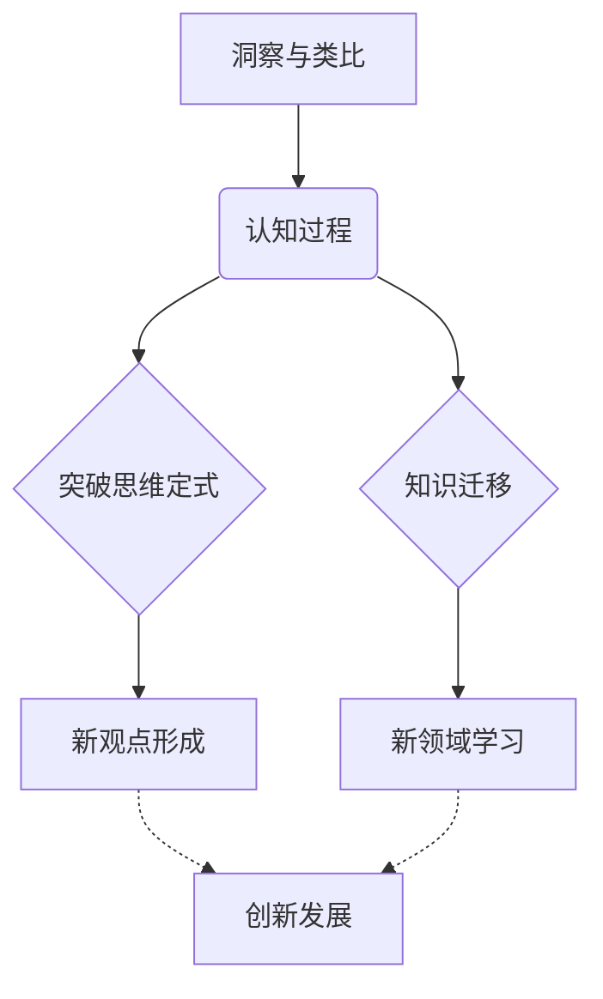
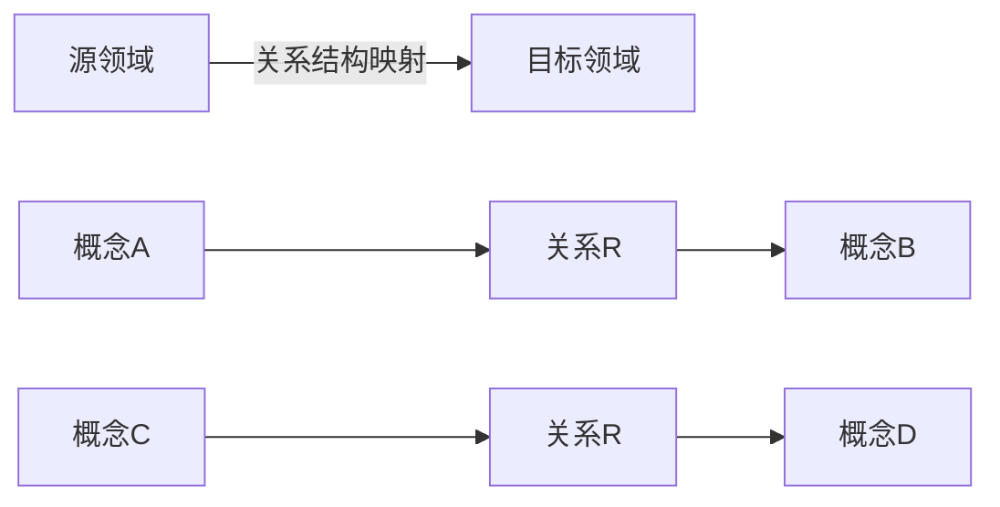

# 洞察与类比：突破知识限制的工具

## 1. 背景介绍

### 1.1 问题的由来

在当今快节奏的科技发展时代，知识的积累和扩展速度前所未有。然而，人类的认知能力和学习效率往往难以跟上这种飞速发展的步伐。我们常常会遇到这样的困境:已有的知识储备无法完全解决手头的新问题,而要彻底掌握所需的全新知识领域又往往耗时耗力。这种知识的局限性严重阻碍了我们解决复杂问题和创新发展的能力。

### 1.2 研究现状  

为了突破知识的局限性,研究人员一直在探索各种认知增强(Cognitive Augmentation)的方法。其中,洞察(Insight)和类比(Analogy)被公认为两种最有力的认知工具。洞察指的是突然产生的新颖观点,能够帮助我们打破常规思维定式;而类比则是将一个陌生的新领域与我们已有的知识经验建立联系,从而降低学习的难度。

### 1.3 研究意义

掌握并运用好洞察与类比的技巧,对于提高个人的学习效率和创新能力有着深远的意义。从更广阔的视角来看,这也是构建人机耦合智能(Human-AI Symbiosis)不可或缺的一个环节。未来,人类与人工智能系统的紧密协作将是常态,而洞察与类比正是人类大脑与AI系统之间桥梁,是实现两者优势互补的关键所在。

### 1.4 本文结构

本文将首先介绍洞察与类比的核心概念,阐明两者在认知过程中的作用机制。接下来,将深入探讨洞察与类比的算法原理、数学模型,并结合实际案例进行分析说明。在此基础上,我们将构建一个实践项目,通过代码实现的方式更加具体地展示这些原理的应用。最后,文章将总结洞察与类比在不同领域的应用现状,并对未来的发展趋势和挑战进行展望。

## 2. 核心概念与联系

洞察(Insight)和类比(Analogy)是两种密切相关的高级认知过程,它们在突破思维定式和促进知识迁移方面发挥着关键作用:

- **洞察**指的是突然产生的新观点或见解,使我们能够打破常规思维模式,从全新的角度审视问题。这种认知"跳跃"有助于形成创新的想法和解决方案。
- **类比**则是在不同领域之间建立联系的过程。通过将新问题与我们熟悉的旧领域建立对应关系,可以降低学习新知识的难度,实现知识的迁移和扩展。

洞察和类比相辅相成,共同推动着人类认知能力的发展:洞察为创新思维提供动力,而类比为获取新知识铺平道路。掌握这两种技能,有助于我们突破知识的局限,在更高的层次上解决复杂问题。

## 3. 核心算法原理 & 具体操作步骤  

### 3.1 算法原理概述

洞察与类比的算法原理主要基于**结构映射理论**(Structure Mapping Theory)。该理论认为,在进行类比推理时,人类大脑会在源领域(source domain)和目标领域(target domain)之间寻找相似的关系结构,而非仅仅匹配表面特征。

如上图所示,在源领域中存在概念A和概念B,两者通过关系R连接;而在目标领域中,概念C和概念D也存在类似的关系R。算法的目标就是发现并建立A-R-B与C-R-D之间的结构映射关系,从而实现知识和推理的迁移。

### 3.2 算法步骤详解

1. **编码**:将源领域和目标领域的信息以计算机可识别的形式表示,通常采用谓词逻辑、语义网络或特征向量等方式。
2. **启动**:从编码后的知识库中检索与目标问题相关的信息,作为类比的起点。这个过程可能需要启发式搜索或人工干预。
3. **映射**:在源领域和目标领域之间建立结构映射,寻找相似的关系模式。这是算法的核心步骤,需要评估映射的结构相似性和语义相关性。
4. **传递**:根据映射结果,将源领域中的解决方案、推理过程等知识迁移到目标领域,并进行必要的适配和修正。
5. **再编码**:将新获得的知识融合到目标领域的知识库中,为下一次类比推理做准备。
6. **评估**:检查类比推理的结果是否合理,满足一定的约束条件和评价指标。必要时需要重复前面的步骤。

这一系列步骤模拟了人类进行类比推理的认知过程,是洞察和创新思维产生的重要计算机模型。

### 3.3 算法优缺点

**优点**:
- 结构映射理论为类比推理提供了合理的理论基础
- 算法模拟了人类进行洞察和创新的认知机制
- 能够在不同领域之间传递知识,扩展认知边界
- 映射过程中考虑了结构相似性和语义相关性

**缺点**:
- 编码和映射的计算代价较高,尤其是在知识库庞大时
- 存在合理的启动问题,需要预先确定源领域
- 映射的正确性和合理性难以完全保证
- 知识的再编码和评估环节需要人工干预

### 3.4 算法应用领域

洞察与类比的算法被广泛应用于多个人工智能领域:

- **问题求解**:通过类比推理将已解决的源问题的解映射到新的目标问题
- **概念学习**:利用类比将已知概念的特征和关系迁移到新概念的学习中
- **自然语言理解**:通过映射已知领域的语义知识来理解隐喻、类比等复杂语言现象
- **设计创新**:将不同领域的设计原理和解决方案相互映射,产生新颖的设计方案
- **科学发现**:在不同理论之间建立类比关联,促进新理论和新发现的产生

总的来说,洞察与类比为人工智能系统带来了更强大的推理、学习和创新能力。

## 4. 数学模型和公式 & 详细讲解 & 举例说明

### 4.1 数学模型构建

为了对类比映射的相似性进行量化和优化,我们需要构建数学模型对其进行形式化描述。一种常用的模型是基于高阶关系的张量表示。

设源领域和目标领域中的概念用一阶张量$\vec{c}_i$表示,概念间的关系用二阶张量$\vec{R}_{ij}$表示。那么,一个完整的结构可以用概念和关系的组合来表达:

$$
\mathcal{S} = \left\{\vec{c}_i, \vec{R}_{ij}\right\}
$$

其中,概念张量$\vec{c}_i$可以编码概念的语义特征;而关系张量$\vec{R}_{ij}$则描述了概念$i$和概念$j$之间的关联。

在这个基础上,我们可以定义源领域$\mathcal{S}_1$和目标领域$\mathcal{S}_2$之间的结构映射相似度:

$$
\begin{aligned}
\text{sim}(\mathcal{S}_1, \mathcal{S}_2) &= \sum_{i,j} \vec{c}_{1i}^T \vec{c}_{2j} \cdot \vec{R}_{1ij}^T \vec{R}_{2ij} \\
&= \langle \mathcal{S}_1, \mathcal{S}_2 \rangle_\mathcal{F}
\end{aligned}
$$

这里的$\langle \cdot, \cdot \rangle_\mathcal{F}$是定义在张量场$\mathcal{F}$上的内积,能够同时考虑概念语义和关系结构的相似性。

优化目标就是在满足一定约束条件的前提下,寻找使相似度最大的映射:

$$
\begin{array}{cl}
\underset{\pi}{\max} & \text{sim}(\mathcal{S}_1, \pi(\mathcal{S}_2)) \\
\text{s.t.} & \pi(i) \neq \pi(j), \quad \forall i \neq j
\end{array}
$$

这里的$\pi$是一个映射函数,将目标领域中的概念重新组合,使其与源领域结构最为相似。约束条件保证了映射的一一性,避免了概念的重复匹配。

### 4.2 公式推导过程

为了更好地理解上述数学模型,我们来推导一下其中的重要公式。

首先,我们定义概念张量$\vec{c}_i$和关系张量$\vec{R}_{ij}$的内积:

$$
\langle \vec{c}_i, \vec{R}_{ij}, \vec{c}_j \rangle = \vec{c}_i^T \vec{R}_{ij} \vec{c}_j
$$

这个内积可以衡量概念$i$和概念$j$通过关系$R_{ij}$连接的紧密程度。利用这个内积,我们可以定义一个结构$\mathcal{S}$的自相似度:

$$
\text{sim}(\mathcal{S}, \mathcal{S}) = \sum_{i,j} \langle \vec{c}_i, \vec{R}_{ij}, \vec{c}_j \rangle = \sum_{i,j} \vec{c}_i^T \vec{R}_{ij} \vec{c}_j
$$

进一步,我们考虑两个结构$\mathcal{S}_1$和$\mathcal{S}_2$之间的相似度:

$$
\begin{aligned}
\text{sim}(\mathcal{S}_1, \mathcal{S}_2) &= \sum_{i,j} \langle \vec{c}_{1i}, \vec{R}_{1ij}, \vec{c}_{1j} \rangle \cdot \langle \vec{c}_{2i}, \vec{R}_{2ij}, \vec{c}_{2j} \rangle \\
&= \sum_{i,j} \vec{c}_{1i}^T \vec{R}_{1ij} \vec{c}_{1j} \cdot \vec{c}_{2i}^T \vec{R}_{2ij} \vec{c}_{2j}
\end{aligned}
$$

利用张量的迹算子$\text{Tr}(\cdot)$和张量外积$\otimes$,上式可以等价地表示为:

$$
\begin{aligned}
\text{sim}(\mathcal{S}_1, \mathcal{S}_2) &= \text{Tr}\left[\left(\sum_{i,j} \vec{c}_{1i} \otimes \vec{R}_{1ij} \otimes \vec{c}_{1j}\right)^T \left(\sum_{i,j} \vec{c}_{2i} \otimes \vec{R}_{2ij} \otimes \vec{c}_{2j}\right)\right] \\
&= \langle \mathcal{S}_1, \mathcal{S}_2 \rangle_\mathcal{F}
\end{aligned}
$$

这就是我们在4.1节中给出的结构映射相似度公式。可以看出,它实际上是在张量场$\mathcal{F}$上定义的一个内积,能够同时衡量概念语义和关系结构的相似程度。

### 4.3 案例分析与讲解

为了更好地理解上述数学模型,我们来分析一个具体的案例。假设我们有如下两个领域的知识:

**源领域**:流体力学
- 概念:流体($\vec{c}_1$)、管道($\vec{c}_2$)、压强($\vec{c}_3$)
- 关系:$\vec{R}_{12}$(流体流过管道)、$\vec{R}_{23}$(管道影响压强)

**目标领域**:电路理论 
- 概念:电流($\vec{c}_4$)、电阻($\vec{c}_5$)、电压($\vec{c}_6$)
- 关系:$\vec{R}_{45}$(电流通过电阻