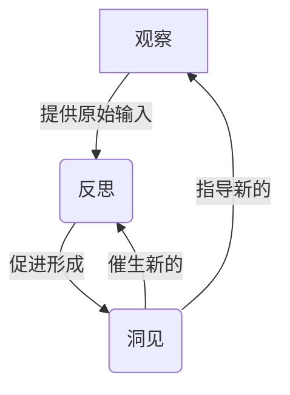
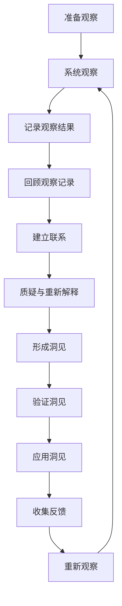

# 洞见的形成：从观察到反思

## 1. 背景介绍

### 1.1 问题的由来

在这个瞬息万变的数字时代,我们被海量的信息所包围。无论是在线上还是现实生活中,我们都不断地接收各种各样的数据、观察结果和现象。然而,仅仅获取这些原始输入是远远不够的。关键在于,我们如何从这些原始输入中提炼出有价值的洞见,并将其转化为行动,从而推动创新和进步。

洞见的形成是一个循环往复的过程,需要我们不断观察、思考、实践,并根据反馈进行调整。这个过程贯穿于各个领域,无论是科学研究、商业决策,还是个人生活。只有掌握了从观察到反思的方法论,我们才能真正把握住洞见的本质,并将其应用于实践中。

### 1.2 研究现状

目前,已有大量研究探讨了洞见形成的过程和方法。一些著名的理论和模型包括:

- **观察理论(Observation Theory)**: 强调通过系统的观察来获取原始数据,并将其作为洞见形成的基础。
- **反思实践理论(Reflective Practice Theory)**: 提出通过反思自身的行为和经验,从中提炼出洞见和改进方向。
- **设计思维(Design Thinking)**: 一种以用户为中心的创新方法,强调通过观察、定义问题、构思创意、原型制作和测试等步骤,形成洞见并创造出创新的解决方案。

然而,这些理论和模型往往侧重于特定领域或阶段,缺乏一个完整的、跨领域的框架来指导从观察到反思的整个过程。

### 1.3 研究意义

掌握从观察到反思的方法论,对于个人、组织乃至整个社会都有着重要意义:

- **个人层面**: 有助于我们更好地理解自身和周围环境,提高自我认知和决策能力。
- **组织层面**: 可以促进组织内部的学习、创新和持续改进,提高组织的竞争力。
- **社会层面**: 有助于解决复杂的社会问题,推动科技进步和可持续发展。

因此,构建一个完整的、系统化的从观察到反思的方法论框架,对于提高个人、组织乃至整个社会的洞见形成能力至关重要。

### 1.4 本文结构

本文将从以下几个方面全面阐述从观察到反思的过程:

1. **核心概念与联系**: 介绍洞见形成过程中的关键概念,如观察、反思、洞见等,并探讨它们之间的关系。
2. **核心算法原理与具体操作步骤**: 提出一种系统化的从观察到反思的算法流程,并详细解释每个步骤的原理和操作方法。
3. **数学模型和公式详细讲解**: 构建相关的数学模型,并推导出描述洞见形成过程的公式,辅以案例分析加深理解。
4. **项目实践:代码实例和详细解释**: 提供一个实际项目案例,包括代码实现、运行结果展示和代码解读分析,帮助读者更好地掌握相关技术。
5. **实际应用场景**: 探讨从观察到反思方法论在不同领域的应用,如科学研究、商业决策、个人发展等。
6. **工具和资源推荐**: 介绍一些有助于从观察到反思过程的工具、学习资源和相关论文等。
7. **总结:未来发展趋势与挑战**: 总结研究成果,展望未来发展趋势,并分析可能面临的挑战。
8. **附录:常见问题与解答**: 针对从观察到反思过程中的一些常见问题,给出解答和建议。

通过全面、系统的阐述,本文旨在为读者提供一个完整的从观察到反思的方法论框架,帮助提高洞见形成的能力。

## 2. 核心概念与联系

在深入探讨从观察到反思的过程之前,我们需要先了解其中涉及的几个核心概念,以及它们之间的联系。

### 2.1 观察(Observation)

观察是获取原始数据的基础,是洞见形成过程的起点。它包括以下几个要素:

1. **感官输入**: 通过视觉、听觉、触觉等感官获取外部信息。
2. **选择性注意**: 由于人类的注意力有限,观察过程中需要选择性地关注特定的对象或现象。
3. **记录**: 将观察到的现象及相关背景信息记录下来,为后续分析做准备。

观察的质量直接影响了后续分析的效果。因此,我们需要训练自己保持开放的心态,客观地记录所见所闻,避免带有主观偏见。

### 2.2 反思(Reflection)

反思是对观察结果进行深入思考和分析的过程。它包括以下几个关键环节:

1. **回顾**: 回顾观察记录,重新审视观察到的现象及相关背景信息。
2. **联系**: 将观察结果与已有的知识和经验建立联系,发现潜在的规律或模式。
3. **质疑**: 对观察结果和自身的假设提出质疑,发现其中的矛盾或漏洞。
4. **重新解释**: 基于新的理解,对观察结果进行重新解释,形成更深刻的见解。

反思需要我们具备批判性思维能力,勇于质疑既定观念,并保持开放的心态接受新的观点。

### 2.3 洞见(Insight)

洞见是通过观察和反思而获得的新的认知,它可以是对现象的新解释、发现潜在的规律,或是创造性的想法和解决方案。一个好的洞见应该具备以下特征:

1. **新颖性**: 与既有认知有所区别,能够带来新的视角或思路。
2. **洞察力**: 能够看穿表象,把握事物的本质和内在联系。
3. **实用性**: 对解决实际问题或推动发展有一定的指导意义。

洞见的形成往往是一个渐进的过程,需要不断地观察、反思和实践,才能获得真正有价值的洞见。

### 2.4 观察、反思和洞见之间的关系

观察、反思和洞见之间存在着紧密的联系,它们共同构成了一个循环往复的过程:

1. **观察为反思提供原始输入**:高质量的观察记录是反思的基础。
2. **反思促进洞见的形成**:通过对观察结果的深入思考和分析,我们才能获得新的洞见。
3. **洞见指导新的观察**:获得洞见后,我们需要进一步观察,验证洞见的准确性,并发现新的问题和机会。
4. **新的观察催生新的反思**:新的观察结果将引发新一轮的反思,形成一个不断迭代的过程。

这个循环不断重复,每一次迭代都会加深我们对问题的理解,促进洞见的不断完善和发展。

掌握这三个核心概念及其内在联系,是从观察到反思过程的基础和关键。只有充分理解它们,我们才能真正把握住洞见形成的本质,并有效地将其应用于实践中。

## 3. 核心算法原理与具体操作步骤

基于上述核心概念,我们可以总结出一种系统化的从观察到反思的算法流程,为洞见的形成提供清晰的指导。该算法包括以下几个关键步骤:

### 3.1 算法原理概述

该算法的核心原理是将观察、反思和洞见形成过程系统化,并通过不断迭代来完善和发展洞见。具体来说:

1. **系统观察**:通过有目标、有计划的观察,获取高质量的原始数据。
2. **深入反思**:对观察结果进行回顾、联系、质疑和重新解释,促进洞见的形成。
3. **验证和应用**:对形成的洞见进行验证和实践应用,收集反馈信息。
4. **迭代优化**:根据反馈,重新观察,启动新一轮的反思和洞见形成过程。

这种循环迭代的方式,有助于不断完善和发展洞见,使其更加准确和实用。

### 3.2 算法步骤详解

#### 步骤1: 准备观察

在正式观察之前,我们需要明确观察的目标和范围,制定观察计划,准备好观察工具和记录方式。这个准备阶段非常重要,它决定了后续观察的质量和效率。

#### 步骤2: 系统观察

根据观察计划,有目标、有重点地进行观察,尽可能全面地记录所见所闻及相关背景信息。在观察过程中,我们需要保持开放的心态,避免带有主观偏见,客观地记录事实。

#### 步骤3: 记录观察结果

将观察到的现象、数据和相关背景信息进行有条理的记录,为后续分析做好准备。记录可以采用文字、图像、视频等多种形式,力求全面和准确。

#### 步骤4: 回顾观察记录

反思过程的第一步是回顾观察记录,重新审视观察到的现象及相关背景信息。在这个阶段,我们需要保持开放的心态,尽量不带有预设的假设和偏见。

#### 步骤5: 建立联系

将观察结果与已有的知识和经验建立联系,发现潜在的规律或模式。这个过程需要我们具备一定的知识储备和经验积累,才能更好地把握事物的内在联系。

#### 步骤6: 质疑与重新解释

对观察结果和自身的假设提出质疑,发现其中的矛盾或漏洞。基于新的理解,对观察结果进行重新解释,形成更深刻的见解。这个步骤需要我们具备批判性思维能力,勇于质疑既定观念。

#### 步骤7: 形成洞见

通过上述反思过程,我们可以获得新的认知,即洞见。这个洞见可能是对现象的新解释、发现潜在的规律,或是创造性的想法和解决方案。

#### 步骤8: 验证洞见

对形成的洞见进行验证,检查其准确性和实用性。验证方式可以包括进一步观察、实验、模拟等,以确保洞见的可靠性。

#### 步骤9: 应用洞见

将验证过的洞见应用于实践中,解决实际问题或推动发展。在应用过程中,我们需要根据具体情况对洞见进行必要的调整和优化。

#### 步骤10: 收集反馈

在应用洞见的过程中,收集来自实践的反馈信息,包括成功案例、遇到的困难、未解决的问题等。这些反馈将为下一轮的观察和反思提供宝贵的输入。

#### 步骤11: 重新观察

根据收集到的反馈,确定新的观察目标和重点,启动新一轮的观察过程,循环往复,不断完善和发展洞见。

### 3.3 算法优缺点

该算法的主要优点包括:

1. **系统性**:将观察、反思和洞见形成过程系统化,有利于指导实践。
2. **迭代优化**:通过不断迭代,可以持续完善和发展洞见,提高其准确性和实用性。
3. **灵活性**:算法步骤清晰,可根据具体情况进行必要的调整和优化。

但同时,该算法也存在一些潜在的缺点和挑战:

1. **时间成本**:从观察到反思的整个过程可能较为耗时,需要投入大量的精力。
2