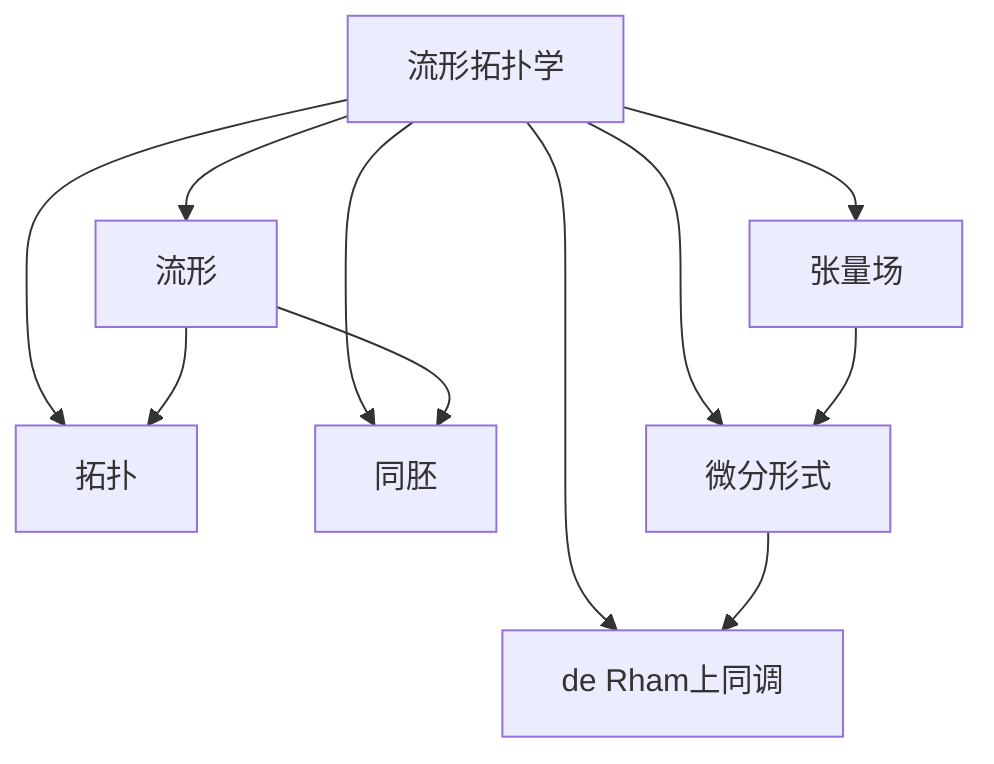

# 流形拓扑学理论与概念的实质：基本概念与框架

## 1. 背景介绍

### 1.1 问题的由来

在现代数学和物理学领域,流形拓扑学理论扮演着至关重要的角色。它为我们提供了一种描述和研究复杂几何结构的强大工具。从广义相对论中的时空几何,到量子场论中的规范场,再到弦论中的高维流形,流形拓扑学无处不在。然而,对于初学者来说,流形拓扑学的概念和理论往往显得晦涩难懂。

### 1.2 研究现状

目前,流形拓扑学的研究主要集中在以下几个方面:

1. 流形的分类和不变量研究
2. 规范场论和量子场论中的拓扑量
3. 弦论和M理论中的高维流形
4. 拓扑相变和拓扑绝缘体
5. 拓扑数据分析和机器学习中的应用

尽管取得了诸多重要进展,但流形拓扑学理论的基础概念和框架仍然存在一些模糊和困惑之处,需要进一步阐明和解释。

### 1.3 研究意义

深入理解流形拓扑学的基本概念和框架,对于我们掌握这一强大的数学工具,并将其应用到各个领域具有重要意义。它不仅能帮助我们更好地理解自然界的规律,还能为新兴的交叉学科提供理论基础。因此,阐明流形拓扑学的本质内涵,是当前理论研究的一个重要课题。

### 1.4 本文结构

本文将从流形拓扑学的基本概念出发,逐步深入探讨其理论框架。我们将首先介绍流形的定义和基本性质,然后讨论拓扑不变量和同胚等概念。接下来,我们将详细阐述流形上的张量场、微分形式和de Rham上同调等核心理论。最后,我们将总结流形拓扑学的应用前景,并展望其在各个领域的发展方向。

## 2. 核心概念与联系

流形拓扑学的核心概念包括:

1. **流形(Manifold)**: 流形是一种抽象的数学对象,用于描述局部看起来像欧几里得空间的拓扑空间。它是现代几何学和物理学的基础。

2. **拓扑(Topology)**: 拓扑研究对象的连续性质,而不关注度量和刚性。它是流形理论的核心部分。

3. **同胚(Homeomorphism)**: 同胚是两个拓扑空间之间的一种等价关系,保持了它们的拓扑性质。

4. **张量场(Tensor Field)**: 张量场是流形上的一种几何对象,用于描述物理量的分布。

5. **微分形式(Differential Form)**: 微分形式是流形上的反变量,在积分理论和de Rham上同调中扮演关键角色。

6. **de Rham上同调(de Rham Cohomology)**: de Rham上同调是流形上的一种拓扑不变量,描述了流形的局部和全局性质。

这些概念相互关联,共同构成了流形拓扑学的理论框架。掌握它们有助于我们深入理解流形的几何和拓扑性质,并将其应用到物理学、数据分析等领域。

## 3. 核心算法原理 & 具体操作步骤

### 3.1 算法原理概述

流形拓扑学中的许多算法都与计算流形的不变量和特征量有关。这些算法通常基于以下几个核心原理:

1. **三角剖分(Triangulation)**: 将流形离散化为一组简单的几何形状(如三角形),从而将连续问题转化为离散问题。

2. **同伦理论(Homology Theory)**: 研究流形的环面、洞穴等拓扑不变量,常用于计算Betti数和同伦群。

3. **Morse理论(Morse Theory)**: 利用流形上的梯度流,研究其临界点和不稳定流形,从而计算拓扑不变量。

4. **规范场理论(Gauge Theory)**: 在流形上定义规范场,研究其拓扑性质,如瞬时子(Instanton)和monopole。

5. **螺旋理论(Spin Geometry)**: 在流形上引入旋量结构,研究其与拓扑和几何之间的关系。

这些原理为流形拓扑学提供了一系列有效的计算工具和算法。

### 3.2 算法步骤详解

以下是一个典型的流形拓扑学算法的步骤:

1. **流形表示**: 首先,我们需要确定流形的表示方式,如三角剖分、细分流形或者矩阵表示等。

2. **构造链复形**: 根据流形的表示,构造相应的链复形(Chain Complex),用于计算同伦群。

3. **计算边界算子**: 计算链复形中的边界算子(Boundary Operator),它描述了高维链到低维链的映射关系。

4. **求解同伦群**: 利用边界算子,计算出流形的同伦群(Homology Groups),它们描述了流形的环面、洞穴等拓扑不变量。

5. **分析不变量**: 根据同伦群的结构,分析流形的Betti数、Euler特征量等拓扑不变量。

6. **可视化和解释**: 将计算结果可视化,并解释其几何和拓扑意义。

7. **应用和推广**: 将算法应用到具体问题中,或者推广到更复杂的流形和拓扑空间。

这些步骤可以根据具体问题和算法进行调整和优化。

### 3.3 算法优缺点

流形拓扑学算法的优点包括:

1. 能够有效计算流形的拓扑不变量,揭示其内在结构。
2. 具有坚实的数学理论基础,计算结果可靠。
3. 适用于广泛的几何和物理问题,有着丰富的应用前景。

但它们也存在一些缺点:

1. 计算复杂度通常较高,特别是对于高维流形。
2. 对于某些特殊情况,可能难以获得解析解或精确结果。
3. 需要掌握相当多的数学背景知识,门槛较高。

### 3.4 算法应用领域

流形拓扑学算法在以下领域有着广泛的应用:

1. **数学**: 计算流形的不变量、分类和特征量。
2. **物理学**: 研究规范场论、弦论和量子重力中的拓扑现象。
3. **数据分��**: 拓扑数据分析(TDA)中的聚类、简化和可视化。
4. **计算机图形学**: 网格处理、形状分析和三维重建。
5. **材料科学**: 研究拓扑绝缘体、拓扑相变和新型量子材料。
6. **生物学**: 分析蛋白质折叠、DNA结构和神经网络拓扑。

随着算法的不断发展和优化,流形拓扑学在更多领域将发挥重要作用。

## 4. 数学模型和公式 & 详细讲解 & 举例说明

### 4.1 数学模型构建

在流形拓扑学中,我们通常使用以下数学模型来描述和研究流形:

1. **拓扑空间模型**:
   - 定义: 设 $M$ 是一个非空集合,其上定义了一个开集族 $\mathcal{T}$,满足以下条件:
     1) 空集 $\emptyset$ 和 $M$ 本身都属于 $\mathcal{T}$。
     2) $\mathcal{T}$ 中任意多个开集的并集仍属于 $\mathcal{T}$。
     3) $\mathcal{T}$ 中任意有限多个开集的交集仍属于 $\mathcal{T}$。
   - 则称 $(M, \mathcal{T})$ 为一个拓扑空间。

2. **流形模型**:
   - 定义: 设 $M$ 是一个拓扑空间,如果对于 $M$ 中的每一点 $p$,都存在一个开集 $U \subseteq M$,使得 $U$ 同胚于 $\mathbb{R}^n$ 中的一个开集,则称 $M$ 为一个 $n$ 维流形。

3. **微分流形模型**:
   - 定义: 设 $M$ 是一个拓扑空间,如果对于 $M$ 中的每一点 $p$,都存在一个开邻域 $U \subseteq M$,使得 $U$ 同胚于 $\mathbb{R}^n$ 中的一个开集,且这个同胚映射及其逆映射都是无限可微的,则称 $M$ 为一个 $n$ 维微分流形。

这些模型为流形拓扑学奠定了坚实的数学基础,并为后续的理论研究和计算提供了框架。

### 4.2 公式推导过程

在流形拓扑学中,许多公式和定理都源自于对流形上的几何对象(如张量场、微分形式等)进行研究和推导。以下是一个典型的公式推导过程:

1. **定义外微分算子(Exterior Derivative)**: 设 $M$ 是一个 $n$ 维流形,对于任意 $k$ 形式 $\omega \in \Omega^k(M)$,我们定义其外微分 $d\omega \in \Omega^{k+1}(M)$ 为:

$$
d\omega(X_0, X_1, \ldots, X_k) = \sum_{i=0}^k (-1)^i X_i \omega(X_0, \ldots, \widehat{X_i}, \ldots, X_k)
$$

其中 $\widehat{X_i}$ 表示省略了 $X_i$ 项。

2. **证明 $d^2 = 0$**: 利用外微分算子的定义,我们可以证明对任意 $k$ 形式 $\omega$,都有 $d(d\omega) = 0$,即:

$$
d^2\omega = 0
$$

这一性质被称为外微分算子的幂等性质。

3. **定义de Rham上同调群(de Rham Cohomology)**: 设 $M$ 是一个流形,我们定义 $k$ 次de Rham上同调群为:

$$
H^k(M) = \frac{\ker(d: \Omega^k(M) \to \Omega^{k+1}(M))}{\operatorname{im}(d: \Omega^{k-1}(M) \to \Omega^k(M))}
$$

即由闭 $k$ 形式模去准确 $k$ 形式所得的商空间。

4. **推导de Rham上同调群的性质**: 利用上述定义,我们可以推导出de Rham上同调群的一系列性质,如:
   - $H^0(M)$ 与 $M$ 的连通分支数有关。
   - $H^1(M)$ 描述了 $M$ 上的非平凡闭环。
   - $H^n(M)$ 与 $M$ 的欧拉特征量相关。
   - de Rham定理: 如果 $M$ 是一个紧致流形,则它的奇异上同调群与de Rham上同调群同构。

这些性质揭示了de Rham上同调群与流形的拓扑结构之间的深刻联系。

### 4.3 案例分析与讲解

为了更好地理解流形拓扑学的数学模型和公式,让我们来分析一个具体的案例:

考虑二维球面 $S^2$,它是一个紧致的2维流形。我们来计算它的de Rham上同调群:

1. **计算 $H^0(S^2)$**:
   - 由于 $S^2$ 是连通的,因此所有0形式都是闭的和准确的,故 $H^0(S^2) \cong \mathbb{R}$。

2. **计算 $H^1(S^2)$**:
   - 在 $S^2$ 上不存在非平凡的闭1形式,因为任何闭1形式都可以局部写为一个准确0形式的外微分。
   - 因此,所有闭1形式都是准确的,故 $H^1(S^2) = 0$。

3. **计算 $H^2(S^2)$**:
   - 在 $S^2$ 上存在一个非平