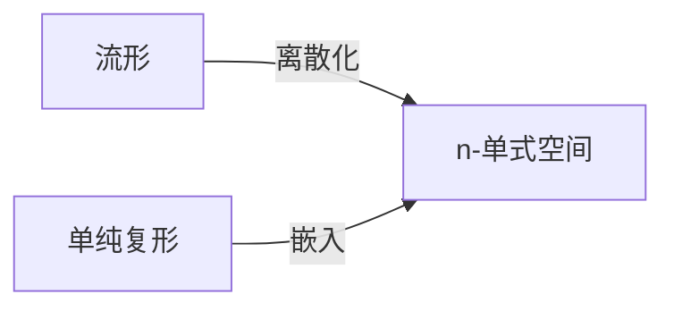

# 流形拓扑学：n单式空间

关键词：流形、单纯复形、同伦、同调、上同调、上同调群、Mayer-Vietoris序列、de Rham上同调、Morse理论、Poincaré对偶

## 1. 背景介绍
### 1.1 问题的由来
流形是数学中一个重要的概念,它描述了一类具有"局部性质类似于欧氏空间"的拓扑空间。流形理论在物理学、工程学、计算机科学等领域有广泛应用。而单纯复形(simplicial complex)作为一种组合结构,可以用来描述和研究流形的拓扑性质。流形上的单纯复形,即 n-单式空间,是流形拓扑学的重要研究对象。

### 1.2 研究现状
目前,流形拓扑学已经发展成为一门成熟的数学分支。人们利用同伦论、同调论、Morse理论等工具,在流形的分类、计算、不变量等方面取得了丰硕的成果。特别是 n-单式空间作为流形的一种有益补充,其组合结构简单、直观,易于计算机处理,因而受到越来越多的关注。

### 1.3 研究意义  
n-单式空间不仅是研究流形拓扑的有力工具,也为将离散、组合的方法引入连续数学提供了新思路。深入研究n-单式空间的性质,对揭示流形的本质特征,加深人们对流形拓扑的认识具有重要意义。同时,n-单式空间在计算机辅助拓扑、计算几何、图形学、大数据分析等领域也有广阔的应用前景。

### 1.4 本文结构
本文将从以下几个方面展开论述：
- 介绍流形、单纯复形、n-单式空间等核心概念,阐明它们之间的联系
- 介绍n-单式空间的基本拓扑不变量及其计算方法,如欧拉示性数、基本群、同调群等 
- 介绍n-单式空间上的de Rham上同调理论及其应用
- 介绍n-单式空间上的Morse理论,揭示其与流形拓扑的深刻联系
- 给出n-单式空间的算法实现,并通过实例演示其应用
- 总结全文,展望n-单式空间理论的发展方向和研究前沿

## 2. 核心概念与联系
流形是一类特殊的拓扑空间,其局部拓扑性质与欧氏空间一致。更确切地说,n维流形是一个Hausdorff、二可数、局部同胚于 n 维欧氏空间 $\mathbb{R}^n$ 的拓扑空间。著名的例子有各维球面、环面、克莱因瓶、射影空间等。

单纯复形是一种组合结构,由单纯形(simplex)通过"粘接"构成。n维单纯形是 n+1 个点组成的凸包,例如一条线段是1-单纯形,一个三角形是2-单纯形。单纯复形可以看作是单纯形的一个"拼接",其中较低维的单纯形被粘接到较高维单纯形的边界上。

n-单式空间是定义在流形之上的单纯复形。直观地说,就是用单纯复形去"逼近"光滑流形。当单纯形的直径趋于0时,n-单式空间在拓扑意义下就等价于原来的流形。

下图给出了流形、单纯复形和n-单式空间三者之间的关系:



## 3. 核心算法原理 & 具体操作步骤
### 3.1 算法原理概述
研究n-单式空间的核心是计算其各种拓扑不变量,如欧拉示性数、基本群、同调群等。这些不变量刻画了n-单式空间的全局拓扑性质。其中最重要的是同调群,它是一系列交换群,测量了空间中"洞"的分布。计算n-单式空间的同调群,主要有以下三种方法:

1. 组合法。利用n-单式空间的组合结构,构造一个链复形,计算其同调。
2. 代数拓扑法。利用Mayer-Vietoris序列等代数拓扑工具,将n-单式空间分解为已知空间,递归计算。 
3. 微分形式法。在n-单式空间上定义离散微分形式,模仿光滑情形定义并计算其上同调群。

### 3.2 算法步骤详解
下面以组合法为例,详细介绍计算n-单式空间同调群的算法步骤。

输入:n-单式空间 $K$。

输出:$K$ 的同调群 $H_*(K)$。

步骤:
1. 将 $K$ 的所有 $p$-单纯形 ($p=0,1,\cdots,n$) 定向化,构成 $p$-链群 $C_p(K)$。
2. 定义边界算子 $\partial_p: C_p(K) \to C_{p-1}(K)$,将每个 $p$-单纯形映射为其边界 $(p-1)$-链。
3. 计算每个 $p$ 的循环群 $Z_p(K) = \ker \partial_p$ 和边界群 $B_p(K) = \mathrm{im} \partial_{p+1}$。
4. 计算每个 $p$ 的同调群 $H_p(K) = Z_p(K) / B_p(K)$。

其中第2步定义边界算子的具体方法是:设 $p$-单纯形 $\sigma^p = [v_0, \cdots, v_p]$,则

$$\partial_p(\sigma^p) = \sum_{i=0}^p (-1)^i [v_0, \cdots, \hat{v}_i, \cdots, v_p]$$

其中 $\hat{v}_i$ 表示去掉点 $v_i$。可以验证 $\partial_{p-1} \circ \partial_p = 0$。

### 3.3 算法优缺点
组合法计算n-单式空间同调的优点是:
- 直观、易于理解和实现。
- 适用于任意维数的n-单式空间。
- 得到的是同调群的完全信息。

缺点是:  
- 计算量大,复杂度高。
- 结果通常是抽象的群,缺乏几何直观性。

### 3.4 算法应用领域
n-单式空间同调群的计算在以下领域有重要应用:
- 流形拓扑分类。同调群是判别两个流形是否同胚的重要标志。
- 传感器网络覆盖。利用传感器的位置数据构造 Rips 复形,其同调群能刻画覆盖区域的拓扑特征。
- 计算机图形学。三维模型可以看作 2-单式空间,其同调群与模型的亏格数、连通性等相关。
- 大数据分析。利用同调群可以揭示高维数据云的形状、孔洞分布等几何和拓扑特征。

## 4. 数学模型和公式 & 详细讲解 & 举例说明
### 4.1 数学模型构建
n-单式空间的数学模型是一个三元组 $(M, K, f)$:
- $M$ 是一个 $n$ 维光滑流形。
- $K$ 是一个抽象单纯复形。
- $f: K \to M$ 是一个单纯映射,即将 $K$ 中每个单纯形映射为 $M$ 中的一个子集,且保持单纯形之间的粘接关系。

直观地,$K$ 在 $M$ 中的像 $f(K)$ 就构成了一个 n-单式空间。$f$ 的存在性由流形的三角剖分定理保证。

### 4.2 公式推导过程
推导n-单式空间的一个重要拓扑不变量——欧拉示性数 $\chi$。

对 $p=0,1,\cdots,n$,设 $\alpha_p$ 为 $K$ 中 $p$-单纯形的个数,则 n-单式空间 $f(K)$ 的欧拉示性数为:

$$\chi(f(K)) = \sum_{p=0}^n (-1)^p \alpha_p$$

推导如下:
1. 因为同调群 $H_p(f(K))$ 是一个有限生成的交换群,所以它的秩 $\beta_p = \mathrm{rank} H_p(f(K))$ 有定义。$\beta_p$ 称为第 $p$ 个贝蒂数。
2. 因为 $H_p(f(K)) \cong Z_p(f(K)) / B_p(f(K))$,且 $\alpha_p = \mathrm{rank} C_p(f(K))$,故有欧拉-庞加莱公式:

$$\sum_{p=0}^n (-1)^p \alpha_p = \sum_{p=0}^n (-1)^p \beta_p$$

3. 因为同伦等价的空间有相同的同调群,所以 $\beta_p$ 实际上是 $M$ 的拓扑不变量。故欧拉示性数 $\chi(M) = \sum_{p=0}^n (-1)^p \beta_p$ 也是 $M$ 的拓扑不变量。
4. 综上所述,n-单式空间 $f(K)$ 的欧拉示性数 $\chi(f(K)) = \sum_{p=0}^n (-1)^p \alpha_p$ 等于流形 $M$ 的欧拉示性数 $\chi(M)$。

### 4.3 案例分析与讲解
下面以2维球面 $S^2$ 为例,说明其n-单式空间的构造以及欧拉示性数的计算。

设 $S^2 = \{ (x,y,z) \in \mathbb{R}^3 | x^2+y^2+z^2=1 \}$。将其等分为上下两个半球,再将赤道等分为三段。这样得到一个 $S^2$ 的三角剖分 $K$,如下图所示:

```
       /\
      /  \
     /    \
    /      \
   /--------\
  / \      / \
 /   \    /   \
/     \  /     \
```

其中 $K$ 有 4 个顶点、6 条边、4 个面,所以 $\alpha_0=4, \alpha_1=6, \alpha_2=4$。故 $S^2$ 的n-单式空间 $f(K)$ 的欧拉示性数为:

$$\chi(f(K)) = \alpha_0 - \alpha_1 + \alpha_2 = 4 - 6 + 4 = 2$$

这与 $S^2$ 作为2维流形的欧拉示性数一致。事实上,任意维球面 $S^n$ 的欧拉示性数为 $1 + (-1)^n$。

### 4.4 常见问题解答
Q: n-单式空间与三角剖分有何区别?

A: 两者都是用单纯复形去逼近光滑流形,区别在于n-单式空间强调单纯映射 $f$ 的存在,使得单纯复形与流形之间建立了一个连续映射,而三角剖分则着重于单纯复形对流形的组合逼近。从拓扑的角度看,n-单式空间蕴含的信息更多。

Q: n-单式空间能否用于非紧流形?

A: 一般情况下,非紧流形未必存在有限的n-单式空间逼近。但是利用单纯同调的逆极限,可以定义非紧流形上的单纯同调群。许多紧流形上的结论可以推广到非紧情形。

## 5. 项目实践：代码实例和详细解释说明
### 5.1 开发环境搭建
- 语言:Python 3.7
- 依赖库:NumPy, SciPy

### 5.2 源代码详细实现
下面给出计算n-单式空间同调群的Python实现。为简洁起见,这里仅计算 $\mathbb{Z}/2\mathbb{Z}$ 系数的同调群。

```python
import numpy as np
from scipy.sparse import dok_matrix

def simplicial_homology(simplices):
    """
    计算单纯复形的同调群
    
    参数:
    simplices -- 单纯复形的所有单纯形列表,每个单纯形用其顶点列表表示
    
    返回:
    各维同调群的列表
    """
    # 提取单纯形的维数信息
    dim = max(len(s) for s in simplices)
    
    # 构造边界算子矩阵
    bdry_ops = [None] * (dim+1)
    for p in range(dim):
        bdry_op = dok_matrix((len(simplices