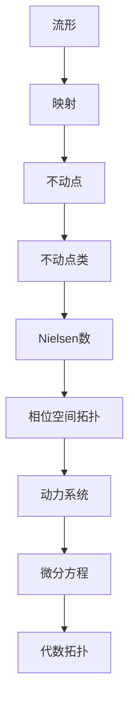

# 流形拓扑学：流形上的不动点类及Nielsen数

## 1. 背景介绍

### 1.1 问题的由来

在拓扑学和代数拓扑学中,不动点理论扮演着重要的角色。不动点理论研究的是连续映射在某些条件下必然存在不动点的现象,以及不动点的性质。在流形上研究不动点理论,需要结合流形的特殊结构,这就引入了流形上的不动点类和Nielsen数等概念。

流形是一种重要的拓扑空间,在数学和物理学中有广泛的应用。流形上的不动点类和Nielsen数理论,为研究流形上的不动点提供了有力的工具,在相位空间拓扑、动力系统、微分方程、代数拓扑等领域有重要应用。

### 1.2 研究现状

流形上的不动点类和Nielsen数理论,最早可以追溯到20世纪60年代。1966年,Jakob Nielsen提出了后来被称为Nielsen数的概念,用于研究流形上的自映射的不动点个数。随后,Brooks、Brown、Jiang等人对这一理论进行了深入的研究和发展。

目前,流形上的不动点类和Nielsen数理论已经成为拓扑不动点理论的一个重要分支,在相关领域有广泛的应用。然而,这一理论也存在一些有待解决的问题和挑战,例如计算复杂度高、某些特殊情况下的应用限制等。

### 1.3 研究意义

研究流形上的不动点类和Nielsen数理论,有着重要的理论意义和应用价值:

1. **理论意义**:不动点理论是拓扑学和代数拓扑学的重要分支,研究流形上的不动点类和Nielsen数,有助于深化对流形结构和连续映射性质的理解。

2. **应用价值**:流形上的不动点类和Nielsen数理论在相位空间拓扑、动力系统、微分方程、代数拓扑等领域有广泛的应用,对于解决实际问题具有重要意义。

3. **交叉学科**:这一理论融合了拓扑学、代数、微分几何等多个数学分支,体现了数学的交叉性和综合性,有助于促进不同学科之间的交流与融合。

### 1.4 本文结构

本文将全面介绍流形上的不动点类和Nielsen数理论。首先阐述核心概念及其相互联系,然后深入探讨核心算法原理和数学模型,并通过实例进行详细说明。接下来,介绍理论的实际应用场景,并推荐相关工具和学习资源。最后,总结理论的发展趋势和面临的挑战,并对未来研究进行展望。

## 2. 核心概念与联系

流形上的不动点类和Nielsen数理论,涉及以下几个核心概念:

1. **流形(Manifold)**: 流形是一种重要的拓扑空间,具有局部欧几里德空间的性质。流形广泛应用于数学、物理学等领域。

2. **映射(Map)**: 映射是定义在流形上的连续函数,将流形的点映射到另一点。研究映射在流形上的性质是该理论的核心。

3. **不动点(Fixed Point)**: 不动点是指映射将其映射回原点的点。在流形上研究不动点,需要结合流形的特殊结构。

4. **不动点类(Fixed Point Class)**: 不动点类是指具有相同不动点数的映射所组成的等价类。

5. **Nielsen数(Nielsen Number)**: Nielsen数是一个代数不变量,用于确定映射在给定流形上的最小不动点数。

6. **相位空间拓扑(Phase Space Topology)**: 相位空间拓扑研究动力系统在相位空间中的拓扑性质,不动点理论在该领域有重要应用。

7. **动力系统(Dynamical System)**: 动力系统描述了物理系统随时间的演化规律,不动点对于研究系统的稳定性至关重要。

8. **微分方程(Differential Equation)**: 微分方程是描述变量之间微分关系的方程,不动点理论可用于研究微分方程的解的性质。

9. **代数拓扑(Algebraic Topology)**: 代数拓扑学结合了代数和拓扑学,不动点类和Nielsen数理论属于该领域的一个分支。

上述概念相互关联、环环相扣,构成了流形上的不动点类和Nielsen数理论的理论框架。掌握这些核心概念及其联系,是深入理解和应用该理论的基础。

## 3. 核心算法原理 & 具体操作步骤

### 3.1 算法原理概述

流形上的不动点类和Nielsen数理论,主要涉及以下几个核心算法:

1. **不动点类计算算法**: 用于计算给定映射的不动点类。

2. **Nielsen数计算算法**: 用于计算给定映射在特定流形上的Nielsen数。

3. **半扩张算法**: 用于构造满足特定条件的映射,从而计算相应的不动点类和Nielsen数。

4. **Wecken分解算法**: 用于将复杂映射分解为更简单的映射,从而简化计算过程。

这些算法的原理基于代数拓扑学、同伦理论和基本群理论等数学分支,并结合了流形的特殊结构。算法的核心思想是通过代数不变量和同伦等价类的计算,来研究映射在流形上的不动点性质。

### 3.2 算法步骤详解

以下是不动点类计算算法和Nielsen数计算算法的具体步骤:

**不动点类计算算法**:

1. 确定映射 $f: M \rightarrow M$ 和流形 $M$ 的性质。

2. 计算流形 $M$ 的基本群 $\pi_1(M)$。

3. 计算映射 $f$ 在基本群上诱导的自同态 $f_*: \pi_1(M) \rightarrow \pi_1(M)$。

4. 将基本群 $\pi_1(M)$ 分解为不变最大子群和有限循环子群的直和。

5. 在每个不变最大子群和有限循环子群上,计算 $f_*$ 的不动点数。

6. 将所有不变最大子群和有限循环子群上的不动点数相加,得到映射 $f$ 的不动点类。

**Nielsen数计算算法**:

1. 确定映射 $f: M \rightarrow M$ 和流形 $M$ 的性质。

2. 计算流形 $M$ 的基本群 $\pi_1(M)$。

3. 计算映射 $f$ 在基本群上诱导的自同态 $f_*: \pi_1(M) \rightarrow \pi_1(M)$。

4. 将基本群 $\pi_1(M)$ 分解为不变最大子群和有限循环子群的直和。

5. 在每个不变最大子群和有限循环子群上,计算 $f_*$ 的最小不动点数。

6. 将所有不变最大子群和有限循环子群上的最小不动点数相加,得到映射 $f$ 在流形 $M$ 上的Nielsen数。

上述算法步骤涉及了基本群计算、同伦理论、有限群表示等复杂的数学概念和技术,需要扎实的代数拓扑学和流形理论基础。在实际应用中,还需要结合具体问题的特殊性,对算法进行适当的调整和优化。

### 3.3 算法优缺点

**优点**:

1. **理论基础扎实**: 这些算法建立在代数拓扑学、同伦理论和基本群理论等坚实的数学理论基础之上,具有严谨的数学依据。

2. **应用广泛**: 不动点类和Nielsen数理论在相位空间拓扑、动力系统、微分方程、代数拓扑等领域有广泛的应用,这些算法为解决实际问题提供了有力工具。

3. **计算不变量**: 这些算法可以计算出映射在流形上的重要代数不变量,如不动点类和Nielsen数,为进一步研究映射的性质提供了依据。

**缺点**:

1. **计算复杂度高**: 尤其是在高维流形和复杂映射的情况下,计算基本群、同伦群等步骤往往非常复杂,导致算法的计算效率较低。

2. **理论局限性**: 这些算法主要适用于连续映射,对于非连续映射或具有特殊性质的映射,可能存在一定的理论局限性。

3. **需要专业知识**: 算法步骤涉及了代数拓扑学、同伦理论、基本群理论等深奥的数学概念,需要扎实的专业知识作为基础。

总的来说,尽管存在一定的缺点和局限性,但这些算法在流形上的不动点类和Nielsen数理论中扮演着核心的角色,是该理论不可或缺的重要组成部分。

### 3.4 算法应用领域

流形上的不动点类和Nielsen数理论,以及相关算法,在以下领域有着广泛的应用:

1. **相位空间拓扑**: 在研究动力系统在相位空间中的拓扑性质时,不动点理论和相关算法可以用于确定系统的稳定性和周期性。

2. **动力系统**: 不动点对于研究动力系统的稳定性、周期性和混沌性至关重要,相关算法可以计算出系统的不动点数和性质。

3. **微分方程**: 微分方程的解的性质与不动点理论密切相关,相关算法可以用于研究微分方程解的存在性、唯一性和稳定性。

4. **代数拓扑**: 不动点类和Nielsen数理论本身就属于代数拓扑学的一个分支,相关算法在该领域有着直接的应用。

5. **计算机科学**: 在计算机图形学、计算机视觉、图像处理等领域,不动点理论和相关算法可以用于研究映射的性质和不变量。

6. **数学建模**: 不动点理论可以应用于各种数学建模问题,如生物种群动力学、化学反应动力学、经济模型等。

7. **拓扑数据分析**: 在新兴的拓扑数据分析领域,不动点理论和相关算法可以用于研究高维数据集的拓扑不变量和结构。

总之,流形上的不动点类和Nielsen数理论及其算法,在数学、物理学、计算机科学等多个领域都有着广泛的应用前景,是一个重要的交叉学科研究方向。

## 4. 数学模型和公式 & 详细讲解 & 举例说明

### 4.1 数学模型构建

在流形上研究不动点类和Nielsen数,需要建立严格的数学模型。该模型的核心要素包括:

1. **流形 $M$**: 一个 $n$ 维流形,通常表示为 $M^n$。

2. **映射 $f: M \rightarrow M$**: 定义在流形 $M$ 上的连续映射。

3. **基本群 $\pi_1(M)$**: 流形 $M$ 的基本群,是一个代数不变量,用于描述流形的拓扑性质。

4. **诱导同态 $f_*: \pi_1(M) \rightarrow \pi_1(M)$**: 映射 $f$ 在基本群上诱导的自同态,反映了映射对流形拓扑结构的作用。

5. **不动点集 $\text{Fix}(f)$**: 映射 $f$ 的不动点集,即所有满足 $f(x) = x$ 的点 $x \in M$ 的集合。

6. **不动点类 $\mathcal{F}(f)$**: 具有相同不动点数的映射所组成的等价类。

7. **Nielsen数 $N(f)$**: 映射 $f$ 在流形 $M$ 上的最小不动点数。

基于这些基本元素,我们可以构建描述不动点类和Nielsen数的数学模型。例如,不动点类 $\mathcal{F}(f)$ 可以通过基本群的分解和诱导同态的不动点数来计算,而Nielsen数 $N(f)$ 则是不动点类中不动点数的下界。

### 4.2 公式推导过程

为了计算不动点类和Nielsen数,我们需要利用代数拓扑学和同伦理论中的一些重要公式和理论。以下是