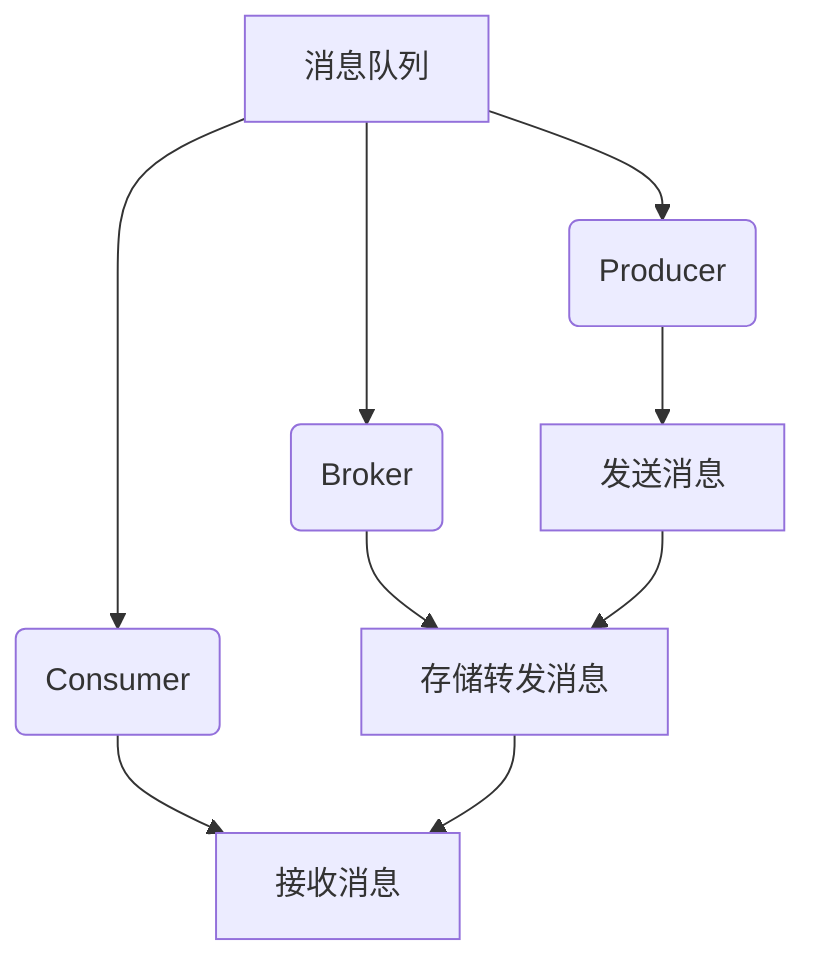
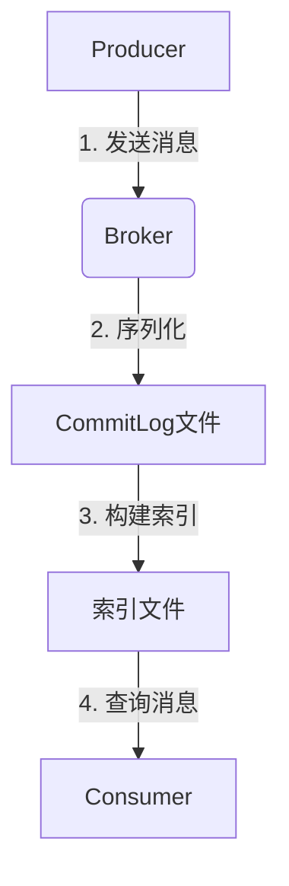
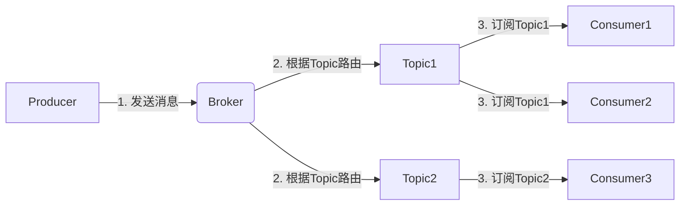
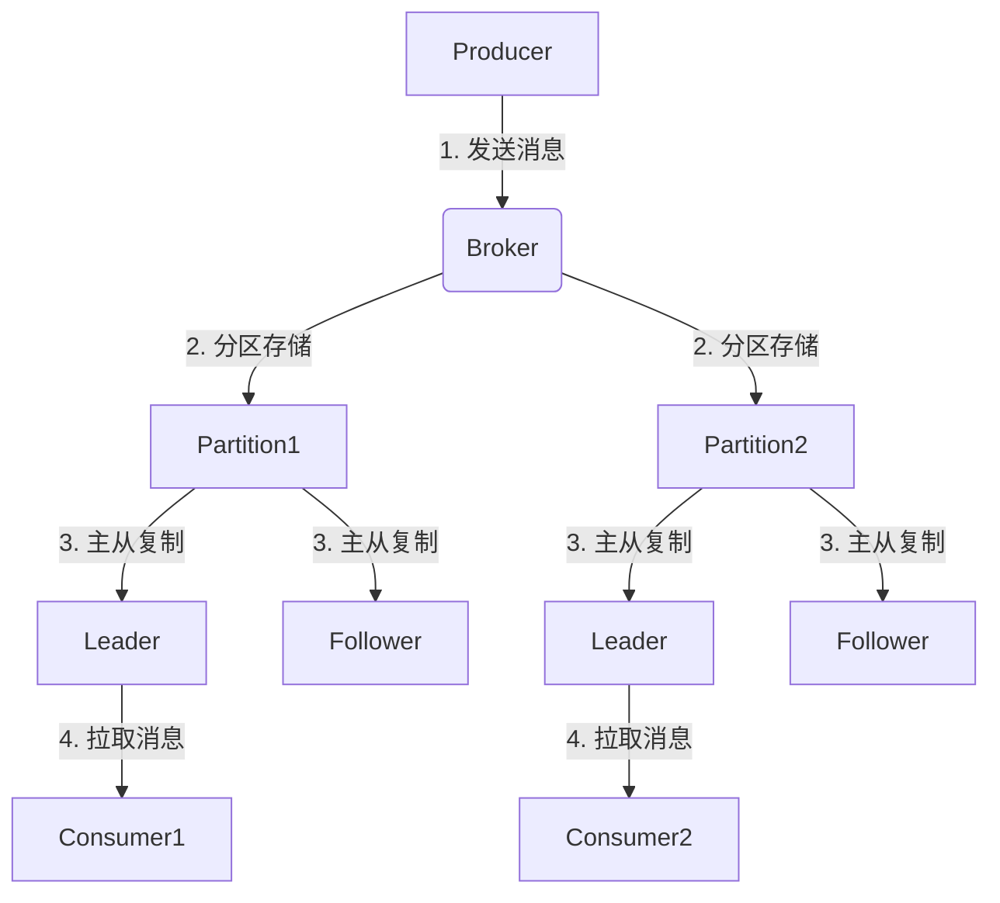
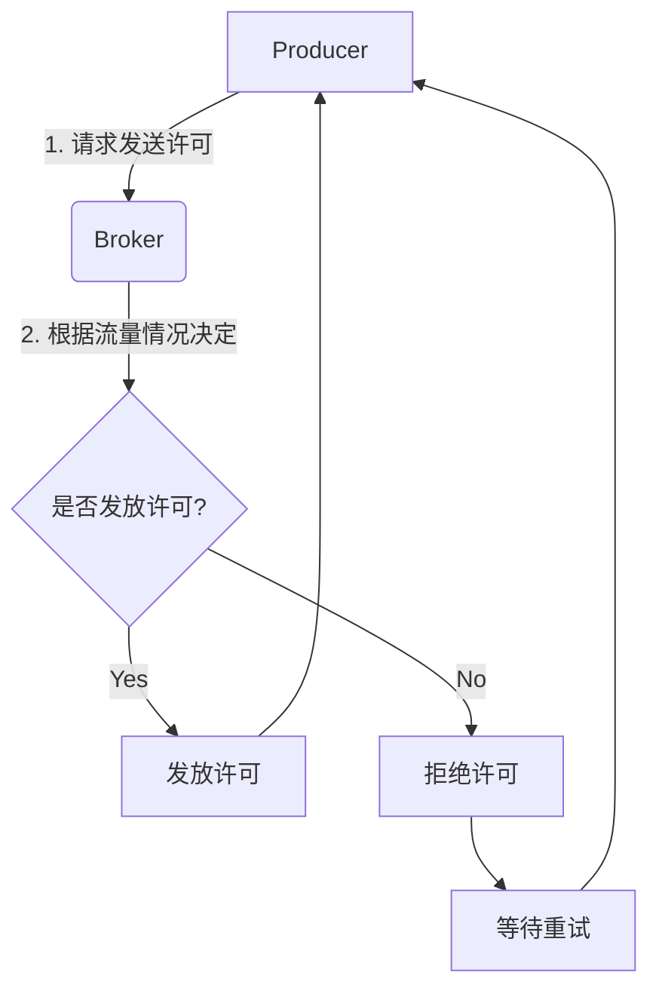
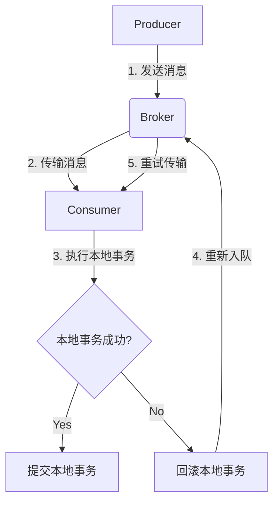

# 消息队列 原理与代码实例讲解

## 1. 背景介绍

### 1.1 问题的由来

在现代分布式系统中,不同的应用程序、服务和模块之间需要进行通信和数据交换。然而,直接的点对点通信方式存在着许多缺陷,例如:

- **耦合度高**:发送方和接收方直接耦合,难以解耦和扩展
- **可靠性差**:如果接收方暂时无法处理消息,消息将丢失
- **吞吐量有限**:发送方需要等待接收方处理完成才能发送下一条消息
- **异步通信困难**:无法实现真正的异步通信,降低了系统的响应能力

为了解决这些问题,**消息队列(Message Queue)** 作为一种解耦合、异步通信的机制应运而生。

### 1.2 研究现状

消息队列技术经过多年的发展,已经成为分布式系统不可或缺的基础设施。目前,业界主流的消息队列产品包括:

- **RabbitMQ**: 采用AMQP协议,支持多种消息传递模式,可靠性高
- **Apache Kafka**: 高吞吐量、分区复制的分布式发布订阅消息系统
- **Apache RocketMQ**: 阿里巴巴开源的分布式消息队列,高性能、低延迟
- **ActiveMQ**: 遵循JMS规范,支持多种语言和协议
- **Amazon SQS**: AWS提供的消息队列服务,可扩展、高可用

这些消息队列产品在设计理念、实现细节、性能特征等方面存在差异,适用于不同的应用场景。

### 1.3 研究意义

深入理解消息队列的原理和实现细节,对于构建高可用、可扩展的分布式系统至关重要。本文将从以下几个方面进行探讨:

- 消息队列的核心概念和基本原理
- 常见的消息传递模式和使用场景
- 消息队列的关键算法和数学模型
- 基于代码实例的实现细节分析
- 消息队列在实际应用中的最佳实践
- 消息队列的发展趋势和未来挑战

通过全面、系统的分析,读者将获得消息队列领域的核心知识,为实际应用提供理论和实践指导。

### 1.4 本文结构

本文将按照以下结构展开讨论:

1. 背景介绍
2. 核心概念与联系
3. 核心算法原理与具体操作步骤
4. 数学模型和公式详细讲解与举例说明
5. 项目实践:代码实例和详细解释说明
6. 实际应用场景
7. 工具和资源推荐
8. 总结:未来发展趋势与挑战
9. 附录:常见问题与解答

## 2. 核心概念与联系

在深入探讨消息队列的原理之前,我们需要了解一些核心概念:

- **Producer(生产者)**: 发送消息的应用程序或服务
- **Consumer(消费者)**: 接收并处理消息的应用程序或服务
- **Broker(代理)**: 消息队列服务器,负责存储、路由和转发消息
- **Message(消息)**: 生产者发送给消费者的数据载体,通常包含头部和消息体

消息队列实现了生产者和消费者的解耦,它们不需要直接通信,而是通过代理进行异步交互。这种间接交互模式具有以下优点:

- **解耦合**: 生产者和消费者之间完全解耦,可独立扩展和维护
- **异步通信**: 生产者无需等待消费者处理完成,可以立即返回
- **峰值处理**: 能够缓冲突发的流量高峰,防止消费者被淹没
- **可靠传输**: 消息可以持久化存储,即使消费者宕机也不会丢失
- **流量分发**: 可以将消息分发给多个消费者,实现负载均衡和故障转移

## 3. 核心算法原理与具体操作步骤

### 3.1 算法原理概述

消息队列的核心算法主要包括以下几个方面:

1. **存储策略**: 如何高效、持久地存储消息
2. **路由策略**: 如何将消息准确地路由到正确的消费者
3. **复制策略**: 如何实现消息的高可用和容错能力
4. **流控策略**: 如何控制消息的发送速率,防止消费者被淹没
5. **事务策略**: 如何保证消息传输的原子性和持久性
6. **安全策略**: 如何保证消息传输的安全性和隐私性

不同的消息队列产品在上述方面采用了不同的算法和策略,我们将重点介绍其中的核心算法原理。

### 3.2 算法步骤详解

#### 3.2.1 存储策略

消息队列需要持久化存储消息,以防止消费者宕机或网络故障导致消息丢失。常见的存储策略包括:

1. **内存存储**: 将消息存储在内存中,速度快但不持久
2. **文件存储**: 将消息序列化存储在文件系统中,持久但性能较差
3. **数据库存储**: 将消息存储在关系型或NoSQL数据库中,持久且具有查询能力

其中,文件存储是最常见的存储策略,它通常采用以下步骤:

1. 将消息序列化为字节数组
2. 将字节数组追加到commitlog文件中
3. 定期从commitlog中获取消息,构建索引文件
4. 消费者从索引文件中查找并读取消息

这种存储策略的优点是:

- 顺序写入commitlog文件,性能高效
- 消息持久化,不会因宕机而丢失
- 索引文件提供快速查询能力

#### 3.2.2 路由策略

消息队列需要将消息准确地路由到正确的消费者,常见的路由策略包括:

1. **队列路由**: 每个消费者监听一个独立的队列
2. **主题路由**: 消费者根据主题订阅感兴趣的消息
3. **内容路由**: 根据消息内容中的某些属性进行路由

其中,主题路由是最常见的策略,它通常采用以下步骤:

1. 生产者将消息发送到指定的主题(Topic)
2. 消费者根据感兴趣的主题订阅消息
3. Broker根据订阅关系将消息路由到对应的消费者

这种路由策略的优点是:

- 解耦生产者和消费者,提高系统的扩展性
- 消费者只接收感兴趣的消息,降低了负载
- 支持广播和组播等复杂的消息传递模式

#### 3.2.3 复制策略

为了提高消息队列的可用性和容错能力,通常需要采用复制策略,将消息复制到多个Broker节点。常见的复制策略包括:

1. **主从复制**: 一个主节点负责写入,多个从节点复制主节点的数据
2. **分区复制**: 将消息分散存储在多个分区中,每个分区内部采用主从复制
3. **无主复制**: 所有节点都是对等的,任何节点都可以接收写入请求

其中,分区复制是最常见的策略,它通常采用以下步骤:

1. 将消息主题分散存储在多个分区中
2. 每个分区内部采用主从复制,保证数据的可用性
3. 消费者订阅感兴趣的分区,并从领导者节点拉取消息

这种复制策略的优点是:

- 提高了消息队列的可用性和容错能力
- 支持水平扩展,可以动态添加新的分区
- 消费者可以并行消费不同分区的消息,提高了吞吐量

#### 3.2.4 流控策略

为了防止消费者被突发的流量高峰淹没,消息队列需要采用流控策略,控制消息的发送速率。常见的流控策略包括:

1. **限流**: 限制生产者每秒钟发送的消息数量
2. **回压**: 当消费者处理速度跟不上时,暂时阻塞生产者的发送请求
3. **优先级调度**: 根据消息的优先级进行调度,优先处理高优先级的消息

其中,限流和回压是最常见的策略,它们通常采用以下步骤:

1. 生产者在发送消息前,先获取发送许可
2. Broker根据当前的流量情况,决定是否发放许可
3. 如果许可被拒绝,生产者需要等待一段时间后重试

这种流控策略的优点是:

- 防止突发的流量高峰导致消费者被淹没
- 保证了消息队列的稳定性和可靠性
- 可以根据实际情况动态调整流控策略

#### 3.2.5 事务策略

为了保证消息传输的原子性和持久性,消息队列需要采用事务策略。常见的事务策略包括:

1. **本地事务**: 生产者和消费者各自维护本地事务
2. **分布式事务**: 采用两阶段提交协议等分布式事务协议
3. **最终一致性**: 通过消息重试、补偿操作等机制实现最终一致性

其中,最终一致性是最常见的策略,它通常采用以下步骤:

1. 生产者发送消息后,立即返回
2. 消费者消费消息,并执行本地事务
3. 如果本地事务失败,消费者将消息重新放回队列
4. 通过重试和补偿操作,最终达到一致性

这种事务策略的优点是:

- 不需要实现复杂的分布式事务协议
- 生产者无需等待消费者的本地事务完成
- 通过重试和补偿操作,最终达到数据一致性

### 3.3 算法优缺点

上述核心算法为消息队列提供了高效、可靠的消息传输能力,但也存在一些缺陷和局限性:

**优点**:

- 解耦生产者和消费者,提高系统的扩展性和灵活性
- 支持异步通信,提高系统的响应能力和吞吐量
- 具有高可用性和容错能力,能够处理突发的流量高峰
- 支持复杂的消