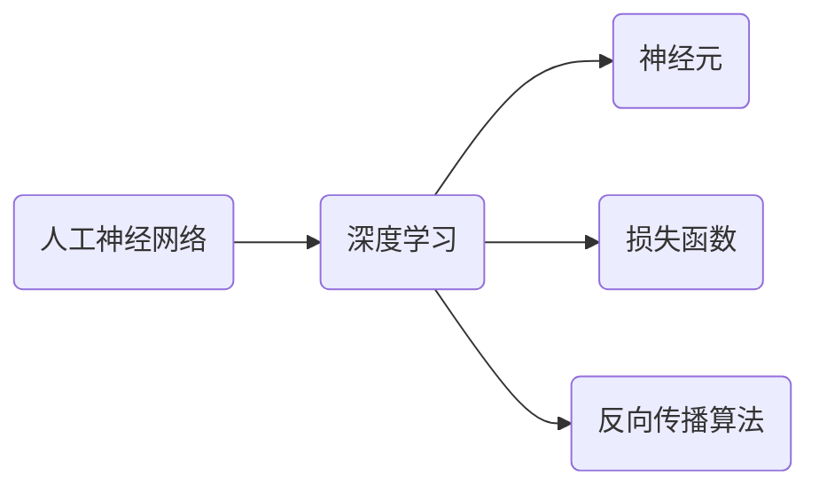

# 深度学习框架原理与代码实战案例讲解

作者：禅与计算机程序设计艺术 / Zen and the Art of Computer Programming

## 1. 背景介绍
### 1.1 问题的由来
深度学习作为人工智能领域的一个重要分支,在近年来取得了突破性的进展。从图像识别、语音识别到自然语言处理等诸多领域,深度学习都展现出了强大的性能,甚至在某些任务上已经超越了人类的表现。然而,对于许多初学者和非专业人士来说,深度学习仍然是一个相对陌生和神秘的领域。究其原因,除了理论上的复杂性之外,如何利用深度学习框架进行实际的模型构建和训练,也是一个不小的挑战。

### 1.2 研究现状
目前,深度学习领域的研究呈现出百花齐放的趋势。从最早的感知机,到浅层神经网络,再到如今的深度神经网络,研究者们不断探索新的网络结构和学习算法,推动着深度学习的发展。与此同时,各种深度学习框架也如雨后春笋般涌现,如TensorFlow、PyTorch、Keras、Caffe等,为深度学习的应用提供了便利。不过,这些框架在使用上还是存在一定的门槛,需要使用者具备一定的编程基础和数学功底。

### 1.3 研究意义
深入剖析深度学习框架的原理,并结合代码实战案例进行讲解,对于深度学习的初学者和爱好者来说意义重大。一方面,通过对框架原理的学习,可以加深对深度学习本质的理解,夯实理论基础;另一方面,借助案例代码的实践,可以快速上手深度学习的项目开发,提升动手能力。此外,这种理论与实践相结合的学习方式,也有助于培养综合性的AI人才,为人工智能的发展储备力量。

### 1.4 本文结构
本文将从以下几个方面展开论述:
- 首先,介绍深度学习的核心概念,并阐明它们之间的内在联系;
- 然后,重点剖析主流深度学习框架的核心原理,并给出清晰的算法步骤;  
- 接着,从数学角度对深度学习的模型和公式进行推导和讲解,并辅以案例进行说明;
- 随后,以实战项目为例,详细解读深度学习代码的实现过程;
- 最后,总结深度学习的发展趋势,分析其面临的机遇和挑战,并对未来进行展望。

## 2. 核心概念与联系

在深入探讨深度学习框架原理之前,我们有必要先明确几个核心概念:

- 人工神经网络(ANN):一种模仿生物神经网络(动物的中枢神经系统,特别是大脑)的结构和功能的数学模型或计算模型。
- 深度学习(DL):一类通过多层非线性变换对数据进行表征学习的机器学习方法。
- 神经元:神经网络的基本单元,负责接收输入信号并产生输出。通常采用非线性激活函数(如sigmoid、tanh、ReLU等)引入非线性因素。
- 损失函数:用于衡量神经网络的预测值与真实值之间的差距。常见的损失函数包括均方误差、交叉熵损失等。
- 反向传播算法(BP):一种高效的神经网络训练方法。通过损失函数的梯度计算,调整神经元权重参数,使网络的预测结果不断逼近真实值。

这些概念环环相扣,共同构成了深度学习的理论基础。人工神经网络是实现深度学习的载体,通过多层神经元的堆叠,可以构建出深度网络。网络训练的目标是最小化损失函数,而反向传播算法则为参数调优提供了高效的途径。

## 3. 核心算法原理 & 具体操作步骤
### 3.1 算法原理概述
现代深度学习框架的核心算法主要包括两大类:一是用于网络搭建的前向传播算法,二是用于参数调优的反向传播算法。

前向传播负责信息的正向传递和计算,将输入数据一层层地转化为输出结果。以最简单的全连接层为例,前向传播可以表示为:

$$a^{(l)}=\sigma(W^{(l)}a^{(l-1)}+b^{(l)})$$

其中,$a^{(l)}$为第$l$层的输出,$W^{(l)}$和$b^{(l)}$分别为该层的权重矩阵和偏置向量,$\sigma$为激活函数。

反向传播则与之相反,负责误差信号的反向传递和梯度计算。根据链式法则,可以推导出第$l$层权重矩阵$W^{(l)}$的梯度:

$$\frac{\partial J}{\partial W^{(l)}}=\frac{\partial J}{\partial a^{(l)}}\frac{\partial a^{(l)}}{\partial z^{(l)}}\frac{\partial z^{(l)}}{\partial W^{(l)}}$$

其中,$J$为损失函数,$z^{(l)}=W^{(l)}a^{(l-1)}+b^{(l)}$。利用梯度下降法,即可不断更新权重矩阵,使损失函数最小化:

$$W^{(l)}=W^{(l)}-\alpha\frac{\partial J}{\partial W^{(l)}}$$

其中,$\alpha$为学习率。

### 3.2 算法步骤详解
结合上述原理,深度学习框架的核心算法可以归纳为以下步骤:

1. 定义网络结构。根据任务需求,选择合适的网络层(全连接层、卷积层、池化层等)进行组合和堆叠,搭建出完整的网络架构。
2. 初始化参数。为网络的权重矩阵和偏置向量赋予初始值,为后续训练做好准备。常用的初始化方法有高斯初始化、Xavier初始化等。
3. 前向传播。将输入数据喂入网络,逐层进行信息传递和计算,直至获得输出结果。
4. 计算损失。将网络输出与真实标签进行比较,根据预定义的损失函数(如均方误差、交叉熵损失等)计算出损失值。
5. 反向传播。根据损失函数,利用链式法则自底向上地计算出每一层权重矩阵和偏置向量的梯度。
6. 参数更新。利用梯度下降法,根据计算出的梯度对权重矩阵和偏置向量进行更新,使网络朝着最小化损失函数的方向优化。
7. 重复迭代。将步骤3-6重复多次,直至网络收敛或达到预设的迭代次数。

以上就是深度学习框架的核心算法步骤。当然,实际操作中还需要考虑数据的批处理、学习率的调整、正则化的引入等细节,以进一步优化网络性能。

### 3.3 算法优缺点
深度学习算法的优点主要体现在以下几个方面:
- 强大的表征能力。通过多层非线性变换,深度学习算法可以自动学习到数据的高层特征,无需人工设计和提取。
- 端到端的学习方式。深度学习算法可以直接将原始输入映射到输出,中间无需人为干预,大大简化了流程。  
- 优异的泛化性能。得益于大规模数据的训练,深度学习模型具有很强的泛化能力,可以很好地适应新的数据。

当然,深度学习算法也存在一些局限性:
- 对数据规模和质量要求高。深度学习算法通常需要大量的标注数据进行训练,否则容易出现过拟合等问题。
- 计算资源消耗大。深度学习模型的训练需要大量的计算资源,对硬件提出了很高的要求。
- 可解释性差。深度学习模型通常被视为一个"黑盒",其内部决策过程难以解释,这在某些场景下可能存在风险。

### 3.4 算法应用领域
得益于其强大的性能,深度学习算法已经在多个领域取得了广泛应用,如:
- 计算机视觉:图像分类、目标检测、语义分割等
- 语音识别:语音转文本、说话人识别等  
- 自然语言处理:机器翻译、情感分析、文本生成等
- 推荐系统:个性化推荐、广告投放等
- 生物医疗:药物发现、基因组学分析等

未来,随着算法的不断发展和完善,深度学习必将在更多领域大放异彩。

## 4. 数学模型和公式 & 详细讲解 & 举例说明
### 4.1 数学模型构建
深度学习的数学模型可以用一个多层复合函数来表示:

$$F(x)=f_n(...f_2(f_1(x;W_1,b_1);W_2,b_2)...;W_n,b_n)$$

其中,$x$为输入,$f_i$为第$i$层的变换函数(如全连接、卷积、池化等),$W_i$和$b_i$为该层的权重矩阵和偏置向量。整个网络的目标就是学习一组最优的参数$\{W_i,b_i\}$,使得模型的输出$F(x)$尽可能逼近真实标签$y$。

以最简单的两层全连接网络为例,其数学模型可以表示为:

$$F(x)=\sigma_2(W_2\sigma_1(W_1x+b_1)+b_2)$$

其中,$\sigma_1$和$\sigma_2$分别为两层的激活函数。

### 4.2 公式推导过程
对于上述两层全连接网络,假设采用均方误差作为损失函数:

$$J=\frac{1}{2}\|F(x)-y\|^2$$

根据反向传播算法,我们需要分别计算出两层权重矩阵$W_1$和$W_2$的梯度。以$W_2$为例,利用链式法则可得:

$$\frac{\partial J}{\partial W_2}=\frac{\partial J}{\partial F}\frac{\partial F}{\partial z_2}\frac{\partial z_2}{\partial W_2}$$

其中,$z_2=W_2a_1+b_2$,$a_1=\sigma_1(z_1)=\sigma_1(W_1x+b_1)$。

进一步展开可得:

$$\frac{\partial J}{\partial W_2}=(F(x)-y)\circ\sigma_2'(z_2)a_1^T$$

类似地,可以推导出$W_1$的梯度:

$$\frac{\partial J}{\partial W_1}=((F(x)-y)\circ\sigma_2'(z_2)W_2^T)\circ\sigma_1'(z_1)x^T$$

其中,$\circ$表示Hadamard乘积(即逐元素相乘)。

有了梯度表达式,即可利用梯度下降法对权重矩阵进行更新:

$$W_i=W_i-\alpha\frac{\partial J}{\partial W_i},i=1,2$$

### 4.3 案例分析与讲解
下面我们以一个简单的二分类任务为例,来说明如何利用数学模型进行深度学习。

假设有一个二维数据集$\{(x_i,y_i)\}_{i=1}^N$,其中$x_i\in\mathbb{R}^2$,$y_i\in\{0,1\}$。我们希望训练一个两层全连接网络,来对数据点进行分类。

首先,定义网络结构如下:

$$F(x)=\sigma(W_2\sigma(W_1x+b_1)+b_2)$$

其中,$\sigma$为sigmoid激活函数:

$$\sigma(z)=\frac{1}{1+e^{-z}}$$

选择交叉熵损失函数:

$$J=-\frac{1}{N}\sum_{i=1}^N[y_i\log F(x_i)+(1-y_i)\log(1-F(x_i))]$$

根据前面的推导,可以得到权重矩阵的梯度:

$$\frac{\partial J}{\partial W_2}=\frac{1}{N}\sum_{i=1}^N(F(x_i)-y_i)a_1^T$$

$$\frac{\partial J}{\partial W_1}=\frac{1}{N}\sum_{i=1}^N((F(x_i)-y_i)W_2^T)\circ\sigma'(z