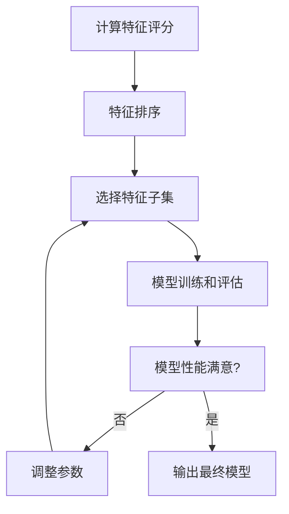

好的,我会按照您的要求,以专业的技术语言写一篇关于"特征工程(Feature Engineering)原理与代码实例讲解"的深度博客文章。文章会遵循您列出的约束条件和内容结构模板,确保逻辑清晰、内容充实、有深度见解。现在,让我们正式开始:

# 特征工程 (Feature Engineering) 原理与代码实例讲解

## 1. 背景介绍

### 1.1 问题的由来

在机器学习和数据挖掘领域,获取高质量的训练数据对于构建精确的模型至关重要。然而,原始数据通常是未经处理的,包含了许多噪声、缺失值和无关特征。为了提高模型的性能,我们需要对原始数据进行特征工程,从而生成对模型更加友好的特征集。

### 1.2 研究现状

特征工程作为数据预处理的关键步骤,已经受到了广泛的关注和研究。目前,已经提出了多种特征工程技术,如特征选择、特征提取、特征构造等。但由于数据的多样性和复杂性,特征工程仍然是一个充满挑战的领域,需要持续探索和创新。

### 1.3 研究意义

高质量的特征对于构建精确的机器学习模型至关重要。通过特征工程,我们可以从原始数据中提取出对模型更加友好的特征,从而提高模型的准确性、泛化能力和解释性。因此,掌握特征工程的原理和技术对于数据科学家和机器学习工程师来说是非常必要的。

### 1.4 本文结构

本文将全面介绍特征工程的核心概念、算法原理、数学模型、代码实现,以及在实际应用中的案例分析。我们将从理论和实践两个层面深入探讨特征工程,帮助读者掌握这一重要技术。

## 2. 核心概念与联系

特征工程包含了以下几个核心概念:

1. **特征选择(Feature Selection)**: 从原始特征集中选择出对模型最有价值的一个子集。这有助于减少模型的复杂度,提高计算效率,并降低过拟合的风险。

2. **特征提取(Feature Extraction)**: 从原始特征集中构造出一组新的特征,这些新特征能够更好地表示数据的内在结构和模式。常用的特征提取方法包括主成分分析(PCA)、线性判别分析(LDA)等。

3. **特征构造(Feature Construction)**: 通过特征之间的组合或转换,构造出新的特征。这种方法可以捕捉原始特征之间的交互关系,从而为模型提供更多的信息。

4. **特征缩放(Feature Scaling)**: 将特征值缩放到一个合适的范围内,以避免某些特征由于数值范围过大而主导模型的训练过程。常用的缩放方法包括标准化(Normalization)和区间缩放(Range Scaling)。

这些核心概念相互关联,共同构成了特征工程的基础框架。在实际应用中,我们通常需要结合使用多种技术来处理原始数据,从而获得高质量的特征集。

## 3. 核心算法原理 & 具体操作步骤

### 3.1 算法原理概述

特征工程的核心算法包括以下几种:

1. **Filter 方法**: 根据特征与目标变量之间的相关性评分,选择出评分最高的特征子集。常用的评分函数包括相关系数、互信息、卡方统计量等。

2. **Wrapper 方法**: 将特征选择过程视为一个优化问题,通过搜索不同的特征子集,选择能够最大化模型性能的特征集。常用的搜索策略包括前向选择、后向消去、递归特征消去等。

3. **Embedded 方法**: 在模型训练的同时进行特征选择,利用模型本身的机制来评估特征的重要性。常见的 Embedded 方法包括 Lasso 回归、决策树等。

4. **特征提取算法**: 常用的特征提取算法包括主成分分析(PCA)、线性判别分析(LDA)、独立成分分析(ICA)等。这些算法通过线性或非线性变换,将原始特征映射到一个新的低维空间中。

5. **特征构造算法**: 通过特征之间的组合或转换,构造出新的特征。常用的方法包括多项式特征、交互特征、基于领域知识的特征构造等。

这些算法各有优缺点,在实际应用中需要根据具体问题和数据特点选择合适的算法。

### 3.2 算法步骤详解

以 Filter 方法为例,特征选择的具体步骤如下:

1. **计算特征与目标变量之间的评分**: 对于每个特征,计算它与目标变量之间的评分,常用的评分函数包括相关系数、互信息、卡方统计量等。

2. **特征排序**: 根据评分结果,将所有特征按照评分从高到低排序。

3. **选择特征子集**: 根据预设的阈值或者期望的特征数量,从排序后的特征列表中选择出评分最高的特征子集。

4. **模型训练和评估**: 使用选择出的特征子集训练机器学习模型,并评估模型的性能。

5. **迭代优化**: 根据模型评估结果,调整特征选择的阈值或期望特征数量,重复执行上述步骤,直到获得满意的模型性能。

这个过程可以用下面的 Mermaid 流程图来描述:

需要注意的是,不同的特征选择算法在具体实现上会有所不同,但是整体思路是类似的。

### 3.3 算法优缺点

每种特征工程算法都有其优缺点:

- **Filter 方法**:
  - 优点:计算速度快,可扩展性强,适用于高维数据。
  - 缺点:评分函数的选择对结果有较大影响,无法考虑特征之间的交互关系。

- **Wrapper 方法**:
  - 优点:可以直接优化模型性能,考虑了特征之间的交互关系。
  - 缺点:计算代价高,对模型有较强的依赖性,容易过拟合。

- **Embedded 方法**:
  - 优点:计算效率较高,能够直接优化模型性能。
  - 缺点:对模型有较强的依赖性,无法解释特征选择的原因。

- **特征提取算法**:
  - 优点:能够发现数据的内在结构,降低特征维度,提高模型的泛化能力。
  - 缺点:可解释性较差,需要对提取后的特征进行重新解释。

- **特征构造算法**:
  - 优点:能够捕捉特征之间的交互关系,为模型提供更多信息。
  - 缺点:需要较强的领域知识,构造过程较为主观,容易引入无关特征。

在实际应用中,我们通常需要结合使用多种算法,综合考虑它们的优缺点,从而获得最佳的特征集。

### 3.4 算法应用领域

特征工程算法在多个领域都有广泛的应用,包括但不限于:

- **计算机视觉**: 从图像或视频中提取出有用的特征,如边缘、纹理、形状等,用于目标检测、图像分类等任务。

- **自然语言处理**: 从文本数据中提取出有用的特征,如词袋模型、TF-IDF、Word Embedding等,用于文本分类、情感分析、机器翻译等任务。

- **生物信息学**: 从基因序列、蛋白质结构等生物数据中提取出有用的特征,用于基因表达分析、蛋白质结构预测等任务。

- **金融分析**: 从金融数据中提取出有用的特征,如技术指标、市场情绪等,用于股票预测、欺诈检测等任务。

- **推荐系统**: 从用户行为数据中提取出有用的特征,如用户偏好、社交关系等,用于个性化推荐。

总的来说,特征工程是一种通用的数据预处理技术,在任何涉及机器学习和数据挖掘的领域都有广泛的应用前景。

## 4. 数学模型和公式 & 详细讲解 & 举例说明

在特征工程中,我们经常需要使用一些数学模型和公式来量化特征与目标变量之间的关系,或者对特征进行转换和缩放。下面我们将详细介绍一些常用的数学模型和公式。

### 4.1 数学模型构建

**相关系数(Correlation Coefficient)**

相关系数是衡量两个变量线性相关程度的一种指标,常用于特征选择的 Filter 方法中。对于两个变量 $X$ 和 $Y$,它们的相关系数可以用下式计算:

$$r_{xy} = \frac{\sum_{i=1}^{n}(x_i - \bar{x})(y_i - \bar{y})}{\sqrt{\sum_{i=1}^{n}(x_i - \bar{x})^2}\sqrt{\sum_{i=1}^{n}(y_i - \bar{y})^2}}$$

其中 $\bar{x}$ 和 $\bar{y}$ 分别表示 $X$ 和 $Y$ 的均值。相关系数的取值范围是 $[-1, 1]$,绝对值越大,表示两个变量的线性相关度越高。

**互信息(Mutual Information)**

互信息是信息论中衡量两个随机变量相互依赖程度的一种度量,也常用于特征选择的 Filter 方法中。对于离散随机变量 $X$ 和 $Y$,它们的互信息可以用下式计算:

$$I(X;Y) = \sum_{y \in Y}\sum_{x \in X}p(x,y)\log\frac{p(x,y)}{p(x)p(y)}$$

其中 $p(x,y)$ 是 $X$ 和 $Y$ 的联合概率分布,而 $p(x)$ 和 $p(y)$ 分别是 $X$ 和 $Y$ 的边缘概率分布。互信息的取值范围是 $[0, +\infty)$,值越大,表示两个变量的相互依赖程度越高。

**主成分分析(Principal Component Analysis, PCA)**

PCA 是一种常用的线性无监督特征提取方法,它通过正交变换将原始特征映射到一个新的正交空间中,新空间中的每个维度被称为主成分,并且主成分之间是线性无关的。

假设我们有一个 $n \times p$ 的数据矩阵 $X$,其中 $n$ 是样本数,而 $p$ 是特征数。PCA 的目标是找到一个 $p \times p$ 的正交变换矩阵 $W$,使得投影后的新特征矩阵 $Z = XW$ 的方差最大化。具体来说,我们需要最大化如下目标函数:

$$\max_{W^TW=I}\sum_{i=1}^{p}\operatorname{Var}(z_i)$$

其中 $z_i$ 是 $Z$ 的第 $i$ 列,即第 $i$ 个主成分。这个优化问题可以通过特征值分解来解决,具体步骤如下:

1. 计算数据矩阵 $X$ 的协方差矩阵 $\Sigma = \frac{1}{n}X^TX$
2. 对协方差矩阵 $\Sigma$ 进行特征值分解,得到特征值 $\lambda_1 \geq \lambda_2 \geq \cdots \geq \lambda_p$ 和对应的特征向量 $v_1, v_2, \cdots, v_p$
3. 将特征向量按照对应特征值的大小排序,构成变换矩阵 $W = [v_1, v_2, \cdots, v_p]$
4. 计算新特征矩阵 $Z = XW$,其中每一列 $z_i$ 就是一个主成分

通过 PCA,我们可以将原始的 $p$ 维特征映射到一个 $k$ 维的新空间中,其中 $k \leq p$。这种降维操作不仅可以减少特征的维度,还能去除噪声和冗余信息,从而提高模型的泛化能力。

### 4.2 公式推导过程

下面我们将详细推导 P