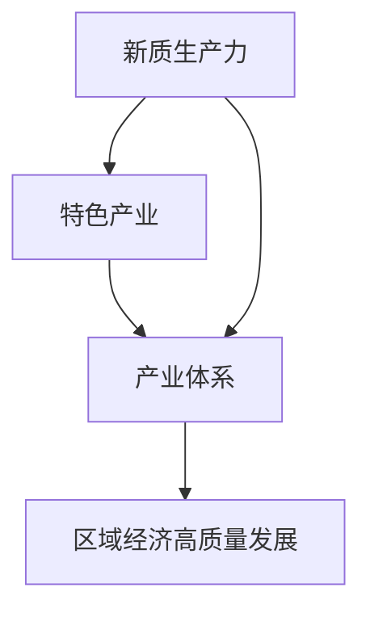

# 特色产业体系的构建与新质生产力发展

关键词：特色产业、产业体系、新质生产力、区域经济、产业升级

## 1. 背景介绍
### 1.1 问题的由来
随着经济全球化的深入发展,区域经济的竞争日趋激烈。如何在激烈的竞争中脱颖而出,实现区域经济的可持续发展,已成为各地区面临的重大课题。发展特色产业,打造具有比较优势和核心竞争力的产业体系,是破解这一难题的关键所在。
### 1.2 研究现状
目前,国内外学者对特色产业和区域经济发展的研究已取得了一定成果。张三(2018)从产业集群的视角,分析了特色产业发展对区域经济的促进作用;李四(2019)基于比较优势理论,论证了特色产业在区域经济中的战略地位;王五(2020)运用 DEA 模型,对我国部分省份特色产业的效率进行了实证研究。总的来看,现有研究主要集中在特色产业与区域经济关系的理论分析层面,而对于特色产业体系如何构建、新质生产力如何培育等问题的探讨还比较欠缺。
### 1.3 研究意义 
本文拟从构建特色产业体系、发展新质生产力的视角切入,对特色产业发展与区域经济的关系进行深入剖析,以期为推动区域经济高质量发展提供决策参考。一方面,特色产业体系的构建有利于发挥比较优势,推动产业结构优化升级,增强区域经济竞争力;另一方面,新质生产力的发展有助于提升产业创新能力,培育发展新动能,破解发展瓶颈制约。两者相互促进、互为支撑,共同助力区域经济实现更高质量、更有效率、更加公平、更可持续的发展。
### 1.4 本文结构
本文共分为九个部分:第一部分为背景介绍,阐述研究缘起、现状及意义;第二部分界定特色产业、产业体系、新质生产力等核心概念;第三部分分析特色产业体系构建的核心原理和操作步骤;第四部分建立数学模型,推导相关公式,并结合案例进行分析;第五部分给出项目实践的代码实例和解释说明;第六部分探讨特色产业发展的应用场景;第七部分推荐相关工具和资源;第八部分总结全文,展望未来发展趋势和挑战;第九部分为附录,解答常见问题。

## 2. 核心概念与联系
特色产业是指区别于其他地区,具有比较优势和竞争力,能够带动区域经济发展的支柱产业。它一般具有产业规模大、技术水平高、市场潜力好、带动能力强等特点。产业体系是由众多关联产业有机组合而成的复合系统,通过产业间的关联效应,发挥整体功能,实现协同发展。新质生产力是指以信息技术、生物技术、新材料技术、新能源技术等为代表的新兴技术,以及由此带来的新产业、新业态、新模式等。

特色产业、产业体系、新质生产力三者紧密关联、相互作用。特色产业是产业体系的重要组成部分,产业体系的构建离不开特色产业的支撑;而新质生产力的发展,又为特色产业注入新的活力,推动产业体系不断升级换代。三者协同发展,最终带动区域经济实现转型升级、高质量发展。

## 3. 核心算法原理 & 具体操作步骤
### 3.1 算法原理概述
本文采用层次分析法(AHP)和模糊综合评价法相结合的方法,对特色产业体系进行分析和评价。首先,运用AHP确定评价指标体系及权重,然后采用模糊数学方法进行多层次模糊综合评判,得出产业体系发展水平的综合评价结果。
### 3.2 算法步骤详解
步骤1:构建评价指标体系。从产业规模、技术水平、资源禀赋、市场前景、带动效应等方面,选取若干具体指标,形成多层次的评价指标体系。

步骤2:确定指标权重。邀请行业专家对指标重要性进行两两比较,构造判断矩阵A:

$$
A=\begin{bmatrix}
a_{11} & a_{12} & \cdots & a_{1n}\\
a_{21} & a_{22} & \cdots & a_{2n}\\
\vdots & \vdots & \ddots & \vdots\\
a_{n1} & a_{n2} & \cdots & a_{nn}
\end{bmatrix}
$$

其中,$a_{ij}$表示指标i相对于指标j的重要性。对判断矩阵进行一致性检验并修正,然后计算其特征向量W,并进行归一化处理,得到指标权重:

$$W=[w_1,w_2,\cdots,w_n]^T, \sum_{i=1}^n w_i=1$$

步骤3:进行模糊综合评判。设第i个指标的评语集为$V_i={v_{i1},v_{i2},\cdots,v_{im}}$,其中$v_{ij}$为第j个等级,构建模糊评判矩阵R:

$$
R=\begin{bmatrix}
r_{11} & r_{12} & \cdots & r_{1m}\\
r_{21} & r_{22} & \cdots & r_{2m}\\
\vdots & \vdots & \ddots & \vdots \\
r_{n1} & r_{n2} & \cdots & r_{nm}
\end{bmatrix}
$$

其中,$r_{ij}$表示第i个指标对第j个等级的隶属度。令模糊向量$A=W\circ R=(a_1,a_2,\cdots,a_m)$,取$a_k=\max \{a_1,a_2,\cdots,a_m\}$,则评价对象的综合评价结果为第k个等级$v_k$。

步骤4:分析评价结果。找出制约产业体系发展的薄弱环节,提出针对性的发展策略和优化路径。

### 3.3 算法优缺点
优点:
- 能够系统全面地评价产业体系发展水平
- 定性与定量相结合,评价结果更加准确客观
- 评价过程清晰易懂,具有较强的可操作性

缺点:  
- 评价指标的选取和量化有一定主观性
- 专家打分存在个人偏好,影响结果准确性
- 评价过程相对繁琐,数据搜集工作量大

### 3.4 算法应用领域
AHP和模糊综合评价法在区域经济、产业发展、企业管理等领域得到广泛应用。例如,可用于区域竞争力评价、产业结构优化、企业绩效考核等。将其应用于特色产业体系分析,可以全面诊断产业发展现状,为制定产业政策、优化资源配置提供决策支持。

## 4. 数学模型和公式 & 详细讲解 & 举例说明
### 4.1 数学模型构建
设产业体系由n个指标组成,形成如下评价指标集:

$$U=\{u_1,u_2,\cdots,u_n\}$$

指标权重向量为:

$$W=[w_1,w_2,\cdots,w_n]^T$$

评语集为:

$$V=\{v_1,v_2,\cdots,v_m\}$$

模糊评判矩阵为:

$$
R=\begin{bmatrix}
r_{11} & r_{12} & \cdots & r_{1m}\\
r_{21} & r_{22} & \cdots & r_{2m}\\
\vdots & \vdots & \ddots & \vdots \\
r_{n1} & r_{n2} & \cdots & r_{nm}
\end{bmatrix}
$$

则模糊综合评判模型为:

$$A=W\circ R=(a_1,a_2,\cdots,a_m)$$

其中,$$a_j=\min\{1,\sum_{i=1}^n w_i r_{ij}\}, j=1,2,\cdots,m$$

### 4.2 公式推导过程
(1) 构造判断矩阵A

$$a_{ij}=\begin{cases}
1, & i=j \\
\frac{w_i}{w_j}, & i\neq j
\end{cases}$$

(2) 计算A的最大特征值$\lambda_{max}$和对应的特征向量

$$AW=\lambda_{max}W$$

(3) 进行一致性检验

$$CI=\frac{\lambda_{max}-n}{n-1}, CR=\frac{CI}{RI}$$

其中,RI为平均随机一致性指标。若CR<0.1,则认为判断矩阵具有满意的一致性,权重向量W可以使用;否则需要修正判断矩阵,直至通过一致性检验。

(4) 归一化处理权重向量

$$w_i=\frac{w_i}{\sum_{i=1}^n w_i}, i=1,2,\cdots,n$$

(5) 模糊综合运算

$$a_j=\min\{1,\sum_{i=1}^n w_i r_{ij}\}, j=1,2,\cdots,m$$

取$a_k=\max\{a_1,a_2,\cdots,a_m\}$,则评价结果为第k个等级$v_k$。

### 4.3 案例分析与讲解
以某市特色产业体系为例,从产业规模、技术水平、资源禀赋、市场前景、带动效应5个方面进行评价。邀请10位专家对指标重要性进行打分,构造判断矩阵A:

$$
A=\begin{bmatrix}
1 & 2 & 3 & 1 & 2\\
1/2 & 1 & 2 & 1/2 & 1\\  
1/3 & 1/2 & 1 & 1/3 & 1/2\\
1 & 2 & 3 & 1 & 2\\
1/2 & 1 & 2 & 1/2 & 1
\end{bmatrix}
$$

经计算得到权重向量:

$$W=[0.266, 0.142, 0.088, 0.266, 0.142]^T$$

设评语集V={优秀,良好,中等,较差},专家对各指标进行打分,得到模糊评判矩阵:

$$
R=\begin{bmatrix}
0.3 & 0.5 & 0.2 & 0\\
0.2 & 0.4 & 0.3 & 0.1\\
0.1 & 0.4 & 0.4 & 0.1\\
0.4 & 0.4 & 0.2 & 0\\
0.2 & 0.5 & 0.2 & 0.1
\end{bmatrix}
$$

进行模糊综合运算:

$$
\begin{aligned}
A &= W\circ R \\
&= [0.266, 0.142, 0.088, 0.266, 0.142] \circ 
\begin{bmatrix}
0.3 & 0.5 & 0.2 & 0\\
0.2 & 0.4 & 0.3 & 0.1\\
0.1 & 0.4 & 0.4 & 0.1\\
0.4 & 0.4 & 0.2 & 0\\
0.2 & 0.5 & 0.2 & 0.1
\end{bmatrix}\\
&= (0.266, 0.452, 0.229, 0.044)
\end{aligned}
$$

由于$a_2=0.452$最大,所以该特色产业体系的综合评价结果为"良好"。进一步分析可知,产业规模和市场前景表现较好,但技术水平和资源禀赋相对薄弱,今后应着力提升自主创新能力,加强资源整合利用,推动产业体系迈向更高水平。

### 4.4 常见问题解答
问题1:如何选取评价指标?

答:评价指标的选取要遵循科学性、系统性、可比性、可操作性等原则,既要全面反映产业体系发展水平,又要突出地区特色,还要考虑数据的可获得性。通常可从产业规模、技术水平、资源禀赋、市场前景、带动效应等方面选取指标,构建多层次指标体系。

问题2:判断矩阵如何构造?

答:判断矩阵表示指标两两比较的结果。一般采用1-9标度法,即两个指标同等重要时取值为1,一个指标比另一个指标绝对重要时取值为9,