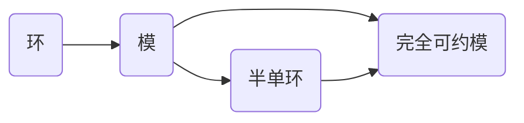

# 环与代数：半单环与完全可约模

作者：禅与计算机程序设计艺术 / Zen and the Art of Computer Programming

## 1. 背景介绍
### 1.1 问题的由来
环与代数是现代数学的重要分支,在计算机科学、密码学、物理学等领域有广泛应用。半单环与完全可约模是环论中的重要概念,对深入理解环的结构具有重要意义。然而,由于这些概念较为抽象,许多学习者对其理解存在一定困难。因此,有必要对半单环与完全可约模的相关概念与理论进行系统阐述,帮助读者建立清晰的认知。
### 1.2 研究现状
目前,关于半单环与完全可约模的研究已经取得了丰硕成果。国内外学者从不同角度对其进行了深入探讨,获得了许多重要结论。例如,Jacobson、Artin、Wedderburn等大师级学者奠定了半单环理论的基础。近年来,随着计算机代数系统的发展,半单环与模论的研究工作得到进一步推进。尽管如此,将这些理论知识与实际应用相结合,并用通俗易懂的方式进行解读,仍是一个值得探索的课题。
### 1.3 研究意义 
深入研究半单环与完全可约模,对于拓展环论知识体系、促进相关领域发展具有重要意义:

1. 丰富代数理论内涵。半单环与完全可约模是现代环论的核心内容,研究这些概念有助于完善环论的理论框架,深化我们对代数结构的理解。

2. 促进交叉学科发展。环论知识在计算机科学、密码学、编码理论等领域有重要应用,深入研究半单环与完全可约模,可以为这些学科提供新的思路和方法。

3. 提升数学素养。环论是现代数学的重要分支,学习半单环与完全可约模的相关理论,有助于提高数学修养,锻炼抽象思维和逻辑推理能力。

### 1.4 本文结构
本文将从以下几个方面系统阐述半单环与完全可约模的相关概念和理论:

1. 介绍环、模的基本概念,阐明半单环与完全可约模的核心要义。 
2. 系统讲解半单环的判定定理,并结合实例进行解读。
3. 深入探讨模的完全可约性,给出相关判定方法。
4. 介绍半单环与完全可约模在密码学等领域的应用案例。
5. 总结全文,并对半单环与完全可约模的研究前景进行展望。

## 2. 核心概念与联系
在探讨半单环与完全可约模之前,我们先回顾一下环、模的基本概念。

**定义1(环)** 称代数系统 $\langle R,+,\cdot \rangle$ 为环,如果:
1. $\langle R,+ \rangle$ 是交换群;
2. $\langle R,\cdot \rangle$ 是半群,即 $\cdot$ 满足结合律;
3. 对任意 $a,b,c \in R$,都有 $a \cdot (b+c)=a \cdot b + a \cdot c$ 和 $(a+b) \cdot c = a \cdot c + b \cdot c$。

如果 $\langle R,\cdot \rangle$ 是幺半群,即存在元素 $1 \in R$ 使得 $1 \cdot a = a \cdot 1 = a(\forall a \in R)$,则称 $R$ 为有单位元的环。

**定义2(模)** 设 $R$ 是环, $M$ 是加法群,如果存在映射 $\varphi:R \times M \to M$ 满足:
1. $\varphi(a+b,x)=\varphi(a,x)+\varphi(b,x)$;
2. $\varphi(a,x+y)=\varphi(a,x)+\varphi(a,y)$;
3. $\varphi(ab,x)=\varphi(a,\varphi(b,x))$。
其中 $a,b \in R,x,y \in M$。则称 $M$ 是环 $R$ 上的模,记为 $_RM$。映射 $\varphi$ 称为 $R$ 在 $M$ 上的作用。

环上的模是环论中的核心概念,它刻画了环与线性空间之间的关系。事实上,域上的模就是线性空间。模的理论在表示论、同调代数等分支中有重要应用。

基于环和模,我们引入半单环的概念:

**定义3(半单环)** 设 $R$ 是环,如果 $R$ 的每个右理想都是投射的,则称 $R$ 为右半单环。类似地可以定义左半单环。如果 $R$ 既是左半单环又是右半单环,则称 $R$ 为半单环。

半单环是一类特殊的环,它的重要性体现在:半单环可以用矩阵环的直和来刻画,这为研究半单环的结构提供了有力工具。

与半单环密切相关的是模的完全可约性:

**定义4(完全可约模)** 设 $_RM$ 是模,如果 $M$ 有子模的直和分解 $M=M_1 \oplus \cdots \oplus M_n$,其中每个 $M_i$ 都是单模(不可分解),则称 $M$ 为完全可约模。

完全可约模是半单环的一个重要特征。事实上,一个环是半单环的充要条件是该环上的每个模都是完全可约的。这说明半单环与完全可约模之间存在着本质联系。

## 3. 核心算法原理 & 具体操作步骤
### 3.1 算法原理概述
判定一个环是否为半单环,以及判定一个模是否完全可约,是环论中的基本问题。本节我们将介绍几个重要定理,并给出相应的判定算法。
### 3.2 算法步骤详解
**定理1(Wedderburn-Artin定理)** 设 $R$ 是半单环,则存在唯一的正整数 $n_1,\cdots,n_k$ 和除环 $D_1,\cdots,D_k$,使得 $R \cong M_{n_1}(D_1) \oplus \cdots \oplus M_{n_k}(D_k)$。

Wedderburn-Artin定理刻画了半单环的结构,它指出半单环同构于矩阵环的直和,而每个矩阵环的系数都是除环。这个定理提供了判定半单环的一个思路:

**半单环的判定算法**
1. 对于环 $R$,计算其所有不可约幂等元 $e_1,\cdots,e_k$。
2. 对每个 $e_i$,计算环 $e_iRe_i$,判断其是否为除环。如果都是除环,则 $R$ 为半单环,否则 $R$ 不是半单环。
3. 如果 $R$ 是半单环,则 $R \cong \bigoplus_{i=1}^k M_{n_i}(e_iRe_i)$,其中 $n_i$ 为 $e_iR$ 的秩。

关于模的完全可约性,有如下判定定理:

**定理2** 设 $_RM$ 是模, $J(R)$ 是 $R$ 的Jacobson根,则以下条件等价:
1. $M$ 是完全可约模;
2. 对任意子模 $N \subseteq M$,都有 $M=N \oplus N'$,其中 $N'$ 是 $M$ 的子模;
3. 任意极大子模 $N \subset M$ 都是 $M$ 的直和项;
4. $J(R)M=0$。

该定理给出了判定完全可约模的多个等价条件,这为我们判定一个模是否完全可约提供了依据:

**完全可约模的判定算法**
1. 对于模 $_RM$,计算 $R$ 的Jacobson根 $J(R)$。
2. 计算 $J(R)M$,如果 $J(R)M=0$,则 $M$ 是完全可约模,否则 $M$ 不完全可约。
3. 如果 $M$ 是完全可约的,可以进一步计算 $M$ 的不可约直和项。

### 3.3 算法优缺点
上述判定算法的优点在于:
1. 理论依据充分,利用了环论中的重要定理;
2. 计算过程明确,容易实现。

但也存在一些局限:
1. 计算Jacobson根等操作的复杂度较高;
2. 对环和模的结构有一定要求,如需要有限生成等。

### 3.4 算法应用领域
半单环与完全可约模的判定算法在以下领域有重要应用:
1. 表示论。判定代数的表示是否完全可约是表示论的核心问题之一。
2. 编码理论。半单环与完全可约模的概念可用于构造纠错码。
3. 密码学。利用半单环构造密码算法,可以提高密码系统的安全性。

## 4. 数学模型和公式 & 详细讲解 & 举例说明
### 4.1 数学模型构建
为了深入理解半单环与完全可约模,我们构建如下数学模型:

设 $R$ 是半单环, $_RM$ 是模,记 $J=J(R)$ 为 $R$ 的Jacobson根。考虑集合
$$S=\{N \mid N \text{ 是 } M \text{ 的子模}\}.$$
在 $S$ 上定义二元关系 $\sim$:
$$N_1 \sim N_2 \Leftrightarrow M/(N_1+N_2) \text{ 是完全可约模}.$$

### 4.2 公式推导过程
我们证明 $\sim$ 是 $S$ 上的等价关系。

(1) 反身性。对任意 $N \in S$,显然有 $N \sim N$。

(2) 对称性。设 $N_1 \sim N_2$,则 $M/(N_1+N_2)$ 是完全可约模。注意到
$$(N_1+N_2)/N_1 \cong N_2/(N_1 \cap N_2),$$
$$(N_1+N_2)/N_2 \cong N_1/(N_1 \cap N_2).$$
从而 $M/N_1$ 和 $M/N_2$ 都是完全可约模,故 $N_2 \sim N_1$。

(3) 传递性。设 $N_1 \sim N_2$, $N_2 \sim N_3$,则 $M/(N_1+N_2)$ 和 $M/(N_2+N_3)$ 都是完全可约模。
考虑商模 $M/(N_1+N_2+N_3)$,它有子模
$$\frac{N_1+N_2+N_3}{N_1+N_2} \cong \frac{N_3}{(N_1+N_2) \cap N_3}.$$
由于 $M/(N_1+N_2)$ 是完全可约模,故 $\frac{N_3}{(N_1+N_2) \cap N_3}$ 也完全可约,从而 $M/(N_1+N_2+N_3)$ 是完全可约模,即 $N_1 \sim N_3$。

综上, $\sim$ 是 $S$ 上的等价关系。

### 4.3 案例分析与讲解
我们以一个具体的环为例,来说明上述模型的应用。

设 $K$ 是数域, $R=K[x]/(x^n)$ 是商环,其中 $n \geq 1$。容易验证 $R$ 是半单环。考虑 $R$ 上的模 $_RM=R$。

对任意 $0 \leq i \leq n$,记 $N_i=(x^i)$。显然 $N_i$ 是 $M$ 的子模,且
$$N_0 \subset N_1 \subset \cdots \subset N_n=M.$$
对任意 $0 \leq i < j \leq n$,我们有
$$M/(N_i+N_j)=M/N_j \cong R/(x^j) \cong K[x]/(x^j).$$
由于 $K[x]/(x^j)$ 是完全可约模,故 $N_i \sim N_j$。这说明 $S$ 的等价类恰好为
$$S/\sim=\{N_0,N_1,\cdots,N_n\}.$$

进一步地,由于 $N_i \subset N_j(i<j)$,我们知道 $S/\sim$ 是全序集,其偏序关系就是模的包含关系。

### 4.4 常见问题解答
**Q:** 如何判断一个环是否为域?