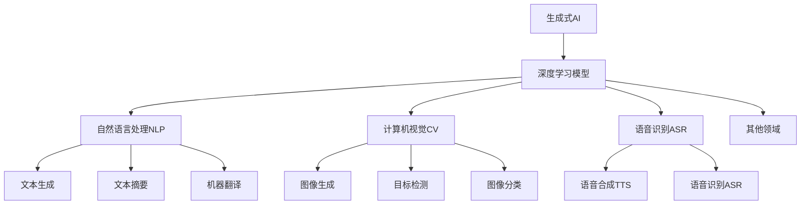

# 生成式AIGC：数据驱动的商业变革

## 1. 背景介绍

### 1.1 问题的由来

在过去几十年中，人工智能(AI)技术取得了长足的进步,尤其是在深度学习和大数据领域的突破,使得AI系统能够从海量数据中学习并生成新的内容。这种被称为"生成式AI"(Generative AI)的新兴技术,正在彻底改变着人类与机器的交互方式,催生了一场前所未有的商业变革浪潮。

生成式AI的核心思想是利用深度学习模型从大规模数据集中捕捉模式和规律,并基于所学习的知识生成新的、前所未见的内容。这种内容可以是文本、图像、音频、视频等多种形式,展现出了AI系统在创造性方面的惊人能力。

随着计算能力的不断提升和数据量的指数级增长,生成式AI技术正在渗透到各个行业和领域,推动着商业模式的根本性变革。企业纷纷意识到,掌握这一颠覆性技术将为他们带来前所未有的竞争优势,因此对生成式AI的投资和应用日益增多。

### 1.2 研究现状

生成式AI技术的发展可以追溯到20世纪90年代,当时的研究主要集中在自然语言处理和计算机视觉领域。随着深度学习算法的不断完善,以及大数据和并行计算能力的飞速提升,生成式AI技术在21世纪初开始突飞猛进。

近年来,生成式AI取得了一系列里程碑式的成就,例如OpenAI的GPT-3大型语言模型、DeepMind的AlphaFold2蛋白质结构预测系统、以及DALL-E和Stable Diffusion等图像生成模型。这些突破性的AI系统展现出了惊人的生成能力,在文本、图像、音频等多个领域实现了人工智能的"通用智能"(General Intelligence)。

与此同时,生成式AI技术也面临着一些挑战和争议,例如版权、隐私、伦理和安全等问题。但总的来说,生成式AI正在成为推动商业变革的关键驱动力,吸引了越来越多的关注和投资。

### 1.3 研究意义

生成式AI技术的兴起,标志着人工智能进入了一个全新的发展阶段。这项技术不仅能够帮助企业提高效率、降低成本,更重要的是,它正在重塑商业模式,催生全新的商业机会。

通过深入研究生成式AI的核心概念、算法原理、数学模型,以及实际应用场景,我们可以更好地把握这一颠覆性技术的本质,洞悉其对商业的深远影响。同时,探讨生成式AI所面临的挑战和未来发展趋势,也将为企业制定相应的战略提供参考。

总之,生成式AI技术正在引领着数据驱动的商业变革浪潮,对于企业来说,抓住这一机遇并制定明智的AI战略,将是赢得未来竞争优势的关键所在。

### 1.4 本文结构

本文将全面深入地探讨生成式AIGC技术,内容安排如下:

1. 背景介绍
2. 核心概念与联系
3. 核心算法原理与具体操作步骤
4. 数学模型和公式详细讲解与案例分析
5. 项目实践:代码实例和详细解释
6. 实际应用场景
7. 工具和资源推荐
8. 总结:未来发展趋势与挑战
9. 附录:常见问题与解答

## 2. 核心概念与联系

生成式AI(Generative AI)是一种利用深度学习模型从大规模数据集中学习,并生成新内容的人工智能技术。它的核心是训练出具有强大生成能力的深度学习模型,这些模型能够捕捉数据中的模式和规律,并基于所学习的知识生成全新的内容。

生成式AI技术在自然语言处理(NLP)、计算机视觉(CV)、语音识别(ASR)等多个领域都有广泛的应用。在NLP领域,生成式AI可用于文本生成、文本摘要和机器翻译等任务。在CV领域,则可应用于图像生成、目标检测和图像分类等场景。而在ASR领域,生成式AI可用于语音合成(TTS)和语音识别等任务。

生成式AI技术的关键在于训练出高质量的深度学习模型。这些模型通常采用transformer、VAE(变分自编码器)、GAN(生成对抗网络)等架构,能够从海量数据中学习到丰富的知识表示,并将这些知识应用于生成新的内容。

生成式AI技术的发展离不开大数据和强大的计算能力的支持。只有拥有足够大的高质量数据集,并具备充分的计算资源进行模型训练,才能最大限度地发挥生成式AI的潜力。

总的来说,生成式AI是一种颠覆性的人工智能技术,它正在推动着商业模式的根本性变革。通过深入理解其核心概念、算法原理和应用场景,企业将能够更好地把握这一技术的本质,制定明智的AI战略,抓住数据驱动的商业变革机遇。

## 3. 核心算法原理与具体操作步骤

### 3.1 算法原理概述

生成式AI技术的核心算法原理主要基于深度学习模型,尤其是transformer、VAE(变分自编码器)和GAN(生成对抗网络)等架构。这些算法能够从大规模数据集中学习到丰富的知识表示,并基于所学习的知识生成新的内容。

1. **Transformer架构**

Transformer是一种基于自注意力机制(Self-Attention)的序列到序列(Seq2Seq)模型,广泛应用于自然语言处理和计算机视觉等领域。它能够有效地捕捉输入序列中的长程依赖关系,并生成高质量的输出序列。著名的GPT(Generative Pre-trained Transformer)语言模型就是基于Transformer架构训练而来。

2. **变分自编码器(VAE)**

VAE是一种生成式深度学习模型,它将输入数据映射到连续的潜在空间,并从该潜在空间中采样生成新的输出数据。VAE模型通过最大化数据的边际对数似然来训练,能够学习到数据的潜在表示,并基于这些表示生成新的样本。VAE广泛应用于图像、视频和语音等领域的生成任务。

3. **生成对抗网络(GAN)**

GAN由一个生成器(Generator)和一个判别器(Discriminator)组成,两者通过对抗训练的方式相互竞争。生成器的目标是生成逼真的样本以欺骗判别器,而判别器则努力区分生成的样本和真实样本。GAN模型在图像、视频和语音等领域展现出了出色的生成能力,被广泛应用于各种生成任务。

这些核心算法原理为生成式AI技术提供了强大的理论基础和实现方法,使得AI系统能够从大规模数据集中学习知识,并生成新的、前所未见的内容。

### 3.2 算法步骤详解

以Transformer架构为例,其核心算法步骤可概括为以下几个关键环节:

1. **数据预处理**

首先需要对输入数据进行预处理,包括标记化(Tokenization)、填充(Padding)和构建位置编码(Positional Encoding)等步骤。这些预处理操作将原始数据转换为Transformer模型可以接受的输入格式。

2. **多头自注意力机制**

Transformer模型的核心是多头自注意力(Multi-Head Self-Attention)机制。该机制允许模型捕捉输入序列中任意两个位置之间的依赖关系,从而更好地建模长期依赖。

3. **前馈神经网络**

在自注意力层之后,Transformer还包含一个前馈神经网络(Feed-Forward Neural Network),用于对每个位置的表示进行进一步的非线性转换和特征提取。

4. **编码器-解码器架构**

对于序列到序列(Seq2Seq)任务,Transformer采用编码器-解码器架构。编码器将输入序列映射到连续的表示空间,而解码器则从该表示空间生成目标输出序列。

5. **掩码机制**

在训练过程中,Transformer使用掩码机制来防止解码器获取未来时间步的信息,确保模型学习到正确的因果关系。

6. **梯度下降优化**

最后,Transformer模型通过梯度下降优化算法(如Adam优化器)来最小化损失函数,不断调整模型参数,从而提高生成质量。

通过上述核心算法步骤,Transformer模型能够从大规模数据集中学习到丰富的语义和上下文知识,并基于所学习的知识生成高质量的输出序列,展现出强大的生成能力。

### 3.3 算法优缺点

生成式AI的核心算法具有以下优缺点:

**优点:**

1. **强大的生成能力**:这些算法能够从大规模数据集中学习到丰富的知识表示,并基于所学习的知识生成新的、前所未见的内容,展现出惊人的创造力。

2. **端到端训练**:算法采用端到端的训练方式,无需手工设计特征,能够自动学习数据的内在表示,提高了模型的泛化能力。

3. **可解释性**:一些算法(如VAE)能够学习到数据的潜在表示,使得生成过程具有一定的可解释性和可控性。

4. **多模态支持**:这些算法可以应用于不同的模态(如文本、图像、语音等),具有很强的通用性和扩展性。

**缺点:**

1. **数据饥渴**:这些算法通常需要大量高质量的训练数据,否则容易出现过拟合或生成质量低下的问题。

2. **计算资源需求高**:训练过程通常需要大量的计算资源,包括GPU、TPU等加速硬件,对于一些中小企业来说,成本可能较高。

3. **生成结果的可控性差**:虽然一些算法具有一定的可解释性,但对于生成结果的精确控制仍然是一个挑战。

4. **潜在的安全和伦理风险**:生成式AI技术可能被滥用于生成虚假信息、侵犯版权等,需要注意相关的安全和伦理问题。

总的来说,生成式AI算法展现出了强大的生成能力,但也存在一些需要解决的挑战和风险。企业在应用这些算法时,需要权衡利弊,并采取必要的措施来确保安全和合规。

### 3.4 算法应用领域

生成式AI算法在多个领域都有广泛的应用,主要包括:

1. **自然语言处理(NLP)**:
   - 文本生成(如新闻稿、小说、诗歌等)
   - 文本摘要
   - 机器翻译
   - 对话系统
   - 问答系统

2. **计算机视觉(CV)**:
   - 图像生成(如插画、概念艺术等)
   - 图像编辑和修复
   - 视频生成
   - 目标检测和跟踪
   - 图像分类和识别

3. **语音处理**:
   - 语音合成(TTS)
   - 语音识别(ASR)
   - 语音增强和降噪

4. **多模态融合**:
   - 视频描述生成
   - 图文生成
   - 虚拟现实(VR)和增强现实(AR)内容生成

5. **药物发现**:
   - 分子结构生成
   - 蛋白质结构预测(如AlphaFold)

6. **设计和创作**:
   - 产品设计
   - 建筑设计
   - 游戏内容生成
   - 音乐创作

7. **其他领域**:
   - 金融预测
   - 天气