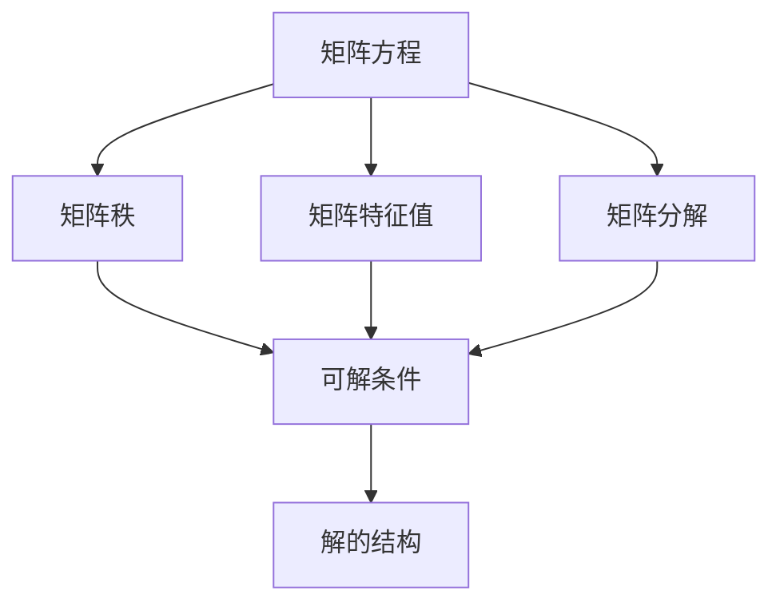

# 矩阵理论与应用：矩阵方程的可解条件

## 1. 背景介绍

### 1.1 问题的由来

矩阵理论是线性代数的核心部分,在数学、物理、工程等诸多领域都有着广泛的应用。矩阵方程是矩阵理论中一个重要的研究课题,它们在数值计算、控制理论、量子力学等领域扮演着关键角色。矩阵方程的可解性问题是指,给定一个矩阵方程,判断它是否存在解,以及解的结构是什么样的。这一问题对于理论研究和实际应用都具有重要意义。

### 1.2 研究现状  

矩阵方程的可解性问题一直是线性代数领域的研究热点。早期,数学家们主要关注特殊形式的矩阵方程,如Sylvester方程、Stein方程等,并给出了一些可解条件。随着研究的深入,人们逐渐发现,矩阵方程的可解性与矩阵的一些重要性质密切相关,如矩阵的秩、特征值、矩阵分解等。近年来,随着计算机代数系统的发展,一些新的方法和技术被应用于矩阵方程的研究,使得这一领域取得了长足进展。

### 1.3 研究意义

矩阵方程的可解性理论不仅在纯数学领域具有重要价值,而且对许多应用领域也有着广泛的影响。例如,在控制理论中,设计反馈控制器常常需要求解一个矩阵方程;在计算机视觉中,重建三维物体的形状需要求解一个矩阵最小化问题;在量子力学中,求解矩阵方程是研究量子态演化的关键。因此,深入研究矩阵方程的可解条件,不仅可以丰富线性代数的理论体系,而且对推动相关应用领域的发展也具有重要意义。

### 1.4 本文结构

本文将全面系统地介绍矩阵方程的可解条件理论。我们将首先回顾矩阵理论的基础知识,为后续内容做好铺垫。接下来,我们将详细阐述矩阵方程的核心概念,并探讨它们之间的内在联系。在此基础上,我们将介绍判定矩阵方程可解性的核心算法,并给出具体的操作步骤。为了加深理解,我们还将构建数学模型,并推导相关公式,辅以案例分析加以说明。此外,我们还将展示一个实际项目的代码实现,帮助读者更好地掌握这一理论。最后,我们将讨论矩阵方程理论在实际应用中的场景,并总结未来的发展趋势和面临的挑战。

## 2. 核心概念与联系

矩阵方程的可解性理论涉及多个核心概念,这些概念之间存在着内在的联系。下面我们将逐一介绍这些概念,并阐明它们之间的关系。

1. **矩阵方程**:矩阵方程是指包含一个或多个未知矩阵的方程,常见形式包括线性矩阵方程、Sylvester矩阵方程、Stein矩阵方程等。判断这些矩阵方程是否可解,以及解的结构是什么,是本文的核心研究对象。

2. **矩阵秩**:矩阵的秩是指矩阵中线性无关的行(列)向量的最大个数。矩阵秩是判断矩阵方程可解性的一个关键因素,因为它反映了方程的自由度。

3. **矩阵特征值**:矩阵的特征值是指使得矩阵与单位矩阵之差的行列式为零的那些标量。矩阵特征值的性质对于研究矩阵方程的可解条件也具有重要意义。

4. **矩阵分解**:将矩阵分解为若干特殊形式的矩阵的乘积,是研究矩阵性质的一种有力工具。矩阵分解理论在判定矩阵方程可解性时也发挥着关键作用。

5. **可解条件**:可解条件是指判断矩阵方程是否存在解的一组充分必要条件,通常与矩阵的秩、特征值、分解等性质密切相关。

6. **解的结构**:如果矩阵方程可解,我们还需要研究解的结构,即解矩阵的形式和性质。这对于深入理解矩阵方程,以及在实际应用中求解具体问题都是非常重要的。

上述核心概念相互关联、环环相扣,共同构成了矩阵方程可解性理论的理论体系。我们需要全面把握这些概念,才能真正掌握这一领域的精髓。

## 3. 核心算法原理 & 具体操作步骤

### 3.1 算法原理概述

判定矩阵方程可解性的核心算法,主要基于矩阵的秩、特征值和矩阵分解等理论。算法的基本思路是:首先将原始矩阵方程转化为某种标准形式,然后利用矩阵的代数性质,推导出一组充分必要条件,最后检验这些条件是否满足,从而判定方程是否可解。

具体来说,算法主要包括以下几个步骤:

1. **转化为标准形式**:通过基本的矩阵运算(如转置、相似变换等),将原始矩阵方程转化为某种标准形式,以便后续分析。

2. **计算矩阵秩**:计算等式两端矩阵的秩,判断它们是否相等,从而确定方程是否存在平凡解。

3. **分析特征值**:研究等式两端矩阵的特征值,判断它们之间是否存在某种代数关系,从而获得方程可解的必要条件。

4. **矩阵分解**:将等式两端矩阵进行分解(如特征值分解、奇异值分解等),从而将原问题简化为若干子问题。

5. **综合分析**:将上述步骤得到的结果综合起来,给出判定矩阵方程可解性的充分必要条件。

6. **求解过程**:如果矩阵方程可解,还需要设计相应的算法求出解的具体形式。

该算法的优点是思路清晰、逻辑严谨,并且可以很好地利用矩阵理论的成果。但是,对于一般情况下的矩阵方程,求解过程往往比较复杂,需要耗费大量的代数计算。

### 3.2 算法步骤详解

下面我们将详细解释上述算法的每一个步骤,并给出具体的操作方法。

#### 3.2.1 转化为标准形式

第一步是将原始矩阵方程转化为标准形式。常见的标准形式包括:

- 线性矩阵方程: $AX + XB = C$
- Sylvester矩阵方程: $AX - XB = C$
- Stein矩阵方程: $\sum_{i=1}^m A_i X B_i = C$

其中,$A,B,C,A_i,B_i$都是已知矩阵,$X$是未知矩阵。

对于一般形式的矩阵方程,我们可以通过矩阵运算(如转置、Kronecker积等)将它转化为上述标准形式之一。例如,对于方程$AXB + CXD = E$,我们可以令$Y = XB$,则原方程等价于$AY + CY(D\otimes I_n) = E$,其中$\otimes$表示Kronecker积,这是一个Sylvester矩阵方程的形式。

#### 3.2.2 计算矩阵秩

第二步是计算等式两端矩阵的秩,并判断它们是否相等。具体操作如下:

1. 计算矩阵$A,B,C$的秩,记为$r_A,r_B,r_C$。
2. 对于线性矩阵方程$AX + XB = C$,若$r_A + r_B \neq r_C$,则该方程无解。
3. 对于Sylvester矩阵方程$AX - XB = C$,若$r_A + r_B \neq r_C$,则该方程无解。
4. 对于Stein矩阵方程$\sum_{i=1}^m A_i X B_i = C$,若$\sum_{i=1}^m r_{A_i}r_{B_i} \neq r_C$,则该方程无解。

如果等式两端矩阵的秩相等,则方程至少存在平凡解(零矩阵)。但是,仅凭矩阵秩的条件还不能完全判定方程是否可解,我们还需要进一步分析矩阵的特征值和矩阵分解。

#### 3.2.3 分析特征值

第三步是研究等式两端矩阵的特征值,判断它们之间是否存在某种代数关系,从而获得方程可解的必要条件。

对于线性矩阵方程$AX + XB = C$,我们有如下必要条件:

- 若$\lambda$是$A$的特征值,$\mu$是$B$的特征值,则$\lambda + \mu$必须是$C$的特征值。

对于Sylvester矩阵方程$AX - XB = C$,必要条件为:

- 若$\lambda$是$A$的特征值,$\mu$是$B$的特征值,则$\lambda - \mu$必须是$C$的特征值。

如果上述条件不满足,则矩阵方程一定无解。需要注意的是,这些条件是必要非充分条件,即满足这些条件,方程未必就一定可解。

#### 3.2.4 矩阵分解

第四步是将等式两端矩阵进行分解,从而将原问题简化为若干子问题。常用的矩阵分解方法包括:

- **特征值分解**:将矩阵分解为特征向量和特征值的乘积,即$A = P\Lambda P^{-1}$,其中$\Lambda$是对角矩阵。
- **奇异值分解**:将矩阵分解为三个矩阵的乘积,即$A = U\Sigma V^*$,其中$U,V$是酉矩阵,$\Sigma$是对角矩阵。
- **QR分解**:将矩阵分解为一个酉矩阵和一个上三角矩阵的乘积,即$A = QR$。

通过矩阵分解,我们可以将原始矩阵方程转化为若干子问题,这些子问题通常更容易分析和求解。例如,对于线性矩阵方程$AX + XB = C$,我们可以将$A,B,C$分别进行特征值分解,从而将原方程转化为若干标量方程,再分别求解这些标量方程即可。

#### 3.2.5 综合分析

在上述步骤的基础上,我们需要将所得结果综合起来,给出判定矩阵方程可解性的充分必要条件。

对于线性矩阵方程$AX + XB = C$,充分必要条件为:

1. $r_A + r_B = r_C$;
2. 若$\lambda$是$A$的特征值,$\mu$是$B$的特征值,则$\lambda + \mu$必须是$C$的特征值;
3. 对于任意$\lambda,\mu$满足条件2,相应的特征空间的直和维数等于$X$的自由度。

对于Sylvester矩阵方程$AX - XB = C$,充分必要条件为:

1. $r_A + r_B = r_C$;
2. 若$\lambda$是$A$的特征值,$\mu$是$B$的特征值,则$\lambda - \mu$必须是$C$的特征值;
3. 对于任意$\lambda,\mu$满足条件2,相应的特征空间的直和维数等于$X$的自由度。

如果矩阵方程满足上述条件,则它是可解的;否则,它是不可解的。

#### 3.2.6 求解过程

如果矩阵方程可解,我们还需要设计相应的算法求出解的具体形式。求解的基本思路是:首先确定解矩阵的自由度,然后构造一组基解,最后通过线性组合得到通解。

具体的求解步骤如下:

1. 根据充分必要条件,确定解矩阵$X$的自由度,即$X$中未知元素的个数。
2. 对于每一对特