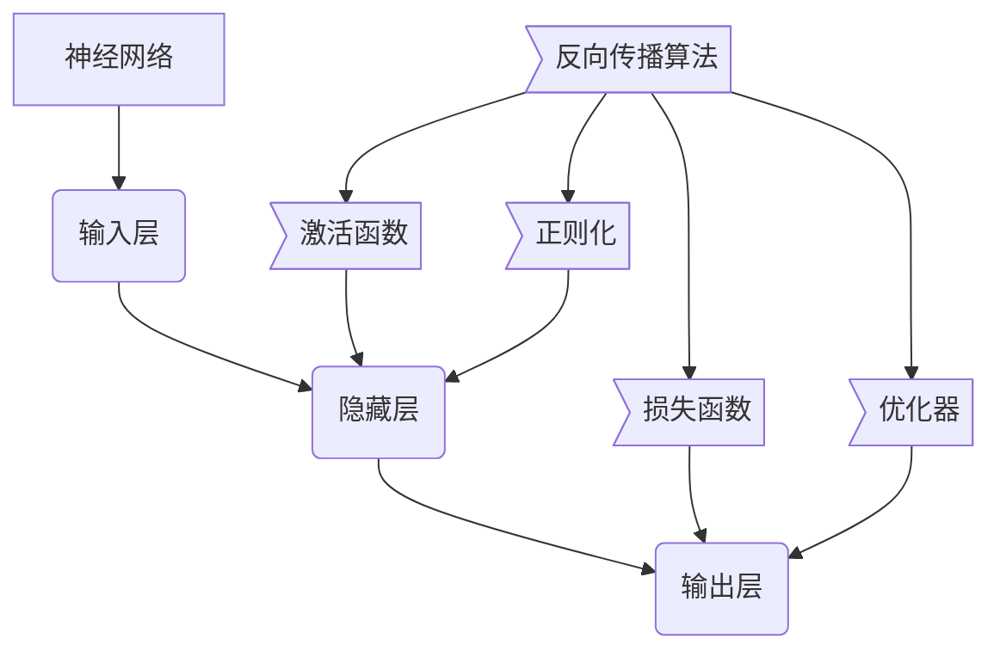

# 神经网络原理与代码实例讲解

## 1. 背景介绍

### 1.1 问题的由来

在过去几十年中，人工智能领域取得了长足的进步,其中神经网络作为一种强大的机器学习模型,在解决复杂的问题上展现出了巨大的潜力。神经网络的概念最早可以追溯到 20 世纪 40 年代,当时的神经网络模型仅仅是对生物神经系统的简单模拟。随着计算能力的不断提高和大量数据的积累,神经网络得以在近年重新焕发生机,并在多个领域取得了突破性的成就。

### 1.2 研究现状

当前,神经网络已经广泛应用于计算机视觉、自然语言处理、语音识别、推荐系统等诸多领域。以计算机视觉为例,基于卷积神经网络的图像分类、目标检测和语义分割等技术已经达到了超越人类水平的精度。在自然语言处理领域,transformer 等基于注意力机制的神经网络模型极大地提升了机器翻译、文本生成等任务的性能。

### 1.3 研究意义

尽管神经网络取得了令人瞩目的成就,但其内在机理仍然是一个黑箱,缺乏对神经网络内部运作方式的透彻理解。深入研究神经网络的原理和实现细节,对于更好地设计和优化神经网络模型、解释神经网络的决策过程、评估其可靠性和公平性等具有重要意义。此外,剖析神经网络内部结构和运算过程,也有助于开发更高效、更节能的硬件加速器,从而推动人工智能技术的实际应用。

### 1.4 本文结构

本文将全面介绍神经网络的基本原理、核心算法和数学模型,并通过代码实例详细讲解其实现细节。文章首先阐述神经网络的核心概念和基本组成部分,接着深入探讨反向传播等核心算法的原理和具体操作步骤。之后,我们将构建神经网络的数学模型,并推导相关公式,辅以案例分析加深读者的理解。在项目实践部分,将提供完整的代码实例,并对关键模块进行解读和分析。最后,本文将总结神经网络的实际应用场景,分享学习资源和开发工具,并展望神经网络在未来的发展趋势和面临的挑战。

## 2. 核心概念与联系

神经网络是一种受生物神经系统启发而设计的机器学习模型,主要由输入层、隐藏层和输出层组成。输入层接收原始数据,如图像像素或文本序列;隐藏层对输入数据进行非线性变换和特征提取;输出层则根据隐藏层的输出,产生最终的预测结果。

在神经网络中,激活函数扮演着非常关键的角色。它们引入了非线性,使得神经网络能够拟合复杂的函数,从而提高了模型的表达能力。常见的激活函数包括 Sigmoid、Tanh、ReLU 等。

为了评估模型的性能,我们需要定义损失函数,它衡量预测值与真实值之间的差异。交叉熵损失函数和均方误差损失函数是两种常用的损失函数。

优化器的作用是根据损失函数的梯度,调整神经网络中的可训练参数(权重和偏置),使损失函数值最小化。常见的优化器有梯度下降、动量优化、AdaGrad、RMSProp 和 Adam 等。

为了防止过拟合,我们通常会采用正则化技术,如 L1 正则化、L2 正则化和 Dropout 等,以提高神经网络的泛化能力。

反向传播算法是训练神经网络的核心,它通过计算损失函数相对于每个参数的梯度,并利用优化器更新参数,从而最小化损失函数值。反向传播算法与激活函数、损失函数、优化器和正则化技术密切相关,共同构成了训练神经网络的完整流程。

## 3. 核心算法原理 & 具体操作步骤

### 3.1 算法原理概述

反向传播算法是训练神经网络的核心算法,它通过计算损失函数相对于每个参数的梯度,并利用优化器更新参数,从而最小化损失函数值。该算法包括两个主要阶段:前向传播和反向传播。

在前向传播阶段,输入数据经过输入层、隐藏层和输出层,产生最终的预测结果。每一层的输出都是通过对上一层输出进行加权求和,然后应用激活函数得到的。

在反向传播阶段,我们首先计算输出层的损失函数值,然后利用链式法则,计算损失函数相对于每个参数的梯度。这个过程从输出层开始,逐层向后传播,直到输入层为止。最后,我们使用优化器根据梯度更新参数,以减小损失函数值。

### 3.2 算法步骤详解

1. **前向传播**

    对于给定的输入数据 $X$,我们计算每一层的输出:

    $$
    Z^{(l)} = W^{(l)}A^{(l-1)} + b^{(l)}\\
    A^{(l)} = g^{(l)}(Z^{(l)})
    $$

    其中 $Z^{(l)}$ 表示第 $l$ 层的加权输入, $W^{(l)}$ 和 $b^{(l)}$ 分别是第 $l$ 层的权重和偏置, $A^{(l-1)}$ 是上一层的激活输出, $g^{(l)}$ 是第 $l$ 层的激活函数。

    对于输出层,我们计算损失函数值 $\mathcal{L}(Y, \hat{Y})$,其中 $Y$ 是真实标签, $\hat{Y}$ 是预测输出。

2. **反向传播**

    我们从输出层开始,计算损失函数相对于每个参数的梯度:

    $$
    \frac{\partial\mathcal{L}}{\partial W^{(L)}} = \frac{\partial\mathcal{L}}{\partial Z^{(L)}} \frac{\partial Z^{(L)}}{\partial W^{(L)}} = \frac{\partial\mathcal{L}}{\partial Z^{(L)}} A^{(L-1)^T}\\
    \frac{\partial\mathcal{L}}{\partial b^{(L)}} = \sum_i \frac{\partial\mathcal{L}}{\partial Z_i^{(L)}}
    $$

    对于隐藏层,我们利用链式法则计算梯度:

    $$
    \frac{\partial\mathcal{L}}{\partial Z^{(l)}} = \frac{\partial\mathcal{L}}{\partial Z^{(l+1)}} \frac{\partial Z^{(l+1)}}{\partial A^{(l)}} \frac{\partial A^{(l)}}{\partial Z^{(l)}} = \frac{\partial\mathcal{L}}{\partial Z^{(l+1)}} W^{(l+1)^T} g^{(l)'}(Z^{(l)})\\
    \frac{\partial\mathcal{L}}{\partial W^{(l)}} = \frac{\partial\mathcal{L}}{\partial Z^{(l)}} A^{(l-1)^T}\\
    \frac{\partial\mathcal{L}}{\partial b^{(l)}} = \sum_i \frac{\partial\mathcal{L}}{\partial Z_i^{(l)}}
    $$

    其中 $g^{(l)'}$ 是激活函数 $g^{(l)}$ 的导数。

3. **参数更新**

    利用计算得到的梯度,我们使用优化器更新每一层的权重和偏置:

    $$
    W^{(l)} \leftarrow W^{(l)} - \eta \frac{\partial\mathcal{L}}{\partial W^{(l)}}\\
    b^{(l)} \leftarrow b^{(l)} - \eta \frac{\partial\mathcal{L}}{\partial b^{(l)}}
    $$

    其中 $\eta$ 是学习率,是一个超参数,需要根据具体问题进行调整。

上述过程反复进行,直到模型收敛或达到最大迭代次数。

### 3.3 算法优缺点

**优点:**

- 反向传播算法可以有效地训练多层神经网络,使其具有强大的拟合能力。
- 通过梯度下降优化,算法可以自动调整参数,无需人工干预。
- 算法具有很好的可解释性,我们可以分析每一层的激活值和梯度,了解神经网络的内部运作过程。

**缺点:**

- 训练过程可能收敛缓慢,尤其是在深层神经网络和大规模数据集上。
- 算法容易陷入局部最优解,导致性能下降。
- 对于高维稀疏数据,反向传播算法的效率较低。
- 算法对于异常值和噪声数据较为敏感,可能导致不稳定的训练过程。

### 3.4 算法应用领域

反向传播算法广泛应用于各种神经网络模型的训练,包括:

- **计算机视觉:** 卷积神经网络 (CNN) 在图像分类、目标检测和语义分割等任务中表现出色。
- **自然语言处理:** 循环神经网络 (RNN)、长短期记忆网络 (LSTM) 和 Transformer 等模型在机器翻译、文本生成和情感分析等任务中发挥着重要作用。
- **语音识别:** 卷积神经网络和循环神经网络的组合模型在语音识别领域取得了显著成果。
- **推荐系统:** 神经协同过滤模型可以有效地捕捉用户和项目之间的复杂关系,提高推荐系统的准确性。
- **强化学习:** 深度强化学习将神经网络应用于决策过程,在游戏、机器人控制和自动驾驶等领域表现优异。

## 4. 数学模型和公式 & 详细讲解 & 举例说明

### 4.1 数学模型构建

为了更好地理解神经网络的工作原理,我们需要构建其数学模型。考虑一个具有 $L$ 层的全连接神经网络,其中第 $l$ 层包含 $n^{(l)}$ 个神经元。我们定义:

- $W^{(l)}$ 为第 $l$ 层的权重矩阵,维度为 $n^{(l)} \times n^{(l-1)}$
- $b^{(l)}$ 为第 $l$ 层的偏置向量,维度为 $n^{(l)}$
- $X$ 为输入数据,维度为 $n^{(0)}$
- $g^{(l)}$ 为第 $l$ 层的激活函数

对于第 $l$ 层,其前向传播过程可以表示为:

$$
Z^{(l)} = W^{(l)}A^{(l-1)} + b^{(l)}\\
A^{(l)} = g^{(l)}(Z^{(l)})
$$

其中 $A^{(0)} = X$,即输入层的激活输出就是原始输入数据。

对于输出层 $L$,我们定义损失函数 $\mathcal{L}(Y, \hat{Y})$,其中 $Y$ 是真实标签, $\hat{Y} = A^{(L)}$ 是预测输出。我们的目标是通过调整权重 $W$ 和偏置 $b$,最小化损失函数值。

### 4.2 公式推导过程

为了找到最小化损失函数的参数值,我们需要计算损失函数相对于每个参数的梯度。根据链式法则,我们有:

$$
\frac{\partial\mathcal{L}}{\partial W^{(l)}} = \frac{\partial\mathcal{L}}{\partial Z^{(l)}} \frac{\partial Z^{(l)}}{\partial W^{(l)}} = \frac{\partial\mathcal{L}}{\partial Z^{(l)}} A^{(l-1)^T}\\
\frac{\partial\mathcal{L}}{\partial b^{(l)}} = \sum_i \frac{\partial\mathcal{L}}{\partial Z_i^{(l)}}
$$

其中 $\frac{\partial\mathcal{L}}{\partial Z^{(l)}}$ 可