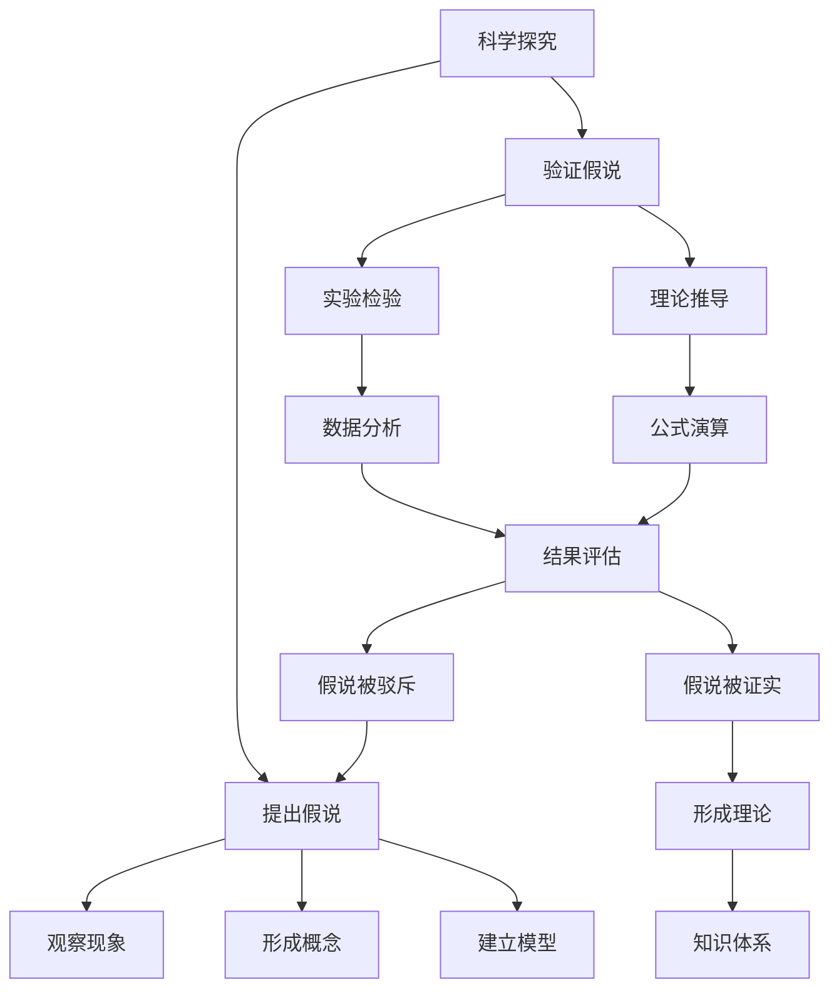

好的,我会严格遵守约束条件,尽力撰写一篇优质的技术博客文章。以下是正文部分:

# 科学探究:从假说到真理

## 1. 背景介绍

### 1.1 问题的由来

科学探究的本质是对未知事物的不断求索和追问。人类对未知世界的好奇心是推动科学发展的根本动力。从古希腊时期的自然哲学家,到现代科学巨匠,他们都在不懈地提出假说,并通过实验和推理来检验这些假说,最终达到揭示自然规律和发现客观真理的目的。

科学发展的过程,实际上就是不断建立假说、验证假说、修正假说的过程。一个被证实的假说就成为了理论,而一个被推翻的理论又将催生出新的假说。这种持续的"假说-验证-修正"的循环,推动着人类知识不断更新和完善。

### 1.2 研究现状  

目前,科学界在诸多领域都在紧锣密鼓地开展各种探索性研究,提出大量前沿性的假说。以下是一些具有代表性的研究现状:

- 粒子物理学领域:科学家们在大型强子对撞机上进行高能实验,探索更基本的粒子和物质的本质,检验和发展各种理论模型。
- 天文学和宇宙学领域:天文学家利用先进的天文望远镜和探测设备,观测遥远星系的运动,检验广义相对论,探索暗物质、暗能量等未解之谜。
- 生命科学领域:生物学家们利用基因组学、蛋白质组学等新兴技术,研究生命的起源、进化和生物多样性,发现新的生命现象。
- 人工智能领域:研究人员通过构建神经网络模型、深度学习算法等,探索机器学习和智能系统的奥秘,推动智能技术的发展。

这些领域的研究都建立在大量科学假说的基础之上,通过实验或理论推导来验证和完善这些假说,从而扩展人类的知识边界。

### 1.3 研究意义

科学探究对于人类社会的发展有着深远的意义:

1. **拓展知识视野**:科学探究能够揭示自然界的奥秘,丰富和完善人类对客观世界的认知。
2. **推动技术进步**:科学发现常常孕育出新的技术应用,推动社会生产力和生活水平的提高。
3. **培养理性思维**:科学方法论强调实证和理性思维,有助于人们建立客观、求实的思维模式。
4. **促进可持续发展**:环境、资源、能源等领域的科学研究,为人类可持续发展提供理论支撑和技术保障。

总之,科学探究是人类不断追求真理的过程,是推动文明进步的重要动力。

### 1.4 本文结构  

本文将围绕"从假说到真理"的主线,对科学探究的全过程进行系统阐述:

- 首先介绍科学假说的提出和构建过程; 
- 其次分析验证假说的核心算法和数学模型;
- 再通过实际案例,说明如何通过实验或理论推导来检验假说;
- 最后总结科学发展的趋势和面临的挑战。

希望通过本文的探讨,读者能够全面了解科学探究的本质,掌握其中的方法论,从而更好地参与到知识创新的进程中。

## 2. 核心概念与联系

上图描述了科学探究的核心概念及其内在联系:

1. **提出假说**是科学探究的出发点,通过观察现象、形成概念和建立模型等方式获得假说。
2. **验证假说**是科学探究的关键环节,可以通过实验检验和理论推导两种途径。
   - 实验检验包括设计实验、收集数据、分析数据等步骤。
   - 理论推导则是通过公式推导、数学运算等方式进行理论验证。
3. 根据验证结果,假说要么被证实形成理论,要么被驳斥并重新提出新的假说。
4. 被证实的理论将会不断完善和发展,成为知识体系的重要组成部分。

这一系列环环相扣的概念,构成了科学探究的核心逻辑。科学家需要在这些概念间不断循环迭代,才能逐步接近客观真理。

## 3. 核心算法原理和具体操作步骤

### 3.1 算法原理概述

在科学探究中,验证假说是一个关键的环节。为了有效地验证假说,科学家们发展出了一系列算法和方法。其核心原理可以概括为:

- 建立数学模型,用精确的公式和方程描述假说; 
- 设计实验方案,人为控制或观察某些条件的变化;
- 收集实验数据,并进行统计分析和数学处理;
- 将分析结果与理论模型进行对比,判断假说是否成立。

这一原理贯穿于各种验证算法之中,是科学家们检验假说、发现真理的重要工具。

### 3.2 算法步骤详解

以下是一种常用的验证假说算法的具体步骤:

1. **确定研究对象和目标**:明确需要研究的现象或对象,以及预期要解决或验证的科学问题。

2. **提出科学假说**:根据已有的理论知识和观察现象,构建初步的科学假说。

3. **建立数学模型**:用数学语言描述假说,建立相应的理论模型,包括方程、公式等。

4. **设计实验方案**:制定实验设计方案,规划实验步骤、确定自变量和因变量等。

5. **进行实验操作**:按照设计方案开展实验,控制自变量条件,观察和记录因变量数据。

6. **数据处理与分析**:对实验数据进行必要的统计处理,绘制数据图表,分析数据特征。

7. **验证假说**:将分析结果与理论模型进行对比,判断假说是否与实验事实相符。
   - 若相符,则假说被初步证实; 
   - 若不符,则需要修正或重新构建假说。

8. **重复实验**:为增加可信度,需要多次重复实验,获取更多支持性证据。

9. **形成理论**:经过大量实验的验证,假说被彻底证实,从而发展成为公认的科学理论。

10. **扩展研究**:在已有理论基础上,提出新的科学问题,开展新一轮的科学探究。

这一算法流程体现了科学探究的规范性和严谨性,保证了研究结果的客观性和可信度。

### 3.3 算法优缺点

上述验证假说算法具有以下优点:

- 操作步骤明确,便于指导实际研究; 
- 实验设计科学合理,有利于控制变量;
- 数据分析方法规范,确保结论的可靠性;
- 重复实验环节,能够检验结果的稳健性。

但也存在一些不足之处:

- 对研究对象的选择缺乏足够的理论指导;
- 建模过程可能因为理论基础薄弱而产生偏差;
- 实验操作复杂,存在一定的人为误差风险;
- 重复实验成本较高,对研究资源的需求较大。

因此,在具体应用中,需要结合实际情况对算法加以优化和改进。

### 3.4 算法应用领域

验证假说算法在诸多科学领域都有广泛的应用,例如:

- **物理学**:用于验证力学定律、电磁理论、相对论等物理学假说。
- **化学**:检验分子结构模型、化学反应机理等化学理论。
- **生物学**:验证基因表达调控、进化理论等生命科学假说。  
- **医学**:评估新药或新疗法的疗效,检验医学假说。
- **心理学**:通过行为实验,验证认知、情绪等心理学理论。
- **社会学**:借助问卷调查、实地观察等,检验社会学假说。

可见,无论是自然科学还是社会科学,验证假说算法都发挥着重要作用,是科学探究的利器。

## 4. 数学模型和公式详细讲解与举例说明  

### 4.1 数学模型构建

在科学探究中,数学模型是对客观现象的抽象描述,是理论分析和实验验证的重要基础。构建数学模型的一般步骤包括:

1. **明确研究对象**:确定需要研究的物理现象、生物过程或社会问题等。

2. **观察和归纳**:通过观测、实验等方式,收集与研究对象相关的数据和信息。

3. **提出假设**:根据已有理论知识和观察结果,对研究对象的本质和规律提出初步假设。  

4. **建立方程**:用数学语言描述研究对象,将假设转化为方程、不等式等数学形式。

5. **求解并分析**:借助数学分析方法,对模型方程进行理论求解和计算分析。

6. **与实验对比**:将理论计算结果与实验观测数据进行比较,检验模型的准确性。

7. **修正完善**:根据对比结果,对模型假设和方程进行必要的修正和完善。

8. **建立最终模型**:确定描述研究对象的最终数学模型及其解析解或数值解。

通过这一系统流程,科学家们可以将复杂的客观现象用精确的数学语言加以刻画,为深入探究提供理论工具。

### 4.2 公式推导过程

数学公式是科学理论的精华所在,它们通常是由一系列严密的逻辑推理而获得。以下以经典的牛顿运动定律为例,说明公式推导的一般过程:

已知:
- 质点 $m$ 在力 $F$ 的作用下做加速度运动
- 加速度 $\vec{a}$ 与力 $\vec{F}$ 方向相同

作如下假设:
- 力 $\vec{F}$ 和加速度 $\vec{a}$ 之间成正比
- 加速度 $\vec{a}$ 和质量 $m$ 成反比

可以用下式描述上述关系:

$$
\vec{F} \propto \vec{a}
$$

$$
\vec{a} \propto \frac{1}{m}
$$

将两式相乘并引入比例常数 $k$:

$$
\vec{F} = k \cdot \vec{a} \cdot m
$$

为确定 $k$ 的数值,需要给定一个已知的参考系统。通常取 $k=1$,这就得到著名的牛顿第二定律:

$$
\vec{F} = m\vec{a}
$$

这一简洁的矢量方程,蕴含着质点运动的深刻规律,是经典力学理论的基石。

通过上例可以看出,公式推导的过程实际上是:

1. 根据已知事实,提出合理的数学假设; 
2. 利用代数、微积分等数学工具,进行严密的理论推导;
3. 结合实验参考系统,确定常数和单位,得到最终公式。

这种严谨的逻辑思维,是科学公式所蕴含的精髓所在。

### 4.3 案例分析与讲解

为了更好地理解数学模型和公式在实际中的应用,我们来分析一个具体的案例。

**案例背景**:某化学实验室希望研究溶液中两种化学物质 A 和 B 的反应动力学。

**实验过程**:
1. 在溶液中注入已知浓度的 A 和 B; 
2. 在一定温度和压强条件下,监测一段时间内 A 和 B 的浓度变化;
3. 记录下不同时刻 A 和 B 的浓度数据。

**模型假设**