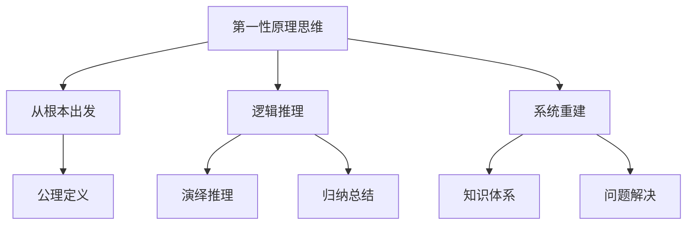
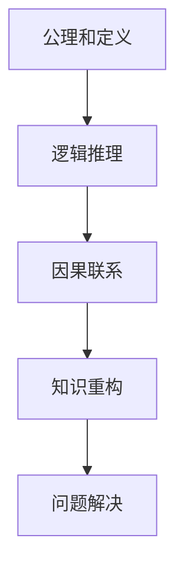

好的,我会按照您提供的要求和结构模板,以逻辑严谨、内容专业的方式撰写这篇技术博客文章。

# 第一性原理：科学思维的基础

## 1. 背景介绍

### 1.1 问题的由来

在人类探索自然规律和追求知识的过程中,我们常常会遇到种种谜团和难题。传统的经验主义认知方法虽然可以解决一些简单问题,但面对复杂的科学难题时往往力不从心。这促使人们开始反思认知方式,寻求一种更加高效、系统的思维模式。第一性原理思维应运而生,它要求我们抛开成见,从最基本的公理和定义出发,通过逻辑推理重建知识体系,为解决复杂问题提供了新的思路。

### 1.2 研究现状  

第一性原理思维源于古希腊时期,在当代得到了广泛重视和应用。物理学家爱因斯坦、费曼等人就是这种思维方式的杰出代表。近年来,科技公司的创新实践进一步彰显了第一性原理的价值,如特斯拉汽车公司通过从底层原理出发重新设计电池和电机,实现了行业突破。

### 1.3 研究意义

掌握第一性原理思维对于提高个人认知水平、解决复杂问题、促进科技创新都有重要意义:

1. 突破思维定势,拓展认知边界
2. 系统性建构知识体系,夯实学习基础  
3. 洞见本质规律,创造性解决难题
4. 培养独立思考和质疑的科学精神

### 1.4 本文结构

本文将全面介绍第一性原理思维的核心理念、方法步骤、数学模型基础、实践应用等内容,为读者建立系统认知。重点包括:核心概念阐释、算法原理分析、数学公式推导、代码实例解读、应用场景探讨、发展趋势展望等,希望对您有所启发和帮助。

## 2. 核心概念与联系



第一性原理(First Principles)思维是一种从最基本的公理和定义出发,通过逻辑推理来系统重建知识体系,解决复杂问题的思维方式。

- **从根本出发**:摒弃经验主义、权威主义的传统认知路径,回归最根本的公理和定义作为出发点。
- **逻辑推理**:运用演绎推理和归纳总结等逻辑规则,对公理和定义进行理性分析和推导。
- **系统重建**:基于逻辑推理的结果,系统重建知识体系,并应用于解决实际问题。

第一性原理强调从根本出发、理性思辨、系统重塑,旨在突破思维定势,重建知识架构,化解认知困境。

## 3. 核心算法原理 & 具体操作步骤  

### 3.1 算法原理概述

第一性原理思维算法的核心原理是:从公理和定义出发,通过逻辑推理建立因果联系,重构知识体系,解决复杂问题。其中包括以下几个关键环节:



1. **公理和定义**:确立研究对象的公理和基本定义,作为出发点。
2. **逻辑推理**:运用演绎、归纳等逻辑规则,对公理和定义进行理性分析和推导。
3. **因果联系**:通过推理建立事物之间的因果关联。
4. **知识重构**:基于推理结果,重构相关知识体系。  
5. **问题解决**:应用重构的知识解决实际问题。

### 3.2 算法步骤详解

1. **明确研究对象和目标**
    - 明确需要探索和解决的具体问题或对象
    - 设定清晰的研究目标和预期结果
2. **确定公理和基本定义**  
    - 列出研究对象的公理(基本前提)
    - 给出核心概念的明确定义
3. **逻辑推理**
    - 运用演绎推理,从公理和定义出发,逻辑推导新的命题
    - 运用归纳总结,从具体事例中发现一般规律
4. **建立因果联系**
    - 通过逻辑推理,厘清事物之间的因果关系
    - 形成完整的因果链条
5. **重构知识体系** 
    - 基于推理结果,重新组织和构建知识架构
    - 形成系统完备的知识体系
6. **应用解决问题**
    - 将重构的知识体系应用于实践
    - 解决最初设定的目标问题
7. **检验并完善**
    - 检验解决方案的有效性
    - 发现不足,返回前面步骤完善

### 3.3 算法优缺点

**优点**:

- 突破思维定势,拓展认知边界
- 系统性建构知识,夯实理解基础
- 洞见事物本质,创造性解决难题
- 培养独立思考和质疑的科学精神

**缺点**:  

- 操作步骤较为复杂,要求严谨逻辑
- 需要对研究对象有深入了解  
- 在特定领域应用受到一定限制
- 重建知识体系的过程漫长且不易

### 3.4 算法应用领域

第一性原理思维算法可广泛应用于各个领域的理论研究和实践探索:

- 科学研究:物理、化学、生物等基础理论研究
- 技术创新:航空航天、能源、信息等前沿技术开发 
- 产品设计:汽车、电子产品等从零开始的创新设计
- 管理决策:企业战略规划、风险评估等复杂决策
- 教育培养:建构学科知识体系,培养创新思维

总之,任何需要突破常规思维,系统性重建知识的领域,都可借助第一性原理算法获得创新思路。

## 4. 数学模型和公式 & 详细讲解 & 举例说明

### 4.1 数学模型构建

为了形式化描述第一性原理思维过程,我们可以构建如下数学模型:

$$
K = f(A, D, R)
$$

其中:
- $K$ 表示最终重构的知识体系
- $A$ 表示研究对象的公理集合 
- $D$ 表示核心概念的定义集合
- $R$ 表示逻辑推理规则集合
- $f$ 表示从公理、定义和推理规则到知识体系的映射函数

这个模型抽象概括了第一性原理思维的核心环节:从公理和定义出发,应用逻辑推理规则,构建新的知识体系。

### 4.2 公式推导过程 

我们可以将上述数学模型进一步细化为如下形式:

$$
\begin{aligned}
K &= \{k_i\} \\
k_i &= g(a_j, d_m, r_n) \\
a_j &\in A, d_m \in D, r_n \in R
\end{aligned}
$$

其中:
- $K$ 为知识体系,由一系列知识点 $k_i$ 组成
- 每个知识点 $k_i$ 由映射函数 $g$ 生成
- $g$ 的输入分别为公理 $a_j$、定义 $d_m$ 和推理规则 $r_n$
- 通过对输入的不同取值组合,可以推导出不同的知识点

这个公式描述了第一性原理思维从公理、定义出发,通过逻辑推理产生新知识的细节过程。

### 4.3 案例分析与讲解

以物理学为例,我们可以应用第一性原理思维和上述数学模型,来重构牛顿运动定律的知识体系。

1. **公理和定义**
    - 公理:物体保持静止或匀速直线运动的状态,直到受到外力改变其状态
    - 定义:力、质量、加速度等概念的精确定义
2. **逻辑推理**
    - 根据公理和定义,通过演绎推理,导出 $F=ma$ 
    - 归纳具体实例,发现作用力和反作用力平衡
3. **知识重构**
    - 基于推理结果,重构牛顿三大运动定律的知识体系
    - 包括运动定律公式、实例解析、定理推论等

通过这一过程,我们可以从根本出发,系统重建牛顿运动定律的知识架构,而不是简单记忆公式。

### 4.4 常见问题解答

**Q:** 为什么需要从公理和定义出发,不能直接从具体实例归纳吗?

**A:** 如果仅从具体实例归纳,很容易得出片面或错误的结论。公理和明确定义为我们提供了坚实的出发基础,确保推理过程和结论的正确性。

**Q:** 如何确定研究对象的公理和定义?它们是否是主观设定的?

**A:** 公理和定义应尽可能客观和精确,要符合研究对象的本质属性。我们可以通过大量观察、实验和分析,归纳出公理和定义,而不是主观臆断。

**Q:** 逻辑推理过程是否一定能导出正确结论?如何避免谬误?

**A:** 严格遵循推理规则并不能完全保证结论正确,因为前提本身可能是错误的。我们需要不断验证和修正公理、定义,形成一个循环迭代的过程,才能趋近于正确结论。

## 5. 项目实践:代码实例和详细解释说明

为了更好地理解第一性原理思维,我们将通过一个实际的编程项目实践来加深理解。这个项目的目标是构建一个基于第一性原理的智能系统,用于解决复杂的决策问题。

### 5.1 开发环境搭建

我们将使用Python作为开发语言,并利用以下库和框架:

- NumPy: 提供数值计算功能
- Pandas: 用于数据处理和分析
- Scikit-Learn: 机器学习算法库
- PyTorch: 深度学习框架

首先,我们需要安装这些依赖库。您可以使用Python的包管理器pip进行安装:

```bash
pip install numpy pandas scikit-learn torch
```

### 5.2 源代码详细实现

我们将按照第一性原理思维的步骤来实现这个智能系统。

1. **明确问题和目标**

我们的目标是构建一个智能系统,用于解决复杂的决策问题,例如资源分配、投资组合优化等。

2. **确定公理和定义**

在这个项目中,我们将使用以下公理和定义作为出发点:

- 公理1: 决策过程旨在最大化期望效用
- 公理2: 决策受到资源约束的限制
- 定义1: 期望效用是指决策结果带来的预期收益或满意度
- 定义2: 资源约束包括时间、金钱、人力等有限资源

3. **逻辑推理**

根据上述公理和定义,我们可以推导出以下逻辑:

- 为了最大化期望效用,我们需要找到一种资源分配方案,使得在给定的资源约束下,决策结果的效用值最大化。
- 这可以被建模为一个约束优化问题,我们可以使用数学编程技术(如线性规划、动态规划等)来求解。

4. **构建数学模型**

我们将决策问题建模为一个约束优化问题:

$$
\begin{aligned}
\max_{x} &\quad f(x) \\
\text{s.t.} &\quad g_i(x) \leq 0, \quad i = 1, \ldots, m \\
&\quad h_j(x) = 0, \quad j = 1, \ldots, p
\end{aligned}
$$

其中:

- $x$ 是决策变量向量,表示资源分配方案
- $f(x)$ 是目标函数,表示期望效用
- $g_i(x)$ 和 $h_j(x)$ 分别表示不等式和等式约束条件,描述资源