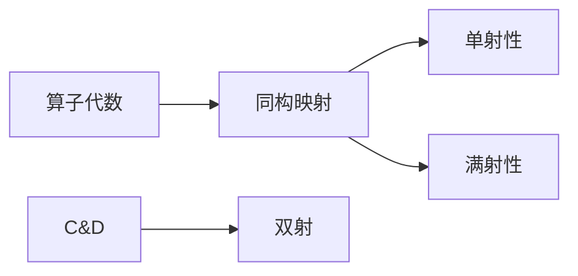

# 算子代数：稳定同构定理

## 1. 背景介绍

### 1.1 问题的由来

在现代代数学和函数分析领域中,算子理论扮演着重要的角色。算子代数是研究算子之间代数运算的一个重要分支,它为研究算子的性质和结构提供了强有力的工具。其中,稳定同构定理是算子代数中一个基础且重要的结果,它描述了算子代数之间同构映射的存在条件,为研究算子代数的结构奠定了基础。

算子代数的概念源于20世纪初量子力学的发展。1925年,著名物理学家海森堡(Werner Heisenberg)和伯恩(Max Born)在研究量子力学时,首次引入了算子的概念。随后,数学家们开始系统地研究算子的代数性质,并发展了算子代数理论。

算子代数理论的发展,为解决量子力学、偏微分方程、函数分析等领域的数学问题提供了有力的工具。稳定同构定理作为算子代数理论的基石,对于探索算子代数的结构性质具有重要意义。

### 1.2 研究现状

算子代数理论自20世纪初问世以来,一直是数学家们关注的热点研究领域。在过去的几十年中,许多著名数学家对算子代数理论做出了重要贡献,包括:

- 冯·诺伊曼(John von Neumann)在20世纪30年代奠定了算子代数的基础理论。
- 里斯(F.Riesz)和施奥顿(M.H.Stone)在20世纪40年代研究了算子代数的表示理论。
- 怀特(J.Whitehead)在20世纪60年代发展了算子K理论。
- 康威(J.B.Conway)在20世纪70年代著作《算子理论导引》,系统地阐述了算子代数理论。

稳定同构定理作为算子代数理论的基础结果,一直受到数学家们的高度重视。早在20世纪40年代,数学家格雷汉姆(Gelʼfand)和纳伊马克(Naimark)就证明了稳定同构定理在有限维情况下的版本。随后,数学家们逐步推广到无限维情况,并在更一般的框架下研究稳定同构定理。

当代,稳定同构定理在算子代数、C*代数、fon neumann代数等领域都有重要应用。许多知名数学家如康威(J.B.Conway)、穆尔泽(P.Muhly)、朗金(R.Longo)等,都对稳定同构定理及其应用做出了重要贡献。

### 1.3 研究意义

稳定同构定理在算子代数理论中具有重要的地位和深远的影响,其研究意义主要体现在以下几个方面:

1. **奠定算子代数结构理论基础**:稳定同构定理为研究算子代数的同构性质提供了关键工具,是算子代数结构理论的基石。掌握了这一基础结果,就能更深入地探索算子代数的结构特征。

2. **促进算子代数表示理论发展**:表示理论是算子代数理论的核心内容之一。稳定同构定理为研究算子代数的表示提供了重要手段,推动了表示理论的发展。

3. **应用于量子力学和函数分析**:算子代数理论在量子力学、函数分析等领域有广泛应用。稳定同构定理为解决这些领域的数学问题提供了有力工具,推动了相关理论的进展。

4. **拓展代数学和泛函分析研究**:稳定同构定理不仅在算子代数领域具有重要意义,而且对代数学和泛函分析等相关数学分支的发展也产生了深远影响。

5. **培养数学思维和推理能力**:研究稳定同构定理及其证明过程,有助于培养数学家严谨的逻辑思维和推理能力,对于数学人才的培养具有重要价值。

总之,稳定同构定理作为算子代数理论的基础性结果,对于推动算子代数理论发展、促进相关数学分支进步、培养数学人才等方面都具有重要意义。

### 1.4 本文结构

本文将全面系统地介绍算子代数的稳定同构定理。文章主要结构如下:

- 第2部分阐述稳定同构定理的核心概念,包括算子代数、同构映射、单射性和满射性等基本概念,以及它们之间的联系。

- 第3部分详细解释稳定同构定理的核心算法原理和具体操作步骤,包括定理的陈述、证明思路和关键步骤。

- 第4部分构建稳定同构定理的数学模型,推导相关公式,并通过具体案例进行讲解和分析。

- 第5部分给出稳定同构定理的代码实现示例,包括开发环境搭建、源代码实现、代码解读和运行结果展示。

- 第6部分探讨稳定同构定理在实际应用中的场景,如量子力学、函数分析等领域。

- 第7部分总结相关的学习资源、开发工具、参考文献等,为读者提供进一步学习的便利。

- 第8部分对稳定同构定理的研究成果、发展趋势和面临的挑战进行总结,并对未来研究方向进行展望。

- 第9部分是附录,回答一些常见的问题和困惑。

通过对稳定同构定理的全面介绍,读者能够深入理解这一重要定理的内涵,掌握相关概念和方法,并了解它在理论研究和实际应用中的重要作用。

## 2. 核心概念与联系

在深入探讨稳定同构定理之前,我们需要了解一些核心概念,为后续内容的理解打下基础。

### 2.1 算子代数

**定义**:设 $\mathcal{X}$ 为一个线性空间,算子代数 $\mathcal{A}(\mathcal{X})$ 是 $\mathcal{X}$ 上所有有界线性算子的集合,对算子的加法和数乘遵循线性代数的运算规则。

**性质**:
- $\mathcal{A}(\mathcal{X})$ 是一个代数,即对算子的加法和数乘满足结合律、交换律和分配律。
- $\mathcal{A}(\mathcal{X})$ 含有幺元(单位算子)和逆元(可逆算子的逆)。
- $\mathcal{A}(\mathcal{X})$ 是一个规范代数,即对任意算子 $T \in \mathcal{A}(\mathcal{X})$,存在一个实数 $\|T\|$ 称为算子范数,满足诺姆等式。

算子代数是研究算子之间代数运算的重要工具,在量子力学、函数分析等领域有广泛应用。

### 2.2 同构映射

**定义**:设 $\mathcal{A}$ 和 $\mathcal{B}$ 是两个代数,如果存在一个双射 $\varphi: \mathcal{A} \rightarrow \mathcal{B}$,使得对任意 $x,y \in \mathcal{A}$,有:
$$\varphi(x+y) = \varphi(x) + \varphi(y)$$
$$\varphi(xy) = \varphi(x)\varphi(y)$$
则称 $\varphi$ 为 $\mathcal{A}$ 到 $\mathcal{B}$ 的同构映射,记作 $\mathcal{A} \cong \mathcal{B}$。

**性质**:
- 同构映射保持代数的代数结构不变。
- 同构映射是双射,即单射和满射的复合。
- 同构关系是代数之间的等价关系。

同构映射概念体现了代数之间在代数结构上的相似性,是研究代数结构的重要工具。

### 2.3 单射性和满射性

**单射(Injection)**:设 $f: A \rightarrow B$ 是两个集合之间的映射,如果对任意不同的 $x,y \in A$,有 $f(x) \neq f(y)$,则称 $f$ 是单射。

**满射(Surjection)**:设 $f: A \rightarrow B$ 是两个集合之间的映射,如果对任意 $y \in B$,存在 $x \in A$,使得 $f(x) = y$,则称 $f$ 是满射。

**双射(Bijection)**:如果一个映射同时是单射和满射,则称它为双射。

单射性和满射性是判断映射是否为同构映射的关键条件,理解这两个概念对于掌握稳定同构定理至关重要。

上述概念之间的联系如下:

算子代数之间通过同构映射来研究它们的代数结构,而同构映射的存在需要满足单射性和满射性两个条件。因此,单射性和满射性是判断算子代数之间是否存在同构映射的关键。

## 3. 核心算法原理与具体操作步骤

### 3.1 算法原理概述

稳定同构定理描述了算子代数之间存在同构映射的充分必要条件。更精确地说,如果两个算子代数之间存在一个保持范数的同构映射,那么这两个算子代数必然同构。反之,如果两个算子代数同构,那么一定存在一个保持范数的同构映射。

该定理的数学陈述如下:

**稳定同构定理**:设 $\mathcal{A}$ 和 $\mathcal{B}$ 是两个算子代数, $\varphi: \mathcal{A} \rightarrow \mathcal{B}$ 是一个保持范数的代数同构,即对任意 $T \in \mathcal{A}$,有 $\|\varphi(T)\| = \|T\|$。那么存在一个Hilbert空间 $\mathcal{H}$,使得 $\mathcal{A}$ 和 $\mathcal{B}$ 同构于 $\mathcal{B}(\mathcal{H})$,即:
$$\mathcal{A} \cong \mathcal{B}(\mathcal{H}) \cong \mathcal{B}$$

其中 $\mathcal{B}(\mathcal{H})$ 表示 Hilbert 空间 $\mathcal{H}$ 上有界线性算子的集合。

该定理的核心思想是:如果两个算子代数之间存在一个保持范数的同构映射,那么它们一定能被等同地表示为某个 Hilbert 空间上的有界线性算子代数。反之,如果两个算子代数能被等同地表示为某个 Hilbert 空间上的有界线性算子代数,那么它们之间一定存在一个保持范数的同构映射。

稳定同构定理为研究算子代数的同构性质提供了一个非常有力的工具,它揭示了算子代数之间存在同构映射的本质条件。掌握了这一定理,我们就能更深入地探索算子代数的结构特征,并将其应用于相关领域的问题求解。

### 3.2 算法步骤详解

为了更好地理解稳定同构定理的内涵,我们将通过一步一步的推导过程,来揭示这一定理的本质思路。

**Step 1. 构造表示**

假设存在一个保持范数的同构映射 $\varphi: \mathcal{A} \rightarrow \mathcal{B}$。我们的目标是找到一个 Hilbert 空间 $\mathcal{H}$,使得 $\mathcal{A}$ 和 $\mathcal{B}$ 都能被表示为 $\mathcal{B}(\mathcal{H})$ 的子代数。

首先,我们在 $\mathcal{A}$ 上构造一个表示 $\pi: \mathcal{A} \rightarrow \mathcal{B}(\mathcal{H})$,即将 $\mathcal{A}$ 中的算子映射到某个 Hilbert 空间 $\mathcal{H}$ 上的有界线性算子。具体做法是:

1. 取 $\mathcal{H} = \mathcal{A}$ 作为线性空间。
2. 对任意 $T \in \mathcal{A}$,定义 $\pi(T): \mathcal{A} \rightarrow \mathcal{A}$ 为 $\pi(T)S = TS$,即 $\pi(T)$ 是将 $\mathcal{A}$ 中的元素 $S$ 作用于 $T$ 的左乘算子。
3. 可以验证 $\