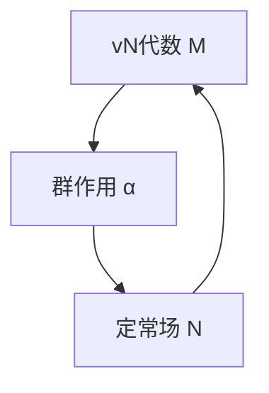

# 算子代数：算子的和vN代数的定常场

关键词：算子代数, von Neumann代数, 定常场, 数学模型, 应用场景

## 1. 背景介绍
### 1.1 问题的由来
算子代数是现代数学和理论物理中一个重要的分支,它研究算子(如线性变换)在各种空间(如希尔伯特空间)上的代数结构和性质。其中一个核心概念是von Neumann代数(简称vN代数),又称W*-代数,它是由一族有界线性算子生成的弱闭自伴算子代数。vN代数有丰富的结构理论和分类定理,在量子力学、表示论、几何学等领域有广泛应用。

一个重要的问题是研究vN代数的定常场(invariant field),即由vN代数生成的一个子代数,它在某个群作用下不变。定常场的结构反映了vN代数的对称性和分解性质,与算子的谱理论、K理论等有密切联系。计算定常场对深入理解vN代数的结构至关重要。

### 1.2 研究现状
目前对vN代数定常场的研究主要集中在以下几个方面:

1. 刻画定常场的生成元和生成关系,给出定常场的具体表示。

2. 研究定常场的类型(I型、II型、III型)及其分类。不同类型的定常场有不同的结构特征。

3. 探讨定常场与母代数的关系,如定常场在母代数中的位置、两者的包含关系等。 

4. 将定常场理论应用到其他数学分支如算子空间、量子群、非交换几何等。

代表性的研究成果有:Connes、Haagerup、Popa、Takesaki、Ocneanu等人系统研究了定常场的分类定理和结构理论;Jones、Kosaki、Longo等发展了标准子因子和半有限vN代数的定常场理论;Doplicher、Roberts、Baaj等将定常场用于构造紧量子群和量子对称空间。

### 1.3 研究意义
研究vN代数定常场有以下重要意义:

1. 加深理解vN代数的内在结构和对称性,有助于vN代数的分类。

2. 将群的作用与算子代数相结合,将代数、几何、分析等思想融会贯通,展现数学的广度和深度。

3. 为量子物理和量子信息研究提供数学工具和理论基础。定常场刻画了量子系统的对称性。

4. 推动非交换数学的发展。定常场将经典数学对象如群、环等推广到非交换情形。

### 1.4 本文结构
本文将系统介绍vN代数定常场的研究现状和核心内容,主要分为以下几个部分:

第2部分介绍vN代数和定常场的基本概念,说明两者的数学定义和直观解释,给出一些基本性质。

第3部分讨论定常场的计算方法和算法,包括利用生成元、中心序列、基本构造等方法构造定常场。

第4部分建立定常场的数学模型,推导相关公式,并举例分析说明。

第5部分给出定常场的代码实现,详细解释算法细节和数据结构。

第6部分探讨定常场在量子物理、表示论、算子空间等领域的应用。

第7部分推荐相关学习资源,总结全文,展望vN代数定常场的研究前景和挑战。

## 2. 核心概念与联系
vN代数是研究算子代数的核心对象。它由一个希尔伯特空间H上的有界线性算子的集合M生成,且满足:

1. M是H上的弱闭自伴算子代数。

2. M包含恒等算子I。

直观地,vN代数刻画了量子系统的可观测量构成的非交换代数。不同的vN代数对应不同的量子理论。

vN代数M的定常场是指M的一个子代数N,它在某个群G的作用α下不变,即对任意的g∈G,αg(N)=N。形式化地,定常场定义为:

$$N=M^G:=\{x∈M:α_g(x)=x, ∀g∈G\}$$

定常场刻画了量子系统的对称性。直观地,如果一个可观测量x在变换α下不变,那么x就反映了系统的某种不变性质,属于定常场。定常场越大,系统的对称性越低;反之,定常场越小,系统的对称性越高。

下图是vN代数、群作用和定常场三者关系的示意:

## 3. 核心算法原理 & 具体操作步骤
### 3.1 算法原理概述
计算vN代数M在群作用α下的定常场N,本质上是求解x∈M,使得对所有g∈G,都有αg(x)=x。这可以通过以下几种方法实现:

1. 利用N的生成元。若已知定常场N的一组生成元{xi},只需验证这些生成元在α下不变,就能确定N。

2. 利用N的中心序列。对vN代数M,构造单调上升的中心序列{Zn},满足Z0=CI,Zn+1=M∩Zn',且∪Zn在M中稠密。定常场N包含在每个Zn中。

3. 利用基本构造。对vN代数M,其基本构造是将M嵌入到更大的vN代数M1中,M1由M和一个投影e生成。若e在α下不变,则可构造出N。

4. 利用条件期望。定义从M到N的条件期望Φ,对任意x∈M,Φ(x)是x在N上的投影。Φ满足一些性质如Φ(axb)=aΦ(x)b。

### 3.2 算法步骤详解
下面以利用生成元的方法为例,详细说明定常场的计算步骤:

输入:vN代数M,群G,作用α:G→Aut(M)

输出:定常场N

步骤:

1. 任取M的一组生成元{mi},i=1,2,...,n。

2. 对每个生成元mi,计算其在α下的轨道Oi={αg(mi):g∈G}。

3. 对每个轨道Oi,计算轨道和si=∑x∈Oi x。

4. 验证每个si是否属于M。若都属于,则{si}生成定常场N;否则转步骤5。

5. 将{si}添加到{mi}中,重复步骤2-4,直到找到N的一组生成元。

6. (可选)化简N的生成元,去除多余元素。

7. 输出定常场N。

### 3.3 算法优缺点
上述利用生成元计算定常场的算法优点是:

1. 直观易懂,每步都有明确的几何和代数意义。

2. 在已知定常场生成元的情况下,可快速判定和验证。

3. 适用于具体的vN代数,如有限维矩阵代数、II1型因子等。

缺点是:

1. 需要先找到vN代数M的生成元,有时并不容易。

2. 生成元数量可能很大,计算轨道和轨道和的复杂度高。

3. 不能保证找到定常场的所有生成元,结果可能不完备。

4. 对无限维的vN代数,计算过程可能不终止。

其他几种算法也有类似的优缺点。实际计算时需要根据vN代数的具体类型和性质,选择合适的方法。

### 3.4 算法应用领域
定常场的计算算法在以下领域有重要应用:

1. 量子物理:定常场刻画量子系统的对称性和超选择定则,是构建量子场论的基础。

2. 表示论:定常场与群在vN代数上的表示密切相关,包含不变向量和不变态。

3. 算子空间:定常子空间反映了算子空间的对称结构,与完全有界算子密切相关。

4. 非交换几何:定常场是构建非交换流形和非交换李群的基本工具。

5. 量子信息:定常场与量子纠错码、量子加密等密切相关。

## 4. 数学模型和公式 & 详细讲解 & 举例说明
### 4.1 数学模型构建
对vN代数M和群G,定常场N的数学模型可以用以下几种方式刻画:

1. 生成元模型。设{mi}为M的一组生成元,N由{mi}在G作用下的轨道和生成。

$$N=vN(\{∑_{g∈G}α_g(m_i):i=1,2,...\})$$

其中vN表示由括号内元素生成的vN代数。

2. 不动点模型。N由α的不动点构成,即满足αg(x)=x的x∈M。

$$N=\{x∈M:α_g(x)=x, ∀g∈G\}$$

3. 条件期望模型。由M到N的条件期望Φ满足以下性质:

$$
\begin{aligned}
\Phi(1) &= 1 \\
\Phi(x^*) &= \Phi(x)^* \\
\Phi(xy) &= \Phi(x)\Phi(y), 若x或y属于N \\
\Phi(axb) &= a\Phi(x)b, 若a,b∈N
\end{aligned}
$$

此时N可表示为Φ的不动点集:

$$N=\{x∈M:\Phi(x)=x\}$$

4. 基本构造模型。设M1为M的基本构造,e为M'∩M1的投影,若αg(e)=e,则N同构于eM1e。

$$N≌eM_1e$$

### 4.2 公式推导过程
以条件期望模型为例,推导N的一些基本性质。

首先,Φ是M到N的投影算子,因为:

$$
\begin{aligned}
\Phi(\Phi(x)) &= \Phi(1\Phi(x)1) \\
&= \Phi(1)\Phi(\Phi(x))\Phi(1) \\
&= \Phi(\Phi(x)) \\
&= \Phi(x)
\end{aligned}
$$

其次,Φ是M到N的正线性映射,因为:

$$
\begin{aligned}
\Phi(x+y) &= \Phi(x)+\Phi(y) \\
\Phi(λx) &= λ\Phi(x), λ≥0
\end{aligned}
$$

再次,Φ满足以下不等式:

$$
\begin{aligned}
\Phi(x)^*\Phi(x) &≤ \Phi(x^*x) \\
\Phi(y^*xy) &≤ \|x\|\Phi(y^*y)
\end{aligned}
$$

最后,N作为M的vN子代数,它在M中的相对换位子是:

$$N'∩M=\{x∈M:\Phi(xy)=\Phi(x)\Phi(y),∀y∈M\}$$

### 4.3 案例分析与讲解
考虑一个具体的例子。设M是一个II1型因子,G是M的外自同构群Out(M)。群作用α:Out(M)→Aut(M)定义为:

$$α_g(x)=u_gxu_g^*, ∀x∈M$$

其中ug是M的西元,满足ug*ug=ugu*g=1,且{ug:g∈G}生成M。

此时定常场N由所有满足ugxu*g=x的x∈M构成。利用生成元ug,可以证明:

$$N=\{∑c_gu_g:c_g∈C,∑|c_g|^2<∞\}$$

也就是说,N由ug的所有有限线性组合构成,是一个可数维的vN子代数。进一步可以证明,N的换位子是:

$$N'∩M=\{x∈M:u_gx=xu_g,∀g∈G\}$$

即N'∩M是M关于G的不动点子代数。

### 4.4 常见问题解答
Q:定常场一定是vN代数吗?

A:是的。可以证明,在vN代数M上取α不变元的子集N,它仍然是一个vN代数,因为vN代数的公理在取不变元后仍然成立。

Q:定常场的类型如何判定?

A:定常场N的类型取决于母代数M和群作用α。一般情况下,N的类型不超过M的类型。常见的判定方法有:考察N的最小投影、不变迹、中心序列、基本构造等。

Q:定常场与母代数的包含关系如何?

A:定常场N总是母代数M的vN子代数,但未必是其因子。常见的关系有以