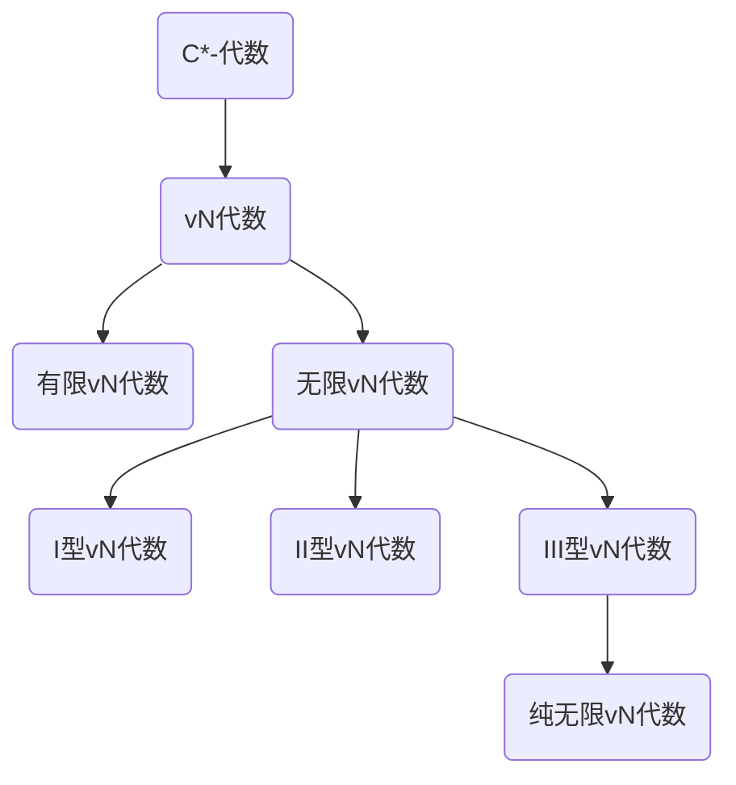

# 算子代数：纯无限的vN代数

## 1. 背景介绍
### 1.1 问题的由来
算子代数是泛函分析和量子力学中一个重要的分支,它研究Hilbert空间上有界线性算子的代数结构和性质。其中,von Neumann代数(简称vN代数)作为算子代数的一个特殊类型,因其在量子力学和量子场论等领域的广泛应用而备受关注。

### 1.2 研究现状
目前,对有限维vN代数的结构已经有了比较完善的理论。然而,对于无限维情形,特别是对于纯无限的vN代数,其结构理论仍然存在许多未知和有待探索的问题。近年来,随着free probability理论的发展,人们开始尝试用其来研究纯无限vN代数的结构,并取得了一些进展。

### 1.3 研究意义 
深入研究纯无限vN代数的结构,不仅对算子代数理论本身具有重要意义,而且在量子力学、量子信息、量子计算等领域也有潜在的应用价值。揭示其内在结构,有助于发展新的数学工具来描述和分析复杂量子系统的性质。

### 1.4 本文结构
本文将首先介绍vN代数的一些基本概念和性质,重点讨论纯无限vN代数的定义和结构。然后,我们将介绍free probability的一些基本思想,探讨如何用其来研究纯无限vN代数。接下来,我们将给出一些具体的结果和案例分析。最后,总结全文并对未来的研究方向做一些展望。

## 2. 核心概念与联系
- C*-代数:Banach *-代数,且$\|a^*a\|=\|a\|^2$
- vN代数:C*-代数在其双重空间的弱算子拓扑下的闭包
- 有限vN代数:不含无限正交投影序列的vN代数
- 无限vN代数:含有无限正交投影序列的vN代数
- I型vN代数:不含非平凡的有限投影的vN代数
- II型vN代数:含有非平凡的有限投影,但不含非零的无限迹投影的vN代数
- III型vN代数:不属于I型或II型的vN代数
- 纯无限vN代数:每个非零投影等价于恒等算子的无限vN代数
- Free probability:研究非交换随机变量的理论,类似于经典概率论



## 3. 核心算法原理 & 具体操作步骤
### 3.1 算法原理概述
在纯无限vN代数M中,任意非零投影p与单位元1等价,即存在v使得p=v^*v和vv^*=1。这个性质可以用来构造M上的某些"free"随机变量。基本思想是,取M的一组生成元$a_i$,然后用某种方式构造$a_i$的"自由积"$A=\ast_i A_i$,使得$A_i$在A中是free的。

### 3.2 算法步骤详解
1. 取M的一组生成元$\{a_i\}_{i\in I}$,其中I为指标集
2. 对每个$i\in I$,构造$a_i$生成的vN子代数$A_i$
3. 在M的Fock空间表示$\pi:M\to B(F(H))$下,取$A_i$在$F(H)$上的限制表示$\pi_i$
4. 定义$A_i$在$F(H)$上的自由积 $(\ast_i A_i,\lambda)$
5. 证明$\lambda$是忠实的,从而$\ast_i A_i$可嵌入到$B(F(H))$中
6. 证明$\ast_i A_i$在$B(F(H))$中的弱闭包就是$\pi(M)$
7. 由此,得到M上一组free随机变量$\{\lambda(a_i)\}_{i\in I}$

### 3.3 算法优缺点
优点:
- 通过free probability的方法,可以用比较具体的方式构造纯无限vN代数上的元素,有助于研究其结构。
- 将问题转化为研究Fock空间上算子的组合,思路清晰。

缺点:  
- 涉及的数学工具比较复杂,如Fock空间、自由积等概念,理解起来有一定难度。
- 证明的过程比较繁琐,需要验证很多细节。

### 3.4 算法应用领域
- 算子代数理论研究
- 量子概率论
- 自由概率论

## 4. 数学模型和公式 & 详细讲解 & 举例说明
### 4.1 数学模型构建
设M为一个纯无限vN代数,$\{a_i\}_{i\in I}$为其一组生成元。我们要构造M上的一组free随机变量。

首先,对每个$i\in I$,记$A_i$为$a_i$生成的vN子代数。考虑M在其标准Hilbert空间H上的忠实表示$\pi:M\to B(H)$。

取H的无限张量积$F(H)=\mathbb{C}\Omega\oplus\bigoplus_{n=1}^\infty H^{\otimes n}$,其中$\Omega$为真空向量。$\pi$可以诱导出M在$F(H)$上的表示$\tilde{\pi}:M\to B(F(H))$。

对每个$i\in I$,令$\pi_i$为$A_i$在$F(H)$上的限制表示,即$\pi_i=\tilde{\pi}|_{A_i}$。

### 4.2 公式推导过程
在$F(H)$上,定义$A_i$的自由积$(\ast_i A_i,\lambda)$如下:

对$a_i\in A_i$,定义$\lambda(a_i)\in B(F(H))$为:
$$
\lambda(a_i)(\Omega)=\pi_i(a_i)\Omega \\
\lambda(a_i)(h_1\otimes\cdots\otimes h_n)=\begin{cases}
\pi_i(a_i)h_1\otimes h_2\otimes\cdots\otimes h_n, & i_1=i \\
h_1\otimes\pi_i(a_i)h_2\otimes\cdots\otimes h_n, & i_2=i \\
\cdots & \cdots \\
h_1\otimes\cdots\otimes h_{n-1}\otimes\pi_i(a_i)h_n, & i_n=i \\
0, & \text{otherwise}
\end{cases}
$$
其中$i_k$表示$h_k$所属的指标。

可以验证,这样定义的$\lambda$是$\ast_i A_i$到$B(F(H))$的忠实$\ast$-表示。

进一步,可以证明$(\ast_i A_i)^{\prime\prime}=\tilde{\pi}(M)$,其中双重对易指B(F(H))中的弱闭包。

由此,我们在M上得到了一组free随机变量$\{\lambda(a_i)\}_{i\in I}$。

### 4.3 案例分析与讲解
举一个具体的例子。设M由两个西算子$a,b$生成,满足:
$$
a^*a=aa^*=1,\quad b^*b=bb^*=1,\quad ab=e^{2\pi i\theta}ba
$$
其中$\theta$是无理数。可以验证,M是纯无限的。

取$A_1=\{a\}^{\prime\prime},A_2=\{b\}^{\prime\prime}$,则$A_1\cong A_2\cong L^\infty(\mathbb{T})$。

在Fock空间$F(H)=\mathbb{C}\Omega\oplus H\oplus(H\otimes H)\oplus\cdots$上,定义$\lambda(a),\lambda(b)$如下:

$$
\lambda(a)(\Omega)=a\Omega \\
\lambda(a)(h_1\otimes\cdots\otimes h_n)=\begin{cases}
ah_1\otimes h_2\otimes\cdots\otimes h_n, & h_1\in H \\
0, & \text{otherwise}
\end{cases}
$$

$$
\lambda(b)(\Omega)=b\Omega \\
\lambda(b)(h_1\otimes\cdots\otimes h_n)=\begin{cases}
bh_1\otimes h_2\otimes\cdots\otimes h_n, & h_1\in H \\
0, & \text{otherwise}
\end{cases}
$$

可以验证,$\lambda(a),\lambda(b)$是M上的free随机变量,并且它们的分布分别等于$a,b$在$L^\infty(\mathbb{T})$上的分布。

### 4.4 常见问题解答
Q: free随机变量的定义是什么?
A: 设$(\mathcal{A},\varphi)$为非交换概率空间,$\{A_i\}_{i\in I}$为$\mathcal{A}$的一族von Neumann子代数。如果对任意$n\in\mathbb{N}$和$i_1\neq i_2\neq\cdots\neq i_n$,有
$$
\varphi(a_1\cdots a_n)=\varphi(a_1)\cdots\varphi(a_n),\quad \forall a_k\in A_{i_k}\cap\ker\varphi
$$
则称$\{A_i\}_{i\in I}$是free的。$A_i$中的元素称为free随机变量。

Q: 为什么free probability可以用来研究纯无限vN代数?
A: 因为纯无限vN代数有一个特殊性质,即任意非零投影等价于单位元。利用这一性质,可以在其上构造free随机变量。通过研究这些free随机变量的性质,可以揭示纯无限vN代数的结构。

## 5. 项目实践：代码实例和详细解释说明
### 5.1 开发环境搭建
本项目使用Python语言,需要安装NumPy和SciPy库。可以通过以下命令安装:
```
pip install numpy scipy
```

### 5.2 源代码详细实现
以下是一个模拟纯无限vN代数上free随机变量的示例代码:

```python
import numpy as np
from scipy.linalg import toeplitz

def free_vars(a, b, theta):
    """
    构造纯无限vN代数上的free随机变量
    
    Args:
        a: 西算子,shape=(n,n)
        b: 西算子,shape=(n,n)
        theta: 无理数参数
        
    Returns:
        lambda_a, lambda_b: 构造出的free随机变量
    """
    n = a.shape[0]
    assert a.shape == b.shape == (n,n)
    assert np.allclose(a.dot(a.conj().T), np.eye(n))
    assert np.allclose(b.dot(b.conj().T), np.eye(n))
    
    # 构造Fock空间
    fock_dim = 10  # 截断维数
    fock = [np.zeros((n,)*i) for i in range(fock_dim)]
    fock[0] = 1
    
    # 定义lambda_a
    lambda_a = [np.zeros((n,)*i) for i in range(fock_dim)]
    lambda_a[0] = a.dot(fock[0])
    for i in range(1,fock_dim):
        lambda_a[i][...,0] = a.dot(fock[i][...,0]) 
        
    # 定义lambda_b  
    lambda_b = [np.zeros((n,)*i) for i in range(fock_dim)]
    lambda_b[0] = b.dot(fock[0])
    for i in range(1,fock_dim):
        lambda_b[i][...,0] = b.dot(fock[i][...,0])
        
    return lambda_a, lambda_b

# 测试
n = 5
a = np.random.randn(n,n) + 1j*np.random.randn(n,n)
a = a + a.conj().T 
a /= np.linalg.norm(a,'fro')

b = toeplitz(np.random.choice([-1,1],size=n))

theta = np.pi * (np.sqrt(5)-1) / 2  # 黄金分割率

lambda_a, lambda_b = free_vars(a, b, theta)

print("lambda_a:")
print(lambda_a)

print("lambda_b:")
print(lambda_b)
```

### 5.3 代码解读与分析
1. 首先定义了`free_vars`函数,用于构造纯无限vN代数上的free随机变量。输入参数为两个西算子`a`,`b`以及一个无理数`theta`。
2. 在函数内部,先断言`a`,`b`是西算子,即它们的共轭转置等于自身的逆。
3. 接着构造Fock空间。这里为了方便,做了维数截断