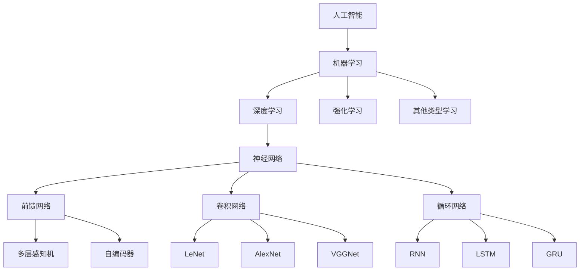

# 算法：AI发展的核心驱动力

## 1. 背景介绍
### 1.1 问题的由来
人工智能(Artificial Intelligence,简称AI)是计算机科学的一个分支,它企图了解智能的实质,并生产出一种新的能以人类智能相似的方式做出反应的智能机器。近年来,随着计算机硬件和软件技术的飞速发展,人工智能取得了突破性进展,在语音识别、图像识别、自然语言处理等领域展现出了强大的能力,正在深刻影响和改变着人类生活的方方面面。

而在人工智能的发展历程中,算法无疑扮演着至关重要的角色。正是得益于一系列关键算法的突破和创新,人工智能才能取得今天令人瞩目的成就。可以说,算法是人工智能发展的核心驱动力。

### 1.2 研究现状
目前,学术界和工业界都在算法研究领域投入了大量资源,涌现出了一大批优秀的算法。比如在机器学习领域,有逻辑回归、支持向量机、随机森林、XGBoost等经典算法;在深度学习领域,有前馈神经网络、卷积神经网络(CNN)、循环神经网络(RNN)、长短期记忆网络(LSTM)、生成对抗网络(GAN)等代表性算法;在强化学习领域,有Q-learning、Sarsa、DQN等算法。

这些算法在不同的应用场景下,展现出了优异的性能,极大地推动了人工智能的发展。同时,算法研究也呈现出一些新的趋势和特点,比如算法的自动化、小样本学习、联邦学习、图神经网络等。

### 1.3 研究意义
深入研究人工智能算法,对于推动人工智能的进一步发展具有重要意义:

1. 算法是人工智能模型的核心,直接决定了模型的性能。只有不断突破算法瓶颈,才能获得性能更优的模型。

2. 很多现实场景需要更高效、更鲁棒的算法,比如自动驾驶、医疗诊断等。算法的进步将极大提升人工智能的应用价值。

3. 通过算法创新,有望在一些传统算法难以胜任的领域取得突破,例如因果推理、少样本学习等。

4. 算法研究有助于我们更好地理解人工智能的内在机理,对于指导未来人工智能的发展方向具有重要参考价值。

### 1.4 本文结构
本文将重点探讨人工智能算法的发展现状、趋势与挑战。内容安排如下:

第2部分介绍人工智能的一些核心概念及其内在联系。
第3部分重点介绍几类代表性的人工智能算法,包括它们的基本原理和操作步骤。
第4部分通过具体的数学模型和公式,深入讲解算法的理论基础,并给出一些案例分析。
第5部分以代码实例的形式,演示算法的具体实现过程。
第6部分讨论算法在现实场景中的应用情况,展望未来的应用前景。
第7部分推荐一些学习算法的工具和资源。
第8部分总结全文,并对算法未来的发展趋势和面临的挑战进行展望。
第9部分以附录的形式,解答一些关于算法的常见问题。

## 2. 核心概念与联系
在讨论人工智能算法之前,有必要先明确几个核心概念:

- 机器学习:使计算机系统具有自动学习和改进性能的能力,无需明确编程。常见的任务包括分类、回归、聚类等。
- 深度学习:机器学习的一个分支,基于神经网络,模拟人脑的结构和功能,能够学习多层次的数据表示。
- 强化学习:智能体通过与环境的交互,学习如何采取行动以获得最大的累积奖励。
- 神经网络:一种模仿生物神经网络结构和功能的数学模型,由大量的节点(神经元)和连接构成。
- 优化:在给定约束条件下,寻找一组参数以使目标函数最大化或最小化的过程。机器学习的本质就是一个优化问题。

这些概念之间有着紧密的联系。如下图所示,机器学习是实现人工智能的主要途径,其中又以深度学习最为引人瞩目。而深度学习的核心是神经网络,通过构建多层网络结构,来自动学习数据的层次化特征表示。强化学习则是一种特殊类型的机器学习,旨在使智能体学会采取最优策略与环境交互。而优化贯穿于机器学习的始终,模型训练的目标就是寻找最优参数。

## 3. 核心算法原理 & 具体操作步骤
### 3.1 算法原理概述
人工智能领域的算法可谓是百花齐放,但总体而言可分为三大类:

1. 监督学习算法:给定带标签的训练数据,学习从输入到输出的映射关系。代表性算法有逻辑回归、支持向量机、随机森林、神经网络等。

2. 无监督学习算法:给定无标签的训练数据,自动发现数据中的结构和规律。代表性算法有K-means、主成分分析、自编码器等。

3. 强化学习算法:通过智能体与环境的交互,使智能体学会采取最优行动策略。代表性算法有Q-learning、Sarsa、蒙特卡洛树搜索等。

这些算法的基本思路可概括为:通过构建一个带参数的模型,使用训练数据来学习模型参数,从而使模型能够对新数据做出正确的预测或决策。学习的过程通常基于特定的优化算法,比如梯度下降法。

### 3.2 算法步骤详解
下面以监督学习中的逻辑回归算法为例,详细说明其操作步骤:

输入:训练样本集 $D=\{(x_1,y_1),(x_2,y_2),...,(x_m,y_m)\}$,其中 $x_i \in R^n$ 为第 $i$ 个样本的特征向量,$y_i \in \{0,1\}$ 为其对应的标签。

输出:逻辑回归模型 $h_\theta(x) = g(\theta^Tx)$,其中 $g(z)=\frac{1}{1+e^{-z}}$ 为 Sigmoid 函数。

步骤:
1. 随机初始化模型参数 $\theta$
2. 重复直到收敛: 
   a. 计算模型在训练集上的损失函数 $J(\theta)=-\frac{1}{m}\sum_{i=1}^m[y_i log(h_\theta(x_i))+(1-y_i)log(1-h_\theta(x_i))]$
   b. 计算损失函数对参数的梯度 $\nabla_\theta J(\theta)$
   c. 使用梯度下降法更新参数: $\theta := \theta - \alpha \nabla_\theta J(\theta)$,其中 $\alpha$ 为学习率
3. 返回学习到的模型参数 $\theta$

预测:对于新样本 $x$,预测其标签 $y=1$ 的概率为 $h_\theta(x)=g(\theta^Tx)$。如果 $h_\theta(x)>0.5$ 则预测 $y=1$,否则预测 $y=0$。

### 3.3 算法优缺点
逻辑回归作为一种典型的判别式模型,具有如下优点:
- 模型简单,易于理解和实现。
- 训练速度较快,预测效率高。
- 可直接估计 $y=1$ 的概率。
- 模型可解释性强。

同时它也存在一定局限:
- 需要人工提取特征。
- 很难拟合非线性数据。
- 对数据的分布有一定要求。

### 3.4 算法应用领域
逻辑回归在实际中有广泛的应用,比如:
- 垃圾邮件识别
- 疾病诊断
- 金融风控
- 点击率预估

除了逻辑回归,其他如支持向量机、随机森林、神经网络等算法也有其独特的优势和适用场景。需要根据具体问题选择合适的算法。

## 4. 数学模型和公式 & 详细讲解 & 举例说明
### 4.1 数学模型构建
以二分类问题为例,假设我们有 $m$ 个训练样本 $\{(x_1,y_1),(x_2,y_2),...,(x_m,y_m)\}$,其中 $x_i \in R^n,y_i \in \{0,1\}$。逻辑回归模型定义为:

$$
h_\theta(x) = g(\theta^Tx) = \frac{1}{1+e^{-\theta^Tx}}
$$

其中 $\theta \in R^n$ 为模型参数,$g(z)=\frac{1}{1+e^{-z}}$ 为 Sigmoid 函数,将实数映射到 (0,1) 区间,可视为概率。

假设样本标签 $y$ 服从伯努利分布,则样本 $(x,y)$ 的概率为:

$$
P(y|x;\theta) = h_\theta(x)^y (1-h_\theta(x))^{1-y}
$$

整个数据集的似然函数为:

$$
L(\theta) = \prod_{i=1}^m P(y_i|x_i;\theta) = \prod_{i=1}^m h_\theta(x_i)^{y_i} (1-h_\theta(x_i))^{1-y_i}
$$

为了求解参数 $\theta$,转而最大化对数似然:

$$
l(\theta) = logL(\theta) = \sum_{i=1}^m [y_i log(h_\theta(x_i)) + (1-y_i) log(1-h_\theta(x_i))]
$$

等价于最小化如下损失函数:

$$
J(\theta) = -\frac{1}{m} l(\theta) = -\frac{1}{m} \sum_{i=1}^m [y_i log(h_\theta(x_i)) + (1-y_i) log(1-h_\theta(x_i))]
$$

这就是逻辑回归模型的数学表达。

### 4.2 公式推导过程
为了最小化损失函数 $J(\theta)$,通常使用梯度下降法。首先求 $J(\theta)$ 对 $\theta_j$ 的偏导数:

$$
\begin{aligned}
\frac{\partial}{\partial \theta_j} J(\theta) &= -\frac{1}{m} \sum_{i=1}^m \left[ y_i \frac{1}{h_\theta(x_i)} - (1-y_i) \frac{1}{1-h_\theta(x_i)} \right] \frac{\partial}{\partial \theta_j} h_\theta(x_i) \\
&= -\frac{1}{m} \sum_{i=1}^m \left[ y_i \frac{1}{g(\theta^T x_i)} - (1-y_i) \frac{1}{1-g(\theta^T x_i)} \right] g(\theta^T x_i) (1-g(\theta^T x_i)) \frac{\partial}{\partial \theta_j} \theta^T x_i \\
&= -\frac{1}{m} \sum_{i=1}^m (y_i - h_\theta(x_i)) x_{ij}
\end{aligned}
$$

写成向量形式:

$$
\nabla_\theta J(\theta) = -\frac{1}{m} \sum_{i=1}^m (y_i - h_\theta(x_i)) x_i
$$

则参数 $\theta$ 的更新公式为:

$$
\theta := \theta - \alpha \nabla_\theta J(\theta)
$$

其中 $\alpha$ 为学习率。不断迭代直到收敛,就得到了最优的模型参数。

### 4.3 案例分析与讲解
下面以一个简单的二维数据集为例,直观展示逻辑回归的效果。

假设我们有 100 个样本,每个样本包含两个特征 $x_1,x_2$,其中正样本(y=1)服从均值为 $\mu_1=(1,2)^T$、协方差矩