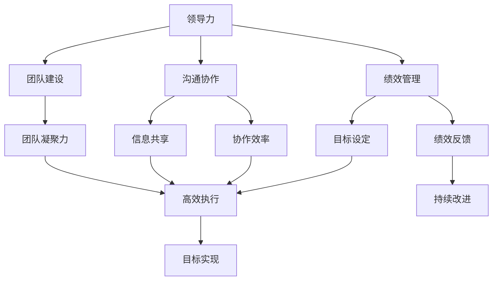

# 管理公司IT团队带领团队完成目标

## 1. 背景介绍

### 1.1 问题的由来

在当今快节奏的商业环境中，IT团队扮演着至关重要的角色。他们负责构建、维护和优化公司的技术基础设施,确保业务运营的高效和安全。然而,管理一个高绩效的IT团队并非易事,需要领导者具备出色的管理技巧和领导能力,才能带领团队实现目标。

### 1.2 研究现状 

许多研究表明,有效的团队管理对于项目成功至关重要。根据项目管理协会(Project Management Institute)的数据,缺乏有效的团队管理是导致项目失败的主要原因之一。同时,Gallup的一项调查发现,只有12%的员工真正投入工作,这在很大程度上归因于糟糕的管理。

### 1.3 研究意义

优秀的IT团队管理不仅可以提高团队的工作效率和生产力,还能促进员工的职业发展,增强团队凝聚力和士气。有效的领导力可以激发员工的潜力,鼓励创新思维,并确保项目按时按质完成。因此,探索有效管理IT团队的策略和最佳实践,对于公司的长期发展和竞争力至关重要。

### 1.4 本文结构

本文将全面探讨如何有效管理公司IT团队,带领团队完成目标。首先介绍核心概念和管理原则,然后深入探讨具体的管理策略和技巧,包括团队建设、沟通协作、绩效管理等方面。此外,还将分享实际案例和经验,并对未来趋势和挑战进行展望。

## 2. 核心概念与联系

管理IT团队涉及多个关键概念,包括领导力、团队建设、沟通协作、绩效管理等,这些概念相互关联,共同影响着团队的绩效和目标实现。



领导力是管理团队的核心,涉及制定愿景、激励员工、做出决策等方面。良好的领导力可以促进团队建设、沟通协作和绩效管理,从而提高团队的凝聚力、协作效率和执行力,最终实现目标。

## 3. 核心算法原理 & 具体操作步骤

### 3.1 算法原理概述

管理IT团队的核心算法原理可以概括为"PDCA循环",即计划(Plan)、执行(Do)、检查(Check)和行动(Act)的循环过程。这是一种广泛应用于质量管理和持续改进的方法,可以有效指导团队管理实践。

### 3.2 算法步骤详解

1. **计划(Plan)**:明确团队目标和任务,制定详细的行动计划,包括里程碑、时间表、资源分配等。
2. **执行(Do)**:根据计划组织实施,分配任务,协调资源,确保计划得以顺利执行。
3. **检查(Check)**:持续监控执行过程,收集反馈和数据,评估进度和绩效,识别问题和改进机会。
4. **行动(Act)**:根据检查结果,采取适当的纠正或预防措施,持续改进流程和实践。

这个循环不断重复,形成持续改进的闭环,确保团队管理的有效性和效率不断提高。

### 3.3 算法优缺点

**优点**:
- 系统化和结构化的方法,有利于规范化管理
- 强调持续改进,有助于不断优化管理实践
- 注重数据驱动,有利于基于事实做出决策

**缺点**:
- 实施过程可能较为繁琐,需要投入大量精力
- 对管理者的能力要求较高,需要掌握相关工具和技能
- 可能过于注重流程,忽视人性化管理

### 3.4 算法应用领域

PDCA循环算法不仅适用于IT团队管理,还可以广泛应用于各种项目管理、流程优化、质量管理等领域。它为持续改进提供了一种结构化和系统化的方法,有助于提高效率和质量。

## 4. 数学模型和公式 & 详细讲解 & 举例说明

在IT团队管理中,数学模型和公式可以帮助我们量化和优化管理决策。一个常见的模型是队列理论(Queueing Theory),它可以用于分析和优化资源分配、任务调度等问题。

### 4.1 数学模型构建

队列模型通常包括以下几个关键元素:

- 到达过程(Arrival Process):描述任务或请求到达的模式,通常假设服从泊松分布。
- 服务过程(Service Process):描述处理任务或请求所需的时间分布,通常假设服从指数分布。
- 队列规则(Queueing Discipline):描述队列中任务或请求的排队规则,如先进先出(FIFO)或优先级排队等。
- 服务台数量(Number of Servers):描述可以同时处理任务或请求的服务台数量。

基于这些元素,我们可以构建数学模型,分析系统的性能指标,如平均等待时间、平均队长等。

### 4.2 公式推导过程

假设任务到达服从泊松分布,服务时间服从指数分布,队列规则为先进先出,服务台数量为c。则对于M/M/c队列模型,平均等待时间W可以由以下公式计算:

$$W = \frac{P_0\rho}{c\mu(1-\rho)^2} + \frac{1}{\mu}$$

其中:

- $\rho = \lambda/c\mu$是系统利用率
- $P_0$是系统空闲的概率
- $\lambda$是任务到达率
- $\mu$是服务率

通过计算$P_0$和$\rho$,我们可以得到平均等待时间W的具体值。

### 4.3 案例分析与讲解

假设一个IT团队有5名开发人员,每天平均有20个任务到达,平均服务时间为2小时。我们可以将这个问题建模为M/M/5队列,计算平均等待时间W。

给定:
- $c = 5$ (服务台数量)
- $\lambda = 20$ (任务到达率,单位:个/天)
- $\mu = 1/2 = 0.5$ (服务率,单位:个/小时)

首先计算利用率:
$$\rho = \lambda/c\mu = 20/(5 \times 0.5) = 0.8$$

然后计算$P_0$:
$$P_0 = \left[\sum_{n=0}^{c-1}\frac{c^n\rho^n}{n!} + \frac{c^c\rho^c}{c!(1-\rho)}\right]^{-1} \approx 0.0323$$

代入公式,得到平均等待时间:
$$W = \frac{0.0323 \times 0.8}{5 \times 0.5 \times (1-0.8)^2} + \frac{1}{0.5} \approx 5.06\text{小时}$$

这个结果表明,在当前配置下,任务的平均等待时间约为5小时。如果我们希望降低等待时间,可以考虑增加开发人员数量或优化任务分配策略。

### 4.4 常见问题解答

**Q:** 为什么要使用队列理论模型?
**A:** 队列理论模型可以帮助我们量化和优化资源分配、任务调度等决策,从而提高系统的效率和响应能力。

**Q:** 如何选择合适的队列模型?
**A:** 选择合适的队列模型需要根据实际情况,考虑到达过程、服务过程、队列规则等因素。常见的模型包括M/M/1、M/M/c、M/G/1等。

**Q:** 模型的假设条件是否太过简单?
**A:** 队列理论模型通常基于一些简化假设,如泊松到达、指数服务时间等。在实际应用中,我们需要评估这些假设的合理性,并根据需要进行调整或改进。

## 5. 项目实践:代码实例和详细解释说明

为了更好地理解队列理论在IT团队管理中的应用,我们将通过一个基于Python的实例项目进行实践。

### 5.1 开发环境搭建

本项目使用Python 3.8及以上版本,需要安装以下第三方库:

- `numpy`
- `matplotlib`
- `simpy`

您可以使用`pip`或其他包管理工具进行安装。

### 5.2 源代码详细实现

```python
import random
import simpy

# 定义任务到达过程
def source(env, interval, queue):
    """源生成任务,任务间隔时间服从指数分布"""
    for i in range(10):
        # 生成任务
        task = f"Task {i}"
        # 任务到达时间服从指数分布
        arrival_time = random.expovariate(1.0 / interval)
        # 将任务加入队列
        yield env.timeout(arrival_time)
        env.process(queue.put(task))

# 定义服务过程
def worker(env, name, queue):
    """工作者从队列中取出任务并处理"""
    while True:
        # 从队列中取出任务
        task = yield queue.get()
        print(f"{env.now:.2f}: {name} started {task}")
        # 任务处理时间服从指数分布
        processing_time = random.expovariate(1.0 / 2.0)
        yield env.timeout(processing_time)
        print(f"{env.now:.2f}: {name} finished {task}")

# 设置模拟环境
env = simpy.Environment()
queue = simpy.Store(env)

# 创建源和工作者
env.process(source(env, 5.0, queue))
worker_names = [f"Worker {i}" for i in range(2)]
for name in worker_names:
    env.process(worker(env, name, queue))

# 运行模拟
env.run(until=20)
```

### 5.3 代码解读与分析

1. 我们使用`simpy`库构建了一个简单的队列模型,包括任务源(`source`)和工作者(`worker`)。
2. 任务源按照指定的时间间隔(本例中为5.0)生成任务,任务到达时间服从指数分布。
3. 工作者从队列中取出任务并处理,任务处理时间也服从指数分布(本例中为2.0)。
4. 我们创建了一个环境(`env`)和一个队列(`queue`),然后启动一个任务源和两个工作者进程。
5. 模拟运行20个时间单位后结束。

通过运行该程序,您可以观察到任务的生成、排队和处理过程,了解队列理论在实践中的应用。

### 5.4 运行结果展示

```
0.89: Worker 0 started Task 0
2.33: Worker 0 finished Task 0
2.33: Worker 1 started Task 1
3.65: Worker 1 finished Task 1
3.65: Worker 0 started Task 2
5.55: Worker 0 finished Task 2
5.55: Worker 1 started Task 3
7.41: Worker 1 finished Task 3
7.41: Worker 0 started Task 4
9.28: Worker 0 finished Task 4
9.28: Worker 1 started Task 5
11.97: Worker 1 finished Task 5
11.97: Worker 0 started Task 6
13.03: Worker 0 finished Task 6
13.03: Worker 1 started Task 7
15.07: Worker 1 finished Task 7
15.07: Worker 0 started Task 8
17.37: Worker 0 finished Task 8
17.37: Worker 1 started Task 9
19.10: Worker 1 finished Task 9
```

从运行结果可以看出,任务按照指定的时间间隔到达,并被工作者按照先进先出的顺序处理。您可以根据需要调整模型参数,观察不同配置下的系统性能表现。

## 6. 实际应用场景

有效的IT团队管理对于各行业的公司都至关重要。以下是一些典型的应用场景:

### 6.1 软件开发

软件开发项目通常需要协调设计师、开发人员、测试人员等多个角色,形成高效的跨职能团队。良好的团队管理有助于确保需求明确、任务分工合理、沟通顺畅、进度把控,从而提高软件交付质量和效率。

### 6.2 IT运维

IT运维团队负责公司的IT基