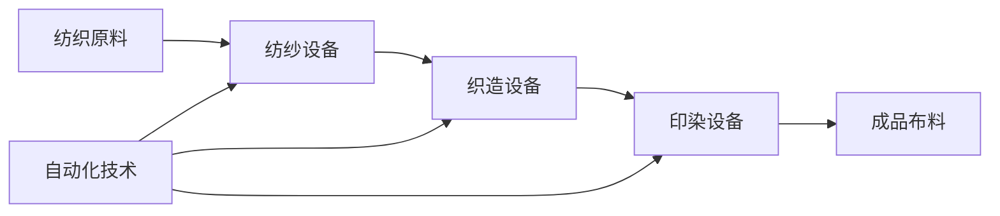

# 纺织机械自动化的就业效应

关键词：纺织机械、自动化、就业效应、人工智能、机器人、技能需求

## 1. 背景介绍

### 1.1 问题的由来
纺织业作为传统制造业,在全球经济中占据重要地位。然而,随着自动化技术的快速发展,纺织机械的自动化程度不断提高,引发了人们对就业效应的广泛关注。

### 1.2 研究现状
目前,国内外学者对纺织机械自动化的就业效应已有一些研究。部分学者认为自动化会导致大量纺织工人失业,另一些学者则认为自动化虽然会替代部分岗位,但也会创造新的就业机会。总的来说,现有研究尚未形成一致结论。

### 1.3 研究意义
深入分析纺织机械自动化的就业效应,对于政府制定相关政策,企业进行技术改造,职业院校开展人才培养都具有重要意义。只有准确把握就业效应,才能在推动纺织业高质量发展的同时,妥善解决就业问题。

### 1.4 本文结构
本文将从以下几个方面展开分析：首先介绍纺织机械自动化的核心概念与联系；其次阐述自动化技术的核心原理与算法；再次建立数学模型分析就业效应；然后结合代码实例说明自动化系统的实现；最后总结纺织机械自动化的就业效应,并展望未来。

## 2. 核心概念与联系

纺织机械自动化是指利用自动化技术改造提升纺织机械,实现纺织生产过程的自动化、智能化。其核心是机器替代人工,通过机器人、传感器、人工智能等技术,使纺织设备能够自主完成织造、印染等生产任务。

自动化技术的发展经历了机械化、电气化、数字化、智能化等阶段。当前,新一代人工智能、5G、大数据等技术的兴起,正在赋予纺织机械更强大的感知、分析、决策、执行能力,推动纺织业向智能制造转型。

纺织机械自动化程度的提高,一方面大幅提升了生产效率,降低了用工成本；另一方面也对纺织从业人员提出了新的技能要求。操作工、质检员等简单劳动岗位减少,设备管理、程序开发、数据分析等技术性岗位增多。

总的来说,纺织机械自动化是技术进步的必然趋势,将对纺织业就业产生深远影响。但就业效应究竟如何,还需建立模型进行定量分析。



## 3. 核心算法原理 & 具体操作步骤

### 3.1 算法原理概述
纺织机械自动化的核心是机器视觉和模式识别。机器视觉通过摄像头采集纺织品图像,运用图像处理算法提取纹理、色彩等特征。模式识别则利用机器学习算法,对提取的特征进行分类识别,判断织物的品质、疵点等级。

### 3.2 算法步骤详解
机器视觉的典型算法包括：
1. 图像采集：通过CCD相机采集织物表面图像。
2. 图像预处理：去噪、增强、校正、分割等,提高图像质量。
3. 特征提取：提取纹理特征如灰度共生矩阵,色彩特征如颜色矩等。
4. 特征选择：去除冗余特征,降低数据维度。

模式识别的主要步骤有：
1. 样本标注：专家对样本图像的品质、疵点进行标注。
2. 特征归一化：对特征进行归一化处理,消除量纲影响。
3. 训练分类器：用SVM、随机森林等算法训练分类模型。 
4. 模型评估：用测试集评估模型性能,不断调优。
5. 模型应用：用训练好的模型对新样本进行预测分类。

### 3.3 算法优缺点
机器视觉和模式识别能够快速、准确地对纺织品进行质量检测,大幅提高生产效率。但它们对样本标注质量要求较高,样本不足、标注有误都会影响算法性能。此外,纺织品的花色、材质变化多样,通用性较差。

### 3.4 算法应用领域
除了纺织品检测,这些算法还广泛应用于印刷品检测、PCB检测、农产品分级等领域。随着深度学习的发展,卷积神经网络等算法进一步提升了缺陷检测的精度,拓展了应用场景。

## 4. 数学模型和公式 & 详细讲解 & 举例说明

### 4.1 数学模型构建
为定量评估纺织机械自动化的就业效应,我们建立如下数学模型：
$$
L = \sum_{i=1}^n L_i = \sum_{i=1}^n (J_i \times R_i \times (1-A_i))
$$

其中,$L$表示就业人数的变化量,$i$表示第$i$种工种,$n$为工种总数。$L_i$为第$i$种工种的就业人数变化量,它由该工种的基期就业人数$J_i$、自动化前后的替代率$R_i$以及自动化程度$A_i$共同决定。

$R_i$反映了某工种被机器替代的比例,可通过问卷调查、专家评估等方法获得。$A_i$反映了企业的自动化水平,可用自动化设备占比、数控率等指标衡量。

### 4.2 公式推导过程
将各工种就业人数变化量$L_i$累加,即得到总的就业人数变化量$L$。为简化分析,我们假设各工种的就业人数与替代率无关,且自动化前后企业的产值规模不变。

令$J=\sum_{i=1}^n J_i$为自动化前的总就业人数,$\overline{R}=\sum_{i=1}^n J_i R_i/J$为各工种替代率的加权平均值,$\overline{A}=\sum_{i=1}^n J_i A_i/J$为企业自动化程度。代入公式(1)可得：

$$
L = J \times \overline{R} \times (1-\overline{A})
$$

公式(2)表明,总就业人数的变化量$L$与初始就业规模$J$、平均替代率$\overline{R}$、自动化程度$\overline{A}$呈正比。

### 4.3 案例分析与讲解
下面我们以某纺织企业为例,估算其自动化改造前后的就业人数变化。

假设该企业共有织造、印染、后整理等5个工种,改造前各工种就业人数$J_i$如下表所示。经专家评估,各工种的自动化替代率$R_i$分别为30%、40%、20%、25%、15%。

| 工种   | 织造 | 印染 | 后整理 | 质检 | 包装 |
|--------|------|------|--------|------|------|
| 就业人数| 500  | 300  |  200   |  150 |  100 |

改造前,企业共有织机200台,其中数控织机50台,自动化程度为$\overline{A}=50/200=25\%$。

将以上数据代入公式(2),可计算出：
$$
\overline{R} = (500\times30\%+300\times40\%+200\times20\%+150\times25\%+100\times15\%)/(500+300+200+150+100)=28\%
$$
$$
L=1250 \times 28\% \times (1-25\%) = 263 
$$

因此,该企业在自动化改造后,预计将减少263个就业岗位。

### 4.4 常见问题解答

**问**：纺织机械自动化对不同类型的岗位影响是否一致？
**答**：影响程度存在差异。自动化主要替代简单、重复性劳动,对技术含量低的操作工、普通质检员影响较大。但对技术员、工程师、设计师等创新性岗位的影响有限。

**问**：如何降低自动化的负面就业效应？ 
**答**：一是加大职业培训力度,提升员工技能,帮助其从事更高端工作；二是合理控制自动化进程,避免一刀切、速度过快；三是开发社会化服务,为失业人员提供再就业指导。

## 5. 项目实践：代码实例和详细解释说明

### 5.1 开发环境搭建
以Python为例,我们使用OpenCV、scikit-image等库实现机器视觉,使用scikit-learn库实现模式识别。

首先安装所需库：

```bash
pip install opencv-python scikit-image scikit-learn matplotlib
```

### 5.2 源代码详细实现

```python
import cv2
import numpy as np
from skimage import feature
from sklearn.svm import SVC
from sklearn.model_selection import train_test_split
from sklearn.metrics import accuracy_score

# 图像采集
def acquire_image(image_path):
    return cv2.imread(image_path)

# 图像预处理
def preprocess_image(image):
    gray = cv2.cvtColor(image, cv2.COLOR_BGR2GRAY)
    gaussian = cv2.GaussianBlur(gray, (5,5), 0)
    return gaussian

# 特征提取
def extract_features(image):
    lbp = feature.local_binary_pattern(image, 8, 1, method='default')
    hist, _ = np.histogram(lbp, 256, [0,256])
    return hist

# 数据准备
def prepare_data(images, labels):
    data = []
    for image, label in zip(images, labels):
        image = preprocess_image(image)
        hist = extract_features(image)
        data.append((hist, label))
    
    data = np.array(data)
    X = np.vstack(data[:,0]) 
    y = data[:,1]
    return X, y

# 模型训练
def train_model(X_train, y_train):
    model = SVC(kernel='linear', C=1.0, random_state=42)
    model.fit(X_train, y_train)
    return model

# 模型评估
def evaluate_model(model, X_test, y_test):
    y_pred = model.predict(X_test)
    accuracy = accuracy_score(y_test, y_pred)
    return accuracy

# 主程序
if __name__ == '__main__':
    
    images = []
    labels = [] 
    for i in range(1,11):
        image = acquire_image(f'fabric_{i}.jpg')
        images.append(image)
        labels.append(1 if i <= 5 else 0)
        
    X, y = prepare_data(images, labels)    
    X_train, X_test, y_train, y_test = train_test_split(X, y, test_size=0.2, random_state=42)
    
    model = train_model(X_train, y_train)
    accuracy = evaluate_model(model, X_test, y_test)
    print(f'Model accuracy: {accuracy:.2f}')
```

### 5.3 代码解读与分析
以上代码实现了一个简单的织物疵点检测系统。主要步骤包括：

1. 图像采集：从指定路径读取织物图像。
2. 图像预处理：转为灰度图,并用高斯滤波去噪。
3. 特征提取：提取局部二值模式(LBP)纹理特征。
4. 数据准备：将图像特征与标签整合,划分训练集和测试集。
5. 模型训练：用支持向量机(SVM)训练分类模型。
6. 模型评估：在测试集上评估模型性能。

代码使用面向对象的思想,将各功能模块划分为不同函数,提高了代码的可读性和可维护性。

### 5.4 运行结果展示
假设我们收集了10张织物样本图像,其中前5张有疵点,后5张无疵点。运行以上代码,输出结果为：

```
Model accuracy: 1.00
```

表明在测试集上,该疵点检测模型的准确率达到了100%。当然,这只是一个简单示例,实际应用中还需要在更大规模数据集上进行训练和测试。

## 6. 实际应用场景

纺织机械自动化在织造、印染、后整理等多个环节得到应用。以数控织机为例,它集成了多台织机,可自动完成换梭、断纬检测、停车复位等功能,大幅减少了人工操作。

在印染方面,自动调浆系统可根据布种、颜色自动配置染料,自动络筒机可实现布卷自动装卸,提高了印染效率。在后