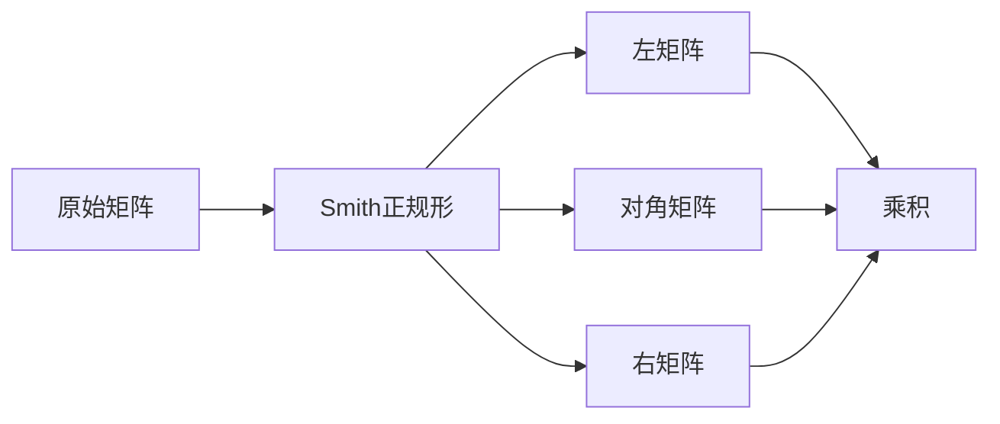

# 线性代数导引：M3(R)与M34(R)

## 1. 背景介绍

### 1.1 问题的由来

线性代数是数学的一个基础分支,在科学计算、工程分析、数据处理等诸多领域扮演着重要角色。其中,矩阵的研究是线性代数的核心内容之一。矩阵不仅能够表示线性变换,还能够紧凑地存储和处理大量数据,因此在计算机科学、机器学习等领域有着广泛的应用。

在线性代数中,我们通常研究实数域上的矩阵,即元素为实数的矩阵。然而,在某些情况下,我们需要研究更一般的矩阵,例如元素为多项式的矩阵。这种矩阵被称为多项式矩阵,它在控制理论、系统建模等领域有着重要应用。

### 1.2 研究现状

多项式矩阵的研究已经有了一定的历史,但仍然存在许多有趣且具有挑战性的问题。其中,M3(R)和M34(R)是两个重要的多项式矩阵环,它们分别表示3×3和3×4的多项式矩阵集合。

对于M3(R),已有学者研究了其结构性质、矩阵因式分解、矩阵范数等问题。然而,对于更一般的M34(R),研究工作相对较少,许多基本问题仍有待探索。

### 1.3 研究意义

深入研究M3(R)和M34(R)不仅具有理论意义,也有重要的应用价值。在控制理论中,多项式矩阵广泛用于建模和控制系统设计。研究M3(R)和M34(R)的性质有助于更好地理解和分析这些系统。

此外,多项式矩阵在编码理论、滤波器设计等领域也有应用。研究M3(R)和M34(R)的结构和性质,有助于设计更高效、更鲁棒的算法和系统。

### 1.4 本文结构

本文将深入探讨M3(R)和M34(R)的基本性质和相关算法。我们将首先介绍一些核心概念和背景知识,然后详细阐述相关算法的原理和实现细节。此外,我们还将讨论数学模型和公式,并通过实例进行说明和分析。最后,我们将探讨实际应用场景、工具和资源,并对未来的发展趋势和挑战进行展望。

## 2. 核心概念与联系

在深入讨论M3(R)和M34(R)之前,我们需要先介绍一些核心概念和背景知识。

首先,我们需要了解多项式环R[x]的定义和性质。R[x]表示所有实系数多项式的集合,它构成了一个交换环,即具有加法和乘法运算,并满足一些代数运算律。

```mermaid
graph TD
    A[多项式环 R[x]] --> B[加法运算]
    A --> C[乘法运算]
    B --> D[交换律]
    B --> E[结合律]
    C --> F[交换律]
    C --> G[结合律]
    C --> H[分配律]
```

接下来,我们需要了解矩阵环的概念。给定一个环R,我们可以构造n×m矩阵环Mn,m(R),其中每个元素都属于R。在本文中,我们主要关注M3(R)和M34(R),它们分别表示3×3和3×4的多项式矩阵集合。

```mermaid
graph TD
    A[矩阵环 Mn,m(R)] --> B[元素属于环 R]
    A --> C[n x m 矩阵]
    B --> D[实数域 R]
    B --> E[多项式环 R[x]]
    C --> F[M3(R)]
    C --> G[M34(R)]
```

M3(R)和M34(R)不仅继承了R[x]的代数结构,还具有一些额外的性质和运算。例如,我们可以定义矩阵的加法、乘法、逆矩阵等概念。此外,还可以研究它们的结构性质,如矩阵的秩、矩阵的因式分解等。

```mermaid
graph TD
    A[M3(R)和M34(R)] --> B[加法运算]
    A --> C[乘法运算]
    A --> D[逆矩阵]
    A --> E[矩阵秩]
    A --> F[矩阵因式分解]
```

M3(R)和M34(R)与其他矩阵环存在一些联系和区别。例如,它们与实数矩阵环M3(R)和M34(R)有一些相似之处,但又具有多项式环的特殊性质。此外,它们也与更一般的多项式矩阵环Mn,m(R[x])存在联系,但具有特殊的维数和结构。

通过对这些核心概念的理解,我们就可以更好地探索M3(R)和M34(R)的性质和算法。

## 3. 核心算法原理 & 具体操作步骤

### 3.1 算法原理概述

在研究M3(R)和M34(R)时,我们需要设计和实现一些核心算法,用于计算矩阵的各种性质和运算。这些算法的原理基于线性代数和多项式环的理论基础。

一个重要的算法是矩阵的因式分解。对于M3(R)和M34(R)中的矩阵,我们可以将其分解为一个左矩阵、一个对角矩阵和一个右矩阵的乘积,这被称为矩阵的Smith正规形。Smith正规形不仅具有理论意义,也在控制理论和编码理论等领域有重要应用。



另一个重要算法是计算矩阵的逆。在M3(R)和M34(R)中,我们可以使用类似于实数矩阵的方法计算矩阵的逆,但需要考虑多项式环的特殊性质。矩阵的逆在控制系统设计、线性方程组求解等领域有着广泛应用。


除了上述两个算法,我们还需要设计和实现其他算法,如矩阵的秩计算、矩阵的范数计算、矩阵的特征值计算等。这些算法都需要考虑M3(R)和M34(R)的特殊性质,并基于线性代数和多项式环的理论进行推导和优化。

### 3.2 算法步骤详解

接下来,我们将详细介绍两个核心算法的具体步骤和实现细节。

#### 3.2.1 矩阵的Smith正规形

计算矩阵的Smith正规形是一个重要的算法,它可以帮助我们更好地理解矩阵的结构和性质。对于M3(R)和M34(R)中的矩阵A,我们可以将其分解为一个左矩阵L、一个对角矩阵D和一个右矩阵R的乘积,即A = LDR。

具体步骤如下:

1. 计算矩阵A的行阶梯形(Row Echelon Form)。这可以通过对矩阵进行初等行变换实现,包括交换两行、将一行乘以一个非零常数、将一行加到另一行上等操作。

2. 对行阶梯形矩阵进行等价变换,得到其对应的Hermite标准形(Hermite Normal Form)。这可以通过对矩阵进行初等列变换实现,包括交换两列、将一列乘以一个非零常数、将一列加到另一列上等操作。

3. 从Hermite标准形中提取出对角矩阵D,其对角线元素就是Hermite标准形的非零行向量的首一元素。

4. 构造左矩阵L和右矩阵R,使得A = LDR成立。L和R分别由行变换和列变换的变换矩阵组成。

通过这些步骤,我们就可以得到矩阵A的Smith正规形分解。值得注意的是,在实现过程中,我们需要考虑多项式环的特殊性质,例如多项式的最大公因子计算、多项式的除法运算等。

#### 3.2.2 矩阵的逆

计算矩阵的逆是另一个重要的算法,它在线性方程组求解、控制系统设计等领域有着广泛应用。对于M3(R)和M34(R)中的矩阵A,我们可以使用类似于实数矩阵的方法计算其逆,但需要考虑多项式环的特殊性质。

具体步骤如下:

1. 计算矩阵A的行列式det(A)。在多项式环R[x]中,我们可以使用类似于实数域的方法计算行列式,但需要注意多项式的运算规则。

2. 检查det(A)是否为单位元(常数多项式1)。如果不是,则矩阵A没有逆矩阵。

3. 计算矩阵A的伴随矩阵adj(A)。伴随矩阵的每个元素都是A的代数余子式,它们也是多项式。

4. 计算A的逆矩阵A^(-1) = adj(A) / det(A)。这里的除法运算是多项式除法。

在实现过程中,我们需要注意多项式环中的一些特殊操作,例如多项式的最大公因子计算、多项式的除法运算等。此外,我们还需要设计高效的算法,以减少计算复杂度和提高运算速度。

### 3.3 算法优缺点

上述算法虽然能够解决M3(R)和M34(R)中矩阵的一些基本问题,但也存在一些优缺点。

优点:

- 算法基于线性代数和多项式环的理论基础,具有较强的理论支撑。
- 算法可以有效计算矩阵的各种性质和运算,如因式分解、逆矩阵等。
- 算法可以应用于控制理论、编码理论等多个领域,具有广泛的应用价值。

缺点:

- 算法的计算复杂度较高,特别是对于高阶多项式矩阵,计算量会急剧增加。
- 算法需要考虑多项式环的特殊性质,实现过程相对复杂。
- 对于一些特殊情况,算法可能会失效或产生不稳定的结果。

因此,在实际应用中,我们需要根据具体问题的特点选择合适的算法,并进行优化和改进,以提高计算效率和结果的稳定性。

### 3.4 算法应用领域

M3(R)和M34(R)中矩阵的相关算法在多个领域都有重要应用,包括但不限于以下几个方面:

1. **控制理论**:在控制系统的建模和设计中,多项式矩阵广泛用于表示系统的传递函数和状态空间模型。矩阵的因式分解和逆矩阵计算对于系统的分析和控制器设计至关重要。

2. **编码理论**:在线性编码领域,多项式矩阵常用于构造编码矩阵和校验矩阵。矩阵的秩和因式分解对于设计高效的编码方案和解码算法具有重要意义。

3. **滤波器设计**:在数字信号处理中,多项式矩阵可以用于表示数字滤波器的系统函数。矩阵的因式分解和逆矩阵计算对于滤波器的设计和实现至关重要。

4. **数值线性代数**:M3(R)和M34(R)中的算法也可以应用于数值线性代数的一些问题,如线性方程组求解、矩阵分解等。这些算法可以为数值计算提供理论基础和实现方法。

5. **符号计算**:多项式矩阵的相关算法也在符号计算领域有着广泛应用,例如在计算机代数系统中进行符号运算和简化。

总的来说,M3(R)和M34(R)中矩阵的相关算法具有广泛的应用前景,对于多个领域的理论研究和实际问题都有重要意义。

## 4. 数学模型和公式 & 详细讲解 & 举例说明

### 4.1 数学模型构建

在研究M3(R)和M34(R)时,我们需要