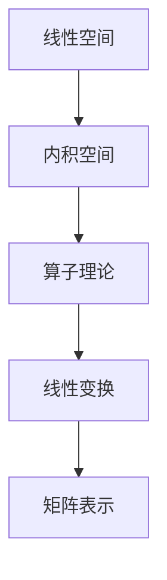

# 线性代数导引：内积空间算子理论

## 1. 背景介绍

### 1.1 问题的由来

线性代数是数学的一个基础分支,也是现代数学的核心内容之一。它在物理、工程、经济等诸多领域有着广泛的应用。随着科学技术的不断发展,线性代数在人工智能、机器学习、计算机图形学等新兴领域也扮演着越来越重要的角色。

内积空间是线性代数中一个非常重要的概念,它为线性空间引入了几何概念,使得线性空间具有了几何意义。内积空间中的算子理论则是对线性变换的深入研究,它为线性变换提供了一种新的视角,使得我们能够更好地理解和操作线性变换。

### 1.2 研究现状

内积空间和算子理论是线性代数中最重要的两个分支,也是最具挑战性的部分。由于其抽象性强,概念较为复杂,因此对初学者来说,掌握这两个部分往往是一个巨大的挑战。

目前,已有大量的线性代数教材和参考书籍,但大多数都是以传统的方式介绍这些概念,缺乏直观的解释和生动的例子。此外,这些教材往往侧重于理论推导,而忽视了实际应用,使得学习者难以将所学知识应用到实践中。

### 1.3 研究意义

掌握内积空间和算子理论对于学习线性代数乃至更高阶数学有着极其重要的意义。它们不仅是线性代数的核心内容,也为后续学习抽象代数、泛函分析等高深课程奠定了坚实的基础。

此外,内积空间和算子理论在实际应用中也扮演着重要角色。例如,在量子力学中,算子被用于描述物理量的测量;在信号处理中,算子被用于滤波和变换;在机器学习中,算子被用于特征提取和降维等。因此,掌握这些概念不仅有助于加深对线性代数的理解,也为将来的学习和工作打下坚实的基础。

### 1.4 本文结构

本文将从内积空间和算子理论的基本概念出发,循序渐进地介绍它们的核心内容。我们将首先介绍内积空间的定义和性质,然后探讨算子的概念及其在内积空间中的作用。接下来,我们将详细阐述算子的性质、分类和运算,并介绍一些重要的算子,如投影算子、正交算子和幺正算子。

在理论部分之后,我们将通过具体的例子和应用场景,帮助读者加深对这些概念的理解。最后,我们将总结本文的主要内容,并对未来的发展方向和挑战进行探讨。

## 2. 核心概念与联系

内积空间和算子理论是线性代数中两个密切相关的核心概念。内积空间为线性空间引入了几何概念,使得线性空间具有了几何意义。算子则是对线性变换的深入研究,它为线性变换提供了一种新的视角,使得我们能够更好地理解和操作线性变换。

内积空间和算子理论之间存在着密切的联系。一方面,算子是定义在内积空间上的线性变换,它们的性质和运算都依赖于内积空间的结构。另一方面,内积空间中的许多重要概念,如正交性、投影等,都与算子理论密切相关。

下面是一个简单的Mermaid流程图,展示了内积空间和算子理论之间的关系:

在这个流程图中,我们可以看到线性空间是内积空间的基础,内积空间为算子理论提供了必要的结构,算子理论则研究线性变换在内积空间中的表现。最终,线性变换可以用矩阵来表示,从而将抽象的概念与具体的计算联系起来。

通过学习内积空间和算子理论,我们不仅能够加深对线性代数的理解,也为后续学习更高阶的数学课程打下坚实的基础。

## 3. 核心算法原理 & 具体操作步骤

### 3.1 算法原理概述

在介绍算子理论的具体算法之前,我们先来了解一下算子的基本概念。

算子(Operator)是定义在向量空间上的一种函数或变换,它将向量空间中的向量映射到另一个向量。在内积空间中,算子是一种特殊的线性变换,它保留了内积空间的结构。

算子理论的核心思想是将线性变换视为一种算子,并研究这些算子的性质和运算。通过研究算子的性质,我们可以更好地理解和操作线性变换。

算子理论中有许多重要的算法,如求算子的特征值和特征向量、计算算子的矩阵表示、求算子的逆等。这些算法都基于一些基本的原理和操作步骤。

### 3.2 算法步骤详解

下面我们将详细介绍一些算子理论中常见的算法步骤:

#### 1. 求算子的特征值和特征向量

对于一个算子 $A$,如果存在一个非零向量 $\vec{x}$ 和一个标量 $\lambda$,使得 $A\vec{x} = \lambda\vec{x}$,那么 $\lambda$ 就被称为 $A$ 的一个特征值,而 $\vec{x}$ 就是对应于 $\lambda$ 的特征向量。

求算子的特征值和特征向量的步骤如下:

1. 构造方程 $A\vec{x} = \lambda\vec{x}$
2. 将算子 $A$ 表示为矩阵 $[A]$
3. 对方程两边同时做线性变换 $[A] - \lambda[I]$,得到 $([A] - \lambda[I])\vec{x} = \vec{0}$
4. 求解方程 $([A] - \lambda[I])\vec{x} = \vec{0}$ 的非零解 $\vec{x}$,对应的 $\lambda$ 即为特征值,而 $\vec{x}$ 即为对应的特征向量。

#### 2. 计算算子的矩阵表示

在有限维内积空间中,任何一个算子都可以用矩阵来表示。计算算子的矩阵表示的步骤如下:

1. 选择一个基底 $\{\vec{e_1}, \vec{e_2}, \dots, \vec{e_n}\}$
2. 对每个基向量 $\vec{e_i}$,计算 $A\vec{e_i}$
3. 将 $A\vec{e_i}$ 在选定基底下的坐标作为矩阵 $[A]$ 的第 $i$ 列
4. 得到的矩阵 $[A]$ 即为算子 $A$ 在选定基底下的矩阵表示。

#### 3. 求算子的逆

如果一个算子 $A$ 是可逆的,那么就存在另一个算子 $B$,使得 $AB = BA = I$,其中 $I$ 是恒等算子。这个算子 $B$ 就被称为 $A$ 的逆算子,记作 $A^{-1}$。

求算子的逆的步骤如下:

1. 计算算子 $A$ 的矩阵表示 $[A]$
2. 检查 $[A]$ 是否可逆,即判断 $\det([A]) \neq 0$
3. 如果 $[A]$ 可逆,计算 $[A]^{-1}$
4. 将 $[A]^{-1}$ 转换回算子形式,即得到 $A^{-1}$。

### 3.3 算法优缺点

算子理论中的算法具有以下优点:

1. 提供了一种抽象的视角,使我们能够更好地理解和操作线性变换。
2. 算法步骤清晰,易于实现和计算。
3. 算法结果具有几何意义,有助于直观理解。

但同时,这些算法也存在一些缺点:

1. 对于无限维内积空间,算法可能变得复杂或无法直接应用。
2. 算法的计算复杂度随着维数的增加而快速上升。
3. 某些算法步骤可能需要进行矩阵运算,计算量较大。

### 3.4 算法应用领域

算子理论中的算法在许多领域都有广泛的应用,例如:

1. **量子力学**: 算子被用于描述物理量的测量和演化。
2. **信号处理**: 算子被用于滤波、变换和压缩等操作。
3. **机器学习**: 算子被用于特征提取、降维和核方法等。
4. **数值分析**: 算子被用于求解微分方程和特征值问题。
5. **控制理论**: 算子被用于系统建模和控制器设计。

总的来说,算子理论为我们提供了一种强大的工具,帮助我们更好地理解和操作线性变换,并在许多领域发挥着重要作用。

## 4. 数学模型和公式 & 详细讲解 & 举例说明

### 4.1 数学模型构建

在介绍内积空间和算子理论的数学模型之前,我们先回顾一下线性空间的概念。

线性空间是一个代数结构,它由一个非空集合 $V$ 和两个运算(加法和数乘)组成,满足以下八个公理:

1. 加法交换律: $\vec{u} + \vec{v} = \vec{v} + \vec{u}$
2. 加法结合律: $(\vec{u} + \vec{v}) + \vec{w} = \vec{u} + (\vec{v} + \vec{w})$
3. 存在加法单位元: 存在一个元素 $\vec{0}$,对任意 $\vec{v} \in V$,有 $\vec{v} + \vec{0} = \vec{v}$
4. 存在加法逆元: 对任意 $\vec{v} \in V$,存在 $-\vec{v} \in V$,使得 $\vec{v} + (-\vec{v}) = \vec{0}$
5. 数乘存在: 对任意 $\vec{v} \in V$ 和任意标量 $\alpha$,存在 $\alpha\vec{v} \in V$
6. 数乘结合律: $(\alpha\beta)\vec{v} = \alpha(\beta\vec{v})$
7. 数乘分配律: $\alpha(\vec{u} + \vec{v}) = \alpha\vec{u} + \alpha\vec{v}$
8. 存在数乘单位元: 对任意 $\vec{v} \in V$,有 $1\vec{v} = \vec{v}$

内积空间是在线性空间的基础上,引入了内积这一新的运算,从而使线性空间具有了几何意义。

设 $V$ 是一个线性空间,如果在 $V$ 上存在一个函数 $\langle \cdot, \cdot \rangle: V \times V \rightarrow \mathbb{F}$,对任意 $\vec{u}, \vec{v}, \vec{w} \in V$ 和任意标量 $\alpha, \beta \in \mathbb{F}$,满足以下四个公理:

1. 对称性: $\langle \vec{u}, \vec{v} \rangle = \langle \vec{v}, \vec{u} \rangle$
2. 线性性: $\langle \alpha\vec{u} + \beta\vec{v}, \vec{w} \rangle = \alpha\langle \vec{u}, \vec{w} \rangle + \beta\langle \vec{v}, \vec{w} \rangle$
3. 正定性: $\langle \vec{v}, \vec{v} \rangle \geq 0$,且当且仅当 $\vec{v} = \vec{0}$ 时,等号成立
4. 非退化性: 对任意非零向量 $\vec{v} \in V$,存在 $\vec{u} \in V$,使得 $\langle \vec{u}, \vec{v} \rangle \neq 0$

那么,我们就称 $(V, \langle \cdot, \cdot \rangle)$ 为一个内积空间。

在内积空间中,我们可以定义算子(Operator)的概念。设 $V$ 和 $W$ 是两个线性空间,如果存在一个函数 $T: V \rightarrow W$,对任意 $\vec{u}, \vec{v} \in V$ 和任意标量 $\alpha, \beta \in \mathbb{F}$,满足:

1. $T(\alpha\vec{u} + \beta\vec{v}) = \alpha T(\vec{u}) + \beta T(\vec{v})$

那么,我们就称 $T$ 为一个线性变换