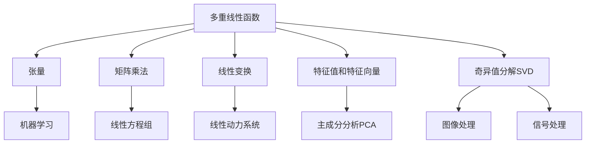

# 线性代数导引：多重线性函数

## 1. 背景介绍

### 1.1 问题的由来

在现代数学和科学计算领域中,线性代数扮演着至关重要的角色。作为数学的一个基础分支,线性代数为许多高级数学概念和应用奠定了基础。其中,多重线性函数(multilinear functions)是线性代数中一个核心概念,广泛应用于多个领域,包括机器学习、信号处理、控制理论等。

多重线性函数可以看作是一种特殊的张量(tensor)运算,它将多个向量作为输入,并产生一个标量作为输出。这种函数具有许多有趣和重要的性质,例如它们对于每个输入向量都是线性的,并且满足某些对称性和不变性。

### 1.2 研究现状

多重线性函数的研究可以追溯到19世纪,当时数学家们开始探索多元函数的性质和应用。然而,直到20世纪初,张量代数和多重线性函数的理论才开始真正发展。著名数学家如格拉斯曼(Grassmann)、利维(Levi-Civita)和爱因斯坦(Einstein)都做出了重要贡献。

近年来,随着机器学习、深度学习和人工智能的兴起,多重线性函数在这些领域中发挥了关键作用。例如,在神经网络中,多重线性函数被用于表示层与层之间的权重连接。此外,它们也在信号处理、图像处理和计算机视觉等领域中有广泛应用。

### 1.3 研究意义

研究多重线性函数具有重要的理论和实际意义。从理论角度来看,多重线性函数提供了一种有效的方式来研究张量的性质和运算,这对于发展更高级的数学理论至关重要。

从实际应用的角度来看,多重线性函数在许多领域中扮演着关键角色。例如,在机器学习中,它们用于构建神经网络模型;在信号处理中,它们可用于滤波和变换;在计算机图形学中,它们可用于建模和渲染。因此,深入理解多重线性函数的性质和计算方法对于解决实际问题至关重要。

### 1.4 本文结构

本文将全面探讨多重线性函数的理论基础和实际应用。我们将从基本定义和性质开始,然后介绍多重线性函数的数学表示和计算方法。接下来,我们将深入探讨多重线性函数在机器学习、信号处理和计算机图形学等领域的应用。最后,我们将总结未来的研究方向和挑战。

## 2. 核心概念与联系

多重线性函数是线性代数中一个核心概念,它与许多其他重要概念密切相关。在这一部分,我们将探讨多重线性函数与其他线性代数概念之间的联系,以及它们在不同领域中的应用。

如上图所示,多重线性函数与张量、矩阵乘法、线性变换、特征值和特征向量、奇异值分解等概念密切相关。这些概念在不同领域中有着广泛的应用,例如:

- 张量在机器学习中用于表示高维数据和构建深度神经网络。
- 矩阵乘法在线性方程组的求解中扮演着重要角色。
- 线性变换在线性动力系统的建模和分析中非常关键。
- 特征值和特征向量在主成分分析(PCA)中用于降维和数据可视化。
- 奇异值分解(SVD)在图像处理和信号处理中有着广泛的应用,如图像压缩和噪声去除。

通过深入理解多重线性函数与这些概念之间的联系,我们可以更好地把握线性代数的本质,并将其应用于实际问题的解决。

## 3. 核心算法原理与具体操作步骤

在这一部分,我们将详细探讨多重线性函数的核心算法原理和具体操作步骤。我们将从算法原理概述开始,然后深入讨论算法的每一个步骤,包括输入、处理和输出。最后,我们将分析算法的优缺点以及应用领域。

### 3.1 算法原理概述

多重线性函数的核心算法原理可以概括为:将多个向量作为输入,并通过一系列线性运算得到一个标量输出。具体来说,该算法包括以下几个关键步骤:

1. 输入:接收 $n$ 个向量 $\vec{x}_1, \vec{x}_2, \ldots, \vec{x}_n$,每个向量的维度分别为 $m_1, m_2, \ldots, m_n$。
2. 张量构造:根据输入向量的维度,构造一个 $m_1 \times m_2 \times \cdots \times m_n$ 维的张量 $\mathcal{T}$。
3. 张量运算:将输入向量与张量 $\mathcal{T}$ 进行张量乘积运算,得到一个标量结果。

该算法的核心在于张量运算步骤,它将多个向量与一个高维张量进行运算,从而实现了对多个输入的线性组合。通过合理设计张量 $\mathcal{T}$ 的元素值,我们可以实现各种不同的多重线性函数。

### 3.2 算法步骤详解

接下来,我们将详细解释多重线性函数算法的每一个步骤。

#### 步骤1:输入向量

算法的输入是 $n$ 个向量 $\vec{x}_1, \vec{x}_2, \ldots, \vec{x}_n$,其中第 $i$ 个向量 $\vec{x}_i$ 的维度为 $m_i$。这些向量可以表示任何类型的数据,如图像像素、音频信号或机器学习特征等。

#### 步骤2:张量构造

根据输入向量的维度,我们构造一个 $m_1 \times m_2 \times \cdots \times m_n$ 维的张量 $\mathcal{T}$。该张量的每个元素 $\mathcal{T}_{i_1, i_2, \ldots, i_n}$ 对应于一个权重值,用于线性组合输入向量的不同分量。

张量 $\mathcal{T}$ 的构造方式取决于具体的应用场景和需求。例如,在机器学习中,我们可以通过训练数据来学习张量的元素值;而在信号处理中,张量的元素可能由已知的滤波器系数确定。

#### 步骤3:张量运算

该步骤是算法的核心,它将输入向量与张量 $\mathcal{T}$ 进行张量乘积运算,得到一个标量结果。具体来说,该运算可以表示为:

$$
f(\vec{x}_1, \vec{x}_2, \ldots, \vec{x}_n) = \sum_{i_1=1}^{m_1} \sum_{i_2=1}^{m_2} \cdots \sum_{i_n=1}^{m_n} \mathcal{T}_{i_1, i_2, \ldots, i_n} \cdot x_{1, i_1} \cdot x_{2, i_2} \cdots x_{n, i_n}
$$

其中 $x_{j, i_j}$ 表示第 $j$ 个输入向量 $\vec{x}_j$ 的第 $i_j$ 个分量。

该运算实现了对多个输入向量的线性组合,并且每个输入向量的每个分量都参与了运算,从而满足了多重线性函数的定义。通过调整张量 $\mathcal{T}$ 的元素值,我们可以实现各种不同的多重线性函数。

### 3.3 算法优缺点

多重线性函数算法具有以下优点:

1. **通用性强**:该算法可以处理任意数量和维度的输入向量,并实现各种不同的多重线性函数。
2. **高效计算**:由于算法的核心是张量运算,因此可以利用现代硬件(如GPU)加速计算,提高效率。
3. **可解释性好**:算法的每一步都有明确的数学解释,易于理解和分析。

然而,该算法也存在一些缺点:

1. **存储开销大**:当输入向量维度较高时,构造的张量维度也会变大,导致存储开销增加。
2. **参数多**:张量的元素数量随着输入向量维度的增加而指数级增长,导致参数数量庞大,增加了模型复杂性。
3. **缺乏自适应能力**:算法本身是固定的,无法自适应输入数据的变化,需要手动调整张量参数。

### 3.4 算法应用领域

多重线性函数算法在许多领域都有广泛的应用,包括但不限于:

1. **机器学习**:在神经网络中,多重线性函数用于表示层与层之间的权重连接。
2. **信号处理**:多重线性函数可用于构建各种滤波器和变换,如小波变换等。
3. **计算机图形学**:多重线性函数在光线追踪、曲面建模等领域有应用。
4. **量子计算**:多重线性函数在量子态的表示和操作中扮演着重要角色。
5. **代数拓扑学**:多重线性函数在研究高维拓扑空间的不变量时有应用。

总的来说,多重线性函数算法为处理多输入数据提供了一种通用而有效的方法,在许多领域都有着广泛的应用前景。

## 4. 数学模型和公式详细讲解与举例说明

在上一部分,我们介绍了多重线性函数算法的核心原理和步骤。在这一部分,我们将深入探讨多重线性函数的数学模型和公式,并通过具体案例进行详细讲解和举例说明。

### 4.1 数学模型构建

多重线性函数的数学模型可以形式化地表示为:

设有 $n$ 个向量 $\vec{x}_1, \vec{x}_2, \ldots, \vec{x}_n$,其维度分别为 $m_1, m_2, \ldots, m_n$。我们定义一个 $m_1 \times m_2 \times \cdots \times m_n$ 维的张量 $\mathcal{T}$,则多重线性函数 $f$ 可以表示为:

$$
f(\vec{x}_1, \vec{x}_2, \ldots, \vec{x}_n) = \sum_{i_1=1}^{m_1} \sum_{i_2=1}^{m_2} \cdots \sum_{i_n=1}^{m_n} \mathcal{T}_{i_1, i_2, \ldots, i_n} \cdot x_{1, i_1} \cdot x_{2, i_2} \cdots x_{n, i_n}
$$

其中 $x_{j, i_j}$ 表示第 $j$ 个输入向量 $\vec{x}_j$ 的第 $i_j$ 个分量。

这个模型表明,多重线性函数是将多个输入向量的每个分量进行线性组合,并由张量 $\mathcal{T}$ 的元素值确定组合的权重。通过调整张量 $\mathcal{T}$ 的元素值,我们可以实现各种不同的多重线性函数。

### 4.2 公式推导过程

接下来,我们将推导多重线性函数的公式,并解释其中的每一步骤。

首先,我们定义一个 $n$ 重求和符号:

$$
\sum_{i_1, i_2, \ldots, i_n} = \sum_{i_1=1}^{m_1} \sum_{i_2=1}^{m_2} \cdots \sum_{i_n=1}^{m_n}
$$

则多重线性函数可以简洁地表示为:

$$
f(\vec{x}_1, \vec{x}_2, \ldots, \vec{x}_n) = \sum_{i_1, i_2, \ldots, i_n} \mathcal{T}_{i_1, i_2, \ldots, i_n} \cdot x_{1, i_1} \cdot x_{2, i_2} \cdots x_{n, i_n}
$$

接下来,我们将推导多重线性函数的一些基本性质。

**线性性质**:对于任意标量 $\alpha_1, \alpha_2