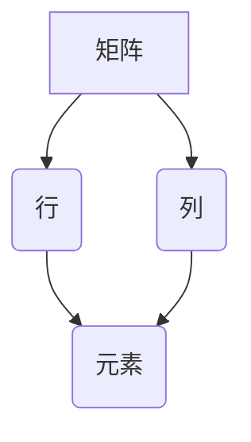

## 1. 背景介绍
### 1.1  问题的由来
在现代计算机科学领域，数据处理和分析是核心任务之一。无论是图像识别、自然语言处理，还是机器学习等领域，都离不开对大量数据的有效处理和分析。而线性代数作为一种强大的数学工具，为数据处理提供了坚实的基础。

矩阵作为线性代数的核心概念，能够高效地表示和操作向量、线性变换等，在计算机科学中有着广泛的应用。例如，在图像处理中，矩阵可以用来表示图像像素的灰度值，并通过矩阵运算实现图像的旋转、缩放、滤波等操作；在机器学习中，矩阵可以用来表示训练数据和模型参数，并通过矩阵运算实现模型的训练和预测。

然而，对于初学者来说，学习线性代数的矩阵运算可能显得比较抽象和困难。因此，我们需要找到一种通俗易懂、易于理解的方法来讲解矩阵运算，并将其与实际应用场景相结合，帮助读者更好地理解和掌握矩阵的应用。

### 1.2  研究现状
目前，关于线性代数的教材和书籍已经非常丰富，但大多数教材都侧重于理论讲解，缺乏对实际应用场景的深入探讨。一些在线课程和教程虽然能够提供一些代码实例，但往往缺乏对算法原理和数学模型的深入解释。

### 1.3  研究意义
本篇文章旨在通过对标准计算矩阵的讲解，帮助读者理解矩阵运算的基本原理，并将其应用于实际的计算机科学问题。通过结合代码实例和应用场景，使读者能够更好地掌握矩阵运算的技巧和方法，从而提高数据处理和分析的能力。

### 1.4  本文结构
本文将从以下几个方面进行讲解：

1. 矩阵的基本概念和运算规则
2. 标准计算矩阵的算法原理和步骤
3. 矩阵运算的数学模型和公式
4. 矩阵运算的代码实现和应用场景
5. 矩阵运算的工具和资源推荐

## 2. 核心概念与联系
### 2.1  矩阵的概念
矩阵是一种用于表示和处理数据的多维数组。它由若干行和若干列组成，每个元素都对应于一个具体的数值。



### 2.2  矩阵的运算
矩阵之间可以进行多种运算，包括加法、减法、乘法、转置等。

* **加法和减法:** 两个矩阵的加法和减法，需要满足相同的大小，对应位置的元素相加或相减。
* **乘法:** 矩阵的乘法规则比较复杂，需要满足一定的条件，例如第一个矩阵的列数必须等于第二个矩阵的行数。

### 2.3  矩阵的应用
矩阵在计算机科学中有着广泛的应用，例如：

* **图像处理:** 矩阵可以用来表示图像像素的灰度值，并通过矩阵运算实现图像的旋转、缩放、滤波等操作。
* **机器学习:** 矩阵可以用来表示训练数据和模型参数，并通过矩阵运算实现模型的训练和预测。
* **数据分析:** 矩阵可以用来表示数据之间的关系，并通过矩阵运算进行数据分析和挖掘。

## 3. 核心算法原理 & 具体操作步骤
### 3.1  算法原理概述
标准计算矩阵是指利用矩阵运算来解决特定问题的算法。这些算法通常基于矩阵的性质和运算规则，通过一系列的矩阵操作来实现目标。

例如，求解线性方程组可以使用高斯消元法，该算法通过一系列的矩阵变换来将系数矩阵转化为阶梯形矩阵，从而求解未知数。

### 3.2  算法步骤详解
标准计算矩阵的具体操作步骤取决于具体的算法和问题。但一般来说，以下是一些常见的步骤：

1. **将问题转化为矩阵形式:** 将问题转化为矩阵方程或矩阵不等式。
2. **选择合适的算法:** 根据问题的性质和要求，选择合适的矩阵算法。
3. **执行算法步骤:** 根据算法的步骤，对矩阵进行一系列的运算。
4. **输出结果:** 将计算结果转化为问题的答案。

### 3.3  算法优缺点
标准计算矩阵的算法通常具有以下优点：

* **效率高:** 矩阵运算可以利用计算机的并行处理能力，提高计算效率。
* **通用性强:** 许多矩阵算法可以应用于不同的问题，具有较强的通用性。
* **可扩展性好:** 矩阵算法可以很容易地扩展到处理更大的数据规模。

然而，标准计算矩阵的算法也存在一些缺点：

* **复杂度高:** 一些矩阵算法的复杂度较高，对于大型矩阵可能需要很长时间才能计算完成。
* **内存占用大:** 矩阵运算需要存储大量的矩阵数据，可能会占用较大的内存空间。

### 3.4  算法应用领域
标准计算矩阵的算法广泛应用于以下领域：

* **计算机图形学:** 用于图像渲染、物体变换等。
* **机器学习:** 用于模型训练、特征提取等。
* **数据科学:** 用于数据分析、模式识别等。
* **科学计算:** 用于求解物理、化学等领域的方程。

## 4. 数学模型和公式 & 详细讲解 & 举例说明
### 4.1  数学模型构建
标准计算矩阵的数学模型通常基于线性代数的理论，例如向量空间、线性变换、矩阵分解等。

例如，高斯消元法可以看作是一种线性变换，通过一系列的矩阵变换来将系数矩阵转化为阶梯形矩阵。

### 4.2  公式推导过程
标准计算矩阵的算法通常涉及到一些数学公式的推导，例如矩阵乘法、逆矩阵、特征值等。

例如，矩阵的逆矩阵可以通过求解一个线性方程组来得到，该方程组的系数矩阵是原矩阵和一个单位矩阵的乘积。

### 4.3  案例分析与讲解
我们可以通过一些具体的案例来分析和讲解标准计算矩阵的算法原理和应用。

例如，我们可以使用高斯消元法来求解一个线性方程组，并通过代码实现该算法，并分析其运行时间和内存占用。

### 4.4  常见问题解答
在学习和使用标准计算矩阵的算法时，可能会遇到一些常见的问题，例如：

* 如何选择合适的算法？
* 如何理解算法的原理？
* 如何调试算法的代码？

## 5. 项目实践：代码实例和详细解释说明
### 5.1  开发环境搭建
为了实现标准计算矩阵的算法，我们需要搭建一个合适的开发环境。

例如，我们可以使用Python语言和NumPy库来实现矩阵运算。

### 5.2  源代码详细实现
以下是一个使用Python语言和NumPy库实现高斯消元法的代码实例：

```python
import numpy as np

def gaussian_elimination(A, b):
    n = len(A)
    # 将系数矩阵和常数向量合并
    Ab = np.hstack((A, b.reshape(-1, 1)))
    # 进行高斯消元法
    for i in range(n):
        # 找到主元
        pivot = Ab[i, i]
        # 将主元归一化
        Ab[i, :] /= pivot
        # 消元
        for j in range(i + 1, n):
            factor = Ab[j, i]
            Ab[j, :] -= factor * Ab[i, :]
    # 解出未知数
    x = Ab[:, -1]
    return x

# 示例
A = np.array([[2, 1, 1], [1, -1, 2], [3, 1, 1]])
b = np.array([8, 1, 11])
x = gaussian_elimination(A, b)
print(f"解向量: {x}")
```

### 5.3  代码解读与分析
这段代码首先将系数矩阵和常数向量合并成一个新的矩阵，然后进行高斯消元法。

高斯消元法通过一系列的矩阵变换来将系数矩阵转化为阶梯形矩阵，从而求解未知数。

### 5.4  运行结果展示
运行这段代码后，会输出解向量，即线性方程组的解。

## 6. 实际应用场景
### 6.1  图像处理
在图像处理中，矩阵可以用来表示图像像素的灰度值，并通过矩阵运算实现图像的旋转、缩放、滤波等操作。

例如，可以使用矩阵来实现图像的旋转操作，将图像旋转一定的角度。

### 6.2  机器学习
在机器学习中，矩阵可以用来表示训练数据和模型参数，并通过矩阵运算实现模型的训练和预测。

例如，可以使用矩阵来实现线性回归模型的训练，将训练数据和模型参数表示为矩阵，并通过矩阵运算来求解模型参数。

### 6.3  数据分析
在数据分析中，矩阵可以用来表示数据之间的关系，并通过矩阵运算进行数据分析和挖掘。

例如，可以使用矩阵来进行主成分分析，将高维数据降维到低维空间，从而更容易地进行分析和理解。

### 6.4  未来应用展望
随着计算机科学的发展，矩阵运算在未来将会有更广泛的应用。例如，在人工智能、量子计算等领域，矩阵运算将发挥越来越重要的作用。

## 7. 工具和资源推荐
### 7.1  学习资源推荐
* **书籍:**
    * 《线性代数及其应用》
    * 《矩阵分析》
* **在线课程:**
    * Coursera 上的线性代数课程
    * edX 上的线性代数课程

### 7.2  开发工具推荐
* **Python:** 
    * NumPy 库
    * SciPy 库
* **MATLAB:** 
    * MATLAB 的矩阵运算函数

### 7.3  相关论文推荐
* **高斯消元法:**
    * Gaussian elimination - Wikipedia
* **矩阵分解:**
    * Matrix factorization - Wikipedia

### 7.4  其他资源推荐
* **在线矩阵计算工具:**
    * Wolfram Alpha
    * Matrix Calculator

## 8. 总结：未来发展趋势与挑战
### 8.1  研究成果总结
本篇文章介绍了标准计算矩阵的算法原理、具体操作步骤、数学模型和公式，并通过代码实例和应用场景进行了讲解。

### 8.2  未来发展趋势
未来，标准计算矩阵的算法将朝着以下方向发展：

* **更高效的算法:** 研究更高效的矩阵算法，例如并行计算、量子计算等。
* **更广泛的应用:** 将标准计算矩阵的算法应用于更多领域，例如人工智能、量子计算等。
* **更智能的算法:** 研究能够自动选择最佳算法和参数的智能算法。

### 8.3  面临的挑战
标准计算矩阵的算法也面临一些挑战：

* **大规模矩阵计算:** 如何高效地处理大规模矩阵数据。
* **算法复杂度:** 如何降低算法的复杂度，提高计算效率。
* **算法可解释性:** 如何提高算法的可解释性，使其更容易被理解和应用。

### 8.4  研究展望
未来，我们将继续研究标准计算矩阵的算法，探索其更广泛的应用，并解决其面临的挑战。


## 9. 附录：常见问题与解答
### 9.1  Q1: 如何选择合适的矩阵算法？
### 9.2  A1: 选择合适的矩阵算法需要根据具体的问题和数据特点来决定。例如，对于求解线性方程组，高斯消元法是一个常用的算法；对于矩阵分解，奇异值分解是一个常用的算法。

### 9.3  Q2: 如何理解矩阵算法的原理？
### 9.4  A2: 理解矩阵算法的原理需要掌握相关的线性代数知识，例如向量空间、线性变换、矩阵分解等。可以通过阅读相关书籍和论文，以及通过代码实现和分析来加深理解。

### 9.5  Q3: 如何调试矩阵算法的代码？
### 9.6  A3: 调试矩阵算法的代码需要仔细检查代码逻辑，并使用调试工具进行跟踪和分析。可以打印出中间变量的值，观察算法的执行过程，找出错误的原因。


作者：禅与计算机程序设计艺术 / Zen and the Art of Computer Programming 
<end_of_turn>