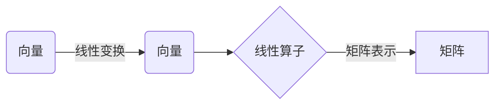

# 线性代数导引：线性算子

关键词：线性代数、线性算子、特征值、特征向量、矩阵、线性变换

## 1. 背景介绍
### 1.1  问题的由来
线性代数是数学的一个重要分支,在科学、工程和计算机科学等领域有着广泛的应用。作为线性代数的核心概念之一,线性算子在理论研究和实际应用中都占据着重要地位。深入理解线性算子的性质和应用,对于我们掌握线性代数乃至解决实际问题都具有重要意义。

### 1.2  研究现状
目前,关于线性算子的研究已经取得了丰硕的成果。从线性算子的基本概念和性质,到它在各个领域的应用,都有大量的文献进行了深入探讨。特别是在量子力学、图像处理、机器学习等前沿领域,线性算子扮演着不可或缺的角色。然而,对于初学者来说,线性算子的概念和理论仍然显得有些抽象和难以理解,亟需一种更加直观和易懂的方式来阐释线性算子的内涵。

### 1.3  研究意义
本文将从线性算子的基本概念出发,系统阐述线性算子的性质、特征值和特征向量等重要概念,并通过具体的例子和代码实现,帮助读者深入理解线性算子的原理和应用。同时,本文还将探讨线性算子在一些前沿领域的最新进展,展望线性算子理论的未来发展趋势和面临的挑战。通过本文的学习,读者将能够更加全面和深入地掌握线性算子的相关知识,并将其应用到实际问题的解决中去。

### 1.4  本文结构
本文将分为以下几个部分：第一部分介绍线性算子的背景知识；第二部分阐述线性算子的核心概念；第三部分讲解线性算子的核心算法原理和步骤；第四部分从数学角度对线性算子的模型和公式进行推导和证明；第五部分通过代码实例演示线性算子的具体实现；第六部分探讨线性算子的实际应用场景；第七部分推荐线性算子的相关工具和资源；第八部分对全文进行总结,并展望线性算子的未来发展趋势和挑战；第九部分为文章的附录,列举了一些常见问题及其解答。

## 2. 核心概念与联系
在正式介绍线性算子之前,我们首先需要明确一些前提概念。线性算子建立在线性空间的基础之上,所以掌握线性空间的概念是学习线性算子的前提。

线性空间是由一组对象(向量)以及定义在这组对象上的两种运算(加法和数乘)组成的数学结构。向量空间中的元素称为向量,它们之间可以进行加法和数乘运算,并满足一些特定的运算律。

有了向量空间的概念,我们就可以引入线性算子的定义了。线性算子是一种将一个向量空间映射到另一个向量空间的映射,它满足加法和数乘的运算律。从直观上来理解,线性算子就是一种保持向量之间线性关系的变换。

我们通常用大写字母(如A、B、T等)来表示线性算子。对于线性算子A,如果对于任意向量x和y,以及任意标量a和b,都有:
$$
A(ax+by) = aA(x) + bA(y)
$$
则称A是一个线性算子。

线性算子还有一些重要的特殊类型,例如:

1. 恒等算子:将向量映射为其自身的线性算子,记为I。
2. 零算子:将所有向量都映射为零向量的线性算子,记为0。 
3. 投影算子:将向量映射到某个子空间上的线性算子。
4. 旋转算子:表示向量在空间中旋转的线性算子。

线性算子还有一个重要的性质,就是它和矩阵之间有着密切的联系。事实上,对于有限维线性空间,我们可以用矩阵来表示线性算子。一个n×n的矩阵就对应着一个n维线性空间上的线性算子。矩阵和线性算子之间可以相互转化,这为研究线性算子提供了很大的便利。

总的来说,线性算子是线性代数中的一个核心概念,它联系着向量空间、线性变换、矩阵等诸多概念,在理论和应用上都有着重要的地位。下面我们将进一步探讨线性算子的算法原理和数学模型。

## 3. 核心算法原理 & 具体操作步骤
### 3.1 算法原理概述
线性算子的一个核心问题是求解算子的特征值和特征向量。所谓特征值和特征向量,就是使得下式成立的标量λ和非零向量v:
$$
Av = λv
$$

直观地说,特征向量v在算子A的作用下,只发生伸缩变换,伸缩的比例就是对应的特征值λ。特征值和特征向量反映了线性算子的本质属性,在许多领域都有重要的应用。

求解线性算子的特征值和特征向量,一般采用以下的基本步骤:

1. 列出特征值方程 $det(A-λI)=0$
2. 求解特征值方程,得到特征值λ
3. 对每个特征值λ,列出方程组 $(A-λI)v=0$,求解特征向量v

### 3.2 算法步骤详解
下面我们用一个具体的例子来说明求解特征值和特征向量的详细步骤。

考虑矩阵:
$$
A=\begin{bmatrix}
1 & 2\\ 
3 & 4
\end{bmatrix}
$$

Step 1: 列出特征值方程
$$
det(A-λI)=\begin{vmatrix}
1-λ & 2\\ 
3 & 4-λ
\end{vmatrix}=0
$$

Step 2: 求解特征值方程
$$
(1-λ)(4-λ)-2×3=0 \\
λ^2-5λ-2=0 \\
(λ+1)(λ-6)=0 \\
λ_1=-1, λ_2=6
$$

Step 3: 求解特征向量
对于特征值λ_1=-1,列出方程组:
$$
\begin{bmatrix}
2 & 2\\ 
3 & 5
\end{bmatrix}
\begin{bmatrix}
v_1\\ 
v_2
\end{bmatrix}=
\begin{bmatrix}
0\\ 
0
\end{bmatrix}
$$

解得特征向量 $v_1=c\begin{bmatrix}-1 \\ 1\end{bmatrix}, c≠0$

同理可求得特征值λ_2=6对应的特征向量 $v_2=c\begin{bmatrix}1 \\ 3\end{bmatrix}, c≠0$

至此,我们就求得了矩阵A的全部特征值和特征向量。

### 3.3 算法优缺点
特征值算法的优点在于:

1. 理论完备,适用于任意维数的线性算子
2. 计算步骤明确,易于实现
3. 几何意义明确,便于理解

特征值算法的缺点包括:

1. 对于高维矩阵,计算量较大
2. 对于退化矩阵,特征值可能不足维数
3. 对于非方阵,无法直接使用特征值算法

### 3.4 算法应用领域
特征值和特征向量在许多领域都有重要应用,例如:

1. 量子力学中的观测量和本征态
2. 图像处理中的主成分分析
3. 结构力学中的矩阵特征值问题
4. 机器学习中的特征提取和降维

理解和掌握特征值算法,对于深入这些领域的研究都是必要的。

## 4. 数学模型和公式 & 详细讲解 & 举例说明
### 4.1 数学模型构建
为了系统地研究线性算子的性质,我们需要建立线性算子的数学模型。一般地,我们用向量空间上的映射来刻画线性算子。

设V和W是两个向量空间,如果映射T:V→W满足:
1. 对任意x,y∈V,有 $T(x+y)=T(x)+T(y)$
2. 对任意x∈V和任意标量a,有 $T(ax)=aT(x)$

则称T是从V到W的一个线性算子。

如果V=W,则称T是V上的线性算子。

我们通常用矩阵来表示有限维线性空间上的线性算子。设V是n维线性空间,W是m维线性空间,如果T是从V到W的线性算子,那么存在唯一的m×n矩阵A,使得对于任意x∈V,有:
$$
T(x) = Ax
$$

其中x是列向量的形式。矩阵A称为线性算子T在给定基下的矩阵表示。

### 4.2 公式推导过程
下面我们推导一下线性算子的一些重要性质。

**性质1:** 设T是V到W的线性算子,则T(0)=0。

Proof:
$$
T(0) = T(0+0) = T(0) + T(0)
$$

两边同时减去T(0),得到
$$
0 = T(0)
$$

**性质2:** 设T是V到W的线性算子,则对任意x,y∈V和a,b∈R,有:
$$
T(ax+by) = aT(x) + bT(y)
$$

Proof:
$$
T(ax+by) = T(ax) + T(by) = aT(x) + bT(y)
$$

**性质3:** 设S和T是V上的线性算子,则S+T和aS也是V上的线性算子。

Proof:
对任意x,y∈V,有:
$$
(S+T)(x+y) = S(x+y) + T(x+y) \\
= S(x) + S(y) + T(x) + T(y) \\
= (S+T)(x) + (S+T)(y)
$$

且
$$
(S+T)(ax) = S(ax) + T(ax) = aS(x) + aT(x) = a(S+T)(x)
$$

所以S+T满足线性算子的定义。

同理可证aS也满足线性算子的定义。

**性质4:** 设T是V到W的线性算子,S是U到V的线性算子,则ST是U到W的线性算子。

Proof:
对任意x,y∈U和a,b∈R,有:
$$
ST(ax+by) = T(S(ax+by)) \\
= T(aS(x) + bS(y)) \\
= aT(S(x)) + bT(S(y)) \\
= aST(x) + bST(y)
$$

所以ST满足线性算子的定义。

### 4.3 案例分析与讲解
下面我们通过一个具体的案例来说明线性算子的矩阵表示。

设T是R^2到R^2的线性算子,在标准基(1,0)和(0,1)下,T的表示矩阵为:
$$
A=\begin{bmatrix}
1 & -1\\ 
2 & 3
\end{bmatrix}
$$

求向量(2,1)在T作用下的像。

Solution:
设(2,1)在T作用下的像为(x,y),则:
$$
\begin{bmatrix}
x\\ 
y
\end{bmatrix}=
\begin{bmatrix}
1 & -1\\ 
2 & 3
\end{bmatrix}
\begin{bmatrix}
2\\ 
1
\end{bmatrix}=
\begin{bmatrix}
1\\ 
7
\end{bmatrix}
$$

所以(2,1)在T作用下的像是(1,7)。

这个例子直观地展示了线性算子的矩阵表示在计算中的作用。通过矩阵乘法,我们可以方便地求出向量在线性变换下的像。

### 4.4 常见问题解答
Q: 线性算子和矩阵有什么区别?

A: 线性算子是一种抽象的映射,它描述了向量空间之间的变换关系。而矩阵是线性算子在特定基下的一种具体表示形式。从数学的角度看,线性算子是一个概念,而矩阵是一个实体。我们通常用矩阵来研究线性算子的性质,但并非所有的线性算子都可以用矩阵表示(例如无穷维线性空间上的线性算子)。