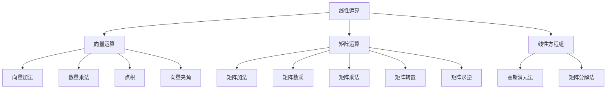

好的,我明白了您的要求。以下是技术博客文章《线性代数导引:线性运算》的正文内容:

# 线性代数导引:线性运算

## 1. 背景介绍

### 1.1 问题的由来

线性代数是数学的一个分支,研究向量、矩阵、线性方程组、线性变换等概念及其运算规律。它在各个科学领域都有广泛的应用,尤其在计算机科学、工程、物理学、经济学等领域扮演着重要角色。线性代数为建模和求解实际问题提供了强有力的数学工具。

### 1.2 研究现状  

线性代数理论经过几个世纪的发展,已经形成了一个相对完整和成熟的数学分支。从17世纪笛卡尔发明解析几何,到18世纪高斯对线性方程组理论的重大贡献,再到19世纪矩阵理论的建立,线性代数经历了一个由初步概念到系统理论的发展过程。

当代线性代数主要研究线性空间、线性变换、矩阵、行列式、二次型等概念及其相关理论。线性代数的理论基础已相当完备,但对于具体应用领域而言,仍有许多有待探索和发展的方向。

### 1.3 研究意义

线性代数是现代数学的重要组成部分,也是数学在实际应用中最为广泛和成功的分支之一。掌握线性代数知识有助于培养抽象思维能力,建立数学建模意识,并能为分析和解决实际问题提供有力的数学工具。

线性代数在计算机科学、工程技术、经济金融、自然科学等诸多领域都有着广泛的应用。例如,在计算机图形学中需要线性变换来实现图像的旋转、缩放等操作;在机器学习中,线性代数为优化算法的设计和求解提供了理论支撑;在量子计算领域,线性代数为描述量子态提供了数学语言。可以说,线性代数是现代科技发展的重要数学基础。

### 1.4 本文结构

本文将系统地介绍线性代数中线性运算的相关理论和应用。主要内容包括:线性运算的核心概念、线性运算的基本算法原理、线性运算的数学模型和公式推导、基于线性运算的项目实践、线性运算在实际应用中的场景、相关工具和资源推荐,以及线性运算发展趋势和面临的挑战。文章旨在为读者提供对线性运算全面而深入的理解。

## 2. 核心概念与联系

线性运算是线性代数的核心内容,主要包括以下几个方面:

1. **向量运算**: 向量是线性代数中最基本的概念,向量运算包括向量加法、数量乘法、点积、向量夹角等基本运算。

2. **矩阵运算**: 矩阵是线性代数中另一个重要概念,矩阵运算包括矩阵加法、矩阵数乘、矩阵乘法、矩阵转置、矩阵求逆等基本运算。

3. **线性方程组**: 线性方程组是线性代数中的一类经典问题,求解线性方程组的常用方法有高斯消元法、矩阵分解法等。

上述三个方面的概念和运算相互关联、相辅相成,共同构成了线性运算的理论体系。掌握这些核心概念及其运算规律,是学习和应用线性代数的基础。

## 3. 核心算法原理 & 具体操作步骤

### 3.1 算法原理概述  

线性运算涉及的核心算法主要有以下几种:

1. **高斯消元法**: 用于求解线性方程组的经典算法,基于用行变换将增广矩阵化为行阶梯形式,从而求解未知数。

2. **矩阵分解**: 将矩阵分解为若干特殊矩阵的乘积,如LU分解、QR分解、SVD分解等,用于求解线性方程组、矩阵求逆等问题。

3. **迭代法**: 对于大型线性方程组,可以使用迭代法逐步逼近解,如雅可比迭代法、高斯-赛德尔迭代法等。

4. **向量与矩阵运算**: 向量与矩阵的加法、数乘、乘法等基本运算,是进行更高层次线性运算的基础。

这些算法原理源于线性代数的基本理论,体现了线性运算的本质特点,并为高效求解线性问题提供了强有力的工具。

### 3.2 算法步骤详解

以下将详细介绍高斯消元法的具体步骤:

1) 构造增广矩阵: 将线性方程组的系数矩阵和常数列矩阵并列,形成增广矩阵$[A|b]$。

2) 化为行阶梯形式:
    a. 从上到下,用非零行去消除下面所有行的对应元素(行变换)
    b. 从左到右,用非零列去消除右边所有列的对应元素(列变换)
    c. 重复上述过程,直至增广矩阵化为行阶梯形式

3) 回代求解:
    a. 从最后一行开始,求出最后一个未知数的值
    b. 将已知未知数的值代入上一行方程,求解上一个未知数
    c. 重复上述过程,直至求出所有未知数的值

### 3.3 算法优缺点

高斯消元法优点:
- 算法原理简单,程序实现容易
- 对于非病态矩阵,有确定的解
- 对于方阵,可以一并求出矩阵的逆矩阵

缺点:
- 对于病态矩阵,算法可能失去有效数字
- 对于大规模线性方程组,算法效率较低
- 需要较大的存储空间存储中间结果

### 3.4 算法应用领域

高斯消元法及其变种算法在诸多领域有着广泛的应用:

- 计算机图形学中用于坐标变换
- 有限元分析中求解大规模线性方程组 
- 机器学习中作为优化算法的基础
- 计算流体动力学中求解控制方程
- 电路理论中分析电路方程
- ...

## 4. 数学模型和公式 & 详细讲解 & 举例说明

### 4.1 数学模型构建

线性运算的数学模型主要围绕线性方程组展开。一个n元线性方程组可以表示为:

$$
\begin{cases}
a_{11}x_1+a_{12}x_2+\cdots+a_{1n}x_n=b_1\\
a_{21}x_1+a_{22}x_2+\cdots+a_{2n}x_n=b_2\\
\cdots\cdots\\ 
a_{n1}x_1+a_{n2}x_2+\cdots+a_{nn}x_n=b_n
\end{cases}
$$

其中$a_{ij}(1\leq i\leq n,1\leq j\leq n)$是系数,$b_i(1\leq i\leq n)$是常数项。

我们也可以用矩阵形式表示:

$$
\begin{bmatrix}
a_{11} & a_{12} & \cdots & a_{1n}\\
a_{21} & a_{22} & \cdots & a_{2n}\\
\vdots & \vdots & \ddots & \vdots\\
a_{n1} & a_{n2} & \cdots & a_{nn}
\end{bmatrix}
\begin{bmatrix}
x_1\\x_2\\\vdots\\x_n
\end{bmatrix}=
\begin{bmatrix}
b_1\\b_2\\\vdots\\b_n
\end{bmatrix}
$$

即 $Ax=b$，其中 $A$ 为$n\times n$系数矩阵，$x$为$n$维未知数向量，$b$为$n$维常数向量。

线性方程组的解即为使等式两边相等时$x$的取值。我们的目标是求解未知数向量$x$。

### 4.2 公式推导过程

以下将推导高斯消元法的数学原理:

设线性方程组为$Ax=b$,其中$A$为$n\times n$系数矩阵。

1) 先对$A$进行第一次初等行变换,将$a_{11}$元素所在行调整为第一行,然后用该行去消去其余行第一列元素。得到:

$$
\begin{bmatrix}
a'_{11} & a'_{12} & \cdots & a'_{1n}\\
0 & a'_{22} & \cdots & a'_{2n}\\
\vdots & \vdots & \ddots & \vdots\\
0 & a'_{n2} & \cdots & a'_{nn}
\end{bmatrix}
\begin{bmatrix}
x_1\\x_2\\\vdots\\x_n
\end{bmatrix}=
\begin{bmatrix}
b'_1\\b'_2\\\vdots\\b'_n
\end{bmatrix}
$$

2) 对第二行元素$a'_{22}$所在行做第二次行变换,将其所在行调整为第二行,再用该行去消去其余行第二列元素。得到:

$$
\begin{bmatrix}
a'_{11} & a'_{12} & \cdots & a'_{1n}\\
0 & a''_{22} & \cdots & a''_{2n}\\
\vdots & 0 & \ddots & \vdots\\
0 & 0 & \cdots & a''_{nn}
\end{bmatrix}
\begin{bmatrix}
x_1\\x_2\\\vdots\\x_n
\end{bmatrix}=
\begin{bmatrix}
b''_1\\b''_2\\\vdots\\b''_n
\end{bmatrix}
$$

3) 重复上述过程,直至化为上三角形矩阵:

$$
\begin{bmatrix}
a^*_{11} & a^*_{12} & \cdots & a^*_{1n}\\
0 & a^*_{22} & \cdots & a^*_{2n}\\
\vdots & 0 & \ddots & \vdots\\
0 & 0 & \cdots & a^*_{nn}
\end{bmatrix}
\begin{bmatrix}
x_1\\x_2\\\vdots\\x_n
\end{bmatrix}=
\begin{bmatrix}
b^*_1\\b^*_2\\\vdots\\b^*_n
\end{bmatrix}
$$

4) 从最后一行开始,可以直接解出$x_n$:

$$x_n=\frac{b^*_n}{a^*_{nn}}$$

5) 将$x_n$代入倒数第二行方程,可解出$x_{n-1}$:

$$x_{n-1}=\frac{b^*_{n-1}-a^*_{n-1,n}x_n}{a^*_{n-1,n-1}}$$

6) 重复上述过程,依次求解出$x_{n-2},x_{n-3},...,x_1$,即可得到完整解。

这一推导过程揭示了高斯消元法的数学本质:通过初等行变换,将增广矩阵化为行阶梯形式,从而可以方便地回代求解未知数向量。

### 4.3 案例分析与讲解

现在我们来看一个实际案例,求解如下线性方程组:

$$
\begin{cases}
2x_1+3x_2-x_3=5\\
x_1-2x_2+3x_3=9\\
4x_1+x_2+2x_3=20
\end{cases}
$$

首先构造增广矩阵:

$$
\begin{bmatrix}
2 & 3 & -1 & 5\\
1 & -2 & 3 & 9\\
4 & 1 & 2 & 20
\end{bmatrix}
$$

然后按照高斯消元法的步骤进行运算:

1) 用第一行去消去第二、三行的第一列元素:

$$
\begin{bmatrix}
2 & 3 & -1 & 5\\
0 & -5 & 4 & 7\\
0 & -7 & 6 & 10
\end{bmatrix}
$$

2) 用第二行去消去第三行的第二列元素: 

$$
\begin{bmatrix}
2 & 3 