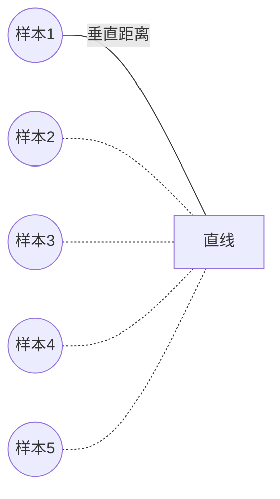

# 线性回归原理与代码实例讲解

## 1. 背景介绍
### 1.1  问题的由来
在科学研究、工程实践和商业决策等诸多领域中,我们经常会遇到一类问题:如何根据已知的数据点,去预测未知情况下的结果。比如,房地产公司想要预测房价、气象部门想要预测天气、金融机构想要预测股票走势等。这些看似不同领域的问题,本质上都可以归结为一个统计学习的任务——回归分析。而线性回归,正是解决这一问题的最基础也是最常用的方法之一。

### 1.2  研究现状
线性回归虽然概念简单,但其思想精髓却非常深刻,在统计学和机器学习领域有着极为重要的地位。目前,线性回归已经被广泛应用于数据挖掘、模式识别、计算机视觉等多个领域。同时,各种改进和扩展的线性回归模型也不断涌现,如岭回归、Lasso回归、弹性网络等,极大地丰富了线性回归的内涵。近年来,随着大数据和人工智能的兴起,线性回归又焕发出新的生命力,成为机器学习的入门和基础。

### 1.3  研究意义
无论对于科研工作者还是工程实践者,深入理解线性回归的原理和掌握其代码实现,都是十分必要和有益的。一方面,这有助于我们建立统计学习的基础思维,培养数据分析和建模的能力;另一方面,线性回归模型简单且可解释性强,在实际问题中通常能取得不错的效果,加之其易于实现,因此成为许多复杂模型的首选基准。

### 1.4  本文结构
本文将全面讲解线性回归的原理和代码实现。第2节介绍线性回归涉及的基本概念;第3节讲解线性回归算法的原理和求解过程;第4节给出线性回归的数学模型和推导过程;第5节通过Python代码实例演示线性回归的具体实现;第6节讨论线性回归的一些实际应用场景;第7节推荐一些学习线性回归的资源;第8节总结全文并展望线性回归的发展前景。

## 2. 核心概念与联系

在讨论线性回归之前,我们先来了解一些相关的基本概念:

- 变量:研究对象的特征,分为自变量(影响因素)和因变量(研究对象)。
- 回归:指研究自变量和因变量之间关系的统计学方法。
- 线性:指自变量和因变量之间是线性关系,即它们的关系可以用一条直线来近似表示。
- 参数:描述线性关系的系数,即直线方程中的斜率和截距。

线性回归的本质是,找出一条直线,使得所有样本到直线的垂直距离之和最小。下图给出了线性回归的一个直观示例:

在上图中,每个点代表一个样本,横坐标表示自变量的值,纵坐标表示因变量的值。线性回归要做的,就是找到一条直线,使得所有样本点到直线的垂直距离(即残差)的平方和最小。这条直线,就是对样本数据的最佳线性拟合。

## 3. 核心算法原理 & 具体操作步骤
### 3.1  算法原理概述
线性回归的目标是学习出一个线性模型,使它能够很好地拟合已知数据,并对未知数据做出很好的预测。具体来说,给定数据集 $D=\{(x_1,y_1),(x_2,y_2),...,(x_n,y_n)\}$,其中 $x_i$ 为第 $i$ 个样本的特征向量, $y_i$ 为 $x_i$ 对应的目标值。线性回归希望学得一个线性函数 $f(x)=w^Tx+b$,使得 $f(x_i)\simeq y_i$。

用矩阵形式描述,即:
$$
\begin{bmatrix}
x_{11} & x_{12} & \cdots & x_{1d} \\
x_{21} & x_{22} & \cdots & x_{2d} \\
\vdots & \vdots & \ddots & \vdots \\
x_{n1} & x_{n2} & \cdots & x_{nd} 
\end{bmatrix}
\begin{bmatrix}
w_1 \\ w_2 \\ \vdots \\ w_d
\end{bmatrix}
+
\begin{bmatrix}
b \\ b \\ \vdots \\ b
\end{bmatrix}
\simeq 
\begin{bmatrix}
y_1 \\ y_2 \\ \vdots \\ y_n
\end{bmatrix}
$$

用 $\boldsymbol{X}$ 表示样本矩阵, $\boldsymbol{w}$ 表示权重向量, $\boldsymbol{b}$ 表示偏置项, $\boldsymbol{y}$ 表示标签向量,上式可以简写为:

$$\boldsymbol{Xw}+\boldsymbol{b} \simeq \boldsymbol{y}$$

为了衡量线性模型 $\boldsymbol{Xw}+\boldsymbol{b}$ 与真实标签 $\boldsymbol{y}$ 的差异,引入损失函数(loss function)这个概念。常用的损失函数是平方损失:

$$L(\boldsymbol{w},b)=\sum_{i=1}^n(f(\boldsymbol{x}_i)-y_i)^2=\sum_{i=1}^n(\boldsymbol{w}^T\boldsymbol{x}_i+b-y_i)^2$$

线性回归的目标就是找到一组参数 $\boldsymbol{w}$ 和 $b$ 来最小化损失函数 $L(\boldsymbol{w},b)$。

### 3.2  算法步骤详解
线性回归的求解过程可以分为以下4个步骤:

**步骤1:初始化参数**。将 $\boldsymbol{w}$ 和 $b$ 初始化为0向量和0。

**步骤2:计算预测值与真实值之差**。对于数据集中的每个样本 $(\boldsymbol{x}_i,y_i)$,计算 $\boldsymbol{w}^T\boldsymbol{x}_i+b-y_i$。

**步骤3:计算梯度并更新参数**。根据步骤2中的计算结果,得到损失函数 $L(\boldsymbol{w},b)$ 关于 $\boldsymbol{w}$ 和 $b$ 的梯度:
$$
\begin{aligned}
\frac{\partial L}{\partial \boldsymbol{w}} &= \frac{1}{n} \boldsymbol{X}^T(\boldsymbol{Xw}+\boldsymbol{b}-\boldsymbol{y}) \\
\frac{\partial L}{\partial b} &= \frac{1}{n} \boldsymbol{1}^T(\boldsymbol{Xw}+\boldsymbol{b}-\boldsymbol{y})
\end{aligned}
$$

其中 $\boldsymbol{1}$ 为全1向量。然后用梯度下降法更新参数:
$$
\begin{aligned}
\boldsymbol{w} &:= \boldsymbol{w} - \alpha \frac{\partial L}{\partial \boldsymbol{w}} \\
b &:= b - \alpha \frac{\partial L}{\partial b}
\end{aligned}
$$

其中 $\alpha$ 为学习率。

**步骤4:重复步骤2~3直至收敛**。不断重复步骤2~3,直到损失函数几乎不再下降。

### 3.3  算法优缺点
线性回归的主要优点有:
- 模型简单,易于理解和实现。
- 计算开销小,训练速度快。
- 可解释性强,权重向量直接反映了各个特征的重要性。

线性回归的主要缺点有:  
- 难以拟合非线性数据。
- 对异常值和噪声敏感。
- 容易出现过拟合。

### 3.4  算法应用领域
线性回归在许多领域都有广泛应用,典型的如:
- 经济学:分析影响经济增长的因素。
- 社会学:研究收入和教育水平的关系。
- 医学:预测药物剂量和疗效的关系。
- 地理学:估算温度和海拔的关系。

此外,线性回归还常用于解决回归类问题的基准模型。

## 4. 数学模型和公式 & 详细讲解 & 举例说明
### 4.1  数学模型构建
线性回归的数学模型非常简单,就是一个线性函数:
$$f(\boldsymbol{x})=\boldsymbol{w}^T\boldsymbol{x}+b$$

其中 $\boldsymbol{x} \in \mathbb{R}^d$ 为d维特征向量, $\boldsymbol{w} \in \mathbb{R}^d$ 为权重向量, $b \in \mathbb{R}$ 为偏置项。

线性回归的目标是找到最优的 $\boldsymbol{w}$ 和 $b$ 以最小化损失函数。这里我们选择平方损失函数:

$$L(\boldsymbol{w},b)=\sum_{i=1}^n(f(\boldsymbol{x}_i)-y_i)^2$$

其中 $(\boldsymbol{x}_i,y_i)$ 为第 $i$ 个样本及其标签。

### 4.2  公式推导过程 
为了求解最优的 $\boldsymbol{w}$ 和 $b$,我们需要对损失函数求导,并令导数为0。首先求 $L(\boldsymbol{w},b)$ 关于 $\boldsymbol{w}$ 的导数:

$$
\begin{aligned}
\frac{\partial L}{\partial \boldsymbol{w}} 
&= \frac{\partial}{\partial \boldsymbol{w}} \left( \sum_{i=1}^n(f(\boldsymbol{x}_i)-y_i)^2 \right) \\
&= \sum_{i=1}^n \frac{\partial}{\partial \boldsymbol{w}} \left( (\boldsymbol{w}^T\boldsymbol{x}_i+b-y_i)^2 \right) \\
&= \sum_{i=1}^n 2(\boldsymbol{w}^T\boldsymbol{x}_i+b-y_i) \frac{\partial}{\partial \boldsymbol{w}} \left( \boldsymbol{w}^T\boldsymbol{x}_i+b-y_i \right) \\
&= \sum_{i=1}^n 2(\boldsymbol{w}^T\boldsymbol{x}_i+b-y_i) \boldsymbol{x}_i \\
&= 2 \boldsymbol{X}^T(\boldsymbol{Xw}+\boldsymbol{b}-\boldsymbol{y}) \\
&= \frac{2}{n} \boldsymbol{X}^T(\boldsymbol{Xw}+\boldsymbol{b}-\boldsymbol{y})
\end{aligned}
$$

同理可得 $L(\boldsymbol{w},b)$ 关于 $b$ 的导数为:

$$
\frac{\partial L}{\partial b} = \frac{2}{n} \boldsymbol{1}^T(\boldsymbol{Xw}+\boldsymbol{b}-\boldsymbol{y})
$$

令上述两式为0,就得到了 $\boldsymbol{w}$ 和 $b$ 的最优解的闭式解:

$$
\begin{aligned}
\boldsymbol{w}^* &= (\boldsymbol{X}^T\boldsymbol{X})^{-1}\boldsymbol{X}^T(\boldsymbol{y}-\boldsymbol{b}) \\
b^* &= \frac{1}{n} \boldsymbol{1}^T (\boldsymbol{y} - \boldsymbol{Xw}^*)
\end{aligned}
$$

当然,在实践中我们通常使用梯度下降法来迭代求解,这样可以避免计算矩阵的逆。

### 4.3  案例分析与讲解
下面我们用一个简单的一元线性回归例子来说明线性回归的建模和求解过程。假设我们收集到5个学生的学习时间和考试成绩数据如下:

| 学习时间(小时) | 考试成绩 |
|-------------|--------|
| 1        | 60     |
| 2        | 70     |  
| 4        | 85     |
| 5        | 95     |
| 7        | 110    |

我们希望建立学习时间和考试成绩的线性关系,即:

$$f(x) = wx+b$$

其中 $x$ 为学习时间, $f(x)$ 为预测的考试成绩。

根据公