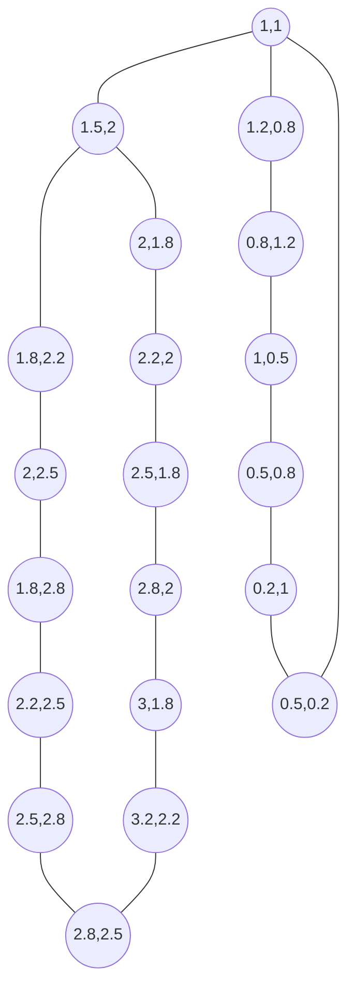
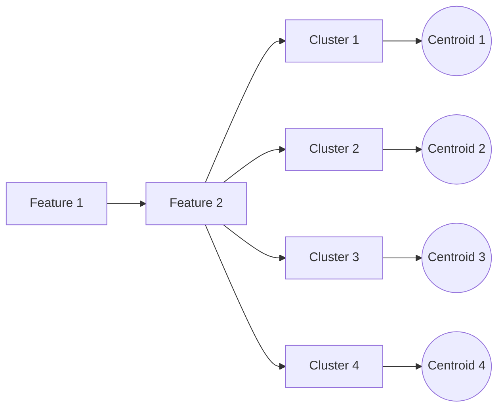

# 聚类分析原理与代码实例讲解

关键词：聚类分析、无监督学习、K-means、层次聚类、DBSCAN、聚类评估

## 1. 背景介绍
### 1.1 问题的由来
在现实世界中，我们经常需要对大量的数据进行分组和归类，以便更好地理解和分析数据。聚类分析作为一种无监督学习的方法，能够自动将相似的数据点归为一组，从而发现数据内在的结构和模式。

### 1.2 研究现状
聚类分析已经成为数据挖掘和机器学习领域的重要研究方向之一。目前，已经提出了多种聚类算法，如K-means、层次聚类、DBSCAN等，并在各个领域得到了广泛的应用。

### 1.3 研究意义
聚类分析可以帮助我们从海量数据中发现有价值的信息，如客户分群、异常检测、图像分割等。深入理解聚类分析的原理和实现，对于数据分析和决策支持具有重要意义。

### 1.4 本文结构
本文将从聚类分析的核心概念出发，详细介绍几种经典的聚类算法原理和实现步骤，并通过数学模型和代码实例进行讲解。同时，探讨聚类分析的实际应用场景和未来发展趋势。

## 2. 核心概念与联系
聚类分析的目标是将数据集划分为若干个簇，使得同一个簇内的数据点相似度高，不同簇之间的数据点相似度低。相似度的度量可以基于距离、密度、连通性等不同的准则。

聚类算法可以分为划分式聚类、层次聚类、基于密度的聚类等几大类。其中，划分式聚类以K-means为代表，通过迭代优化的方式将数据划分为预定数量的簇；层次聚类通过合并或分裂的策略生成树状的聚类结构；基于密度的聚类考虑数据点的紧密程度，能够发现任意形状的簇。

聚类结果的评估是一个重要问题，常用的指标有轮廓系数、Calinski-Harabasz指数、Davies-Bouldin指数等，用于衡量聚类的紧凑性和分离性。

## 3. 核心算法原理 & 具体操作步骤
### 3.1 算法原理概述
本节重点介绍K-means、层次聚类和DBSCAN三种经典聚类算法的原理。

K-means通过最小化簇内数据点到簇中心的距离平方和来优化聚类结果，具体步骤包括：
1. 随机选择K个初始簇中心
2. 将每个数据点分配到距离最近的簇中心所在的簇
3. 更新每个簇的中心为该簇所有数据点的均值
4. 重复步骤2和3直到簇中心不再变化

层次聚类分为聚合法和分裂法，聚合法自底向上合并距离最近的两个簇，分裂法自顶向下分裂距离最远的簇，最终形成树状结构。常用的距离度量有最小距离、最大距离和平均距离等。

DBSCAN基于数据点的密度连通性来划分簇，对噪声数据有较好的鲁棒性。算法引入了两个关键参数：半径Eps和最小点数MinPts。如果一个点的Eps邻域内至少有MinPts个点，则称其为核心点。DBSCAN将密度可达的核心点划分在同一个簇中。

### 3.2 算法步骤详解
以下是K-means算法的详细步骤：
1. 输入：数据集D，聚类数K，最大迭代次数Max_iterations
2. 随机选取K个数据点作为初始簇中心
3. repeat
4. 　for each 数据点x_i ∈ D do
5. 　　计算x_i 到各个簇中心的距离，将其分配到距离最近的簇
6. 　end for
7. 　for each 簇C_j do
8. 　　更新簇中心为簇内所有点的均值
9. 　end for
10. until 簇中心不再变化或达到最大迭代次数
11. 输出：K个簇

层次聚类的聚合法步骤如下：
1. 将每个数据点看作一个初始簇
2. repeat
3. 　计算两两簇之间的距离
4. 　合并距离最近的两个簇
5. until 达到预定的簇数或所有点归为一个簇
6. 输出：聚类树

DBSCAN的步骤如下：
1. 输入：数据集D，半径Eps，最小点数MinPts
2. 标记所有点为unvisited
3. for each unvisited 点P ∈ D do
4. 　标记P为visited
5. 　if P的Eps邻域内的点数 >= MinPts then
6. 　　创建新簇C，将P添加到C
7. 　　for each P'∈ P的Eps邻域 do
8. 　　　if P'是unvisited then
9. 　　　　标记P'为visited
10. 　　　　if P'的Eps邻域内的点数 >= MinPts then
11. 　　　　　将P'的Eps邻域内的点添加到C
12. 　　　　end if
13. 　　　end if
14. 　　end for
15. 　else
16. 　　标记P为噪声点
17. 　end if
18. end for
19. 输出：簇的集合

### 3.3 算法优缺点
K-means的优点是简单高效，适用于大规模数据集。但需要预先指定聚类数，对噪声和异常点敏感，容易陷入局部最优。

层次聚类的优点是无需指定聚类数，可以生成聚类树方便可视化分析。缺点是时间复杂度高，对数据量大的情况不太适用。

DBSCAN的优点是可以发现任意形状的簇，对噪声数据有很好的鲁棒性。缺点是需要调参，参数选择不当可能导致欠聚类或过聚类。

### 3.4 算法应用领域
聚类算法在多个领域有广泛应用，如市场细分、社交网络分析、生物信息学、异常检测等。例如，在客户关系管理中，可以用聚类分析将客户划分为不同的群体，实现精准营销。

## 4. 数学模型和公式 & 详细讲解 & 举例说明
### 4.1 数学模型构建
以K-means为例，假设数据集 $D=\{x_1,x_2,...,x_n\}$，需要划分为 $K$ 个簇 $C=\{C_1,C_2,...,C_K\}$。定义簇 $C_k$ 的中心为 $\mu_k$，目标函数为最小化所有数据点到其所属簇中心的距离平方和：

$$
J = \sum_{k=1}^K\sum_{x_i \in C_k} ||x_i - \mu_k||^2
$$

通过不断迭代优化，直到目标函数收敛或达到最大迭代次数。

### 4.2 公式推导过程
每次迭代时，固定簇中心，将每个数据点 $x_i$ 分配到距离最近的簇 $C_k$：

$$
C_k = \{x_i: ||x_i - \mu_k|| \leq ||x_i - \mu_j||, \forall j \neq k\}
$$

然后固定簇内的数据点，更新每个簇的中心为簇内所有点的均值：

$$
\mu_k = \frac{1}{|C_k|}\sum_{x_i \in C_k}x_i
$$

重复上述两个步骤直到收敛。

### 4.3 案例分析与讲解
下面以一个简单的二维数据集为例，演示K-means聚类的过程。数据集包含20个点，如下图所示：



假设K=2，随机选择(1,1)和(2.5,1.8)作为初始簇中心。第一次迭代后，得到两个簇：
- 簇1：(1,1), (1.5,2), (1.2,0.8), (0.8,1.2), (1,0.5), (0.5,0.8), (0.2,1), (0.5,0.2)
- 簇2：(2,1.8), (1.8,2.2), (2.2,2), (2,2.5), (2.5,1.8), (1.8,2.8), (2.8,2), (2.2,2.5), (3,1.8), (2.5,2.8), (3.2,2.2), (2.8,2.5)

更新簇中心为：
- 簇1中心：(0.84,0.96)
- 簇2中心：(2.38,2.18)

重复迭代直到簇中心不再变化，最终得到稳定的聚类结果。

### 4.4 常见问题解答
1. K-means如何选择初始簇中心？

可以采用随机选择或K-means++等策略。K-means++先随机选择一个点作为第一个簇中心，然后以与已选择的簇中心的最短距离作为概率分布，选择下一个簇中心，重复K-1次。这样可以使初始簇中心分布更加合理。

2. 如何确定最优的聚类数K？

可以使用手肘法、轮廓系数等方法评估不同K值下的聚类质量，选择聚类效果最好的K值。手肘法计算不同K值下的簇内距离平方和，绘制曲线图，选择曲线拐点处的K值。轮廓系数衡量样本与所在簇的相似度与其他簇的差异性，取值在[-1,1]之间，值越大表示聚类效果越好。

## 5. 项目实践：代码实例和详细解释说明
### 5.1 开发环境搭建
本文使用Python 3和Scikit-learn库实现聚类算法。首先安装所需库：

```bash
pip install numpy matplotlib scikit-learn
```

### 5.2 源代码详细实现
以下是使用Scikit-learn实现K-means聚类的完整代码：

```python
from sklearn.cluster import KMeans
from sklearn.datasets import make_blobs
import matplotlib.pyplot as plt

# 生成样本数据
X, _ = make_blobs(n_samples=1000, centers=4, cluster_std=0.6, random_state=0)

# 构建K-means模型
km = KMeans(n_clusters=4, random_state=0)

# 训练模型
km.fit(X)

# 预测聚类结果
labels = km.predict(X)

# 可视化聚类结果
plt.scatter(X[:, 0], X[:, 1], c=labels, cmap='viridis')
plt.scatter(km.cluster_centers_[:, 0], km.cluster_centers_[:, 1], marker='*', s=200, c='r')
plt.xlabel('Feature 1')
plt.ylabel('Feature 2') 
plt.title('K-means Clustering')
plt.show()
```

### 5.3 代码解读与分析
1. 首先使用`make_blobs`函数生成1000个样本点，设置4个簇中心，簇内标准差为0.6。
2. 创建`KMeans`对象，指定聚类数为4。
3. 调用`fit`方法训练模型，传入特征矩阵X。
4. 调用`predict`方法预测每个样本的簇标签。
5. 使用`scatter`函数绘制散点图，样本点颜色根据簇标签设置，簇中心用红色星号表示。

### 5.4 运行结果展示
运行上述代码，可以得到如下的聚类结果可视化图：



从图中可以