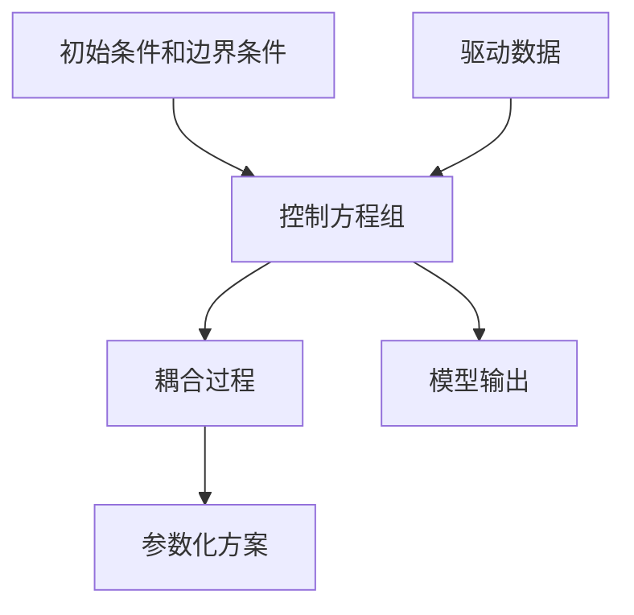

好的,我明白了您的要求。以下是根据您提供的标题和要求撰写的技术博客文章正文部分:

# 自然环境物理模型的建立

## 1. 背景介绍

### 1.1 问题的由来

自然环境是一个复杂的物理系统,其中包含了多种相互作用的物理过程和要素。随着人类活动对自然环境的影响不断加深,准确描述和预测自然环境的演变变得越来越重要。传统的基于经验公式的模型已经无法满足当前对自然环境建模的需求,因此建立基于物理定律的自然环境模型迫在眉睫。

### 1.2 研究现状  

目前,自然环境物理模型的研究主要集中在以下几个方面:

1. 大气环境模型:包括气候模型、数值天气预报模型、大气化学传输模型等。
2. 水文环境模型:包括流域水文模型、地下水模型、水质模型等。
3. 生态环境模型:包括生态系统模型、种群动力学模型、景观模型等。
4. 地球系统模型:将上述模型整合,描述整个地球系统的物理、化学、生物过程及其相互作用。

这些模型在不同程度上结合了物理定律、化学反应动力学、生物过程等,对自然环境进行了描述和预测。但由于自然环境的复杂性,现有模型在精度、计算效率、多尺度耦合等方面仍有待进一步改进。

### 1.3 研究意义

建立准确的自然环境物理模型对于以下方面具有重要意义:

1. 科学认知:深入理解自然环境中的物理、化学、生物过程及其相互作用机制。
2. 环境预测:准确预测气候变化、极端天气、水资源变化、生态系统演变等,为制定应对策略提供依据。
3. 环境管理:评估人类活动对环境的影响,优化资源利用,实现可持续发展。
4. 灾害预警:及时预警自然灾害(洪涝、干旱、沙尘暴等),减少灾害损失。

### 1.4 本文结构

本文将首先介绍自然环境物理模型的核心概念和相互联系,然后详细阐述模型的核心算法原理和数学表达,并通过案例分析具体的模型实现过程。最后探讨模型的实际应用场景、发展趋势和面临的挑战。

## 2. 核心概念与联系

建立自然环境物理模型需要将多个子系统(大气、水文、生态等)进行耦合,描述各子系统内部过程及其相互作用。模型的核心概念包括:

1. **控制方程组**: 描述子系统内部的物理、化学、生物过程,如流体运动方程、扩散方程、化学反应动力学方程、生物种群动力学方程等。
2. **耦合过程**: 不同子系统之间的相互作用,如大气-水文耦合(降水、蒸发等)、水文-生态耦合(植被根系吸收、蒸腾作用等)、大气-生态耦合(光合作用、呼吸作用等)。
3. **参数化方案**: 由于空间尺度限制,一些小尺度过程(如云物理过程、土壤水分运移等)需要通过参数化方案简化描述。
4. **初始条件和边界条件**: 模型需要给定初始状态和物理边界条件(如地形、土壤类型、植被覆盖等)。
5. **驱动数据**: 模型运行需要一些外部驱动数据,如大气环流场、太阳辐射、人类活动排放等。

这些核心概念相互关联、相互作用,共同构成了自然环境物理模型的理论框架。下面给出一个简单的模型框架示意图:

## 3. 核心算法原理与具体操作步骤

### 3.1 算法原理概述

自然环境物理模型的核心算法原理是基于控制方程组,通过数值方法求解方程组获得模型变量的时空分布。常用的数值求解方法包括:

1. **有限差分法**: 在离散的空间网格上,用有限差分格式逼近偏微分方程中的导数项。
2. **有限元法**: 将解析解空间离散化为有限个单元,在每个单元上构造插值函式逼近解析解。
3. **谱方法**: 将微分方程的解用特征函数(如三角函数)的无穷级数展开,代入方程求解展开系数。

这些方法都需要对时间进行离散,采用某种时间推进格式(如前向或后向欧拉格式)。数值计算过程中,需要特别处理非线性项、耦合项、参数化过程等。

算法的具体实现步骤包括:

1. 建立物理模型控制方程组
2. 构造离散格式(有限差分、有限元或谱方法)
3. 处理非线性项、耦合项、参数化过程
4. 设置初始条件和边界条件
5. 选择时间推进格式
6. 编写数值求解程序
7. 并行优化,提高计算效率

### 3.2 算法步骤详解

以有限差分法为例,算法具体步骤如下:

1. **建立控制方程组**

   假设某子系统的控制方程为:

   $$
   \frac{\partial u}{\partial t} = F(u, \nabla u, x, t)
   $$

   其中 $u$ 为求解变量,如温度、浓度等; $F$ 为控制方程的右手项,包含了各种物理过程。

2. **构造离散格式**

   在离散的空间网格 $(x_i, y_j, z_k)$ 上,用有限差分格式逼近方程中的导数项:

   $$
   \frac{\partial u}{\partial t} \approx \frac{u_{ijk}^{n+1} - u_{ijk}^n}{\Delta t}
   $$

   $$
   \nabla u \approx \left( \frac{u_{i+1,j,k} - u_{i-1,j,k}}{2\Delta x}, \frac{u_{i,j+1,k} - u_{i,j-1,k}}{2\Delta y}, \frac{u_{i,j,k+1} - u_{i,j,k-1}}{2\Delta z} \right)
   $$

   将差分格式代入控制方程,可获得离散代数方程组。

3. **处理非线性、耦合、参数化**

   - 非线性项通常采用某种线性化方法,如牛顿迭代法。
   - 耦合项需要在不同子模型之间传递界面数据,可采用算符分裂法或同步耦合法。
   - 小尺度参数化过程通常用半经验公式描述。

4. **设置初始条件和边界条件**

   给定初始时刻 $t=0$ 时的 $u^0_{ijk}$ 值,以及物理边界(如地形、土壤类型等)条件。

5. **选择时间推进格式**

   常用的时间推进格式有:

   - 前向欧拉格式: $u^{n+1} = u^n + \Delta t F(u^n)$
   - 后向欧拉格式: $u^{n+1} = u^n + \Delta t F(u^{n+1})$
   - 经典四阶朗格-库塔格式

   高阶格式精度更高,但计算量也更大。

6. **编写数值求解程序**

   根据上述离散代数方程组、时间推进格式,编写求解程序。

7. **并行优化**

   由于计算量很大,通常需要在多核CPU或GPU上并行计算,以提高效率。可采用如域分解、线程并行等并行优化技术。

### 3.3 算法优缺点

上述基于数值方法的算法具有以下优缺点:

**优点**:

1. 能够较为精确地求解控制方程组,描述各种物理过程。
2. 算法框架清晰,容易编码实现。
3. 并行性好,可在高性能计算平台上实现高效计算。

**缺点**:

1. 计算量大,对计算资源要求高。
2. 对复杂过程的参数化依赖较多,参数不确定性较大。
3. 多尺度过程的耦合存在一定困难。

### 3.4 算法应用领域

基于数值方法的自然环境物理模型算法在以下领域有广泛应用:

1. **气候模型**: 如CESM、CAMS等全球气候模式。
2. **数值天气预报**: 如WRF、GRAPES等中尺度天气预报模型。
3. **大气环境模型**: 如CMAQ、CAMx等大气化学传输模型。
4. **水文模型**: 如SWAT、VIC等流域水文模型。
5. **生态模型**: 如BIOME-BGC、DLEM等生态系统模型。
6. **地球系统模型**: 如NASA的GEOS、DOE的ACME等。

## 4. 数学模型和公式详细讲解与举例说明

### 4.1 数学模型构建

自然环境物理模型的数学模型主要由控制方程组构成。以大气环境模型为例,其控制方程组包括:

1. **大气动力学方程组**

   描述大气流体运动,基于质量、动量、能量守恒定律,包括连续方程、运动方程、热力学能量方程等。

   $$
   \frac{\partial \rho}{\partial t} + \nabla \cdot (\rho \mathbf{v}) = 0 \\ 
   \frac{\partial \rho \mathbf{v}}{\partial t} + \nabla \cdot (\rho \mathbf{vv}) = -\nabla p + \rho \mathbf{g} \\
   \frac{\partial \rho C_pT}{\partial t} + \nabla \cdot (\rho C_p T \mathbf{v}) = Q_R + Q_C + Q_F
   $$

2. **大气物理过程方程**

   描述辐射传输、云微物理、边界层过程、重力波拖曳等。

   $$
   \frac{\partial q_x}{\partial t} = P_x - L_x - \nabla \cdot \mathbf{F}_x
   $$

3. **大气化学过程方程** 

   描述大气化学反应、气溶胶过程等。

   $$
   \frac{\partial c_i}{\partial t} = P_i - L_i - \nabla \cdot \mathbf{F}_i + R_i(c_1, c_2, \cdots)
   $$

这些方程组通过耦合作用,共同描述了大气环境的物理和化学过程。

### 4.2 公式推导过程

以大气动力学方程组为例,介绍公式的推导过程:

1. **连续方程**

   根据质量守恒定律:

   $$
   \frac{D}{Dt}\int_V \rho dV = -\oint_S \rho \mathbf{v} \cdot d\mathbf{S}
   $$

   将其用拉格朗日形式表示:

   $$
   \frac{D\rho}{Dt} + \rho \nabla \cdot \mathbf{v} = 0
   $$

   即可得到连续方程:

   $$
   \frac{\partial \rho}{\partial t} + \nabla \cdot (\rho \mathbf{v}) = 0
   $$

2. **运动方程**

   根据牛顿第二定律,对流体微元体施加力为:

   $$
   \frac{D}{Dt}\int_V \rho \mathbf{v} dV = -\oint_S p d\mathbf{S} + \int_V \rho \mathbf{g} dV
   $$

   将其用拉格朗日形式表示,即可得到运动方程:

   $$
   \frac{\partial \rho \mathbf{v}}{\partial t} + \nabla \cdot (\rho \mathbf{vv}) = -\nabla p + \rho \mathbf{g}
   $$

3. **热力学能量方程**

   根据热力学第一定律,对流体微元体施加功为:

   $$
   \frac{D}{Dt}\int_V \rho C_vTdV = -\oint_S p\mathbf{v}\cdot d\mathbf{S} + \int_V Q_R dV + \int_V Q_C dV + \int_V Q_F dV
   $$

   将其用拉格朗日形式表示,利用$C_p = C_v + R/M$,即可得到热力学能量方程:

   $$
   \frac{\partial \r