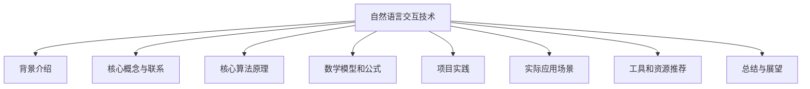
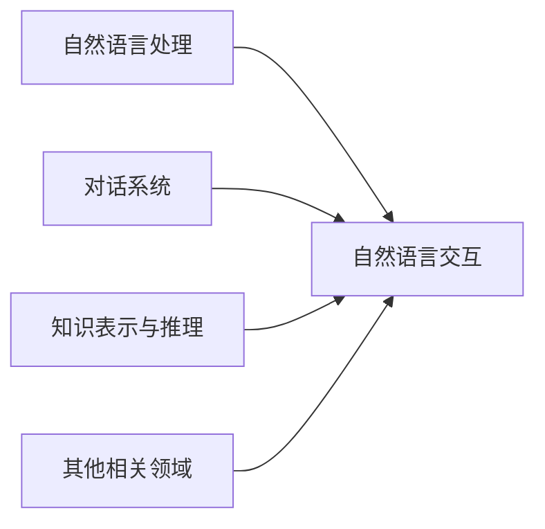
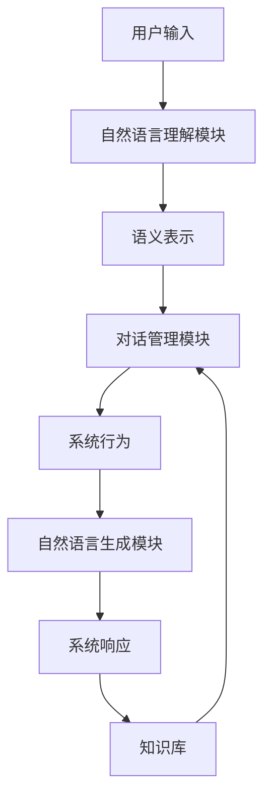

# 自然语言交互（LUI）的潜力

## 1. 背景介绍

### 1.1 问题的由来

在当今的数字时代，人机交互方式正在经历着巨大的变革。传统的图形用户界面(GUI)虽然为我们提供了直观的操作体验,但它也存在着一些局限性。用户需要熟悉特定的操作逻辑和界面布局,才能高效地与计算机系统进行交互。这种交互方式对于一些特殊群体(如残障人士、老年人等)来说,可能会存在一定的障碍。

随着人工智能技术的不断发展,自然语言处理(NLP)领域取得了长足的进步。这为发展更加自然、友好的人机交互方式提供了新的契机。自然语言交互(LUI)应运而生,它旨在让用户能够以自然语言的形式与计算机系统进行交互,从而打破传统GUI的局限,提供更加人性化的体验。

### 1.2 研究现状

自然语言交互技术已经在一些领域得到了初步应用,例如智能语音助手(如Siri、Alexa等)、聊天机器人等。但是,现有的自然语言交互系统仍然存在一些不足,例如:

1. 理解能力有限:现有系统对于复杂的自然语言表达往往难以准确理解,导致交互体验不佳。
2. 上下文理解不足:系统难以很好地捕捉对话的上下文信息,导致回复的连贯性不高。
3. 知识库局限:系统所依赖的知识库往往有限,难以覆盖所有领域的知识。
4. 安全性和隐私问题:自然语言交互系统可能会收集大量用户数据,存在潜在的安全和隐私风险。

因此,提升自然语言交互系统的理解能力、上下文感知能力、知识覆盖范围,并解决相关的安全和隐私问题,是当前研究的重点方向。

### 1.3 研究意义

自然语言交互技术的发展将为人机交互带来革命性的变化,具有重要的理论意义和应用价值:

1. 理论意义:自然语言交互技术的发展将推动人工智能、自然语言处理等相关学科的进步,为解决复杂的人机交互问题提供新的思路和方法。
2. 应用价值:自然语言交互技术可以广泛应用于各个领域,如智能助手、客户服务、教育培训、无障碍辅助等,为人们的生活和工作带来极大的便利。

### 1.4 本文结构

本文将全面探讨自然语言交互技术的发展现状、核心概念、算法原理、数学模型、实践应用等多个方面,并对未来的发展趋势和挑战进行展望。文章主要结构如下:

## 2. 核心概念与联系

自然语言交互(LUI)技术涉及多个相关领域的核心概念,包括自然语言处理(NLP)、对话系统、知识表示与推理等,它们之间存在着紧密的联系。

### 2.1 自然语言处理(NLP)

自然语言处理(NLP)是人工智能的一个重要分支,旨在使计算机能够理解和生成人类语言。它包括以下几个主要任务:

1. **词法分析(Tokenization)**: 将自然语言文本分割成单词、标点符号等最小单元。
2. **词性标注(Part-of-Speech Tagging)**: 为每个单词赋予相应的词性标记,如名词、动词等。
3. **命名实体识别(Named Entity Recognition, NER)**: 识别出文本中的人名、地名、组织机构名等命名实体。
4. **依存分析(Dependency Parsing)**: 分析句子中单词之间的依存关系。
5. **语义分析(Semantic Analysis)**: 理解自然语言的语义含义。
6. **自然语言生成(Natural Language Generation, NLG)**: 根据某种结构化的输入,生成自然语言的文本。

这些任务为自然语言交互系统提供了基础的语言理解和生成能力。

### 2.2 对话系统

对话系统是自然语言交互的核心组成部分,它能够与用户进行自然语言对话交互。一个典型的对话系统包括以下几个主要模块:

1. **自然语言理解(Natural Language Understanding, NLU)**: 将用户的自然语言输入转换为计算机可以理解的语义表示。
2. **对话管理(Dialogue Management)**: 根据当前对话状态和上下文信息,决策系统的下一步行为。
3. **自然语言生成(Natural Language Generation, NLG)**: 将系统的响应转换为自然语言的输出。
4. **知识库(Knowledge Base)**: 存储系统所需的领域知识,为对话提供信息支持。

对话系统需要具备较强的语言理解能力、上下文感知能力和决策能力,才能实现流畅自然的对话交互。

### 2.3 知识表示与推理

知识表示与推理是人工智能的另一个重要分支,它关注如何在计算机系统中表示和操作知识。在自然语言交互系统中,知识表示与推理发挥着重要作用:

1. **知识表示**: 将结构化的或非结构化的知识以计算机可理解的形式表示,如本体论、知识图谱等。
2. **知识推理**: 基于已有的知识,通过逻辑推理得出新的知识或结论。
3. **知识库构建**: 从各种数据源(如网络、文本等)中自动提取知识,并构建知识库。

丰富的知识库和强大的推理能力,可以帮助自然语言交互系统更好地理解用户的意图,提供更加准确和相关的响应。

### 2.4 核心概念之间的联系

自然语言交互技术是一个交叉学科,需要多个领域的理论和技术相互支撑:

1. **自然语言处理(NLP)**: 为自然语言交互系统提供基础的语言理解和生成能力。
2. **对话系统**: 是自然语言交互的核心组成部分,负责与用户进行对话交互。
3. **知识表示与推理**: 为自然语言交互系统提供知识支持和推理能力。
4. **其他相关领域**: 如机器学习、信息检索、语音识别等,也为自然语言交互技术的发展做出了贡献。

只有将这些核心概念有机结合,自然语言交互技术才能取得进一步的发展。

## 3. 核心算法原理与具体操作步骤

### 3.1 算法原理概述

自然语言交互系统的核心算法原理主要包括以下几个方面:

1. **自然语言理解(NLU)**: 将用户的自然语言输入转换为计算机可以理解的语义表示。常用的方法包括基于规则的方法、统计机器学习方法和深度学习方法等。
2. **对话管理**: 根据当前对话状态和上下文信息,决策系统的下一步行为。主要采用基于规则的方法、基于模板的方法、基于机器学习的方法等。
3. **自然语言生成(NLG)**: 将系统的响应转换为自然语言的输出。常用的方法包括基于模板的方法、基于规则的方法、基于统计机器翻译的方法、基于神经网络的序列生成方法等。
4. **知识表示与推理**: 将结构化或非结构化的知识以计算机可理解的形式表示,并基于已有的知识进行推理。常用的方法包括本体论、知识图谱、规则推理、机器学习推理等。

这些算法原理相互配合,共同构建了自然语言交互系统的核心能力。

### 3.2 算法步骤详解

以一个典型的基于端到端神经网络的自然语言交互系统为例,其算法步骤如下:

1. **自然语言理解模块**:
   - 输入: 用户的自然语言输入
   - 算法: 基于神经网络的序列到序列模型(如Transformer等)
   - 输出: 用户输入的语义表示(如意图、实体等)
2. **对话管理模块**:
   - 输入: 语义表示、对话历史、知识库信息等
   - 算法: 基于强化学习的对话策略模型
   - 输出: 系统的下一步行为(如查询知识库、执行某个操作等)
3. **自然语言生成模块**:
   - 输入: 系统行为的结构化表示
   - 算法: 基于Transformer的序列生成模型
   - 输出: 系统的自然语言响应
4. **知识库**:
   - 存储系统所需的领域知识,为对话提供信息支持
   - 可采用知识图谱、本体论等知识表示方式

在实际应用中,上述算法步骤可能会有所调整和优化,以适应不同的场景和需求。

### 3.3 算法优缺点

上述基于端到端神经网络的自然语言交互算法具有以下优缺点:

**优点**:

1. **端到端学习**: 算法能够直接从数据中学习,无需手动设计复杂的特征工程。
2. **泛化能力强**: 神经网络模型具有较强的泛化能力,能够处理未见过的输入。
3. **联合建模**: 算法能够联合建模自然语言理解、对话管理和自然语言生成等多个任务,提高了系统的一致性和性能。

**缺点**:

1. **数据饥渴**: 神经网络模型通常需要大量的标注数据进行训练,否则容易出现过拟合问题。
2. **可解释性差**: 神经网络模型通常被视为"黑盒",其内部决策过程难以解释。
3. **鲁棒性不足**: 神经网络模型对于一些异常输入(如含有噪音的输入)的鲁棒性较差。
4. **知识获取困难**: 神经网络模型难以直接从结构化的知识库中获取知识,需要额外的知识融合机制。

### 3.4 算法应用领域

基于端到端神经网络的自然语言交互算法已经在多个领域得到了应用,包括但不限于:

1. **智能助手**: 如Siri、Alexa、小米小爱同学等,可以通过自然语言与用户进行交互,执行各种任务。
2. **客户服务**: 在客户服务领域,可以部署自动化的聊天机器人,为用户提供7*24小时的服务支持。
3. **教育培训**: 在教育培训领域,可以开发智能教学助手,为学生提供个性化的学习辅导。
4. **医疗健康**: 在医疗健康领域,可以开发智能医疗助手,为患者提供疾病咨询和健康管理服务。
5. **旅游导览**: 在旅游领域,可以开发智能导览助手,为游客提供个性化的旅游路线规划和景点介绍。

随着算法的不断优化和应用场景的扩展,自然语言交互技术将为人们的生活和工作带来更多便利。

## 4. 数学模型和公式详细讲解与举例说明

### 4.1 数学模型构建

在自然语言交互系统中,常常需要构建数学模型来描述和解决相关的问题。以下是一些常见的数学模型:

1. **序列到序列模型(Sequence-to-Sequence Model)**:
   - 用于自然语言理解和自然语言生成任务
   - 将输入序列(如自然语言文本)映射到输出序列(如语义表示或自然语言响应)
   - 常用