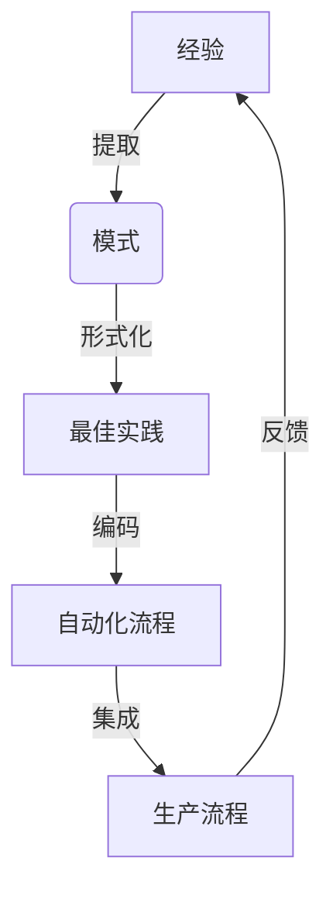

# 莱特的启示：经验固化进生产流程

## 1. 背景介绍

### 1.1 问题的由来

在当今快节奏的软件开发环境中,我们面临着一个持续的挑战:如何将过去的经验和教训有效地融入到未来的开发实践中。随着技术的不断进化和新需求的不断涌现,我们常常发现自己重复着过去的错误,或者未能充分利用先前获得的宝贵经验。这种经验的流失不仅会降低开发效率,还可能导致代码质量下降、重复工作和不必要的技术债务。

### 1.2 研究现状

许多组织已经意识到这一问题的重要性,并采取了各种措施来尝试解决它。一些常见的做法包括代码审查、知识共享会议、最佳实践文档等。然而,这些方法往往效果有限,因为它们依赖于个人的主动性和持续的投入。此外,随着时间的推移和团队成员的变动,这些知识和经验很容易被遗忘或丢失。

### 1.3 研究意义

通过系统化地捕获和固化过去的经验,我们可以更有效地将这些宝贵的知识资产融入到未来的开发流程中。这不仅有助于提高代码质量和开发效率,还能促进团队协作和知识传递。通过将经验转化为可重用的实践和自动化流程,我们可以减少重复工作,避免常见错误,并确保最佳实践得到一致应用。

### 1.4 本文结构

本文将探讨如何将过去的经验和教训有效地融入到软件开发的生产流程中。我们将介绍一种名为"莱特"(LATHE)的方法,它提供了一个系统化的框架,用于捕获、分析和固化经验,并将其转化为可重用的实践和自动化流程。文章将分为以下几个部分:

1. 背景介绍
2. 核心概念与联系
3. 核心算法原理与具体操作步骤
4. 数学模型和公式详细讲解与举例说明
5. 项目实践:代码实例和详细解释说明
6. 实际应用场景
7. 工具和资源推荐
8. 总结:未来发展趋势与挑战
9. 附录:常见问题与解答

## 2. 核心概念与联系

在探讨"莱特"方法之前,我们需要了解一些核心概念及它们之间的联系。

1. **经验 (Experience)**: 这是我们希望捕获和利用的宝贵资源。它可以来自于过去的项目、代码审查、错误修复等各种来源。经验通常以非结构化的形式存在,如代码注释、文档、会议记录等。

2. **模式 (Patterns)**: 通过分析和总结经验,我们可以发现其中的共性和规律,从而提取出一般化的模式。这些模式描述了解决特定问题的通用方法或最佳实践。

3. **最佳实践 (Best Practices)**: 模式被进一步形式化和文档化,形成了一组明确定义的最佳实践。这些实践为解决特定问题提供了可重用的解决方案。

4. **自动化流程 (Automated Processes)**: 最佳实践被转化为可执行的代码或脚本,形成自动化的流程。这些流程可以集成到现有的开发工具链中,以确保最佳实践得到一致应用。

5. **生产流程 (Production Workflow)**: 自动化流程被集成到整个软件开发生命周期中,成为生产流程的一部分。这确保了经验和最佳实践在每个项目中都能得到应用和传递。

6. **反馈 (Feedback)**: 生产流程的执行会产生新的经验和教训,这些反馈将被用于改进和扩展现有的模式、最佳实践和自动化流程。

通过这个循环,我们可以持续地捕获、分析和固化经验,并将其融入到软件开发的生产流程中。这种方法不仅有助于提高代码质量和开发效率,还促进了知识共享和团队协作。

## 3. 核心算法原理 & 具体操作步骤

### 3.1 算法原理概述

"莱特"方法的核心算法原理是基于经验学习和模式识别。它包括以下几个关键步骤:

1. **经验收集**: 从各种来源(如代码审查、错误报告、会议记录等)收集相关的经验和教训。

2. **数据预处理**: 对收集到的经验数据进行清理、标准化和结构化,以便后续的模式分析。

3. **模式挖掘**: 使用机器学习和数据挖掘技术,从结构化的经验数据中发现潜在的模式和规律。

4. **模式评估**: 对发现的模式进行评估和筛选,确定哪些模式具有足够的普遍性和实用性,可以形成最佳实践。

5. **最佳实践形式化**: 将评估通过的模式形式化为明确定义的最佳实践,并进行文档化。

6. **自动化编码**: 将最佳实践转化为可执行的代码或脚本,形成自动化的流程。

7. **流程集成**: 将自动化流程集成到现有的开发工具链和生产流程中。

8. **反馈收集**: 从生产流程的执行中收集新的经验和反馈,用于改进和扩展现有的模式、最佳实践和自动化流程。

该算法的核心思想是通过自动化的方式,从大量的经验数据中发现潜在的模式,并将这些模式转化为可重用的最佳实践和自动化流程。这种方法可以有效地捕获和利用过去的经验,并将其融入到软件开发的生产流程中。

### 3.2 算法步骤详解

接下来,我们将详细解释"莱特"算法的每个步骤。

#### 3.2.1 经验收集

经验收集是整个过程的起点。我们需要从各种来源收集相关的经验和教训,包括但不限于:

- **代码审查**: 代码审查过程中发现的问题、最佳实践和改进建议。
- **错误报告**: 软件缺陷、异常和错误的详细描述和解决方案。
- **会议记录**: 设计评审、回顾会议和知识共享会议的记录。
- **个人笔记**: 开发人员在编码过程中记录的经验教训和技巧。
- **文档资料**: 技术文档、设计文档和最佳实践指南等。

收集的经验数据可能以各种形式存在,如文本文件、电子邮件、Wiki页面等。我们需要将这些数据统一收集并进行适当的存储和管理。

#### 3.2.2 数据预处理

收集到的经验数据通常是非结构化的,需要进行预处理以便后续的模式分析。预处理步骤包括:

1. **数据清理**: 去除无关数据、重复数据和噪声数据。
2. **标准化**: 将数据转换为统一的格式和表示形式。
3. **结构化**: 将非结构化的数据转换为结构化的形式,如关系数据库或NoSQL数据库。
4. **特征提取**: 从数据中提取相关的特征,如关键词、主题、代码片段等。
5. **标注**: 对数据进行人工标注,为后续的模式挖掘提供监督信息。

经过预处理后,数据将变得更加清晰、一致和结构化,为后续的模式挖掘奠定基础。

#### 3.2.3 模式挖掘

模式挖掘是算法的核心步骤,旨在从结构化的经验数据中发现潜在的模式和规律。我们可以使用各种机器学习和数据挖掘技术,包括但不限于:

- **聚类分析**: 根据数据的相似性将其分组,发现潜在的簇和模式。
- **频繁模式挖掘**: 发现在数据中频繁出现的项集或子序列模式。
- **主题建模**: 使用主题模型(如LDA)发现数据中的潜在主题和概念。
- **序列模式挖掘**: 从序列数据(如代码片段、执行日志等)中发现频繁的序列模式。
- **关联规则挖掘**: 发现数据中的关联规则和相关性。
- **异常检测**: 识别数据中的异常值和异常模式。

根据具体的应用场景和数据特征,我们可以选择合适的挖掘算法和技术。模式挖掘的目标是发现具有足够支持度和置信度的模式,这些模式可能反映了潜在的最佳实践或常见问题。

#### 3.2.4 模式评估

发现的模式需要进一步进行评估和筛选,以确定哪些模式具有足够的普遍性和实用性,可以形成最佳实践。评估标准可能包括:

- **支持度**: 模式在数据中出现的频率。
- **置信度**: 模式的可靠性和准确性。
- **覆盖范围**: 模式适用的场景和领域范围。
- **实用性**: 模式对实际开发实践的价值和影响。
- **一致性**: 模式与现有最佳实践和规范的一致性。
- **可解释性**: 模式的可理解性和可解释性。

评估过程可能需要人工参与,结合领域专家的知识和经验进行判断。通过评估,我们可以筛选出最有价值的模式,并将其形式化为明确定义的最佳实践。

#### 3.2.5 最佳实践形式化

评估通过的模式需要被形式化为明确定义的最佳实践,并进行文档化。形式化的过程包括:

1. **定义**: 清晰地定义最佳实践的目的、适用场景和预期结果。
2. **步骤描述**: 详细描述实现该最佳实践所需的具体步骤和操作。
3. **示例说明**: 提供具体的示例,说明如何应用该最佳实践。
4. **注意事项**: 列出需要注意的限制、边界情况和潜在问题。
5. **相关资源**: 提供相关的参考资料、工具和学习资源。
6. **版本控制**: 对最佳实践进行版本控制,以便跟踪和管理变更。

形式化的最佳实践文档应该清晰、易懂,并且可供整个团队参考和使用。这些文档不仅有助于知识传递,还为后续的自动化编码提供了基础。

#### 3.2.6 自动化编码

将形式化的最佳实践转化为可执行的代码或脚本,是实现自动化流程的关键步骤。自动化编码包括:

1. **需求分析**: 根据最佳实践文档,分析自动化流程的具体需求和约束条件。
2. **设计和架构**: 设计自动化流程的整体架构和模块划分。
3. **编码实现**: 根据设计,使用适当的编程语言和框架实现自动化流程。
4. **测试和验证**: 对自动化流程进行全面的测试和验证,确保其正确性和稳定性。
5. **部署和集成**: 将自动化流程部署到目标环境,并与现有的开发工具链和流程进行集成。
6. **文档和示例**: 为自动化流程提供详细的文档和使用示例,方便其他开发人员理解和使用。

自动化编码的目标是将最佳实践转化为可重用的代码或脚本,以确保这些实践能够在整个开发生命周期中得到一致应用。自动化流程可以集成到各种开发工具中,如代码编辑器、构建系统、测试框架等。

#### 3.2.7 流程集成

将自动化流程集成到现有的开发工具链和生产流程中,是确保经验和最佳实践得到有效利用的关键步骤。集成过程包括:

1. **工具链分析**: 分析现有的开发工具链,确定集成点和接口。
2. **接口开发**: 根据需要开发适当的接口和插件,以便将自动化流程无缝集成到工具链中。
3. **配置和部署**: 配置和部署自动化流程,确保其与工具链和流程的其他部分协同工作。
4. **测试和验