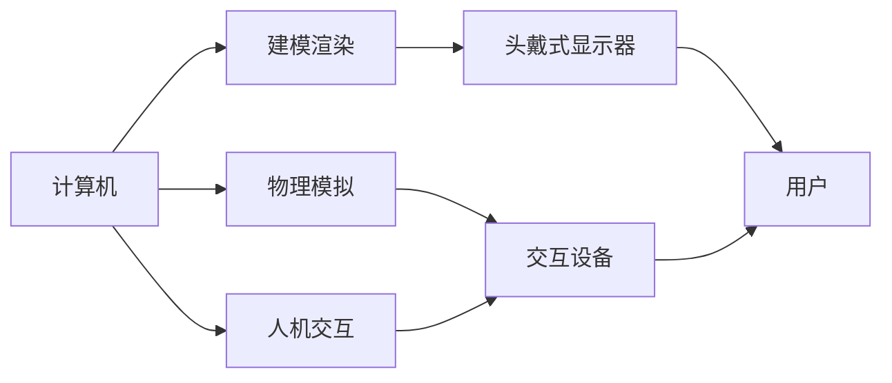

# 虚拟现实 (Virtual Reality)

关键词：虚拟现实、VR、沉浸式体验、头戴式显示器、交互、建模、渲染、传感器、Unity3D、Unreal Engine

## 1. 背景介绍
### 1.1 问题的由来
虚拟现实(Virtual Reality, VR)技术起源于20世纪60年代,随着计算机图形学、人机交互、传感器等技术的发展,VR技术在近年来得到了飞速发展。人们对沉浸式、交互式的虚拟体验有着巨大需求,VR为满足这一需求提供了可能。

### 1.2 研究现状
当前,VR技术已经在游戏娱乐、教育培训、医疗、工业设计等领域得到广泛应用。各大科技巨头如Facebook、Google、微软、索尼等纷纷进军VR领域。高校和研究机构也在VR领域开展了大量研究,取得了丰硕成果。

### 1.3 研究意义
VR技术的发展有助于推动人机交互向更自然、更智能的方向发展,为人们提供身临其境的虚拟体验。研究VR技术不仅具有重要的科学意义,在推动经济社会发展、提升人类生活品质等方面也具有重要作用。

### 1.4 本文结构
本文将首先介绍VR的核心概念,然后重点阐述VR的关键技术,包括建模、渲染、跟踪定位、人机交互等,并给出具体算法和案例。接着介绍VR的开发工具和应用案例。最后,展望VR技术的发展趋势和面临的挑战。

## 2. 核心概念与联系
虚拟现实是利用计算机生成逼真的三维虚拟环境,让用户沉浸其中并与之交互,从而获得身临其境的感受。VR的三个核心特征是:沉浸性、交互性和构想性。

沉浸性是指用户在虚拟环境中有一种"在场"的感觉。这需要多感官(视觉、听觉、触觉等)的刺激,以及高保真的场景渲染。
交互性是指用户能够与虚拟环境进行实时交互。这需要精确的动作捕捉和快速的系统响应。
构想性是指虚拟环境是人为构建的,可以超越真实世界的限制。这为创造力提供了无限空间。

VR系统通常由计算机、头戴式显示器(HMD)、交互设备(如数据手套)、传感器等组成。软件方面需要3D建模、实时渲染、物理模拟、人机交互等技术支持。



## 3. 核心算法原理 & 具体操作步骤
### 3.1 算法原理概述
VR的实现涉及计算机图形学、人机交互、传感器等多个领域的算法。其中最核心的是实时渲染和人机交互。

实时渲染需要在毫秒级响应用户的交互操作,并生成逼真的画面。常用的算法有光线追踪、光栅化等。
人机交互需要精确捕捉用户的动作,并给出实时反馈。常用的是惯性测量单元(IMU)、视觉跟踪等算法。

### 3.2 算法步骤详解
以光栅化渲染管线为例,其主要步骤包括:

1. 顶点着色器(Vertex Shader):将3D模型的顶点从模型空间变换到屏幕空间。
2. 图元装配(Primitive Assembly):将顶点组装成三角形等图元。
3. 光栅化(Rasterization):将图元转化为屏幕上的像素片段(Fragment)。
4. 片段着色器(Fragment Shader):计算每个片段的颜色值。
5. 测试与混合(Testing and Blending):根据深度等信息决定片段的可见性,并与颜色缓冲区混合。

### 3.3 算法优缺点
光栅化渲染的优点是速度快,适合实时渲染;缺点是渲染质量有限,难以处理全局光照等效果。

光线追踪渲染的优点是渲染质量高,可以产生逼真的光影效果;缺点是计算量大,实时性不足。

### 3.4 算法应用领域
渲染算法广泛应用于游戏、电影、工业仿真等领域。游戏领域通常使用光栅化渲染,电影则更多使用光线追踪。

人机交互算法在VR/AR、机器人等领域得到广泛应用。精确的动作捕捉对于沉浸感至关重要。

## 4. 数学模型和公式 & 详细讲解 & 举例说明
### 4.1 数学模型构建
VR中的许多算法都基于线性代数和矩阵运算。以3D变换为例,可以用4x4的变换矩阵来表示物体的平移、旋转、缩放等操作。

假设一个顶点的坐标为$(x,y,z,1)$,变换矩阵为$M$,则变换后的坐标为:

$$
\begin{bmatrix}
x' \\ y' \\ z' \\ 1
\end{bmatrix} = M \begin{bmatrix}
x \\ y \\ z \\ 1  
\end{bmatrix} = \begin{bmatrix}
m_{11} & m_{12} & m_{13} & m_{14} \\
m_{21} & m_{22} & m_{23} & m_{24} \\
m_{31} & m_{32} & m_{33} & m_{34} \\
m_{41} & m_{42} & m_{43} & m_{44}
\end{bmatrix} \begin{bmatrix}
x \\ y \\ z \\ 1
\end{bmatrix}
$$

### 4.2 公式推导过程
以平移变换为例,假设物体沿着$(dx,dy,dz)$方向平移,则变换矩阵为:

$$
T(dx,dy,dz) = \begin{bmatrix}
1 & 0 & 0 & dx \\  
0 & 1 & 0 & dy \\
0 & 0 & 1 & dz \\
0 & 0 & 0 & 1
\end{bmatrix}
$$

将顶点坐标与平移矩阵相乘:

$$
\begin{bmatrix}
x' \\ y' \\ z' \\ 1
\end{bmatrix} = \begin{bmatrix}
1 & 0 & 0 & dx \\
0 & 1 & 0 & dy \\  
0 & 0 & 1 & dz \\
0 & 0 & 0 & 1
\end{bmatrix} \begin{bmatrix}
x \\ y \\ z \\ 1  
\end{bmatrix} = \begin{bmatrix}
x+dx \\ y+dy \\ z+dz \\ 1
\end{bmatrix}
$$

可以看出,平移后的坐标为$(x+dx,y+dy,z+dz)$,与平移量相加。

### 4.3 案例分析与讲解
假设有一个立方体,初始位置为$(0,0,0)$,现在要将其沿$x$轴平移2个单位,沿$y$轴旋转90度,再沿$z$轴缩放0.5倍。

首先是平移变换,变换矩阵为:

$$
T(2,0,0) = \begin{bmatrix}
1 & 0 & 0 & 2 \\
0 & 1 & 0 & 0 \\
0 & 0 & 1 & 0 \\
0 & 0 & 0 & 1  
\end{bmatrix}
$$

然后是绕$y$轴旋转90度,变换矩阵为:

$$
R_y(90^\circ) = \begin{bmatrix}
\cos 90^\circ & 0 & \sin 90^\circ & 0 \\
0 & 1 & 0 & 0 \\
-\sin 90^\circ & 0 & \cos 90^\circ & 0 \\
0 & 0 & 0 & 1
\end{bmatrix} = \begin{bmatrix}
0 & 0 & 1 & 0 \\
0 & 1 & 0 & 0 \\
-1 & 0 & 0 & 0 \\  
0 & 0 & 0 & 1
\end{bmatrix}
$$

最后是沿$z$轴缩放0.5倍,变换矩阵为:

$$
S(1,1,0.5) = \begin{bmatrix}
1 & 0 & 0 & 0 \\
0 & 1 & 0 & 0 \\
0 & 0 & 0.5 & 0 \\
0 & 0 & 0 & 1
\end{bmatrix}  
$$

将三个变换矩阵相乘,得到最终的变换矩阵:

$$
M = S(1,1,0.5) \cdot R_y(90^\circ) \cdot T(2,0,0) \\
= \begin{bmatrix}
1 & 0 & 0 & 0 \\
0 & 1 & 0 & 0 \\
0 & 0 & 0.5 & 0 \\
0 & 0 & 0 & 1  
\end{bmatrix} \begin{bmatrix}
0 & 0 & 1 & 0 \\
0 & 1 & 0 & 0 \\
-1 & 0 & 0 & 0 \\
0 & 0 & 0 & 1  
\end{bmatrix} \begin{bmatrix}
1 & 0 & 0 & 2 \\
0 & 1 & 0 & 0 \\
0 & 0 & 1 & 0 \\
0 & 0 & 0 & 1    
\end{bmatrix} \\
= \begin{bmatrix}
0 & 0 & 1 & 2 \\  
0 & 1 & 0 & 0 \\
-0.5 & 0 & 0 & 0 \\
0 & 0 & 0 & 1
\end{bmatrix}
$$

将立方体的顶点坐标乘以变换矩阵$M$,就得到了变换后的坐标。

### 4.4 常见问题解答
1. 为什么要用4x4的矩阵,而不是3x3的?
   
   3x3矩阵只能表示旋转和缩放,不能表示平移。引入第4维度,就可以将平移统一到矩阵乘法中,简化计算。

2. 矩阵乘法的顺序有影响吗?
   
   有影响。矩阵乘法不满足交换律,不同的顺序得到的结果不同。通常应该按照缩放、旋转、平移的顺序相乘。

3. 如何表示绕任意轴的旋转?
   
   可以用四元数(Quaternion)或欧拉角(Euler Angle)来表示。它们可以避免万向锁(Gimbal Lock)等问题。

## 5. 项目实践：代码实例和详细解释说明
### 5.1 开发环境搭建
VR开发通常使用游戏引擎如Unity、Unreal Engine等。以Unity为例,需要安装:

- Unity编辑器
- 对应平台的SDK(如Android SDK、iOS SDK)
- VR设备的SDK(如Oculus SDK、SteamVR SDK)

### 5.2 源代码详细实现
以下是一个简单的Unity脚本,实现了物体的平移、旋转和缩放:

```csharp
using UnityEngine;

public class TransformExample : MonoBehaviour
{
    void Update()
    {
        // 平移
        transform.Translate(0.1f, 0, 0);

        // 旋转
        transform.Rotate(0, 1f, 0);

        // 缩放  
        transform.localScale *= 0.99f;
    }
}
```

### 5.3 代码解读与分析
- `transform.Translate`方法实现平移,参数分别为$x$、$y$、$z$方向的平移量。这里每帧沿$x$轴平移0.1个单位。
- `transform.Rotate`方法实现旋转,参数为绕$x$、$y$、$z$轴的旋转角度。这里每帧绕$y$轴旋转1度。
- `transform.localScale`属性表示物体的缩放。这里每帧将缩放系数乘以0.99,即不断缩小。

在Unity中,可以直接修改`Transform`组件的属性,引擎会自动计算变换矩阵并应用到顶点上。

### 5.4 运行结果展示
将上述脚本挂载到一个立方体上,运行游戏,可以看到立方体在不断平移、旋转、缩小。

通过脚本控制`Transform`,可