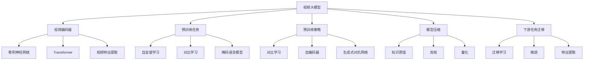

# 视频大模型的基本粒子创新

## 1. 背景介绍

### 1.1 问题的由来

在当今的数字时代,视频已经成为人们获取信息、娱乐和交流的主要方式之一。随着高清视频、4K视频和360度全景视频等新兴视频技术的不断涌现,视频数据的规模和复杂性也在不断增加。这对视频处理、分析和理解带来了巨大的挑战。

传统的视频处理方法主要依赖于手工设计的特征提取和模式识别算法,这些算法往往局限于特定场景,难以适应视频数据的多样性和复杂性。因此,需要一种新的视频处理范式来应对这一挑战。

### 1.2 研究现状

近年来,深度学习在计算机视觉、自然语言处理等领域取得了巨大成功,推动了人工智能的快速发展。基于这一背景,视频大模型(Video Large Model,VLM)作为一种新兴的视频处理范式应运而生。

视频大模型旨在通过预训练的方式,从海量视频数据中学习通用的视频表示,捕捉视频中的语义和上下文信息。这种通用视频表示可以支持下游的各种视频任务,如视频分类、目标检测、行为识别等。

目前,视频大模型的研究主要集中在以下几个方面:

1. 视频编码器(Video Encoder):设计高效的视频编码器网络结构,将原始视频数据映射为连续的向量表示。
2. 预训练任务(Pretraining Tasks):设计有效的自监督预训练任务,促进视频大模型学习有意义的视频表示。
3. 预训练策略(Pretraining Strategies):探索不同的预训练策略,如对比学习、掩码语言模型等,提高视频表示的质量。
4. 模型压缩(Model Compression):由于视频大模型通常具有巨大的模型容量,需要采用模型压缩技术以降低计算和存储开销。
5. 下游任务迁移(Downstream Task Transfer):研究视频大模型在下游视频任务上的迁移学习能力,提高泛化性能。

### 1.3 研究意义

视频大模型的研究具有重要的理论和应用价值:

1. **理论意义**:视频大模型为视频处理提供了一种全新的范式,有助于深入理解视频数据的本质特征和内在规律。同时,视频大模型的研究也可以推动深度学习、自监督学习等相关领域的发展。

2. **应用意义**:视频大模型可以支持广泛的视频应用场景,如视频理解、视频检索、视频编辑、视频安全等。它有望显著提高视频处理的性能和效率,推动人工智能在视频领域的落地应用。

### 1.4 本文结构

本文将全面介绍视频大模型的基本概念、核心算法原理、数学模型、项目实践、应用场景等内容。文章结构如下:

1. 背景介绍
2. 核心概念与联系
3. 核心算法原理与具体操作步骤
4. 数学模型和公式详细讲解与举例说明
5. 项目实践:代码实例和详细解释说明
6. 实际应用场景
7. 工具和资源推荐
8. 总结:未来发展趋势与挑战
9. 附录:常见问题与解答

## 2. 核心概念与联系

视频大模型涉及多个核心概念,它们相互关联,共同构建了视频大模型的理论基础和技术框架。以下是这些核心概念及其联系:

1. **视频编码器(Video Encoder)**:视频编码器是视频大模型的核心组件,负责将原始视频数据映射为连续的向量表示。常用的视频编码器包括基于卷积神经网络(CNN)和Transformer的结构。

2. **预训练任务(Pretraining Tasks)**:预训练任务是视频大模型学习通用视频表示的关键。常见的预训练任务包括自监督学习任务(如对比学习、掩码语言模型等)。

3. **预训练策略(Pretraining Strategies)**:预训练策略指定了视频大模型如何从大规模视频数据中学习有意义的表示。常见的预训练策略包括对比学习、自编码器、生成式对抗网络等。

4. **模型压缩(Model Compression)**:由于视频大模型通常具有巨大的模型容量,需要采用模型压缩技术(如知识蒸馏、剪枝、量化等)以降低计算和存储开销。

5. **下游任务迁移(Downstream Task Transfer)**:视频大模型通过迁移学习(如微调、特征提取等)将预训练得到的通用视频表示应用于下游视频任务,提高任务性能。

这些核心概念相互关联,共同构建了视频大模型的理论基础和技术框架。视频编码器负责提取视频特征,预训练任务和策略促进学习有意义的视频表示,模型压缩降低计算开销,而下游任务迁移则将预训练的视频表示应用于实际任务。

## 3. 核心算法原理与具体操作步骤

### 3.1 算法原理概述

视频大模型的核心算法原理可以概括为两个主要步骤:预训练(Pretraining)和微调(Finetuning)。

1. **预训练阶段**:在这一阶段,视频大模型从大规模的视频数据集中学习通用的视频表示。具体步骤包括:

   a. 构建视频编码器网络,将原始视频数据映射为连续的向量表示。
   b. 设计自监督预训练任务,如对比学习、掩码语言模型等。
   c. 采用预训练策略(如对比学习、自编码器等)优化视频编码器,使其学习到有意义的视频表示。

2. **微调阶段**:在这一阶段,将预训练得到的视频大模型迁移到特定的下游视频任务上,通过微调的方式进一步优化模型参数,提高任务性能。具体步骤包括:

   a. 根据下游任务的特点,设计合适的损失函数和优化器。
   b. 在特定任务的训练数据上,微调预训练模型的部分或全部参数。
   c. 评估微调后模型在验证集上的性能,并在测试集上进行最终评估。

通过预训练和微调的两阶段训练策略,视频大模型可以有效地利用大规模视频数据学习通用的视频表示,并将这种表示迁移到特定的下游视频任务中,提高任务性能。

### 3.2 算法步骤详解

下面将详细介绍视频大模型算法的具体操作步骤:

#### 3.2.1 预训练阶段

1. **构建视频编码器网络**

   视频编码器网络的设计是预训练阶段的关键。常见的视频编码器包括基于卷积神经网络(CNN)和Transformer的结构。

   - **CNN-based Video Encoder**:利用3D卷积神经网络(如C3D、I3D等)对视频帧序列进行编码,捕捉时空特征。
   - **Transformer-based Video Encoder**:采用Vision Transformer等结构,将视频帧序列拆分为patch序列,通过Transformer编码器捕捉长程依赖关系。

2. **设计自监督预训练任务**

   设计有效的自监督预训练任务,促进视频大模型学习有意义的视频表示。常见的预训练任务包括:

   - **对比学习(Contrastive Learning)**:通过最大化正样本对之间的相似性,最小化正负样本对之间的相似性,学习视频表示。
   - **掩码语言模型(Masked Language Modeling)**:类似于NLP中的BERT,通过预测被掩码的视频patch,学习视频表示。
   - **视频属性预测(Video Attribute Prediction)**:预测视频的属性(如运动类型、场景等),作为辅助预训练任务。

3. **采用预训练策略**

   采用合适的预训练策略,优化视频编码器网络,使其学习到有意义的视频表示。常见的预训练策略包括:

   - **对比学习(Contrastive Learning)**:通过对比损失函数,最大化正样本对之间的相似性,最小化正负样本对之间的相似性。
   - **自编码器(Autoencoder)**:将视频编码为潜在表示,然后重构原始视频,通过重构损失优化编码器。
   - **生成式对抗网络(Generative Adversarial Networks)**:通过生成器和判别器的对抗训练,学习视频的潜在分布。

4. **预训练过程**

   在大规模视频数据集上执行预训练,优化视频编码器网络的参数。具体步骤包括:

   a. 准备预训练数据集,可以是大规模的开源视频数据集或自定义数据集。
   b. 定义预训练损失函数,如对比损失、重构损失等,根据选择的预训练任务和策略。
   c. 选择优化器(如Adam、SGD等)和相关超参数(如学习率、批量大小等)。
   d. 执行预训练,迭代地优化视频编码器网络的参数,直到收敛或达到预设的训练步数。

经过预训练阶段,视频大模型将学习到通用的视频表示,为下游任务的微调做好准备。

#### 3.2.2 微调阶段

1. **准备下游任务数据集**

   根据具体的下游视频任务(如视频分类、目标检测、行为识别等),准备相应的训练、验证和测试数据集。

2. **设计下游任务损失函数**

   根据下游任务的特点,设计合适的损失函数,如交叉熵损失(分类任务)、focal loss(目标检测任务)等。

3. **微调模型参数**

   利用预训练得到的视频编码器参数作为初始化,在下游任务的训练数据上进行微调:

   a. 冻结预训练模型的部分参数(如视频编码器的底层参数),只微调其余参数。
   b. 或者解冻全部参数,对整个模型进行端到端的微调。

4. **评估模型性能**

   在验证集上评估微调后模型的性能,根据需要调整超参数或训练策略。最终在测试集上对模型进行评估。

通过预训练和微调的两阶段训练策略,视频大模型可以充分利用大规模视频数据学习通用的视频表示,并将这种表示迁移到特定的下游视频任务中,提高任务性能。

### 3.3 算法优缺点

视频大模型算法具有以下优缺点:

**优点**:

1. **数据利用效率高**:通过预训练的方式,视频大模型可以从大规模视频数据中学习通用的视频表示,充分利用数据。
2. **泛化性能好**:预训练得到的通用视频表示可以有效迁移到不同的下游视频任务,提高了模型的泛化能力。
3. **端到端训练**:视频大模型采用端到端的训练方式,无需手工设计特征,简化了模型设计和训练流程。
4. **多任务能力强**:通过微调,同一个预训练模型可以应用于多种下游视频任务,具有良好的多任务能力。

**缺点**:

1. **计算开销大**:视频大模型通常具有巨大的模型容量,训练和推理过程计算开销较大,需要采用模型压缩等技术进行优化。
2. **数据需求量大**:预训练视频大模型需要大规模的视频数据作为支撑,数据需求量巨大,对数据质量和多样性也有较高要求。
3. **解释性差**:视频