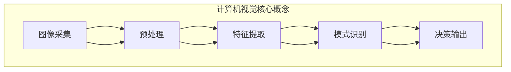

以下是题为《计算机视觉CV原理与代码实例讲解》的技术博客文章正文内容：

# 计算机视觉CV原理与代码实例讲解

## 1. 背景介绍

### 1.1 问题的由来

计算机视觉(Computer Vision, CV)是人工智能领域的一个重要分支,旨在使计算机能够从数字图像或视频中获取有意义的高层次信息。随着数字图像和视频数据的快速增长,对高效准确的计算机视觉技术的需求也与日俱增。计算机视觉技术广泛应用于多个领域,如自动驾驶、机器人视觉、人脸识别、医疗图像分析等。

### 1.2 研究现状  

早期的计算机视觉系统主要基于经典的机器学习算法和手工设计的特征,如HOG、SIFT等。近年来,随着深度学习技术的兴起,基于深度卷积神经网络(CNN)的计算机视觉方法取得了突破性进展,在图像分类、目标检测、语义分割等任务上性能大幅提升。

### 1.3 研究意义

计算机视觉技术可以极大提高图像数据的利用效率,为人工智能系统提供"视觉"能力,推动智能系统向更高级别发展。同时,计算机视觉也是实现自动驾驶、智能安防等前沿应用的关键技术。因此,深入研究计算机视觉的原理和实践具有重要的理论和应用价值。

### 1.4 本文结构

本文将全面介绍计算机视觉的核心概念、算法原理、数学模型、代码实现和应用场景。首先阐述计算机视觉的基本概念和流程;其次详细讲解主流的计算机视觉算法原理和数学模型;再次给出核心算法的代码实现示例;最后探讨计算机视觉在实际应用中的实践,并对未来发展趋势进行展望。

## 2. 核心概念与联系

计算机视觉系统通常包括以下核心步骤:

1. **图像采集**: 获取输入的数字图像或视频数据。
2. **预处理**: 对原始图像进行降噪、增强、校正等预处理,以提高后续处理的效果。
3. **特征提取**: 从预处理后的图像中提取有意义的特征,如边缘、角点、纹理等低级特征,或基于深度学习提取的高级语义特征。
4. **模式识别**: 基于提取的特征,利用机器学习或深度学习模型对图像中的目标进行分类、检测、分割等任务。
5. **决策输出**: 根据模式识别的结果,输出最终的决策,如目标类别、位置、语义mask等。

上述各个步骤相互关联,共同构建了完整的计算机视觉系统。其中,特征提取和模式识别是计算机视觉的核心环节,直接决定了系统的性能表现。

## 3. 核心算法原理 & 具体操作步骤  

### 3.1 算法原理概述

计算机视觉涉及多种核心算法,主要包括:

1. **图像分类算法**: 将图像按类别进行识别和分类,如ImageNet分类等。主流方法有基于CNN的分类网络,如AlexNet、VGGNet、ResNet等。

2. **目标检测算法**: 在图像中定位并识别出感兴趣的目标物体,如行人、车辆等。经典算法有R-CNN系列、YOLO系列、SSD等。

3. **语义分割算法**: 对图像中的每个像素点进行分类,得到图像的像素级语义mask。主流方法有FCN、U-Net、Mask R-CNN等。

4. **实例分割算法**: 在语义分割的基础上,将属于同一类别的目标进行实例化分离。常用算法有Mask R-CNN、YOLACT等。

5. **视频目标跟踪算法**: 在视频序列中持续跟踪感兴趣目标的运动轨迹。经典算法有相关滤波、Mean-Shift、CAMSHIFT等。

以上算法均基于深度学习模型,主要区别在于网络结构和损失函数的设计。

### 3.2 算法步骤详解

以目标检测算法为例,详细介绍其核心步骤:

1. **网络架构**:
   - 主干网络(Backbone): 通常采用预训练的分类网络(VGG、ResNet等)作为特征提取器。
   - 颈部网络(Neck): 融合不同尺度的特征,如FPN、PAN等。
   - 检测头(Head): 基于特征预测目标边界框和类别,如RPN、YOLO Head等。

2. **网络训练**:
   - 标注数据: 需要标注目标边界框和类别标签。
   - 损失函数: 边界框回归损失(如SmoothL1损失)和分类损失(如交叉熵损失)的加权和。
   - 优化器: 常用SGD、Adam等优化算法。

3. **网络预测**:
   - 先由主干网络提取特征图。
   - 然后通过颈部网络融合多尺度特征。 
   - 最后由检测头预测目标边界框和类别分数。

4. **后处理**:
   - 非极大值抑制(NMS): 去除重叠的冗余检测框。
   - 软件/硬件加速: 利用GPU/TPU/NPU等加速预测。

通过上述步骤,目标检测算法可以高效准确地在图像中定位并识别出感兴趣的目标。

### 3.3 算法优缺点

**优点**:

- 准确性高: 基于深度学习的算法能够学习到有效的高级语义特征,提高了目标识别和定位的准确率。
- 泛化性强: 深度模型具有良好的泛化能力,可以适应不同场景和数据分布。
- 端到端训练: 算法流程可以端到端地进行训练,无需手工设计复杂的特征。

**缺点**:

- 训练数据需求大: 深度模型需要大量高质量的标注数据进行有效训练。
- 计算资源消耗高: 训练和推理过程对GPU等硬件资源的需求较大。
- 可解释性较差: 深度网络内部的特征学习过程较为"黑箱"。
- 对小目标和密集场景的检测效果仍有待提升。

### 3.4 算法应用领域

计算机视觉算法在多个领域有着广泛的应用:

- **自动驾驶**: 车载摄像头结合目标检测、分割、跟踪等算法,实现障碍物检测、车道线识别、交通标志检测等功能,是自动驾驶的关键技术。

- **机器人视觉**: 机器人借助计算机视觉算法对环境进行感知,实现抓取、导航、检测等任务。

- **人脸识别**: 利用图像分类和目标检测算法,对人脸图像进行身份识别,广泛应用于安防、考勤等领域。

- **医疗影像分析**: 基于图像分割算法,可以自动从医学影像(CT、MRI等)中分割出感兴趣的器官或病灶区域,辅助医生诊断。

- **无人机航拍**: 结合目标检测和跟踪算法,可实现对地面目标的自动识别和跟踪。

- **智能视频分析**: 通过对视频画面进行语义理解,可实现智能监控、行为分析等应用。

## 4. 数学模型和公式 & 详细讲解 & 举例说明

### 4.1 数学模型构建

计算机视觉算法通常基于概率模型和深度神经网络模型。以目标检测为例,其数学模型可表示为:

$$
P(C, B|I) = P(C|I)P(B|C, I)
$$

其中:
- $I$表示输入图像
- $C$表示目标类别
- $B$表示目标边界框
- 目标是最大化$P(C, B|I)$,也就是同时预测准确的目标类别$C$和边界框$B$。

该联合概率可以分解为两个部分:
1) 目标分类概率$P(C|I)$
2) 边界框回归概率$P(B|C, I)$

对应地,目标检测网络也由两个子网络组成:
1) 分类子网络,基于特征图预测每个锚框的类别概率。
2) 回归子网络,基于特征图预测每个锚框的边界框坐标偏移量。

### 4.2 公式推导过程

以YOLO (You Only Look Once)目标检测算法为例,介绍其损失函数的推导过程:

YOLO将图像划分为$S \times S$个网格,每个网格负责预测该区域内的目标。如果一个目标的中心落在某个网格内,则该网格需要预测:
1) 目标的边界框坐标$\hat{b}_x, \hat{b}_y, \hat{b}_w, \hat{b}_h$
2) 目标的置信度(Objectness)得分$\hat{C}$  
3) 目标的条件类别概率$\hat{p}_i$

为衡量预测值与真实值的偏差,定义以下损失函数:

1) 边界框坐标损失:
   $$
   \lambda_{coord}\sum_{i=0}^{S^2}\sum_{j=0}^{B}1_{ij}^{obj}[(x_i-\hat{x}_i)^2 + (y_i-\hat{y}_i)^2 + (\sqrt{w_i}-\sqrt{\hat{w}_i})^2 + (\sqrt{h_i}-\sqrt{\hat{h}_i})^2]
   $$

2) 目标置信度损失:
   $$
   \lambda_{noobj}\sum_{i=0}^{S^2}\sum_{j=0}^{B}1_{ij}^{noobj}(\hat{C}_i)^2 + \lambda_{obj}\sum_{i=0}^{S^2}\sum_{j=0}^{B}1_{ij}^{obj}(C_i-\hat{C}_i)^2
   $$
   
3) 类别概率损失:
   $$
   \sum_{i=0}^{S^2}1_{i}^{obj}\sum_{c\in\text{classes}}(p_i(c)-\hat{p}_i(c))^2
   $$

最终损失函数为上述三项加权和:

$$
\mathcal{L} = \mathcal{L}_{coord} + \mathcal{L}_{conf} + \mathcal{L}_{class}
$$

通过最小化该损失函数,可以同时优化边界框坐标、置信度和类别概率的预测精度。

### 4.3 案例分析与讲解

以PASCAL VOC数据集为例,分析YOLO算法在目标检测任务上的表现:

上图展示了YOLO在PASCAL VOC数据集上的目标检测结果,算法能够准确检测出图像中的多个目标(人、车辆、动物等),并给出每个目标的类别和边界框。

具体来看,YOLO算法有以下几个显著特点:

1. **端到端预测**:YOLO将目标检测任务建模为单个回归问题,端到端地直接从图像像素预测目标边界框和类别,无需复杂的候选框生成和后处理步骤。

2. **预测速度快**:由于简化了网络结构,YOLO的预测速度明显快于传统的两阶段目标检测算法,能够实现实时检测。

3. **泛化能力强**:YOLO在学习目标分类和检测任务时,利用了图像的全局信息,因此对小目标、遮挡目标等情况的泛化能力较好。

4. **定位精度略低**:相比于基于候选框的两阶段算法,YOLO在密集场景下的定位精度稍差,存在一定的误检和漏检。

总的来说,YOLO在检测精度和速度之间取得了较好的平衡,特别适合于对实时性要求较高的应用场景。

### 4.4 常见问题解答

**Q: 为什么基于深度学习的算法在计算机视觉任务上表现优异?**

A: 深度神经网络具有强大的特征学习能力,能够自动从数据中挖掘出高级语义特征,而无需人工设计特征。这些高级特征对于解