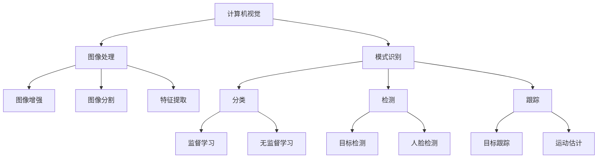
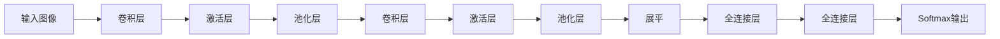

# 计算机视觉原理与代码实战案例讲解

## 1. 背景介绍

### 1.1 问题的由来

在当今数字化时代,图像和视频数据的爆炸式增长已成为不争的事实。从社交媒体上的自拍照片到安防监控录像,再到无人驾驶汽车的路况识别,图像和视频数据无处不在。然而,如何高效地从这些海量视觉数据中提取有价值的信息并加以利用,成为了一个亟待解决的挑战。这就催生了计算机视觉(Computer Vision)这一跨学科领域的兴起和蓬勃发展。

### 1.2 研究现状

计算机视觉技术的发展大致可分为三个阶段:

1. **经典计算机视觉阶段(20世纪60年代-20世纪90年代初)**: 该阶段主要集中在低层次视觉任务,如边缘检测、角点检测、图像分割等,并建立了一些基础理论模型,如小波变换、主成分分析等。这一阶段的主要挑战是视觉数据复杂多变、算法鲁棒性不足。

2. **统计学习阶段(20世纪90年代-21世纪10年代初)**: 随着统计学习理论的发展,如支持向量机、随机森林、条件随机场等,计算机视觉逐步向高层次视觉任务延伸,如目标检测、语义分割、行为分析等。这一阶段的主要挑战是特征表示的设计困难、大规模标注数据缺乏。

3. **深度学习阶段(21世纪10年代至今)**: benefiting from大数据和算力的支持,深度学习技术在计算机视觉领域取得了革命性的突破。卷积神经网络(CNN)、循环神经网络(RNN)等深度模型在众多视觉任务上展现出了超越人类的性能,推动了计算机视觉的飞速发展。目前,主要挑战集中在模型可解释性、泛化能力、鲁棒性等方面。

### 1.3 研究意义

计算机视觉技术的发展对于推动人工智能的实际应用具有重要意义:

1. **智能交通**: 通过对路况视频的分析,可实现智能驾驶辅助、交通流量监测等,提高交通运输效率和安全性。

2. **智能安防**: 利用视频监控数据,可实现人脸识别、行为分析等,提升公共安全和反恐能力。

3. **智能制造**: 应用于工业缺陷检测、自动化装配等,提高生产效率和产品质量。

4. **智能医疗**: 辅助医生诊断疾病,如CT、MRI等医学影像分析,提高诊断准确率。

5. **智能零售**: 实现客流统计、购物行为分析等,优化商业决策。

6. **多媒体娱乐**: 增强现实(AR)、虚拟现实(VR)等领域的视觉处理。

总之,计算机视觉技术是人工智能在实际应用中不可或缺的关键支柱。

### 1.4 本文结构

本文将从以下几个方面全面介绍计算机视觉的原理和实战案例:

1. 核心概念与联系
2. 核心算法原理和具体操作步骤
3. 数学模型与公式推导
4. 项目实践:代码实例和详细解释
5. 实际应用场景
6. 工具和学习资源推荐
7. 总结和展望

接下来,我们将逐一深入探讨上述内容。

## 2. 核心概念与联系

计算机视觉是一个庞大的跨学科领域,涉及图像处理、模式识别、机器学习等多个分支。其核心概念主要包括:

1. **图像处理(Image Processing)**: 对原始图像数据进行加工处理,以改善图像质量或提取有用信息。主要任务包括图像增强、图像分割、特征提取等。

2. **模式识别(Pattern Recognition)**: 利用机器学习算法从图像数据中识别出特定的模式或对象。主要任务包括分类、检测、跟踪等。

3. **机器学习(Machine Learning)**: 赋予计算机自动学习和优化的能力,是计算机视觉算法的核心驱动力。常用的有监督学习、无监督学习、深度学习等范式。

上述三个概念相互关联、环环相扣:图像处理为模式识别提供预处理和特征输入,模式识别依赖机器学习算法实现,而机器学习则需要图像处理提供标注数据。

## 3. 核心算法原理与具体操作步骤

计算机视觉涵盖了众多经典和前沿算法,本节将重点介绍其中一种广泛应用的核心算法:卷积神经网络(Convolutional Neural Network, CNN)。

### 3.1 算法原理概述

CNN是一种前馈神经网络,其灵感来源于生物学上视觉皮层的神经结构,专门用于处理网格结构数据(如图像)。CNN由多个卷积层和池化层交替组成,并在最后加上全连接层,从而实现端到端的图像特征提取和模式识别。

CNN的核心思想是**局部连接(Local Connectivity)**和**权值共享(Weight Sharing)**:

- 局部连接:每个神经元仅与输入数据的一个局部区域相连,从而获得数据的局部特征。
- 权值共享:同一个卷积核在整个输入数据上滑动,大大减少了网络参数量。

这种设计灵感来源于生物视觉系统的"简单细胞"和"复杂细胞"结构。简单细胞对局部输入模式高度敏感,而复杂细胞则对特定特征的位移和变形具有一定的不变性。

### 3.2 算法步骤详解

CNN通常包含以下主要层次:

1. **卷积层(Convolutional Layer)**: 将一个卷积核(Kernel)在输入数据(如图像)上滑动,对局部区域进行卷积操作,提取局部特征。

2. **激活层(Activation Layer)**: 通过非线性激活函数(如ReLU)增强网络的表达能力。

3. **池化层(Pooling Layer)**: 对卷积层的输出执行下采样操作,获得对平移、旋转等变化的鲁棒性。常用的有最大池化和平均池化。

4. **全连接层(Fully-Connected Layer)**: 将前面层的特征数据展平,并与全连接层的权重相乘,输出分类或回归结果。

以图像分类为例,CNN的基本流程如下:

1. 输入原始图像数据
2. 卷积层提取低级特征(如边缘、纹理等)
3. 激活层增强非线性表达能力
4. 池化层降低特征分辨率,提高位移不变性
5. 重复2-4步骤,提取更高级的语义特征
6. 将特征数据展平为一维向量
7. 全连接层对特征向量进行加权求和
8. Softmax输出预测类别概率

通过上述层次的协同工作,CNN能够自动从原始图像数据中逐层提取出越来越抽象的视觉特征,并最终完成分类或其他视觉任务。

### 3.3 算法优缺点

CNN算法的主要优点包括:

1. **局部连接**:减少了网络参数量,降低了过拟合风险。
2. **权值共享**:进一步降低参数量,减小计算开销。
3. **平移不变性**:通过池化层实现对位移、缩放等变换的鲁棒性。
4. **端到端学习**:无需人工设计特征提取器,可自动从数据中学习最优特征表示。

CNN的主要缺点包括:

1. **缺乏理论指导**:大多数设计选择(如网络深度、卷积核大小等)依赖经验和大量试错。
2. **对旋转不鲁棒**:尽管具有平移不变性,但对旋转变换仍然敏感。
3. **对遮挡敏感**:遮挡会破坏图像的局部结构,影响特征提取。
4. **需要大量数据**:深度模型参数众多,需要大量标注数据进行有效训练。

### 3.4 算法应用领域

CNN因其强大的特征学习能力,在计算机视觉的众多领域取得了卓越的应用成果:

1. **图像分类**: 将图像按类别(如猫、狗等)进行分类,在ImageNet等基准测试中表现出色。

2. **目标检测**: 在图像中同时识别出目标类别及其位置,是无人驾驶、安防监控等领域的关键技术。

3. **语义分割**: 对图像中的每个像素点进行分类,常应用于医学影像分析、无人驾驶场景理解等。

4. **实例分割**: 在语义分割的基础上,将属于同一个实体的像素点分到同一个实例,如同一张人脸。

5. **视频分析**: 结合RNN等模型,可用于行为识别、动作检测、目标跟踪等视频理解任务。

6. **图像生成**: 通过对抗生成网络(GAN),可用于图像超分辨率重建、图像翻译、图像修复等。

7. **迁移学习**: 利用在大型数据集(如ImageNet)上预训练的CNN模型,加速其他视觉任务的训练。

总之,CNN已成为计算机视觉领域最为广泛应用和成功的深度学习模型之一。

## 4. 数学模型和公式详细讲解举例说明

为了更深入理解CNN的原理,本节将介绍其数学模型及公式推导过程,并结合具体案例进行讲解。

### 4.1 数学模型构建

令输入图像为 $I$,卷积核为 $K$,卷积层输出特征图为 $O$。卷积运算可表示为:

$$O(i,j) = b + \sum_{m}\sum_{n}I(i+m,j+n)K(m,n)$$

其中 $b$ 为偏置项, $m、n$ 为卷积核的尺寸。

该公式描述了卷积核 $K$ 在输入图像 $I$ 上滑动,对每个局部区域进行加权求和,从而获得输出特征图 $O$ 上的每个像素值。

通过堆叠多个卷积层,可以提取出不同级别的特征:

$$
O_l = f\Big(W_l * O_{l-1} + b_l\Big)
$$

其中 $O_l$ 表示第 $l$ 层的输出特征图, $W_l$ 为第 $l$ 层的卷积核权重, $b_l$ 为偏置项, $f$ 为激活函数(如ReLU)。

池化层通常在卷积层之后,对特征图进行下采样,公式如下:

$$
O_l^{pool} = \text{pool}(O_l)
$$

其中 $\text{pool}$ 可以是最大池化或平均池化等操作。

最后,将多个卷积层和池化层的输出特征图展平,输入到全连接层,进行分类或回归任务:

$$
y = \text{softmax}(W^Tx + b)
$$

其中 $x$ 为展平后的特征向量, $W$ 和 $b$ 为全连接层的权重和偏置, $\text{softmax}$ 函数用于多分类问题。

通过以上公式,我们可以构建出端到端的CNN模型,并利用反向传播算法和优化器(如SGD)对模型参数进行学习和更新。

### 4.2 公式推导过程

接下来,我们将推导卷积层的前向传播和反向传播公式,以深