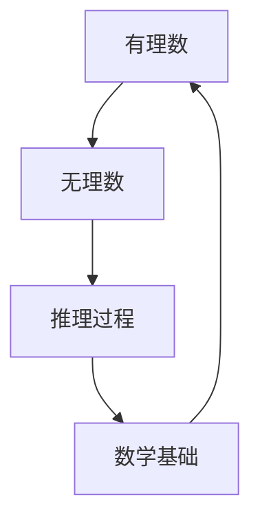

# 计算：第一部分 计算的诞生 第 1 章 毕达哥拉斯的困惑 悖论：推理的暗面

## 1. 背景介绍

### 1.1 问题的由来

在古希腊时期，毕达哥拉斯学派对数学和哲学产生了深远的影响。他们发现了一些基本的数学规律,如勾股定理等。然而,在探索有理数和无理数的关系时,他们遇到了一个令人困惑的悖论。

这个悖论源于对"无理数"的发现。无理数是指那些不能被有限或无限循环小数表示的数,例如π和√2。这种发现与毕达哥拉斯学派的核心理念相矛盾,即"一切都是有理数"。

### 1.2 研究现状

这个悖论引发了哲学家和数学家的广泛讨论和研究。一些学者试图否认无理数的存在,而另一些人则接受了这个事实,并努力解释它。然而,直到19世纪,数学家们才真正理解了无理数的本质,并将其纳入数学理论体系。

### 1.3 研究意义

毕达哥拉斯的困惑揭示了推理过程中潜在的陷阱和局限性。它提醒我们,即使是看似合理的假设,也可能会在某些情况下失效。这个悖论促进了人们对数学基础的重新思考,并推动了数学理论的发展。

### 1.4 本文结构

本文将首先介绍毕达哥拉斯学派的核心理念和无理数的发现。然后,我们将深入探讨这个悖论的本质,以及它对推理过程的影响。接下来,我们将分析数学家们是如何解决这个困境的,并将无理数纳入数学理论体系。最后,我们将总结这个悖论对数学和逻辑思维的重要启示。

## 2. 核心概念与联系

毕达哥拉斯的困惑涉及了几个核心概念,包括有理数、无理数、推理过程和数学基础。这些概念之间存在着密切的联系。

1. **有理数**是指可以用两个整数的比值表示的数。毕达哥拉斯学派最初认为,所有数都是有理数。
2. **无理数**是指不能被有限或无限循环小数表示的数,如π和√2。无理数的发现打破了毕达哥拉斯学派的核心理念。
3. **推理过程**是人们获取知识和解决问题的过程。毕达哥拉斯的困惑揭示了推理过程中可能存在的悖论和陷阱。
4. **数学基础**是数学理论体系的基石。无理数的发现促使数学家们重新思考数学的基础,并推动了数学理论的发展。

这些概念相互影响,形成了一个紧密相连的网络。无理数的发现挑战了有理数的概念,从而引发了对推理过程和数学基础的反思。

## 3. 核心算法原理 & 具体操作步骤

### 3.1 算法原理概述

虽然毕达哥拉斯的困惑并不直接涉及算法,但它揭示了推理过程中可能存在的逻辑悖论。为了解决这个困境,数学家们提出了一种新的算法,用于确定一个数是否为有理数或无理数。

该算法的核心思想是利用连分数(Continued Fractions)的概念。连分数是一种表示有理数和无理数的方法,它将一个数表示为一系列整数的和或差的形式。

$$x = a_0 + \cfrac{1}{a_1 + \cfrac{1}{a_2 + \cfrac{1}{a_3 + \cdots}}}$$

其中,$a_0$是整数部分,$a_1, a_2, a_3, \cdots$是分数部分。

### 3.2 算法步骤详解

1. **初始化**:给定一个实数$x$,我们需要确定它是有理数还是无理数。
2. **计算整数部分**:将$x$的整数部分记为$a_0$,即$a_0 = \lfloor x \rfloor$。
3. **计算分数部分**:计算$x - a_0$的倒数,记为$f_1$。如果$f_1$是整数,则$x$是有理数,算法结束。否则,将$f_1$的整数部分记为$a_1$。
4. **迭代计算**:对于$i \geq 2$,计算$f_{i-1} - a_{i-1}$的倒数,记为$f_i$。如果$f_i$是整数,则$x$是有理数,算法结束。否则,将$f_i$的整数部分记为$a_i$。
5. **判断条件**:如果在某一步骤中,出现了之前已经出现过的$f_i$,则$x$是无理数,算法结束。否则,继续迭代。

通过这个算法,我们可以确定一个数是有理数还是无理数。如果算法在有限步骤内终止,则该数是有理数;否则,它是无理数。

### 3.3 算法优缺点

**优点**:

- 算法简单易懂,基于连分数的概念,具有数学理论基础。
- 能够准确判断一个数是有理数还是无理数,解决了毕达哥拉斯的困惑。
- 算法具有一般性,可以应用于任何实数。

**缺点**:

- 对于某些无理数,算法可能需要进行大量的迭代计算,效率较低。
- 算法无法直接给出无理数的精确值,只能确定它是无理数。
- 算法只能判断单个数字,无法处理更复杂的数学表达式。

### 3.4 算法应用领域

虽然这个算法最初是为解决毕达哥拉斯的困惑而提出的,但它在数论和计算机科学等领域也有广泛的应用。

- **数论**:在研究有理数和无理数的性质时,这个算法可以用于判断一个数是否为有理数或无理数。
- **计算机科学**:在计算机程序中,常常需要判断一个数字是否为有理数或无理数,以进行相应的处理。这个算法可以提供一种有效的方法。
- **符号计算**:在符号计算系统中,需要对数学表达式进行简化和化简。判断表达式中是否存在无理数是一个重要的步骤,这个算法可以为此提供支持。

总的来说,虽然这个算法看似简单,但它在数学和计算机科学领域具有重要的理论和实际应用价值。

## 4. 数学模型和公式 & 详细讲解 & 举例说明

### 4.1 数学模型构建

为了更好地理解有理数和无理数的概念,我们可以构建一个数学模型。

设$\mathbb{Q}$表示有理数集合,即所有可以表示为$\frac{p}{q}$形式的数,其中$p$和$q$是整数,且$q \neq 0$。

设$\mathbb{R}$表示实数集合,包括所有有理数和无理数。

我们可以将$\mathbb{Q}$看作是$\mathbb{R}$的一个真子集,即$\mathbb{Q} \subset \mathbb{R}$。

$$\mathbb{R} = \mathbb{Q} \cup \{\text{无理数}\}$$

这个模型清楚地表明,无理数是实数集合中除有理数之外的其他元素。

### 4.2 公式推导过程

我们可以利用连分数的概念,推导出判断一个数是否为有理数的公式。

设$x$是一个实数,我们希望确定它是否为有理数。根据连分数的定义,我们可以将$x$表示为:

$$x = a_0 + \cfrac{1}{a_1 + \cfrac{1}{a_2 + \cfrac{1}{a_3 + \cdots}}}$$

其中,$a_0$是$x$的整数部分,$a_1, a_2, a_3, \cdots$是分数部分。

如果$x$是有理数,则它的连分数表示在某一步骤后将终止,即存在一个整数$n$,使得$a_{n+1} = 0$。反之,如果$x$是无理数,则它的连分数表示将无限延续下去。

因此,我们可以得到判断$x$是否为有理数的公式:

$$x \in \mathbb{Q} \Leftrightarrow \exists n \in \mathbb{N}, a_{n+1} = 0$$

这个公式为我们提供了一种判断实数是否为有理数的方法。

### 4.3 案例分析与讲解

让我们通过一些具体的例子来说明上述算法和公式的应用。

**例1:判断$\frac{5}{3}$是否为有理数**

1) 初始化:$x = \frac{5}{3}$
2) 计算整数部分:$a_0 = \lfloor \frac{5}{3} \rfloor = 1$
3) 计算分数部分:$f_1 = \frac{1}{\frac{5}{3} - 1} = \frac{3}{2}$,因为$f_1$不是整数,所以$a_1 = \lfloor \frac{3}{2} \rfloor = 1$
4) 继续计算:$f_2 = \frac{1}{\frac{3}{2} - 1} = 2$,因为$f_2$是整数,所以$\frac{5}{3}$是有理数。

根据公式:$\frac{5}{3} = 1 + \cfrac{1}{1 + \cfrac{1}{2}}$,存在$n = 1$使得$a_{n+1} = 0$,因此$\frac{5}{3} \in \mathbb{Q}$。

**例2:判断$\pi$是否为有理数**

1) 初始化:$x = \pi$
2) 计算整数部分:$a_0 = \lfloor \pi \rfloor = 3$
3) 计算分数部分:$f_1 = \frac{1}{\pi - 3} \approx 0.1412537...$,因为$f_1$不是整数,所以$a_1 = \lfloor 0.1412537... \rfloor = 0$
4) 继续计算:$f_2 = \frac{1}{0.1412537...} \approx 7.0796326...$,因为$f_2$不是整数,所以$a_2 = \lfloor 7.0796326... \rfloor = 7$
5) 继续计算:$f_3 = \frac{1}{0.0796326...} \approx 12.5492965...$,因为$f_3$不是整数,所以$a_3 = \lfloor 12.5492965... \rfloor = 12$
6) 经过多次迭代,我们发现连分数表示不会终止,且没有出现重复的$f_i$。

因此,根据算法和公式,我们可以确定$\pi$是一个无理数,即$\pi \notin \mathbb{Q}$。

通过这些例子,我们可以清楚地看到,连分数提供了一种判断实数是否为有理数的有效方法,从而解决了毕达哥拉斯的困惑。

### 4.4 常见问题解答

**Q1:为什么要使用连分数来判断一个数是否为有理数?**

A1:连分数是一种表示有理数和无理数的优雅方式,它可以清晰地展示有理数和无理数的区别。有理数的连分数表示在某一步骤后将终止,而无理数的连分数表示将无限延续下去。这种特性为我们提供了一种判断实数是否为有理数的方法。

**Q2:算法中为什么要检查是否出现了重复的$f_i$?**

A2:如果在计算过程中出现了重复的$f_i$,那么意味着连分数表示进入了一个无限循环,这是无理数的典型特征。因此,检查重复的$f_i$是确定一个数是否为无理数的关键步骤。

**Q3:这个算法是否适用于所有实数?**

A3:理论上,这个算法适用于所有实数。然而,对于某些无理数,算法可能需要进行大量的迭代计算才能确定它是无理数,效率较低。此外,算法无法直接给出无理数的精确值,只能确定它是无理数。

**Q4:除了判断实数是否为有理数,这个算法还有其他应用吗?**

A4:是的,这个算法在数论和计算机科学等领域也有广泛的应用。例如,在计算机程序中,常常需要判断一个数