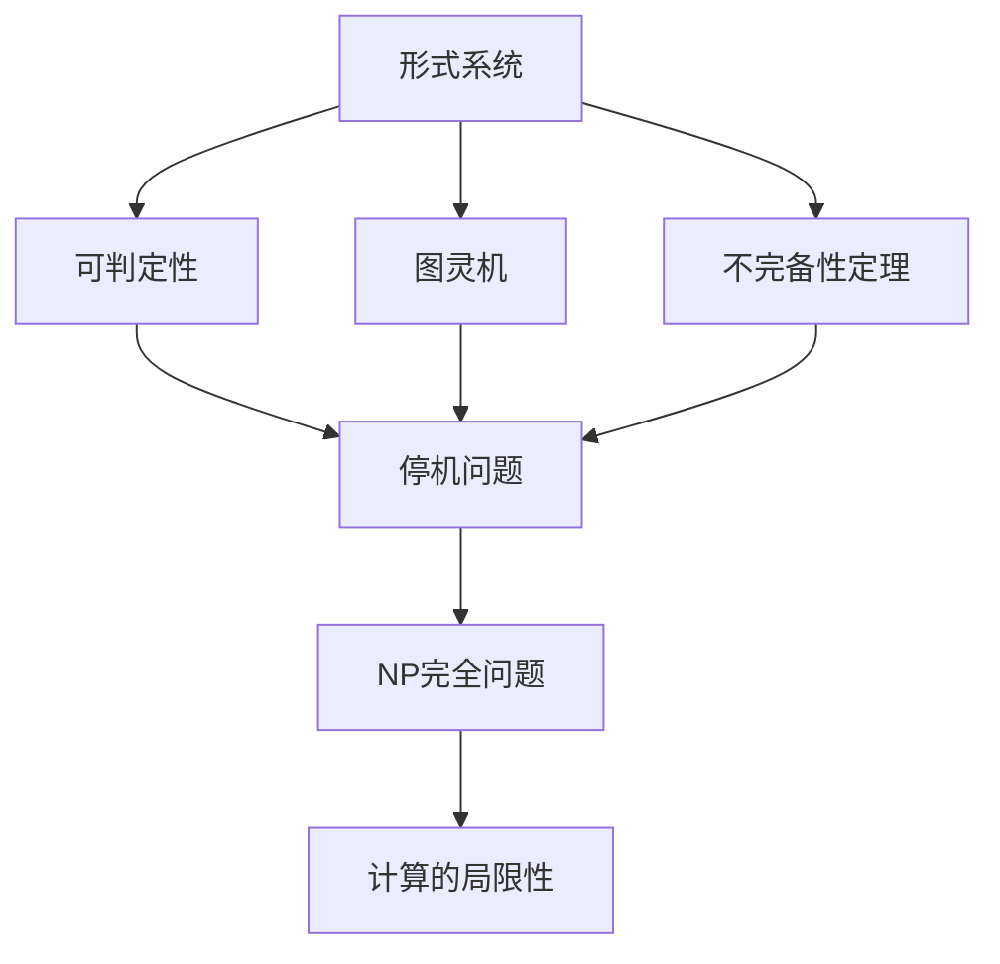

# 计算：第三部分 计算理论的形成 第 7 章 计算不能做什么：终结者哥德尔 我们必须知道，我们必将知道

## 1. 背景介绍

### 1.1 问题的由来

自古以来，人类一直对"计算"这一概念有着浓厚的兴趣和探索欲望。从最初的算盘、算筹到如今的现代计算机,计算的能力和效率不断提升,已经渗透到了我们生活的方方面面。然而,在这个过程中,一个根本性的问题也随之浮现:计算是否有其内在的局限性?是否存在某些问题,无论计算能力有多强,都无法被有效解决?

这个看似简单的问题,实则揭示了计算理论的一个核心命题。20世纪30年代,奥地利逻辑学家库尔特·哥德尔(Kurt Gödel)提出了著名的"不完备性定理"(Incompleteness Theorems),这一定理不仅在逻辑学和数学基础领域产生了深远影响,更为计算理论的发展带来了全新的视角。

### 1.2 研究现状

哥德尔的不完备性定理揭示了任何足够复杂的形式系统都存在内在的局限性,即存在某些命题在该系统中既无法证明,也无法证伪。这一结论直接冲击了当时盛行的"万能算法"(general algorithm)的观念,即人们曾经天真地认为,只要给出一个明确的规则集合,就能解决任何可计算的问题。

不完备性定理的提出,引发了学术界广泛的讨论和研究。著名的图灵机(Turing Machine)模型、停机问题(Halting Problem)等概念的提出,都与此密切相关。随着计算理论的不断发展,人们逐渐意识到计算的局限性是一个无法回避的事实,并开始探索这些局限性的具体内涵和影响。

### 1.3 研究意义

深入探讨计算的局限性,不仅有助于我们更好地理解计算的本质,还对计算机科学乃至整个信息技术领域产生了深远影响:

1. **理论基础**:计算理论为计算机科学奠定了坚实的理论基础,阐明了计算的边界和局限,为计算模型的构建和分析提供了指导。

2. **算法设计**:了解计算的局限性,有助于算法设计者更清晰地认识到算法的局限,从而避免追求"万能算法",转而关注特定问题的有效解决方案。

3. **复杂性理论**:复杂性理论研究问题的本质难度,与计算的局限性息息相关。深入探讨这一主题,有助于我们更好地分析和优化算法的时间和空间复杂度。

4. **人工智能**:人工智能的发展也与计算的局限性密切相关。了解这一主题,有助于我们清晰认识人工智能的边界,并合理设置发展目标和期望。

总之,探讨计算的局限性不仅是一个富有哲学意味的命题,更是计算机科学乃至整个信息技术领域不可或缺的重要课题。

### 1.4 本文结构

本文将从以下几个方面深入探讨计算的局限性:

1. 阐述哥德尔不完备性定理的核心内容及其对计算理论的影响。
2. 介绍图灵机模型、停机问题等与计算局限性密切相关的核心概念。
3. 分析计算局限性的数学模型及公式推导过程。
4. 通过实际案例,说明计算局限性在算法设计和复杂性理论中的体现。
5. 探讨计算局限性对人工智能发展的影响和挑战。
6. 总结计算局限性的研究现状,并展望未来的发展方向和应用前景。

## 2. 核心概念与联系

计算的局限性是一个涉及多个核心概念的复杂主题,这些概念相互关联、相互影响。为了更好地理解这一主题,我们需要先介绍以下几个核心概念:

1. **形式系统**(Formal System): 一个由一组符号、公理和推理规则组成的逻辑系统。形式系统是研究计算局限性的基础。

2. **可判定性**(Decidability): 指对于一个给定的形式语言,是否存在一个算法能够判断任意一个句子是否属于该语言。可判定性问题直接关系到计算的局限性。

3. **图灵机**(Turing Machine): 一种抽象的计算模型,被广泛认为是最通用的计算模型。图灵机的局限性直接反映了计算的局限性。

4. **停机问题**(Halting Problem): 判断一个给定的程序在特定输入下是否会终止运行。停机问题被证明是不可判定的,这体现了计算的局限性。

5. **不完备性定理**(Incompleteness Theorems): 哥德尔在1931年提出的两个重要定理,揭示了任何足够复杂的形式系统都存在内在的局限性。

6. **NP完全问题**(NP-Completeness): 复杂性理论中的一个重要概念,与计算的局限性密切相关。NP完全问题被认为是最难解决的一类问题。

这些核心概念相互关联、相互影响,共同构成了计算局限性这一主题的理论基础。下面我们将逐一深入探讨它们。

## 3. 核心算法原理 & 具体操作步骤

### 3.1 算法原理概述

探讨计算的局限性,核心算法原理主要包括以下几个方面:

1. **形式系统的构建**:首先需要构建一个形式系统,包括确定符号集、公理集和推理规则集。形式系统的复杂程度直接决定了计算局限性的表现形式。

2. **可判定性分析**:对于给定的形式语言,分析是否存在算法能够判断任意句子是否属于该语言。可判定性问题直接关系到计算的局限性。

3. **图灵机模拟**:利用图灵机这一最通用的计算模型,模拟形式系统中的计算过程。图灵机的局限性直接反映了计算的局限性。

4. **不完备性定理证明**:利用对角线构造法等技巧,证明形式系统的不完备性,即存在某些命题在该系统中既无法证明,也无法证伪。

5. **NP完全性分析**:将计算问题归约为已知的NP完全问题,从而证明该问题也是NP完全的,即计算复杂度极高,暴露了计算的局限性。

### 3.2 算法步骤详解

1. **构建形式系统**:
   - 确定符号集合,包括逻辑符号、变量、常量等。
   - 确定公理集合,作为推理的出发点。
   - 确定推理规则集合,用于从公理集合中导出新的命题。

2. **分析可判定性**:
   - 构造一个判定算法,尝试判断给定句子是否属于形式语言。
   - 如果存在这样的算法,则该形式语言是可判定的。
   - 如果不存在这样的算法,则该形式语言是不可判定的,暴露了计算的局限性。

3. **模拟图灵机**:
   - 将形式系统中的计算过程映射到图灵机上。
   - 模拟图灵机的运行,观察其局限性,如停机问题等。
   - 图灵机的局限性直接反映了计算的局限性。

4. **证明不完备性**:
   - 利用对角线构造法,构造一个特殊的命题。
   - 证明该命题在形式系统中既无法证明,也无法证伪。
   - 从而证明了形式系统的不完备性,暴露了计算的局限性。

5. **分析NP完全性**:
   - 将待分析的计算问题归约为已知的NP完全问题。
   - 如果归约成功,则该问题也是NP完全的。
   - NP完全问题被认为是最难解决的一类问题,体现了计算的局限性。

通过上述步骤,我们可以从不同角度揭示和分析计算的局限性,为计算理论的发展提供重要的理论基础。

### 3.3 算法优缺点

上述算法在揭示计算局限性方面具有以下优点:

- 理论基础扎实,源于数理逻辑和计算理论的核心概念。
- 算法步骤清晰,易于理解和实现。
- 可以从多个角度(形式系统、图灵机、NP完全性等)分析计算的局限性。
- 算法结果具有严谨的数学证明,可靠性高。

但也存在一些缺点和局限性:

- 算法过程较为抽象,与实际计算问题的联系不够紧密。
- 分析过程复杂,需要一定的数理逻辑和计算理论基础。
- 只能证明计算的局限性的存在,但无法给出具体的局限性边界。
- 对于一些特殊的计算问题,可能需要进一步改进和扩展算法。

### 3.4 算法应用领域

上述算法主要应用于以下几个领域:

1. **计算理论研究**:作为计算理论的核心算法,用于研究计算的本质、边界和局限性,为计算机科学奠定理论基础。

2. **形式验证**:在软件正确性验证、硬件设计验证等领域,可以利用该算法分析形式系统的局限性,从而评估验证的可靠性和完备性。

3. **复杂性理论**:该算法为复杂性理论提供了重要的理论支撑,有助于分析和优化算法的时间和空间复杂度。

4. **人工智能**:在人工智能领域,可以利用该算法分析智能系统的局限性,从而合理设置发展目标和期望。

5. **密码学**:密码学中的一些核心问题,如素数判定、离散对数等,与计算的局限性密切相关,可以借助该算法进行分析和研究。

总之,这一算法不仅是计算理论的基石,也为许多相关领域的发展提供了重要的理论支持和指导。

## 4. 数学模型和公式 & 详细讲解 & 举例说明

### 4.1 数学模型构建

为了更好地理解和分析计算的局限性,我们需要构建合适的数学模型。在这里,我们将借助形式系统和图灵机的概念,建立如下数学模型:

设 $F = (V, \Sigma, \Gamma, \delta, q_0, B, F)$ 为一个图灵机,其中:

- $V$ 是有限的字母表集合
- $\Sigma \subseteq V$ 是输入字母表
- $\Gamma \subseteq V$ 是带字母表,包含输入字母表和特殊字母 $B$ (空格)
- $\delta: Q \times \Gamma \rightarrow Q \times \Gamma \times \{L, R\}$ 是转移函数
- $q_0 \in Q$ 是初始状态
- $B \in \Gamma - \Sigma$ 是空格符号
- $F \subseteq Q$ 是终止状态集合

我们将形式系统 $S$ 映射到图灵机 $F$ 上,即将 $S$ 中的符号、公理和推理规则对应到 $F$ 的字母表、初始状态和转移函数上。

在这一模型下,我们可以定义如下概念:

1. **可计算函数**(Computable Function):如果一个函数 $f: \Sigma^* \rightarrow \Sigma^*$ 可以由某个图灵机 $F$ 计算,则称 $f$ 为可计算函数。

2. **可判定语言**(Decidable Language):如果一个语言 $L \subseteq \Sigma^*$ 可以由某个图灵机 $F$ 判定,即对任意字符串 $w$,如果 $w \in L$,则 $F$ 将停留在接受状态,否则将停留在拒绝状态,则称 $L$ 为可判定语言。

3. **不可判定语言**(Undecidable Language):如果一个语言不是可判定的,则称它为不可判定语言。

通过这一数学模