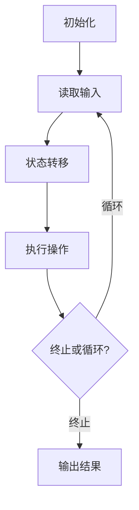

# 计算：第三部分 计算理论的形成 第 8 章 计算理论的诞生：图灵的可计算数 停机问题

## 1. 背景介绍

### 1.1 问题的由来

计算理论的诞生可以追溯到 20 世纪 30 年代，当时数学家和逻辑学家们对于"什么是可计算的"这一根本性问题展开了广泛的研究。在这一背景下，英国数学家艾伦·图灵(Alan Turing)提出了著名的"图灵机"概念，并证明了"停机问题"无法被任何程序解决，从而奠定了现代计算理论的基础。

### 1.2 研究现状

图灵的可计算数理论和停机问题不仅在理论计算机科学领域产生了深远的影响，也为人工智能、密码学等诸多领域的发展提供了坚实的理论基础。目前,计算理论在计算机科学、数学、逻辑学等多个学科中都有广泛的应用,是一个活跃的研究领域。

### 1.3 研究意义

深入理解图灵的可计算数理论和停机问题,对于我们认识计算的本质、计算机程序的局限性以及人工智能的发展前景都具有重要的意义。它不仅是计算机科学理论基础的重要组成部分,也为我们探索计算的边界和可能性提供了思路和方法。

### 1.4 本文结构

本文将首先介绍图灵可计算数理论的核心概念,包括图灵机、计算模型等。然后详细阐述停机问题的提出、证明过程以及其深远影响。接下来,我们将探讨停机问题在实际应用中的体现,以及它对于人工智能发展的启示。最后,本文将总结计算理论的发展趋势和面临的挑战。

## 2. 核心概念与联系

图灵可计算数理论的核心概念包括:

1. **图灵机(Turing Machine)**: 一种抽象的计算模型,由一个无限长的带状存储器(称为"带")和一个读写头组成。图灵机根据一系列规则在带上移动并修改带上的符号,从而实现计算。

2. **计算模型(Computational Model)**: 用于描述和研究计算过程的数学抽象,例如图灵机、λ演算、部分递归函数等。不同的计算模型具有等价的计算能力,被称为"图灵等价"。

3. **可计算数(Computable Number)**: 指可以由图灵机计算出来的数字。图灵证明了,可计算数的集合与通过有效过程(effective procedure)定义的数的集合是相同的。

4. **停机问题(Halting Problem)**: 判断一个给定的程序在给定的输入下是否会终止运行。图灵证明了停机问题是无法被任何程序解决的。

这些核心概念之间存在着紧密的联系,共同构成了图灵可计算数理论的理论框架。图灵机提供了一种研究计算过程的工具,而可计算数则描述了计算的边界。停机问题则揭示了计算机程序的局限性,对于理解人工智能的发展前景具有重要意义。

## 3. 核心算法原理 & 具体操作步骤

### 3.1 算法原理概述

图灵机的工作原理可以概括为:根据一系列规则,在带上移动并修改带上的符号,从而实现计算。具体来说,图灵机由以下几个部分组成:

1. **带(Tape)**: 一个无限长的带状存储器,用于存储输入数据和中间计算结果。
2. **读写头(Read-Write Head)**: 用于读取和修改带上的符号。
3. **状态寄存器(State Register)**: 记录图灵机当前所处的状态。
4. **状态转移函数(State Transition Function)**: 根据当前状态和读写头读取到的符号,确定下一步的操作(移动方向、写入符号、新状态)。

图灵机的计算过程可以看作是一系列离散的状态转移,每一步根据当前状态和输入符号,执行相应的操作,直到达到某个终止状态或进入无限循环。

### 3.2 算法步骤详解

图灵机的计算步骤可以总结为以下几个步骤:

1. **初始化**: 将输入数据写入带,读写头移动到带的起始位置,状态寄存器设置为初始状态。

2. **读取输入**: 读写头读取当前位置的符号。

3. **状态转移**: 根据当前状态和读取到的符号,查询状态转移函数,确定下一步的操作(移动方向、写入符号、新状态)。

4. **执行操作**: 执行状态转移函数指定的操作。

5. **终止或循环**: 如果达到终止状态,则计算结束;如果进入无限循环,则计算不会终止。

6. **输出结果**: 如果计算终止,则从带上读取计算结果。

需要注意的是,图灵机的计算过程是确定性的,也就是说,对于给定的输入和初始状态,计算过程是唯一确定的。

### 3.3 算法优缺点

图灵机作为一种计算模型,具有以下优点:

1. **简单性**: 图灵机的结构和工作原理非常简单,易于理解和分析。
2. **通用性**: 图灵机具有等价于任何可计算函数的计算能力,是一种通用的计算模型。
3. **理论基础**: 图灵机为计算理论提供了坚实的理论基础,促进了计算理论的发展。

但是,图灵机也存在一些缺点:

1. **抽象性**: 图灵机是一种高度抽象的计算模型,与实际的计算机硬件存在一定差距。
2. **有限性**: 尽管图灵机具有通用的计算能力,但它也受到停机问题等理论限制的约束。
3. **效率问题**: 图灵机的计算过程可能非常低效,无法满足实际应用的性能要求。

### 3.4 算法应用领域

尽管图灵机本身是一种抽象的计算模型,但它的理论基础和思想在许多领域都有重要应用:

1. **计算机科学**: 图灵机为计算机科学奠定了理论基础,影响了编程语言、编译器、操作系统等领域的发展。
2. **人工智能**: 图灵机的思想为人工智能的发展提供了理论支持,例如图灵测试、机器学习算法等。
3. **密码学**: 图灵机的理论为现代密码学提供了重要的数学基础,如一次性密码本、密钥交换协议等。
4. **复杂性理论**: 图灵机的计算复杂性理论为分析算法的时间和空间复杂度提供了理论依据。
5. **形式化验证**: 图灵机的思想为形式化验证软件正确性提供了基础,如模型检查、定理证明等技术。

## 4. 数学模型和公式 & 详细讲解 & 举例说明

### 4.1 数学模型构建

为了形式化描述图灵机的计算过程,我们需要构建一个数学模型。一种常见的表示方法是使用7元组来定义图灵机:

$$
M = (Q, \Gamma, b, \Sigma, \delta, q_0, F)
$$

其中:

- $Q$ 是图灵机的有限状态集合
- $\Gamma$ 是带字母表,包括输入符号和特殊的空白符号 $b$
- $\Sigma \subseteq \Gamma$ 是输入字母表
- $\delta: Q \times \Gamma \rightarrow Q \times \Gamma \times \{L, R\}$ 是状态转移函数
- $q_0 \in Q$ 是初始状态
- $F \subseteq Q$ 是终止状态的集合

在这个模型中,图灵机的计算过程可以看作是一系列的状态转移,由状态转移函数 $\delta$ 确定下一步的操作。

### 4.2 公式推导过程

我们可以使用数学归纳法来证明图灵机的计算过程是确定性的,也就是说,对于给定的输入和初始状态,计算过程是唯一确定的。

设 $M$ 是一个图灵机,初始状态为 $q_0$,输入字符串为 $w = w_1w_2...w_n \in \Sigma^*$,带的初始内容为 $\alpha_0 b w b^\infty$。我们定义图灵机在时间 $t$ 的配置为 $\alpha_t q_t \beta_t$,其中 $\alpha_t$ 是带的左侧内容,$ q_t$ 是当前状态,$\beta_t$ 是带的右侧内容(包括读写头当前读取的符号)。

我们需要证明:对于任意的 $t \geq 0$,配置 $\alpha_t q_t \beta_t$ 都是唯一确定的。

**基础步骤**:
当 $t = 0$ 时,配置为 $\alpha_0 q_0 \beta_0 = b w b^\infty q_0$,显然是唯一确定的。

**归纳步骤**:
假设对于某个 $t \geq 0$,配置 $\alpha_t q_t \beta_t$ 是唯一确定的。根据状态转移函数 $\delta$,我们可以确定下一步的操作,从而得到下一个配置 $\alpha_{t+1} q_{t+1} \beta_{t+1}$。由于 $\delta$ 是一个函数,因此对于给定的 $\alpha_t q_t \beta_t$,下一个配置 $\alpha_{t+1} q_{t+1} \beta_{t+1}$ 也是唯一确定的。

综上所述,通过数学归纳法,我们可以证明图灵机的计算过程是确定性的。

### 4.3 案例分析与讲解

为了更好地理解图灵机的工作原理,让我们来看一个具体的例子。假设我们有一个图灵机 $M$,它的目标是计算一个二进制数字的值。

1. 初始状态: $q_0$
2. 终止状态: $q_f$
3. 带字母表: $\Gamma = \{0, 1, b\}$
4. 输入字母表: $\Sigma = \{0, 1\}$
5. 状态转移函数:
   - $\delta(q_0, b) = (q_0, b, R)$ 
   - $\delta(q_0, 0) = (q_1, 0, R)$
   - $\delta(q_0, 1) = (q_1, 1, R)$
   - $\delta(q_1, 0) = (q_1, 0, R)$
   - $\delta(q_1, 1) = (q_1, 1, R)$
   - $\delta(q_1, b) = (q_f, b, R)$

假设输入字符串为 $w = 1011$,那么带的初始内容为 $\alpha_0 b w b^\infty = b1011b^\infty$。

图灵机的计算过程如下:

1. 初始配置: $b1011b^\infty q_0$
2. 根据 $\delta(q_0, b) = (q_0, b, R)$,读写头向右移动一个单元格,配置变为 $b1011b^\infty q_0$
3. 根据 $\delta(q_0, 1) = (q_1, 1, R)$,将当前符号保持不变,状态变为 $q_1$,读写头向右移动一个单元格,配置变为 $b1011b^\infty q_1$
4. 根据 $\delta(q_1, 0) = (q_1, 0, R)$,将当前符号保持不变,状态保持为 $q_1$,读写头向右移动一个单元格,配置变为 $b101b^\infty q_1$
5. 根据 $\delta(q_1, 1) = (q_1, 1, R)$,将当前符号保持不变,状态保持为 $q_1$,读写头向右移动一个单元格,配置变为 $b10b^\infty q_1$
6. 根据 $\delta(q_1, b) = (q_f, b, R)$,将当前符号保持不变,状态变为终止状态 $q_f$,读写头向右移动一个单元格,配置变为 $bb^\infty q_f$

因此,图灵机成功计算出了输入字符串 $1011$ 的值,并进入了