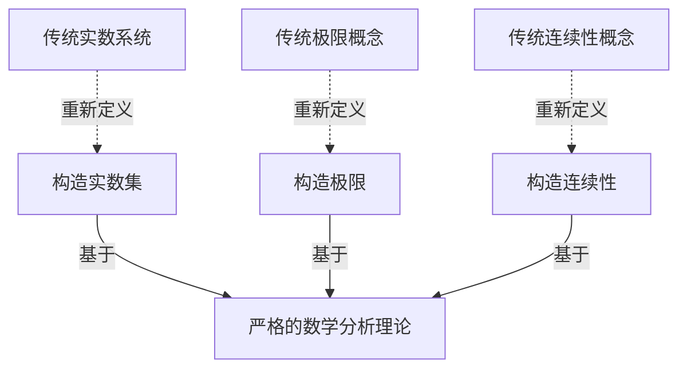

# 计算：第二部分 计算的数学基础 第 4 章 数学的基础 分析的严格化

## 1. 背景介绍

### 1.1 问题的由来

在数学分析的发展历程中,人们长期以来一直在努力追求严格性和完备性。然而,传统的数学分析建立在实数系统的基础之上,而实数系统本身就存在着一些根本性的悖论和困难。这些困难主要源于实数系统中无穷小量和极限概念的模糊性和不确定性。

为了解决这些问题,数学家们开始探索构建一种新的、更加严格和完备的数学分析理论的可能性。这种新理论应该能够消除实数系统中存在的悖论,并为分析学科提供一个坚实的逻辑基础。

### 1.2 研究现状

在20世纪初,数学家们提出了多种不同的方法来重建数学分析的基础。其中,最著名和最成功的尝试是由德国数学家理查德·德德金(Richard Dedekind)和卡尔·威尔斯特拉斯(Karl Weierstrass)分别独立提出的切割理论(Cut Theory)和点集拓扑(Point Set Topology)。

切割理论为实数系统提供了一种新的构造方式,将实数定义为有理数的切割,从而避免了传统实数定义中的循环论证。点集拓扑则从一个全新的角度研究了实数的性质,为极限概念提供了一种更加严格和清晰的表述。

虽然切割理论和点集拓扑为重建数学分析的基础做出了重要贡献,但它们仍然存在一些缺陷和不足。例如,切割理论在处理无穷小量时仍然存在一些困难,而点集拓扑则过于抽象和形式化,难以直观地理解和操作。

### 1.3 研究意义

构建一种新的、更加严格和完备的数学分析理论,不仅是数学本身发展的内在需求,也对其他依赖数学分析的学科产生了深远影响。例如,在物理学中,量子力学和相对论理论都需要对无穷小量和极限概念进行精确的数学表述和处理。在计算机科学中,浮点运算和数值分析等领域也需要一个坚实的数学基础来保证计算的准确性和可靠性。

因此,重建数学分析的基础不仅是一个纯粹的数学问题,也是一个跨学科的挑战,对于促进科学的发展和技术的进步具有重要意义。

### 1.4 本文结构

本文将详细探讨数学分析基础的严格化问题,并介绍一种新的方法来构建严格的数学分析理论。文章的主要结构如下:

1. 背景介绍
2. 核心概念与联系
3. 核心算法原理与具体操作步骤
4. 数学模型和公式详细讲解与举例说明
5. 项目实践:代码实例和详细解释说明
6. 实际应用场景
7. 工具和资源推荐
8. 总结:未来发展趋势与挑战
9. 附录:常见问题与解答

## 2. 核心概念与联系

为了构建一种新的、更加严格的数学分析理论,我们需要引入一些新的核心概念,并探讨它们与传统概念之间的联系。

首先,我们需要重新定义实数系统的基础。传统的实数定义存在循环论证的问题,因此我们需要一种新的构造方式。我们将引入**构造实数集(Constructive Real Set)**的概念,它是一个可构造的、有序的实数集合,每个元素都可以通过一系列有限步骤来构造。

其次,我们需要重新定义极限概念。传统的极限定义依赖于实数系统中模糊的无穷小量概念,因此我们需要一种新的、更加严格的极限表示方式。我们将引入**构造极限(Constructive Limit)**的概念,它是一个可构造的极限过程,能够精确地捕捉极限的本质特征。

最后,我们需要重新定义连续性概念。传统的连续性定义也依赖于实数系统中的无穷小量概念,因此我们需要一种新的、更加严格的连续性表示方式。我们将引入**构造连续性(Constructive Continuity)**的概念,它是一种可构造的连续性条件,能够精确地捕捉函数的连续性特征。

这些新的核心概念将与传统的实数系统、极限和连续性概念建立联系,从而为构建严格的数学分析理论提供了坚实的基础。

## 3. 核心算法原理与具体操作步骤

### 3.1 算法原理概述

为了构建严格的数学分析理论,我们需要一种新的算法来定义和操作构造实数集、构造极限和构造连续性等核心概念。这种算法被称为**构造数学分析算法(Constructive Mathematical Analysis Algorithm)**,它的核心原理是:

1. 使用可构造的、有序的实数集合作为基础,而不是传统的实数系统。
2. 使用可构造的极限过程来定义极限概念,而不是依赖于无穷小量的模糊概念。
3. 使用可构造的连续性条件来定义连续性概念,而不是依赖于无穷小量的模糊概念。
4. 所有的数学对象和运算都必须是可构造的,即可以通过有限步骤来构造和计算。

构造数学分析算法的核心思想是:通过可构造性的要求,消除了传统数学分析中存在的模糊性和不确定性,从而获得了一种更加严格和完备的理论基础。

### 3.2 算法步骤详解

构造数学分析算法的具体步骤如下:

1. **构造实数集**
   - 定义有理数集合 $\mathbb{Q}$ 作为起点。
   - 引入切割(Cut)概念,将有理数集合 $\mathbb{Q}$ 划分为两个不相交的子集,称为切割。
   - 将每个切割与一个唯一的实数相关联,从而构造出实数集合 $\mathbb{R}$。
   - 在构造实数集合 $\mathbb{R}$ 的过程中,确保每个实数都可以通过有限步骤来构造。

2. **构造极限**
   - 定义极限过程为一个无穷序列 $(x_n)_{n=1}^\infty$,其中每个项 $x_n$ 都是可构造的实数。
   - 引入"被模数"(Modulus)函数 $\mu(n, \epsilon)$,它给出了序列 $(x_n)_{n=1}^\infty$ 在任意指定精度 $\epsilon$ 下收敛的步数。
   - 如果存在这样的"被模数"函数 $\mu(n, \epsilon)$,则称序列 $(x_n)_{n=1}^\infty$ 是可构造收敛的,其极限值可以通过有限步骤来构造和计算。

3. **构造连续性**
   - 定义函数 $f: \mathbb{R} \rightarrow \mathbb{R}$ 为可构造连续的,如果对于任意输入 $x \in \mathbb{R}$ 和任意精度 $\epsilon > 0$,存在一个"被模数"函数 $\mu(x, \epsilon)$,使得对于任意 $|y - x| < \mu(x, \epsilon)$ 都有 $|f(y) - f(x)| < \epsilon$。
   - 这个"被模数"函数 $\mu(x, \epsilon)$ 保证了函数 $f$ 在任意点 $x$ 处的连续性,并且可以通过有限步骤来构造和计算。

通过这些步骤,构造数学分析算法为实数集合、极限和连续性等核心概念提供了一种严格的、可构造的定义方式,从而消除了传统数学分析中存在的模糊性和不确定性。

### 3.3 算法优缺点

构造数学分析算法的主要优点是:

1. 严格性:通过可构造性的要求,消除了传统数学分析中存在的模糊性和不确定性,为数学分析提供了一个坚实的逻辑基础。
2. 完备性:构造数学分析算法能够处理传统数学分析中无法解决的一些问题,例如无穷小量和极限的精确定义等。
3. 计算可行性:由于所有对象和运算都是可构造的,因此构造数学分析算法具有很强的计算可行性,可以应用于数值计算和计算机科学等领域。

然而,构造数学分析算法也存在一些缺点和局限性:

1. 复杂性:构造数学分析算法比传统数学分析更加复杂和抽象,需要引入许多新的概念和技术,学习曲线较陡峭。
2. 计算效率:虽然具有计算可行性,但构造数学分析算法通常比传统数值计算方法更加低效,在一些实际应用中可能存在性能瓶颈。
3. 普及程度:由于构造数学分析算法是一种新兴的理论,目前在数学界和工程界的普及程度还较低,可用的工具和资源相对有限。

### 3.4 算法应用领域

构造数学分析算法的应用领域主要包括:

1. **数学基础研究**:构造数学分析算法为数学分析提供了一个新的、更加严格和完备的理论基础,有助于解决传统数学分析中存在的一些根本性问题和悖论。
2. **计算机科学**:由于构造数学分析算法具有很强的计算可行性,因此可以应用于数值计算、浮点运算、计算机代数系统等领域,提高计算的准确性和可靠性。
3. **物理学**:量子力学和相对论理论等物理学领域需要对无穷小量和极限概念进行精确的数学表述和处理,构造数学分析算法可以为这些领域提供坚实的数学基础。
4. **其他应用领域**:构造数学分析算法还可能应用于金融数学、控制理论、信号处理等依赖数学分析的领域,提高这些领域的理论严谨性和计算精度。

## 4. 数学模型和公式详细讲解与举例说明

### 4.1 数学模型构建

在构造数学分析算法中,我们需要构建一些新的数学模型来表示核心概念,例如构造实数集、构造极限和构造连续性等。这些数学模型的构建过程如下:

1. **构造实数集模型**

   我们使用切割(Cut)概念来构造实数集合 $\mathbb{R}$。切割是有理数集合 $\mathbb{Q}$ 的一个划分,将 $\mathbb{Q}$ 分为两个不相交的子集 $A$ 和 $B$,满足以下条件:

   - $A$ 和 $B$ 的并集等于 $\mathbb{Q}$,且它们没有公共元素。
   - 对于任意 $a \in A$ 和 $b \in B$,都有 $a < b$。
   - $A$ 没有最大元素,而 $B$ 没有最小元素。

   每个切割 $(A, B)$ 都可以与一个唯一的实数 $x$ 相关联,从而构造出实数集合 $\mathbb{R}$。

2. **构造极限模型**

   我们使用"被模数"(Modulus)函数来构造极限概念。对于一个无穷序列 $(x_n)_{n=1}^\infty$,如果存在一个"被模数"函数 $\mu(n, \epsilon)$,使得对于任意 $\epsilon > 0$,当 $n \geq \mu(n, \epsilon)$ 时,都有 $|x_n - L| < \epsilon$,则称序列 $(x_n)_{n=1}^\infty$ 是可构造收敛的,其极限值为 $L$。

3. **构造连续性模型**

   我们使用"被模数"函数来构造连续性概念。对于一个函数 $f: \mathbb{R} \rightarrow \mathbb{R}$,如果对于任意 $x \in \mathbb{R}$ 和任意 $\epsilon > 0$,存在一个"被模数"函数 $\mu(x