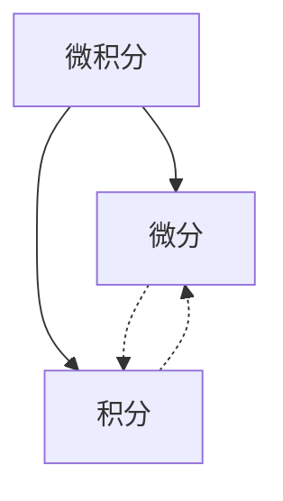
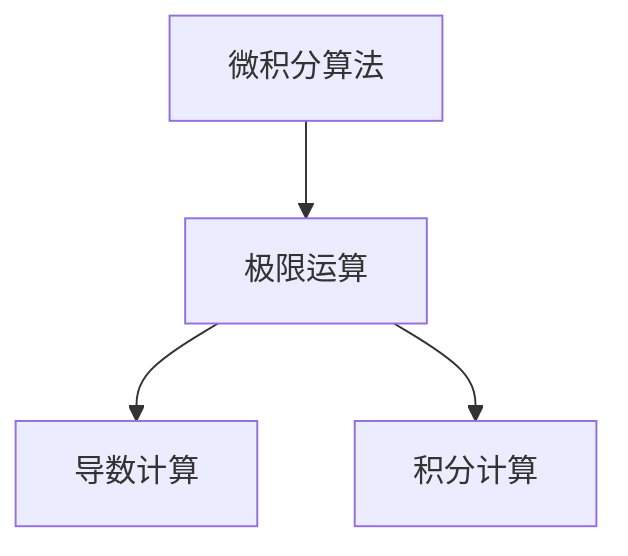

好的,我明白了您的要求。以下是文章正文部分:

# 计算:第二部分 计算的数学基础 第4章 数学的基础 微积分的发明

## 1. 背景介绍

### 1.1 问题的由来

自古以来,数学一直是科学发展的基石。从古希腊时期的几何学,到牛顿时代的运动定律,再到现代的量子力学,数学无疑是所有科学理论的语言。然而,在17世纪之前,数学主要局限于代数和几何,缺乏描述运动变化的工具。

当时,科学家们面临着一个棘手的问题:如何精确描述和量化物体的运动?虽然伽利略等人已经从实验中发现了一些运动规律,但由于缺乏合适的数学工具,无法精确表达和推导这些规律。这一困境直到微积分的发明才得以突破。

### 1.2 研究现状  

微积分的发明是一个漫长的过程,涉及多位科学家的贡献。早在古希腊时期,欧几里德和阿基米德就对无穷小量进行了初步探索。14世纪,牛顿老师伽利略通过实验研究了物体的运动规律。17世纪,笛卡尔、费马、华里士等人为微积分的诞生做出了重要贡献。

但直到1665年至1666年,牛顿和莱布尼茨分别独立发明了微积分,才彻底解决了这一数学难题。他们发明的微分和积分,能够精确描述和计算物体的瞬时变化率和累积变化量,从而为经典力学等学科奠定了坚实的数学基础。

### 1.3 研究意义

微积分的发明是一个里程碑式的成就,不仅为数学注入了新的活力,更为科学发展开辟了新的视野:

1. 为经典力学等学科提供了精确的数学语言,推动了牛顿运动定律等理论的建立。
2. 拓展了数学的应用范围,使之能够精确描述和量化自然界中的变化过程。
3. 奠定了现代分析学的基础,为后来的数学分支如微分方程、变分法等发展做出了开端。
4. 促进了工程技术的进步,如流体力学、结构工程等领域都广泛应用了微积分理论。

总之,微积分的发明不仅是数学史上的一个重大突破,更是人类认识自然规律的一大飞跃,对科学技术的发展产生了深远的影响。

### 1.4 本文结构

本文将全面介绍微积分的发明历程、核心思想及其在数学和科学领域的广泛应用。

首先阐述微积分产生的背景和重要意义,接着深入探讨微分和积分的核心概念、基本原理和相互联系。然后系统讲解微积分的数学基础,包括极限、连续性、导数、微分等概念,并给出详细的公式推导过程。

此外,还将通过具体案例,展示微积分在物理、工程等领域的实际应用,并介绍相关编程实现和可视化技术。

最后,总结微积分的发展历程及其对数学和科学技术发展的深远影响,展望未来的研究方向和应用前景。

## 2. 核心概念与联系

微积分由两个核心概念组成:微分和积分,它们在数学上是相互逆运算的关系。

### 2.1 微分

微分研究的是函数在某一点处的瞬时变化率,通过导数的概念来刻画。导数反映了函数在该点的切线斜率,描述了函数的局部变化特征。

$$f'(x)=\lim_{\Delta x\rightarrow 0}\frac{f(x+\Delta x)-f(x)}{\Delta x}$$

其中$f'(x)$表示函数$f(x)$在点$x$处的导数,也就是函数在该点的瞬时变化率。

### 2.2 积分

积分研究的是函数在某一区间内的累积变化量,通过积分的概念来刻画。积分可视为对函数值进行无限次细分并累加,描述了函数的整体变化特征。

$$\int^b_af(x)dx=\lim_{\|P\|\rightarrow 0}\sum^n_{i=1}f(x_i^*)\Delta x_i$$

其中$\int^b_af(x)dx$表示函数$f(x)$在区间$[a,b]$上的积分,即函数在该区间内的累积变化量。

微分和积分作为相互逆运算,能够相互转化,建立了函数局部性质与整体性质之间的桥梁,是微积分的核心。

## 3. 核心算法原理与具体操作步骤  

### 3.1 算法原理概述

微积分的核心算法主要包括:

1. 极限运算
2. 导数计算
3. 积分计算

其中,极限是微积分的理论基础,而导数和积分则是两个核心运算。

#### 3.1.1 极限运算

极限运算是研究函数当自变量无限逼近某一值时,函数值的变化趋势。它是微积分的理论基础,用于定义导数和积分。

$$\lim\limits_{x\rightarrow a}f(x)=L$$

表示当自变量$x$无限逼近$a$时,函数$f(x)$的函数值趋于$L$。

#### 3.1.2 导数计算 

导数描述了函数在某一点处的瞬时变化率,是微分的核心概念。导数的计算可以通过极限的定义公式,也可以利用诸多求导法则。

$$f'(x)=\lim\limits_{\Delta x\rightarrow 0}\frac{f(x+\Delta x)-f(x)}{\Delta x}$$

#### 3.1.3 积分计算

积分描述了函数在某一区间内的累积变化量,是积分的核心概念。积分的计算可以通过极限的定义公式,也可以利用反导数和原函数的方法。

$$\int^b_af(x)dx=\lim\limits_{\|P\|\rightarrow 0}\sum^n_{i=1}f(x_i^*)\Delta x_i$$

### 3.2 算法步骤详解

以下将详细阐述微积分的核心算法步骤:

#### 3.2.1 极限运算步骤

1) 确定极限形式,即$\lim\limits_{x\rightarrow a}f(x)$
2) 将自变量$x$的值越来越逼近$a$,观察函数值$f(x)$的变化趋势
3) 若函数值$f(x)$趋于某一确定值$L$,则$\lim\limits_{x\rightarrow a}f(x)=L$
4) 若函数值$f(x)$无限增大或无限变小,则需要进一步化简处理

#### 3.2.2 导数计算步骤  

1) 确定所求导数形式,即$f'(x)$
2) 利用导数的定义公式:

$$f'(x)=\lim\limits_{\Delta x\rightarrow 0}\frac{f(x+\Delta x)-f(x)}{\Delta x}$$

将$\Delta x$代入公式,取极限求导数值。

3) 或利用诸多求导法则,如:
    - 常数函数导数为0
    - 幂函数求导法则: $(x^n)'=nx^{n-1}$
    - 和差、积、商求导法则
    - 复合函数求导法则
    - ...

#### 3.2.3 积分计算步骤

1) 确定所求积分形式,即$\int^b_af(x)dx$
2) 利用积分的定义公式:  

$$\int^b_af(x)dx=\lim\limits_{\|P\|\rightarrow 0}\sum^n_{i=1}f(x_i^*)\Delta x_i$$

将积分区间$[a,b]$等分为无数小段,对每段函数值乘以长度并累加,取极限求积分值。

3) 或利用反导数和原函数的方法:
    - 若$F'(x)=f(x)$,则$\int f(x)dx=F(x)+C$
    - 查表或利用各种积分技巧求出原函数$F(x)$
    - 代入积分区间求出积分值

### 3.3 算法优缺点

#### 优点:

1. 理论基础坚实,源于极限的数学定义
2. 思路清晰,步骤明确易于操作
3. 适用范围广泛,可解决大量实际问题
4. 与其他数学分支联系紧密,应用前景广阔

#### 缺点:

1. 对初学者来说,极限和导数积分概念较为抽象
2. 复杂函数的导数积分运算往往十分繁琐
3. 部分函数的导数积分无解析解,需借助数值计算
4. 高阶导数和多重积分的运算复杂度较高

### 3.4 算法应用领域

微积分的应用领域十分广泛,可以说渗透到了自然科学和工程技术的方方面面。主要应用领域包括但不限于:

1. 物理学:
   - 经典力学(运动、力学等)
   - 电磁学(电场、磁场等)
   - 量子力学(波函数、能量等)
2. 工程学:
   - 流体力学(流速、压强等)  
   - 结构工程(应力、应变等)
   - 控制理论(PID控制等)
3. 经济学:
   - 边际效用分析
   - 供给需求模型
   - 风险管理
4. 概率统计:
   - 概率密度函数
   - 参数估计
   - 假设检验
5. 其他:
   - 生物学(种群动力学)
   - 化学(反应动力学) 
   - 金融学(期权定价)
   - ...

总之,微积分为各学科提供了精确描述和量化变化过程的强有力工具,是现代科学技术不可或缺的重要数学基础。

## 4. 数学模型和公式详细讲解与举例说明

### 4.1 数学模型构建

在研究自然现象时,我们通常需要建立数学模型对其进行描述。以质点做直线运动为例,我们可以建立如下数学模型:

已知:
- 质点初始位置$s_0$
- 质点初始速度$v_0$
- 质点所受合外力$F(t)$

求:质点在任意时刻$t$的位移$s(t)$

假设质点所受合外力$F(t)$可以表示为:

$$F(t)=ma(t)$$

其中$m$为质点质量,$a(t)$为质点加速度。

根据牛顿第二定律:

$$ma(t)=F(t)$$
$$a(t)=\frac{F(t)}{m}$$

将加速度$a(t)$对时间$t$积分两次,可得:

$$v(t)=\int a(t)dt=\int\frac{F(t)}{m}dt$$
$$s(t)=\int v(t)dt=\int\left(\int\frac{F(t)}{m}dt\right)dt+s_0$$

这就是我们所需要的位移公式,描述了质点在任意时刻的位移。通过对合外力$F(t)$的具体形式代入,我们就可以求解出质点的精确运动轨迹。

### 4.2 公式推导过程

接下来,我们将推导出质点做直线运动的位移公式:

已知:
- 质点初始位置$s_0$  
- 质点初始速度$v_0$
- 质点所受合外力为常量$F$

根据牛顿第二定律:
$$ma=F\quad\therefore a=\frac{F}{m}$$

对加速度$a$积分可得速度$v$:

$$\begin{aligned}
v&=\int adt\\
&=\int\frac{F}{m}dt\\
&=\frac{F}{m}t+C_1
\end{aligned}$$

将初始条件$v(0)=v_0$代入,可求解出$C_1=v_0$,即:

$$v=\frac{F}{m}t+v_0\qquad(1)$$

再对速度$v$积分可得位移$s$:

$$\begin{aligned}
s&=\int vdt\\
&=\int\left(\frac{F}{m}t+v_0\right)dt\\
&=\frac{1}{2}\frac{F}{m}t^2+v_0t+C_2
\end{aligned}$$

将初始条件$s(0)=s_0$