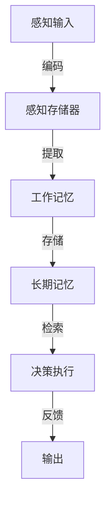
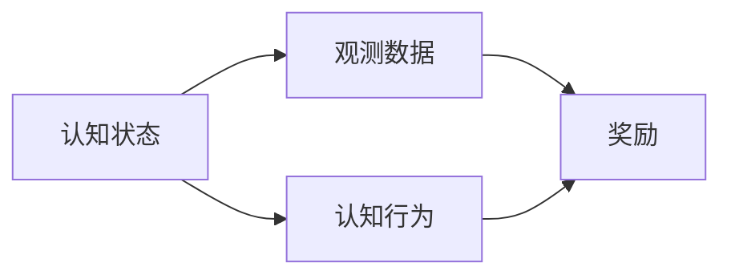

好的,我明白了您的要求。以下是题为《认知的形式化:利用数学来解释、证明自然界的现象》的技术博客文章正文内容:

# 认知的形式化:利用数学来解释、证明自然界的现象

## 1. 背景介绍

### 1.1 问题的由来

人类对于认知和思维过程的探索由来已久。自古希腊时期起,哲学家们就开始探讨人类是如何获取知识的,认知的本质是什么。在现代,随着计算机科学、人工智能和神经科学的发展,对认知过程的研究变得更加系统和严谨。

然而,长期以来认知科学一直缺乏一种统一的理论框架来整合不同领域的研究成果。传统的研究方法过于定性,缺乏数学建模和形式化的理论支撑,难以对认知过程进行精确描述和量化分析。

### 1.2 研究现状  

近年来,随着计算理论、信息论、概率论等数学工具的发展,一些学者开始尝试利用数学语言对认知过程进行形式化描述。例如,计算理论中的"计算复杂性"概念被引入认知科学,用来衡量认知任务的困难程度;信息论中的"信息熵"概念被用于测量认知系统的不确定性等。

这种数学形式化的尝试为建立统一的认知理论奠定了基础。不过,目前的研究仍处于初级阶段,离建立完整的理论体系还有一定距离。

### 1.3 研究意义

将数学工具引入认知科学研究,具有重要的理论意义和应用价值:

- 理论意义:能够更精确、更规范地描述认知过程,有助于建立统一的认知理论框架。
- 应用价值:有助于量化分析认知能力,为人工智能、教育等领域提供理论指导。

因此,认知的形式化研究有望成为认知科学的一个重要发展方向。

### 1.4 本文结构

本文将系统阐述利用数学工具对认知过程进行形式化描述的理论和方法。

- 首先介绍核心概念,如认知架构、计算复杂性等,并阐明它们之间的联系。
- 其次详细讲解核心算法原理,如贝叶斯建模、马尔可夫决策过程等。
- 再次给出数学公式的推导过程,并结合案例进行讲解和分析。  
- 之后通过项目实践展示具体的代码实现和运行效果。
- 最后总结研究现状,展望未来发展趋势和面临的挑战。

## 2. 核心概念与联系

要对认知过程进行形式化描述,需要建立一个合适的认知架构模型。目前公认的主流模型是"信息处理架构",将认知视为一系列串行的信息处理阶段。



在这个架构中,信息流经编码、存储、提取、检索等阶段,最终完成决策和行为输出。每个阶段的信息处理都可以用计算复杂性来刻画和测量。

计算复杂性理论源于计算机科学,描述了一个计算问题的本质难度。常用的复杂性度量有时间复杂度、空间复杂度等。

$$
时间复杂度: T(n) = 最坏情况下完成问题所需的基本操作次数
$$

$$
空间复杂度: S(n) = 最坏情况下完成问题所需的存储空间
$$

在认知领域,计算复杂性可用于衡量认知任务的困难程度。例如,n位二进制数加法的时间复杂度为$O(n)$,而n个数的排序的时间复杂度为$O(nlgn)$,后者更复杂。

除了复杂度,信息论中的信息熵、互信息等概念也被引入认知科学。熵可以测量认知系统的不确定性和信息量。

$$
熵: H(X) = -\sum_{x \in X} P(x)logP(x)
$$

互信息则可以衡量不同认知过程之间的相关性。

$$
互信息: I(X;Y) = \sum_{x \in X}\sum_{y \in Y} P(x,y)log\frac{P(x,y)}{P(x)P(y)}
$$

通过这些核心概念,我们可以对认知过程的计算复杂度、信息特征等进行刻画和分析,为形式化建模奠定基础。

## 3. 核心算法原理 & 具体操作步骤

### 3.1 算法原理概述

要对认知过程进行形式化建模,核心算法包括贝叶斯建模和马尔可夫决策过程。

- 贝叶斯建模: 基于贝叶斯理论,利用先验知识和观测数据,对认知状态进行概率推理。
- 马尔可夫决策过程: 将认知过程建模为一个马尔可夫决策序列,在每个状态下选择最优行为。

这两种算法原理相辅相成,前者对认知状态进行推理,后者对行为决策进行优化。

### 3.2 算法步骤详解

#### 3.2.1 贝叶斯建模算法

1) 建立认知模型的贝叶斯网络表示
2) 获取先验概率分布 P(X)
3) 观测数据证据 e
4) 根据贝叶斯公式计算后验概率:

$$
P(X|e) = \frac{P(e|X)P(X)}{P(e)}
$$

5) 基于后验概率分布对认知状态进行推理

#### 3.2.2 马尔可夫决策过程算法

1) 定义马尔可夫决策过程 (S, A, P, R)
    - S: 认知状态集合
    - A: 可选行为集合  
    - P: 状态转移概率 P(s' | s, a)
    - R: 奖励函数 R(s, a)
2) 确定折现因子 $\gamma$
3) 使用价值迭代或策略迭代算法求解最优价值函数 $V^*(s)$
    - 价值迭代:
        $$
        V_{k+1}(s) = \max_{a}\left\{R(s,a) + \gamma\sum_{s'}P(s'|s,a)V_k(s')\right\}
        $$
    - 策略迭代:
        $$
        \pi_{k+1}(s) = \arg\max_{a}\left\{R(s,a) + \gamma\sum_{s'}P(s'|s,a)V^{\pi_k}(s')\right\}
        $$
        
4) 根据最优价值函数 $V^*(s)$ 选择最优行为策略

通过这两种算法,我们可以对认知状态进行概率推理,并选择最优的认知行为序列,从而对认知过程进行形式化建模。

### 3.3 算法优缺点

- 优点:
    - 贝叶斯建模能够融入先验知识,对复杂认知状态进行概率推理
    - 马尔可夫决策过程能够找到全局最优的认知行为序列
    - 两种算法相结合,能够全面描述认知过程的状态和行为
- 缺点:  
    - 计算复杂度较高,尤其是在状态空间和行为空间很大时
    - 需要对认知模型进行精确定义,而现实中认知过程的模型化仍很困难
    - 需要大量的先验知识和训练数据作为输入,获取这些信息的代价很高

### 3.4 算法应用领域

- 人工智能
    - 认知架构
    - 智能决策
    - 自然语言理解
    - 机器学习
- 认知科学
    - 人类行为分析
    - 大脑建模
    - 智力测试
- 教育
    - 个性化教学
    - 智能辅导系统
- 其他
    - 人机交互
    - 游戏AI
    - 机器人控制

## 4. 数学模型和公式 & 详细讲解 & 举例说明

### 4.1 数学模型构建

要对认知过程进行形式化建模,首先需要构建合理的数学模型。常用的模型有:

- 概率图模型
    - 贝叶斯网络
    - 马尔可夫网络
- 决策过程模型
    - 马尔可夫决策过程
    - 部分可观测马尔可夫决策过程
- 神经网络模型
    - 前馈网络
    - 递归网络
    - 深度学习网络

以贝叶斯网络为例,它由节点和有向边构成,能够直观地表示变量之间的因果关系。



上图是一个简单的贝叶斯网络模型,表示认知状态和行为如何导致奖励反馈。基于这种表示,我们可以应用贝叶斯推理算法对认知状态进行建模。

### 4.2 公式推导过程 

以马尔可夫决策过程的价值迭代算法为例,推导其数学公式:

已知:
- 状态集合 $S$
- 行为集合 $A$  
- 状态转移概率 $P(s' | s, a)$
- 奖励函数 $R(s, a)$
- 折现因子 $\gamma$

目标是求解最优价值函数 $V^*(s)$,表示在状态 s 下按最优策略行动可获得的期望总奖励。

1) 定义价值函数 $V(s)$:
$$
V(s) = \max_{\pi}\mathbb{E}\left[\sum_{t=0}^{\infty}\gamma^tR(s_t,a_t)|s_0=s,\pi\right]
$$

2) 构造贝尔曼方程:
$$
\begin{aligned}
V(s) &= \max_a\mathbb{E}\left[R(s,a) + \gamma\sum_{s'}P(s'|s,a)V(s')\right]\\
     &= \max_a\left\{R(s,a) + \gamma\sum_{s'}P(s'|s,a)V(s')\right\}
\end{aligned}
$$

3) 价值迭代算法:
$$
V_{k+1}(s) = \max_a\left\{R(s,a) + \gamma\sum_{s'}P(s'|s,a)V_k(s')\right\}
$$

4) 收敛性证明:
    - 存在唯一的最优价值函数 $V^*$
    - 价值迭代算法能够保证收敛到 $V^*$

通过这一系列的数学推导,我们得到了价值迭代算法的具体形式,并证明了其收敛性,为认知过程的形式化建模提供了理论支持。

### 4.3 案例分析与讲解

考虑一个简单的视觉搜索任务:在一个 $5\times 5$ 的方格中,有一个目标物品,需要尽快找到它。

1) 建模为马尔可夫决策过程:
    - 状态 $S$: 25个格子的位置
    - 行为 $A$: 上下左右移动
    - 转移概率 $P(s'|s,a)$: 根据行为决定,移动成功为1,否则为0
    - 奖励 $R(s,a)$: 找到目标得1分,否则为0
    - 折现因子 $\gamma = 0.9$

2) 使用价值迭代算法求解:

```python
import numpy as np

# 状态空间大小
n_states = 25  

# 行为空间
actions = ['up', 'down', 'left', 'right']

# 初始化价值函数
V = np.zeros(n_states)

# 价值迭代
gamma = 0.9
for i in range(1000):
    V_new = np.zeros(n_states)
    for s in range(n_states):
        max_val = float('-inf')
        for a in actions:
            val = 0
            # 模拟转移
            if a == 'up' and s >= 5:
                s_new = s - 5
                val += R(s_new) + gamma * V[s_new]
            # 其他情况...
            if val > max_val:
                max_val = val
        V_new[s] = max_val
    if np.sum(np.abs(V - V_new)) < 1e-6:
        break
    V = V_new
        
# 根据最优价值函数选择行为
policy = np.zeros(n_states, dtype=int)
for s