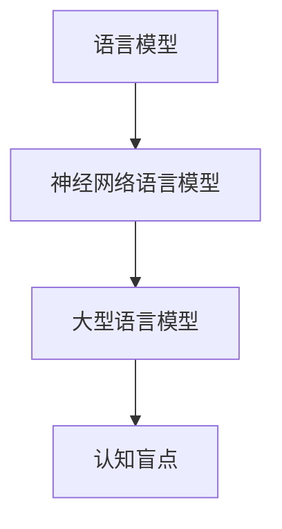

# 语言≠思维：大模型的认知盲点

## 1. 背景介绍

### 1.1 问题的由来

随着人工智能技术的不断发展,大型语言模型(Large Language Models, LLMs)已经在自然语言处理、机器翻译、问答系统等领域展现出了令人惊叹的能力。这些模型通过从海量文本数据中学习,掌握了丰富的语言知识和表达能力。然而,越来越多的研究表明,尽管大型语言模型在语言层面表现出色,但它们在理解和推理方面仍存在明显的缺陷,这种现象被称为"认知盲点"。

### 1.2 研究现状

目前,研究人员已经发现了大型语言模型在多个方面存在认知盲点,例如:

1. **缺乏因果推理能力**: 大型语言模型难以准确理解事物之间的因果关系,容易产生不合理的推理结果。
2. **缺乏常识推理能力**: 这些模型在处理需要常识推理的任务时表现较差,常常产生与人类直觉相悖的结果。
3. **缺乏数理逻辑推理能力**: 在涉及数学、逻辑推理的任务中,大型语言模型的表现远逊于人类。
4. **缺乏情景理解能力**: 大型语言模型难以准确把握语境信息,在处理需要情景理解的任务时存在明显缺陷。

### 1.3 研究意义

语言是人类思维和认知的重要载体,而大型语言模型作为当前人工智能领域的核心技术,其认知能力的局限性直接影响了人工智能系统的发展潜力。因此,深入探究大型语言模型的认知盲点,并寻求有效的解决方案,对于推动人工智能技术向通用人工智能(Artificial General Intelligence, AGI)迈进至关重要。

### 1.4 本文结构

本文将从以下几个方面深入探讨大型语言模型的认知盲点问题:

1. 阐述大型语言模型的核心概念和工作原理,分析其在语言表征和生成方面的优势。
2. 介绍大型语言模型在因果推理、常识推理、数理逻辑推理和情景理解等方面存在的认知盲点,并给出具体案例说明。
3. 探讨导致大型语言模型认知盲点的潜在原因,包括模型架构、训练数据和评估方式等方面的局限性。
4. 介绍当前研究人员提出的一些解决方案,如知识增强、多模态学习、元学习等,并分析其优缺点。
5. 总结大型语言模型认知盲点问题的研究现状,并展望未来的发展趋势和挑战。

## 2. 核心概念与联系

在深入探讨大型语言模型的认知盲点问题之前,我们需要先了解一些核心概念和它们之间的联系。

### 2.1 语言模型(Language Model)

语言模型是自然语言处理领域的一个基础概念,它旨在捕捉语言的统计规律,并对给定的文本序列计算出概率分布。形式化地,给定一个文本序列 $S = (w_1, w_2, \ldots, w_n)$,语言模型的目标是计算该序列的概率 $P(S) = P(w_1, w_2, \ldots, w_n)$。根据链式法则,我们可以将该概率分解为:

$$P(S) = \prod_{i=1}^{n} P(w_i | w_1, \ldots, w_{i-1})$$

其中 $P(w_i | w_1, \ldots, w_{i-1})$ 表示在给定前面的词 $w_1, \ldots, w_{i-1}$ 的条件下,当前词 $w_i$ 出现的条件概率。

语言模型广泛应用于自然语言处理的各个任务,如机器翻译、文本生成、语音识别等。通过学习大量文本数据,语言模型可以捕捉语言的统计规律,并用于指导语言生成和理解。

### 2.2 神经网络语言模型(Neural Network Language Model)

传统的语言模型通常基于 n-gram 统计或者句法规则,但这些方法难以捕捉语言的深层次结构和语义信息。神经网络语言模型则利用神经网络的强大建模能力,通过端到端的方式直接从数据中学习语言的表征,从而获得更好的性能。

常见的神经网络语言模型包括基于循环神经网络(Recurrent Neural Network, RNN)的模型、基于卷积神经网络(Convolutional Neural Network, CNN)的模型,以及基于自注意力机制(Self-Attention)的 Transformer 模型等。其中,Transformer 模型由于其并行计算的优势和长距离依赖捕捉能力,在大型语言模型的构建中发挥了关键作用。

### 2.3 大型语言模型(Large Language Model)

大型语言模型(LLM)是指具有数十亿甚至上百亿参数的庞大神经网络语言模型。这些模型通过在海量文本数据(如网页、书籍、论文等)上进行预训练,学习到了丰富的语言知识和表达能力。

目前,一些知名的大型语言模型包括 GPT-3(OpenAI)、PanGu-Alpha(百度)、Wu Dao 2.0(清华)、BLOOM(BigScience)等。这些模型在自然语言生成、理解、推理等任务上展现出了强大的能力,但同时也暴露出了一些认知盲点和局限性。

### 2.4 认知盲点(Cognitive Blind Spot)

认知盲点指的是人工智能系统在某些认知任务上表现出的明显缺陷或失能。尽管大型语言模型在语言生成和理解方面表现出色,但它们在涉及推理、常识理解、情景把握等高级认知能力时,往往会产生与人类直觉和期望相去甚远的结果。

研究人员认为,大型语言模型的认知盲点源于多方面的原因,包括模型架构的局限性、训练数据的偏差、评估方式的不当等。深入探究和解决这一问题,是推动人工智能技术向通用人工智能迈进的关键一步。

### 2.5 核心概念关系

上述核心概念之间的关系可以用下图来概括:

语言模型是自然语言处理的基础概念,神经网络语言模型则是一种更加强大的语言模型实现方式。大型语言模型是指具有大规模参数的神经网络语言模型,它们展现出了强大的语言能力,但同时也暴露出了认知盲点这一局限性。研究和解决大型语言模型的认知盲点问题,是推动人工智能技术向通用人工智能迈进的关键一步。

## 3. 核心算法原理 & 具体操作步骤

### 3.1 算法原理概述

大型语言模型的核心算法原理是基于 Transformer 架构的自注意力机制(Self-Attention)。自注意力机制允许模型在计算每个输出表征时,直接关注输入序列中的所有位置,捕捉长距离依赖关系。这种机制大大提高了模型的并行计算能力和表达能力。

Transformer 模型由编码器(Encoder)和解码器(Decoder)两个主要部分组成。编码器将输入序列映射为一系列连续的表征,解码器则基于这些表征生成输出序列。编码器和解码器都由多个相同的层组成,每一层都包含了多头自注意力(Multi-Head Attention)和前馈神经网络(Feed-Forward Neural Network)两个子层。

自注意力机制的核心思想是允许每个位置的输出表征通过注意力机制关注输入序列中的所有位置,从而捕捉长距离依赖关系。具体来说,对于输入序列 $X = (x_1, x_2, \ldots, x_n)$,自注意力机制计算每个位置 $i$ 的输出表征 $y_i$ 如下:

$$y_i = \sum_{j=1}^{n} \alpha_{ij}(x_j W^V)$$

其中 $W^V$ 是一个可学习的值矩阵(Value Matrix),用于将输入映射到值空间。$\alpha_{ij}$ 是注意力权重,表示位置 $i$ 对位置 $j$ 的注意力程度,它是通过注意力函数计算得到的:

$$\alpha_{ij} = \frac{e^{score(x_i, x_j)}}{\sum_{k=1}^{n} e^{score(x_i, x_k)}}$$

$$score(x_i, x_j) = (x_i W^Q)(x_j W^K)^T$$

其中 $W^Q$ 和 $W^K$ 分别是可学习的查询矩阵(Query Matrix)和键矩阵(Key Matrix),用于将输入映射到查询空间和键空间。注意力分数 $score(x_i, x_j)$ 反映了位置 $i$ 对位置 $j$ 的关注程度。

多头自注意力机制则是将多个注意力头的结果进行拼接,以捕捉不同的注意力模式:

$$MultiHead(X) = Concat(head_1, \ldots, head_h)W^O$$

其中 $head_i = Attention(XW_i^Q, XW_i^K, XW_i^V)$ 表示第 $i$ 个注意力头的计算结果,并通过可学习的矩阵 $W^O$ 进行线性变换。

通过自注意力机制和多头注意力,Transformer 模型能够有效地捕捉输入序列中的长距离依赖关系,从而展现出强大的语言表示和生成能力。然而,这种基于注意力机制的架构也存在一些局限性,导致了大型语言模型在某些认知任务上表现不佳。

### 3.2 算法步骤详解

下面我们详细介绍 Transformer 模型的训练和推理过程:

1. **输入embedding**:将输入序列(如文本)转换为embedding向量表示。
2. **位置编码(Positional Encoding)**:由于自注意力机制没有捕捉序列顺序的能力,因此需要为每个位置添加位置编码,以引入位置信息。
3. **编码器(Encoder)**:
   - 将embedding和位置编码相加,得到初始表征。
   - 对初始表征进行多头自注意力计算,捕捉输入序列中的依赖关系。
   - 通过前馈神经网络进一步加工注意力输出。
   - 上述过程重复 $N$ 次(即 $N$ 个编码器层)。
4. **解码器(Decoder,用于序列生成任务)**:
   - 将目标序列的embedding和位置编码相加,得到初始表征。
   - 进行遮蔽自注意力(Masked Self-Attention),即在生成每个位置的输出时,只关注该位置之前的输入。
   - 进行编码器-解码器注意力(Encoder-Decoder Attention),将解码器的输出与编码器的输出进行注意力计算。
   - 通过前馈神经网络进一步加工注意力输出。
   - 上述过程重复 $N$ 次(即 $N$ 个解码器层)。
   - 最终输出经过线性层和softmax,得到下一个token的概率分布。
5. **训练**:使用教师强制(Teacher Forcing)的方式,将模型的输出与真实目标序列进行对比,并基于最大似然估计(Maximum Likelihood Estimation)优化模型参数。
6. **推理**:对于生成任务,以自回归(Autoregressive)的方式生成序列,即每次根据已生成的部分序列,预测下一个token。对于理解任务,则直接输出编码器的输出表征。

需要注意的是,上述算法步骤描述了 Transformer 模型的基本流程,实际上不同的大型语言模型可能会在细节上有所不同,如采用不同的注意力变体、优化器、正则化策略等。此外,一些模型还会引入其他机制,如基于生成式对抗网络(Generative Adversarial Network, GAN)的训练策略等。

### 3.3 算法优缺点

Transformer 模型及其衍生的大型语言模型具有以下优点:

1. **并行计算能力强**:自注意力机制允许模型并行计算每个位置的表征,大大提高了计算效率。
2. **长距离依赖捕捉能力强**:自注意力机制能够