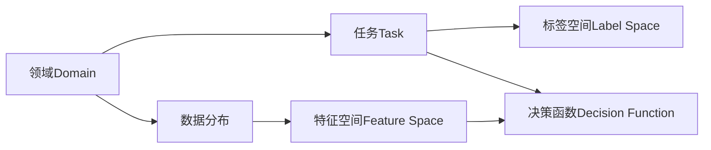

# 迁移学习 原理与代码实例讲解

## 1. 背景介绍

### 1.1 问题的由来

在过去几年中，深度学习在计算机视觉、自然语言处理等众多领域取得了巨大的成功。然而，训练一个深度神经网络通常需要大量的标注数据和计算资源。对于一些特定的任务或领域来说,获取足够的标注数据是一个巨大的挑战。此外,从头开始训练一个复杂的深度模型需要大量的计算资源和时间,这对于一些资源有限的应用场景来说是不可行的。

为了解决这个问题,研究人员提出了迁移学习(Transfer Learning)的概念。迁移学习的核心思想是利用在源领域(Source Domain)学习到的知识,来帮助目标领域(Target Domain)的任务学习。通过迁移学习,我们可以减少标注数据的需求,加快模型的训练过程,并提高模型在目标领域的性能表现。

### 1.2 研究现状

近年来,迁移学习在计算机视觉、自然语言处理等领域得到了广泛的应用和研究。在计算机视觉领域,研究人员通常使用在ImageNet等大型数据集上预训练的模型(如VGGNet、ResNet等)作为初始模型,然后在目标数据集上进行微调(Fine-tuning),以获得更好的性能表现。在自然语言处理领域,预训练语言模型(如BERT、GPT等)已经成为许多下游任务的基础模型。

除了在特定领域的应用之外,迁移学习也受到了理论研究的关注。研究人员探索了不同的迁移学习方法,如特征提取(Feature Extraction)、微调(Fine-tuning)、域适应(Domain Adaptation)等,并分析了它们在不同场景下的优缺点。此外,一些研究工作也关注了迁移学习在异构领域(Heterogeneous Domains)之间的应用,以及如何量化和评估迁移学习的效果。

### 1.3 研究意义

迁移学习在实际应用中具有重要的意义:

1. **降低数据需求**: 通过利用源领域的知识,迁移学习可以减少对目标领域标注数据的需求,从而降低数据获取和标注的成本。

2. **加快模型训练**: 由于可以利用源领域预训练的模型,迁移学习可以加快目标任务模型的训练过程,节省计算资源和时间。

3. **提高模型性能**: 在许多情况下,迁移学习可以帮助模型在目标领域获得比从头训练更好的性能表现。

4. **促进知识共享**: 迁移学习提供了一种在不同领域之间共享和利用知识的机制,有助于推动人工智能技术的发展和应用。

### 1.4 本文结构

本文将全面介绍迁移学习的原理、方法和实践。具体内容包括:

1. 核心概念与联系
2. 核心算法原理及具体操作步骤
3. 数学模型和公式详细讲解及案例分析
4. 代码实例和详细解释说明
5. 实际应用场景
6. 工具和资源推荐
7. 未来发展趋势与挑战
8. 常见问题与解答

## 2. 核心概念与联系

在深入探讨迁移学习的原理和方法之前,我们需要先了解一些核心概念及它们之间的联系。

1. **领域(Domain)**: 指的是数据所属的环境或背景。一个领域由两部分组成:特征空间(Feature Space)和数据分布(Data Distribution)。

2. **任务(Task)**: 指需要解决的具体问题,由标签空间(Label Space)和决策函数(Decision Function)组成。

3. **迁移学习(Transfer Learning)**: 指利用源领域(Source Domain)的知识,来帮助目标领域(Target Domain)的任务学习。

4. **特征空间(Feature Space)**: 指数据的特征表示,如图像的像素值、文本的词向量等。

5. **数据分布(Data Distribution)**: 指数据在特征空间中的分布情况。

6. **标签空间(Label Space)**: 指任务的输出标签集合,如分类任务中的类别标签。

7. **决策函数(Decision Function)**: 指从特征空间到标签空间的映射函数,通常由机器学习模型来学习。

在迁移学习中,我们希望利用源领域学习到的知识,来帮助目标领域任务的学习。这种知识可以体现在特征空间、数据分布或决策函数等方面。根据源领域和目标领域之间的差异,迁移学习可以分为不同的类型,如同域迁移(Intra-Domain Transfer)、异构迁移(Heterogeneous Transfer)等。

## 3. 核心算法原理 & 具体操作步骤

### 3.1 算法原理概述

迁移学习的核心算法原理可以概括为以下三个步骤:

1. **预训练(Pre-training)**: 在源领域的大规模数据上训练一个基础模型,以学习通用的特征表示和模型参数。

2. **迁移(Transfer)**: 将预训练模型的部分或全部参数迁移到目标任务模型中,作为初始化参数。

3. **微调(Fine-tuning)**: 在目标领域的数据上,对迁移后的模型进行进一步的训练和调整,使其适应目标任务的特征和决策函数。

在这个过程中,预训练阶段学习到的知识(如特征表示、模型参数等)被迁移到目标任务模型中,从而减少了目标任务模型的训练需求,并提高了模型的性能表现。

### 3.2 算法步骤详解

下面我们将详细介绍迁移学习算法的具体步骤:

1. **选择预训练模型**

   首先,我们需要选择一个合适的预训练模型作为基础。这个模型应该是在大规模数据上训练的,并且具有良好的泛化能力。常见的预训练模型包括:

   - 计算机视觉领域: VGGNet、ResNet、Inception等在ImageNet上预训练的模型。
   - 自然语言处理领域: BERT、GPT、XLNet等预训练语言模型。

2. **确定迁移策略**

   根据源领域和目标领域的差异,我们需要选择合适的迁移策略。常见的迁移策略包括:

   - **特征提取(Feature Extraction)**: 将预训练模型作为特征提取器,提取目标数据的特征表示,然后在这些特征上训练一个新的分类器或回归模型。
   - **微调(Fine-tuning)**: 将预训练模型的部分或全部参数迁移到目标任务模型中,然后在目标数据上进行微调,调整模型参数以适应目标任务。
   - **域适应(Domain Adaptation)**: 当源领域和目标领域的数据分布存在差异时,可以采用域适应技术来减小分布差异,提高模型在目标领域的性能。

3. **模型训练**

   根据选择的迁移策略,我们需要对目标任务模型进行训练。具体步骤如下:

   - 特征提取:
     1. 使用预训练模型提取目标数据的特征表示。
     2. 在提取的特征上训练一个新的分类器或回归模型。

   - 微调:
     1. 将预训练模型的参数迁移到目标任务模型中。
     2. 在目标数据上对模型进行微调,调整模型参数。
     3. 可以选择冻结部分层的参数,只微调后面几层的参数。

   - 域适应:
     1. 使用域适应技术(如域对抗训练、最大均值差异等)减小源领域和目标领域的分布差异。
     2. 在经过域适应后的特征或模型上进行训练或微调。

4. **模型评估**

   在目标数据上评估训练好的模型,观察其性能表现。如果性能不理想,可以尝试调整超参数或采用其他迁移策略。

5. **模型部署**

   将训练好的模型部署到实际的应用系统中,解决目标任务。

### 3.3 算法优缺点

迁移学习算法具有以下优点:

- 减少了目标任务的数据需求,降低了数据获取和标注的成本。
- 加快了模型的训练过程,节省了计算资源和时间。
- 在许多情况下,可以提高模型在目标任务上的性能表现。
- 促进了不同领域之间的知识共享和迁移。

但同时,迁移学习算法也存在一些缺点和挑战:

- 预训练模型和目标任务之间的差异可能会影响迁移效果。
- 不同的迁移策略适用于不同的场景,选择合适的策略需要一定的经验。
- 一些迁移学习技术(如域适应)可能会增加模型的复杂性和计算开销。
- 缺乏理论指导,难以量化和评估迁移效果。

### 3.4 算法应用领域

迁移学习算法已经在多个领域得到了广泛的应用,包括但不限于:

- **计算机视觉**: 图像分类、目标检测、语义分割等任务。
- **自然语言处理**: 文本分类、机器翻译、问答系统等任务。
- **语音识别**: 利用预训练的语音模型进行迁移学习。
- **医疗健康**: 利用迁移学习技术分析医疗图像和电子健康记录。
- **金融**: 应用于欺诈检测、风险评估等金融任务。
- **物联网**: 利用迁移学习技术分析传感器数据。

总的来说,只要存在源领域和目标领域的差异,且目标领域的数据较少,迁移学习就可以发挥作用,提高模型的性能和效率。

## 4. 数学模型和公式 & 详细讲解 & 举例说明

### 4.1 数学模型构建

在介绍迁移学习的数学模型之前,我们先定义一些基本符号:

- $\mathcal{D}_s = \{X_s, P(X_s)\}$: 源领域,包括源数据 $X_s$ 和源数据分布 $P(X_s)$。
- $\mathcal{D}_t = \{X_t, P(X_t)\}$: 目标领域,包括目标数据 $X_t$ 和目标数据分布 $P(X_t)$。
- $\mathcal{T}_s = \{Y_s, f_s(\cdot)\}$: 源任务,包括源标签 $Y_s$ 和源决策函数 $f_s(\cdot)$。
- $\mathcal{T}_t = \{Y_t, f_t(\cdot)\}$: 目标任务,包括目标标签 $Y_t$ 和目标决策函数 $f_t(\cdot)$。

在传统的机器学习中,我们通常假设源领域和目标领域的数据分布是相同的,即 $P(X_s) = P(X_t)$。在这种情况下,我们可以直接在源数据上训练一个模型 $f_s(\cdot)$,并将其应用于目标任务。

然而,在迁移学习场景下,源领域和目标领域的数据分布通常是不同的,即 $P(X_s) \neq P(X_t)$。因此,我们需要利用迁移学习技术,将源领域学习到的知识迁移到目标任务中,以提高模型在目标领域的性能。

迁移学习的数学模型可以表示为:

$$
\min_{f_t \in \mathcal{H}} \mathcal{R}_t(f_t) = \mathbb{E}_{X_t \sim P(X_t)}[L(f_t(X_t), Y_t)]
$$

其中:

- $\mathcal{H}$ 是一个假设空间(Hypothesis Space),包含所有可能的目标决策函数 $f_t(\cdot)$。
- $\mathcal{R}_t(f_t)$ 是目标任务的风险函数(Risk Function),衡量了决策函数 $f_t(\cdot)$ 在目标领域的预测误差。
- $L(\cdot)$ 是一个损失函数(Loss Function),用于衡量预测值和真实标签之间的差异。

我们的目标是找到一个最优的决策函数 $f_t^*$,使得目标任务的风险函数 $\mathcal{R}_t(f_