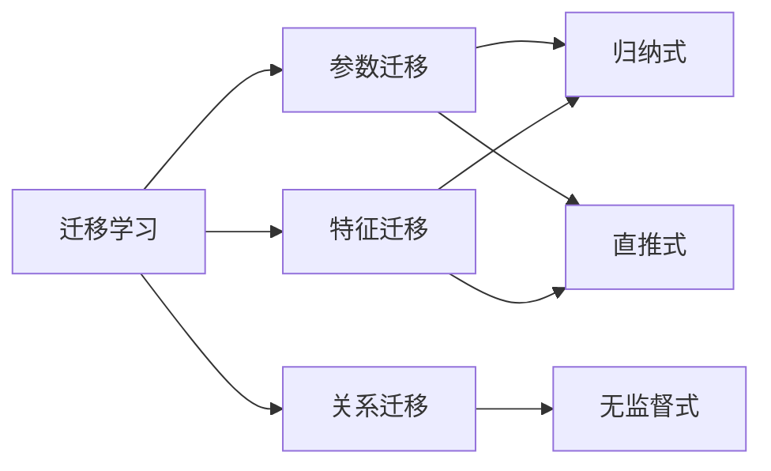

# 迁移学习Transfer Learning原理与代码实例讲解

## 1. 背景介绍
### 1.1 问题的由来
在机器学习领域,当我们面对一个全新的任务时,通常需要从头开始收集数据、搭建模型、进行训练,这个过程非常耗时耗力。但在现实世界中,很多任务之间是存在相关性的。比如图像分类任务,不管是识别猫狗还是识别花草,所用到的图像特征其实是相通的。如果一个模型已经在海量猫狗数据集上训练好了,那么用它来识别花草,效果应该也不会太差。这种利用已有知识来解决新问题的思路,就是迁移学习的核心idea。

### 1.2 研究现状
迁移学习作为机器学习的一个分支,由来已久。早在1993年,NASA就利用神经网络进行迁移学习进行图像分类。近年来,随着深度学习的发展,迁移学习也焕发出新的生机。一方面,很多深度学习模型如CNN、Transformer等具有强大的特征提取和泛化能力,非常适合迁移学习。另一方面,不同任务领域的数据日益增多,迁移学习可以充分利用这些数据,极大提升模型性能。在计算机视觉、自然语言处理等领域,迁移学习已经成为业界标配。从学术界到工业界,从理论研究到应用落地,迁移学习正蓬勃发展。

### 1.3 研究意义
迁移学习的研究意义主要体现在以下几点:

1. 显著降低机器学习的数据门槛和计算成本。利用迁移学习,即使在小样本或无标注数据的情况下,也能训练出不错的模型。
2. 促进不同领域知识的融合。通过迁移学习,计算机视觉、自然语言处理等领域的技术可以交叉应用,催生出更多创新性的解决方案。
3. 推动人工智能走向通用化。迁移学习是构建通用人工智能的重要途径之一。掌握迁移学习的奥秘,对理解人类认知智能也大有裨益。

### 1.4 本文结构
本文将分为理论和实践两大部分,深入浅出地介绍迁移学习的方方面面。在理论部分,我们将讲解迁移学习的核心概念、主要方法、数学原理等;在实践部分,我们将手把手带大家用Python实现几个典型的迁移学习算法,并应用到真实场景中。希望通过本文的学习,读者能对迁移学习建立全面的认知,并具备将其应用到实际问题中的能力。

## 2. 核心概念与联系
迁移学习的核心概念可以总结为:利用已有知识,解决新问题。这里的已有知识,可以是某个领域内的大规模数据集,也可以是在此基础上训练好的机器学习模型;新问题则往往是数据量较小的新任务。两者之间的关联,通常体现在输入空间、特征空间、标签空间的相似性上。

从模型训练的角度看,迁移学习大致可分为三类:
1. 参数迁移:直接使用源领域模型的部分参数,在目标领域进行微调。这是最常见的迁移学习方式,如CV领域的Backbone网络迁移。
2. 特征迁移:利用源领域模型学习到的特征表示,在目标领域进行新的训练。如NLP中的Word Embedding迁移。  
3. 关系迁移:挖掘源领域和目标领域的共同规律,构建领域不变的关系映射。如跨语言文本分类。

从学习方式上看,迁移学习又可分为归纳式、直推式、无监督式三种。其中,归纳式学习在目标领域有少量标注数据,直推式学习在目标领域只有无标注数据,无监督式学习则在源领域和目标领域均无标注数据。

下图展示了几种主要的迁移学习范式,以及它们之间的联系:

可以看到,尽管迁移学习有多种分支和变体,但核心思想都是一以贯之的,即充分利用已有的知识和资源,来加速和优化新任务的学习过程。这种思想符合人类学习的一般规律,有着广泛的应用前景。

## 3. 核心算法原理 & 具体操作步骤
### 3.1 算法原理概述
迁移学习的算法原理,可以用数学语言简要表述如下:

给定源领域 $\mathcal{D}_s=\{(x_i^s,y_i^s)\}_{i=1}^{n_s}$ 和目标领域 $\mathcal{D}_t=\{(x_j^t,y_j^t)\}_{j=1}^{n_t}$,其中 $x$ 为输入,$y$ 为标签,$n_s$ 和 $n_t$ 为样本数量。迁移学习的目标是,利用 $\mathcal{D}_s$ 的知识来学习目标领域的条件概率分布 $P(y^t|x^t)$。根据 $\mathcal{D}_s$ 和 $\mathcal{D}_t$ 的相似程度和可利用信息,迁移学习可细分为以下几类:

1. 归纳式迁移:$\mathcal{D}_s$ 和 $\mathcal{D}_t$ 的特征空间相同,标签空间不同。利用 $\mathcal{D}_s$ 辅助学习 $\mathcal{D}_t$ 的分类器。
2. 直推式迁移:$\mathcal{D}_s$ 和 $\mathcal{D}_t$ 的特征空间和标签空间均相同。利用 $\mathcal{D}_s$ 的分类器直接预测 $\mathcal{D}_t$。
3. 无监督迁移:$\mathcal{D}_s$ 和 $\mathcal{D}_t$ 均无标注信息。挖掘 $\mathcal{D}_s$ 和 $\mathcal{D}_t$ 的共同特征表示。
4. 领域自适应:$\mathcal{D}_s$ 和 $\mathcal{D}_t$ 的特征空间不同,标签空间相同。寻找 $\mathcal{D}_s$ 到 $\mathcal{D}_t$ 的特征变换。

### 3.2 算法步骤详解
下面我们以最常用的参数迁移为例,详细说明迁移学习算法的具体步骤。

输入:源领域数据 $\mathcal{D}_s$,源领域模型 $\mathcal{M}_s$,目标领域数据 $\mathcal{D}_t$
输出:目标领域模型 $\mathcal{M}_t$

1. 在源领域 $\mathcal{D}_s$ 上训练模型 $\mathcal{M}_s$:
$$\min_{\theta_s} \frac{1}{n_s} \sum_{i=1}^{n_s} L(x_i^s, y_i^s; \theta_s) $$
其中 $L$ 为损失函数,$\theta_s$ 为 $\mathcal{M}_s$ 的参数。

2. 固定 $\mathcal{M}_s$ 的部分参数 $\theta_s^{fix}$,初始化 $\mathcal{M}_t$ 的其余参数 $\theta_t$。

3. 在目标领域 $\mathcal{D}_t$ 上微调 $\mathcal{M}_t$:
$$ \min_{\theta_t} \frac{1}{n_t} \sum_{j=1}^{n_t} L(x_j^t, y_j^t; \theta_s^{fix}, \theta_t) $$

4. 输出训练完成的目标领域模型 $\mathcal{M}_t$。

可以看到,参数迁移的核心是利用源领域模型 $\mathcal{M}_s$ 学习到的特征表示(如CNN的底层卷积核)来初始化目标领域模型 $\mathcal{M}_t$,然后在 $\mathcal{D}_t$ 上进行微调。这种做法可以显著加速 $\mathcal{M}_t$ 的收敛,提升泛化性能。

### 3.3 算法优缺点
参数迁移具有如下优点:
- 实现简单,工程化程度高。大多数深度学习框架都内置了相关API。
- 通用性强,适用于大多数使用神经网络的场景。
- 性能提升明显,尤其在目标领域数据量较小时。

但参数迁移也存在一些局限:
- 源领域和目标领域的相关性难以准确度量,需要依靠人工经验进行选择。
- 源领域模型复杂时,微调的参数量仍然很大,计算开销不容忽视。
- 容易发生负迁移,即源领域知识对目标领域学习产生负面影响。

### 3.4 算法应用领域
参数迁移在深度学习领域应用广泛,几乎覆盖了计算机视觉、自然语言处理等所有方向。一些著名的例子包括:
- CV:在ImageNet上预训练的ResNet,可以迁移到人脸识别、医学影像等任务。
- NLP:在海量语料库上预训练的BERT,可以迁移到文本分类、问答系统、机器翻译等任务。
- 语音:在LibriSpeech上预训练的DeepSpeech,可以迁移到说话人识别、情感分析等任务。

此外,参数迁移在推荐系统、时间序列预测、强化学习等领域也有广泛应用。总的来说,只要源领域和目标领域的相关性较高,深度学习模型容易迁移,参数迁移就可能带来性能的提升。

## 4. 数学模型和公式 & 详细讲解 & 举例说明
### 4.1 数学模型构建
为了更严谨地描述迁移学习,我们引入以下数学符号:

- $\mathcal{X}$:样本空间
- $\mathcal{Y}$:标签空间  
- $P(X)$:边缘概率分布
- $P(Y|X)$:条件概率分布
- $f:\mathcal{X} \rightarrow \mathcal{Y}$:预测函数

在领域 $\mathcal{D}=\{\mathcal{X}, P(X)\}$ 上的任务 $\mathcal{T}=\{\mathcal{Y}, P(Y|X)\}$ 定义为:学习一个预测函数 $f$,使其能够很好地逼近真实的条件分布 $P(Y|X)$。

现在考虑两个领域 $\mathcal{D}_s$ 和 $\mathcal{D}_t$,以及对应的任务 $\mathcal{T}_s$ 和 $\mathcal{T}_t$。如果 $\mathcal{D}_s \neq \mathcal{D}_t$ 或 $\mathcal{T}_s \neq \mathcal{T}_t$,但它们之间存在某种联系,那么就可以通过迁移学习利用 $\mathcal{D}_s$ 和 $\mathcal{T}_s$ 的知识来帮助学习 $\mathcal{T}_t$。形式化地,迁移学习的数学模型可以表示为:

$$ \mathcal{D}_s, \mathcal{T}_s, \mathcal{D}_t, \mathcal{T}_t: \mathcal{D}_s \neq \mathcal{D}_t \vee \mathcal{T}_s \neq \mathcal{T}_t $$

$$ \text{Learn} \; f_t: \mathcal{X}_t \rightarrow \mathcal{Y}_t \; \text{using knowledge in} \; \mathcal{D}_s \; \text{and} \; \mathcal{T}_s $$

### 4.2 公式推导过程
接下来,我们以参数迁移中的微调过程为例,推导出目标模型参数更新的数学公式。

记源模型为 $f_s(x; \theta_s)$,目标模型为 $f_t(x; \theta_t)$,微调过程的目标是最小化目标领域上的经验风险:

$$ \mathcal{L}(\theta_t) = \frac{1}{n_t} \sum_{i=1}^{n_t} l(f_t(x_i^t; \theta_t), y_i^t) $$

其中 $l$ 为样本级别的损失函数。将目标模型参数拆分为 $\theta_t=[\theta_s^{fix}, \theta_s^{ft}, \theta_n]$,其中:
- $\theta_s^{fix