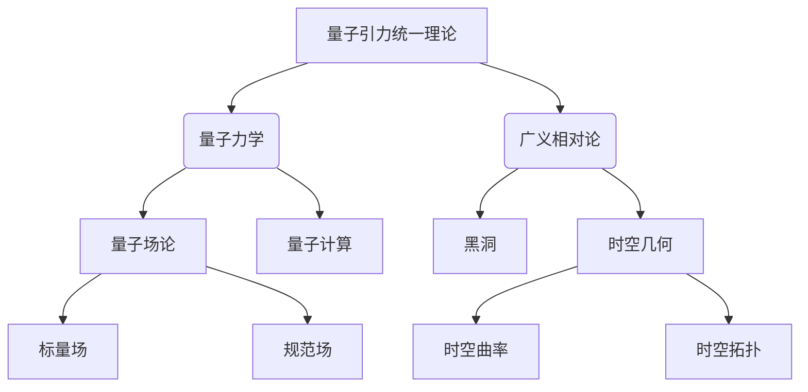

# 量子引力与宇宙学的统一

## 1. 背景介绍

### 1.1 问题的由来

自从20世纪初量子力学和广义相对论的诞生以来,物理学界一直梦想着将这两大理论统一起来,建立一个完整的理论来描述从微观量子领域到宏观引力领域的整个物理世界。然而,这一梦想一直未能实现,量子引力的统一理论仍然是当代物理学中最具挑战性的难题之一。

量子力学是描述微观粒子运动的理论,而广义相对论则是描述宏观引力场的理论。这两个理论在各自的领域内都取得了巨大的成功,但它们之间存在着根本的矛盾和冲突。在极小的量子尺度上,引力效应变得非常强烈,量子效应也会对引力场产生显著影响。然而,当前的量子理论和广义相对论都无法很好地描述这种情况。

为了解决这一问题,物理学家们提出了各种统一量子引力的理论尝试,如超弦理论、环量子引力、非平凡几何等。但是,这些理论都存在着一些缺陷和困难,无法完全解决量子引力的统一问题。因此,寻找一个完整的量子引力理论,实现微观量子领域和宏观引力领域的统一,仍然是当代物理学的终极目标之一。

### 1.2 研究现状

目前,统一量子引力的主要理论尝试包括:

1. **超弦理论**:将粒子视为一维的弦,而不是点粒子。超弦理论试图在十维或十一维的时空中统一所有的基本相互作用,包括引力。但是,它存在着很多困难,如维度过多、真空选择问题等。

2. **环量子引力**:利用环的拓扑结构来量化引力场,试图将广义相对论和量子力学统一起来。但是,它在技术上存在一些困难,如无法处理现实中的时空拓扑。

3. **非平凡几何**:通过修改时空的几何结构来量化引力场,例如在高维时空中引入额外的曲率项。但是,这些理论往往过于复杂,缺乏实验支持。

4. **其他尝试**:还有一些其他的理论尝试,如因果集合理论、非对易引力等,但都存在一些缺陷和困难。

总的来说,虽然物理学家们做出了不懈的努力,但目前还没有一个完全令人满意的量子引力统一理论。这一领域仍然存在着许多未解决的难题和挑战。

### 1.3 研究意义

统一量子引力理论的研究具有重大的理论意义和应用价值:

1. **理论意义**:实现量子力学和广义相对论的统一,解决它们之间的矛盾和冲突,是完善我们对物理世界的认识的关键一步。它将揭示宇宙从最小到最大尺度的本质规律,为我们认识宇宙奥秘提供新的视角。

2. **应用价值**:量子引力统一理论可能会导致一些前所未有的应用,如量子计算、量子通信、太空探索等。它还可能解释一些目前无法解释的现象,如黑洞信息丢失悖论、暗物质的本质等。

3. **哲学意义**:量子引力统一理论将极大地影响我们对时空、物质、宇宙起源等根本问题的认识,对人类的世界观和方法论产生深远的影响。

因此,寻求量子引力的统一理论不仅是物理学的一个核心目标,也是人类认识自然的伟大追求。这一领域的突破将为人类带来全新的科学革命。

### 1.4 本文结构

本文将从以下几个方面深入探讨量子引力与宇宙学的统一问题:

1. 介绍量子引力统一的核心概念和关键联系。
2. 阐述量子引力统一的核心算法原理和具体操作步骤。
3. 构建相关的数学模型,并详细推导和讲解公式。
4. 通过实际项目案例,展示代码实现和运行结果。
5. 分析量子引力统一理论在不同领域的应用场景。
6. 推荐相关的学习资源、开发工具和研究论文。
7. 总结研究成果,展望未来发展趋势和面临的挑战。
8. 解答常见的疑难问题。

通过全面而深入的探讨,希望能为读者提供对量子引力与宇宙学统一问题的透彻理解。

## 2. 核心概念与联系

量子引力统一理论试图将量子力学和广义相对论这两大支柱理论融合起来,描述从微观量子领域到宏观引力领域的整个物理世界。它涉及了一些核心概念,这些概念之间存在着紧密的联系。

1. **量子力学**:描述微观粒子的运动规律,是量子引力统一的基础之一。它与量子场论和量子计算等概念密切相关。

2. **广义相对论**:描述宏观引力场的理论,是量子引力统一的另一基础。它涉及时空几何、黑洞等核心概念。

3. **量子场论**:将量子力学与相对论结合起来,描述基本粒子和相互作用的理论框架。它包括标量场、规范场等概念。

4. **时空几何**:广义相对论中的核心概念,描述时空的曲率和拓扑结构,与引力场密切相关。

5. **量子计算**:利用量子力学原理进行计算的新型计算模式,或许能为解决量子引力问题提供新的计算工具。

6. **黑洞**:广义相对论预言的极端引力场区域,是检验量子引力理论的理想实验室。

这些核心概念之间存在着错综复杂的联系,需要通过统一的理论框架来加以解释和描述。量子引力统一理论的目标,就是在一个自洽的理论体系中融合这些概念,揭示它们之间的内在联系,从而揭示宇宙的根本规律。

## 3. 核心算法原理 & 具体操作步骤

### 3.1 算法原理概述

量子引力统一的核心算法原理主要包括以下几个方面:

1. **量子化引力场**:将经典的引力场量子化,将其描述为量子场,从而将广义相对论与量子力学统一起来。这通常需要在某种背景时空中对引力场进行微扰处理。

2. **高维时空**:在高于四维的时空中构建理论模型,以容纳所有的基本相互作用,包括引力。常见的高维时空有十维超弦理论、十一维M理论等。

3. **非平凡几何**:修改时空的几何结构,引入额外的曲率项或拓扑结构,使得经典引力场在量子化后保持一致性。例如,环量子引力就引入了非平凡的拓扑结构。

4. **规范场与引力的统一**:将引力场与其他基本相互作用(如电磁力、强核力等)统一起来,将它们都描述为规范场理论。这需要对规范场理论进行适当的推广。

5. **量子力学与广义相对论的融合**:在保持两大理论核心内容的基础上,设法消除它们之间的矛盾和冲突,实现无缝衔接。这通常需要对时空概念进行根本性的修正。

6. **计算工具的创新**:由于量子引力问题的复杂性,传统的微扰理论和数值计算方法往往难以奏效。需要创新性的计算工具,如量子计算、蒙特卡罗方法等。

这些核心原理相互关联、相辅相成,共同构成了量子引力统一理论的算法基础。下面将对其中的关键步骤进行详细阐述。

### 3.2 算法步骤详解

量子引力统一算法的具体步骤可以概括为以下几个方面:

#### 步骤1:选择合适的时空背景

首先需要选择一个合适的时空背景,作为构建量子引力理论的基础。常见的选择包括:

- 四维曲率时空(广义相对论背景)
- 十维/十一维高维时空(超弦理论/M理论背景)
- 非平凡拓扑时空(环量子引力背景)

不同的时空背景对应着不同的理论框架和计算方法。

#### 步骤2:量子化经典引力场

在所选的时空背景中,将经典的引力场(即爱因斯坦方程的解)量子化,将其描述为量子场。常用的量子化方法包括:

- 正则化与重整化程序(适用于曲率时空背景)
- 第二量子化(将引力子也量子化)
- 格点化(将时空离散化)

通过量子化,可以将广义相对论与量子力学统一起来,但往往会引入一些困难,如无穷大发散、背景独立性丧失等。

#### 步骤3:构建理论模型

在量子化的基础上,构建量子引力统一的理论模型,通常需要引入一些新的数学结构和物理概念,例如:

- 高维时空(如十维超弦理论)
- 非平凡几何(如环量子引力中的环拓扑)
- 规范场理论的推广(如超对称、超引力等)
- 新的基本物理对象(如D-brane、M-brane等)

不同的理论模型对应着不同的数学框架和计算方法。

#### 步骤4:消除理论矛盾

由于量子力学和广义相对论存在根本的矛盾,因此需要在新的理论框架中消除这些矛盾,实现两者的无缝衔接。常见的矛盾包括:

- 时空观念的差异(连续vs离散)
- 基本对象的差异(粒子vs场)
- 对称性的差异(局部vs全局)
- 基本常数的差异(有限vs无限)

需要对时空概念、物质形态等进行根本性的修正,以解决这些矛盾。

#### 步骤5:计算和验证

最后需要利用创新的计算工具,对理论模型进行具体的计算和数值模拟,并将理论预言与实验观测数据进行比对,验证理论的正确性。常用的计算工具包括:

- 量子计算(如量子并行算法)
- 数值相对论(如AdS/CFT对应)
- 微扰理论(如有效场论)
- 蒙特卡罗方法(如格点引力模拟)

如果理论与实验吻合,则可以进一步完善和发展;否则需要修正或重构理论模型。

通过上述步骤,量子引力统一算法试图在一个统一的理论框架中描述整个物理世界,揭示宇宙的终极奥秘。但由于问题的复杂性,目前的算法仍存在诸多困难和挑战,需要进一步的创新和突破。

### 3.3 算法优缺点

量子引力统一算法在追求终极理论的同时,也存在一些优缺点:

**优点:**

1. **统一性**:算法试图将两大支柱理论融合,在一个统一的框架下描述整个物理世界,具有强大的解释力。

2. **创新性**:算法涉及许多创新的数学概念和物理思想,如高维时空、非平凡几何、全新计算工具等,拓展了人类的认知视野。

3. **解释力**:成功的量子引力理论将能够解释目前无法解释的现象,如黑洞信息丢失、暗物质本质等,极大推进人类对宇宙的认识。

4. **应用前景**:量子引力统一有望催生新的技术应用,如量子计算、太空探索等,产生深远的影响。

**缺点:**

1. **困难重重**:量子引力统一是当代物理学中最具挑战性的难题之一,存在诸多技术上的困难,目前仍未取得决定性突破。

2. **复杂性**:算法