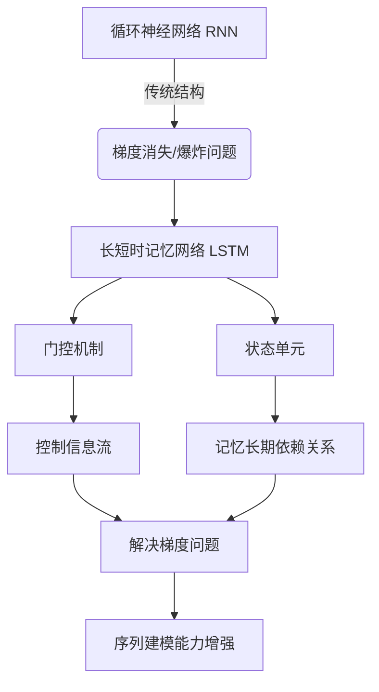
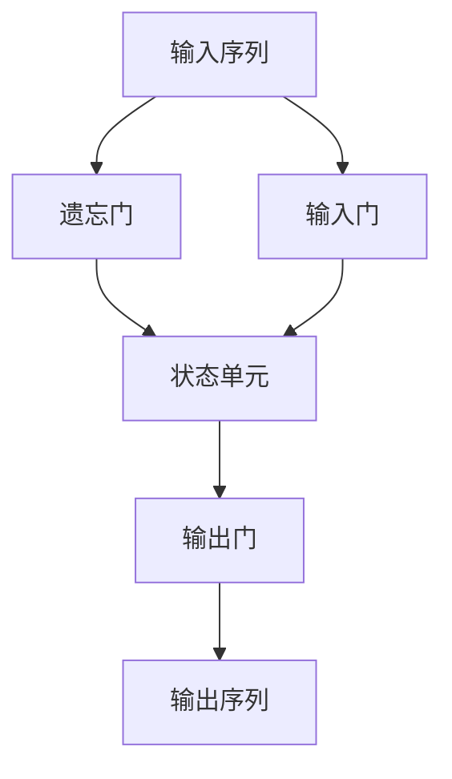

# 长短时记忆网络 (LSTM) 原理与代码实例讲解

## 1. 背景介绍

### 1.1 问题的由来

在深度学习领域中,循环神经网络 (RNN) 被广泛应用于处理序列数据,如自然语言处理、语音识别、时间序列预测等。然而,传统的 RNN 在处理长序列数据时存在梯度消失或梯度爆炸的问题,导致网络难以很好地捕捉长期依赖关系。为了解决这一问题,长短时记忆网络 (LSTM) 应运而生。

### 1.2 研究现状

LSTM 是一种特殊的 RNN 结构,由 Hochreiter 和 Schmidhuber 于 1997 年提出。它通过精心设计的门控机制和状态单元,有效地解决了 RNN 在处理长序列数据时的梯度消失和爆炸问题。自从提出以来,LSTM 在各种序列建模任务中取得了卓越的成绩,成为处理序列数据的主流方法之一。

### 1.3 研究意义

LSTM 的出现为处理长期依赖序列数据带来了新的可能性。它在自然语言处理、语音识别、机器翻译、时间序列预测等领域发挥着重要作用。深入理解 LSTM 的原理和实现对于开发更加高效和准确的序列建模模型至关重要。

### 1.4 本文结构

本文将全面介绍 LSTM 的理论基础、核心算法原理、数学模型推导、代码实现细节以及实际应用场景。通过理论与实践相结合的方式,旨在帮助读者深入理解 LSTM,并为其在实际项目中的应用奠定坚实基础。

## 2. 核心概念与联系

LSTM 是一种特殊的 RNN 结构,旨在解决传统 RNN 在处理长序列数据时存在的梯度消失或梯度爆炸问题。它的核心创新在于引入了门控机制和状态单元。

门控机制通过控制信息的流动,决定什么时候更新网络状态、什么时候遗忘旧信息、什么时候输出结果。状态单元则用于记录序列中的长期依赖关系,避免梯度消失或爆炸。

通过这些创新设计,LSTM 能够有效地捕捉长期依赖关系,从而显著增强了处理长序列数据的能力,在自然语言处理、语音识别、时间序列预测等领域发挥着重要作用。

## 3. 核心算法原理 & 具体操作步骤

### 3.1 算法原理概述

LSTM 的核心思想是通过门控机制和状态单元来控制信息的流动和记忆长期依赖关系。它由四个主要部分组成:遗忘门、输入门、状态单元和输出门。

1. **遗忘门**决定从上一时间步的状态中遗忘什么信息。
2. **输入门**决定从当前输入和上一状态中获取什么新信息。
3. **状态单元**整合遗忘门和输入门的信息,更新记忆状态。
4. **输出门**根据当前输入和状态,决定输出什么信息。

通过这种精心设计的门控机制和状态单元,LSTM 能够有效地捕捉长期依赖关系,从而解决了传统 RNN 在处理长序列数据时存在的梯度消失或爆炸问题。

### 3.2 算法步骤详解

LSTM 的具体计算过程可以分为以下几个步骤:

1. **遗忘门计算**

$$
f_t = \sigma(W_f \cdot [h_{t-1}, x_t] + b_f)
$$

其中 $f_t$ 表示遗忘门的激活值向量, $\sigma$ 是 Sigmoid 激活函数, $W_f$ 和 $b_f$ 分别是遗忘门的权重和偏置参数, $h_{t-1}$ 是上一时间步的隐藏状态, $x_t$ 是当前时间步的输入。

2. **输入门计算**

$$
i_t = \sigma(W_i \cdot [h_{t-1}, x_t] + b_i)
$$
$$
\tilde{C}_t = \tanh(W_C \cdot [h_{t-1}, x_t] + b_C)
$$

其中 $i_t$ 表示输入门的激活值向量, $\tilde{C}_t$ 是候选状态向量, $W_i$、$W_C$、$b_i$ 和 $b_C$ 分别是输入门和候选状态的权重和偏置参数。

3. **状态单元更新**

$$
C_t = f_t \odot C_{t-1} + i_t \odot \tilde{C}_t
$$

其中 $C_t$ 是当前时间步的状态单元, $\odot$ 表示元素wise乘积操作。状态单元通过遗忘门和输入门来更新,保留了重要的长期依赖信息。

4. **输出门计算**

$$
o_t = \sigma(W_o \cdot [h_{t-1}, x_t] + b_o)
$$
$$
h_t = o_t \odot \tanh(C_t)
$$

其中 $o_t$ 表示输出门的激活值向量, $h_t$ 是当前时间步的隐藏状态输出, $W_o$ 和 $b_o$ 是输出门的权重和偏置参数。

通过上述步骤,LSTM 可以有效地控制信息的流动,捕捉长期依赖关系,并产生当前时间步的输出。

### 3.3 算法优缺点

**优点:**

1. **解决梯度消失/爆炸问题**: LSTM 通过门控机制和状态单元,可以有效地捕捉长期依赖关系,避免了传统 RNN 在处理长序列数据时存在的梯度消失或爆炸问题。
2. **强大的建模能力**: LSTM 在各种序列建模任务中表现出色,如自然语言处理、语音识别、时间序列预测等。
3. **可解释性较好**: LSTM 的门控机制和状态单元具有一定的可解释性,有助于理解网络的内部工作原理。

**缺点:**

1. **参数较多**: LSTM 由于引入了门控机制和状态单元,导致参数数量较多,增加了计算复杂度和内存占用。
2. **训练时间较长**: LSTM 的训练过程通常比传统 RNN 更加缓慢,需要更长的时间来收敛。
3. **短期记忆能力有限**: LSTM 虽然能够捕捉长期依赖关系,但对于短期记忆的建模能力相对较弱。

### 3.4 算法应用领域

LSTM 在以下领域具有广泛的应用:

1. **自然语言处理**: 如机器翻译、文本生成、情感分析、语音识别等。
2. **时间序列预测**: 如股票预测、天气预报、销售预测等。
3. **语音识别**: 将语音信号转换为文本。
4. **手写识别**: 识别手写字符或数字。
5. **视频分析**: 如行为识别、动作检测等。
6. **机器人控制**: 根据环境输入控制机器人的行为。

LSTM 在处理序列数据方面展现出了强大的能力,成为了深度学习领域中不可或缺的重要组成部分。

## 4. 数学模型和公式 & 详细讲解 & 举例说明

### 4.1 数学模型构建

LSTM 的数学模型可以表示为:

$$
\begin{aligned}
f_t &= \sigma(W_f \cdot [h_{t-1}, x_t] + b_f) \\
i_t &= \sigma(W_i \cdot [h_{t-1}, x_t] + b_i) \\
\tilde{C}_t &= \tanh(W_C \cdot [h_{t-1}, x_t] + b_C) \\
C_t &= f_t \odot C_{t-1} + i_t \odot \tilde{C}_t \\
o_t &= \sigma(W_o \cdot [h_{t-1}, x_t] + b_o) \\
h_t &= o_t \odot \tanh(C_t)
\end{aligned}
$$

其中:

- $f_t$: 遗忘门的激活值向量
- $i_t$: 输入门的激活值向量
- $\tilde{C}_t$: 候选状态向量
- $C_t$: 当前时间步的状态单元
- $o_t$: 输出门的激活值向量
- $h_t$: 当前时间步的隐藏状态输出
- $W_f$、$W_i$、$W_C$、$W_o$: 各门和候选状态的权重参数
- $b_f$、$b_i$、$b_C$、$b_o$: 各门和候选状态的偏置参数
- $\sigma$: Sigmoid 激活函数
- $\odot$: 元素wise乘积操作

通过上述数学模型,LSTM 可以有效地控制信息的流动,捕捉长期依赖关系,并产生当前时间步的输出。

### 4.2 公式推导过程

以遗忘门 $f_t$ 为例,推导其公式的过程如下:

1. 将当前时间步的输入 $x_t$ 和上一时间步的隐藏状态 $h_{t-1}$ 进行拼接,形成一个新的向量 $[h_{t-1}, x_t]$。
2. 将拼接后的向量与遗忘门的权重矩阵 $W_f$ 进行矩阵乘法,得到 $W_f \cdot [h_{t-1}, x_t]$。
3. 将上一步的结果加上遗忘门的偏置向量 $b_f$,得到 $W_f \cdot [h_{t-1}, x_t] + b_f$。
4. 将上一步的结果输入 Sigmoid 激活函数 $\sigma$,得到遗忘门的激活值向量 $f_t$。

$$
f_t = \sigma(W_f \cdot [h_{t-1}, x_t] + b_f)
$$

通过类似的推导过程,可以得到输入门 $i_t$、候选状态 $\tilde{C}_t$、状态单元 $C_t$、输出门 $o_t$ 和隐藏状态输出 $h_t$ 的公式。

### 4.3 案例分析与讲解

现在,让我们通过一个简单的案例来更好地理解 LSTM 的工作原理。

假设我们有一个序列 "The cat sat on the mat"。我们希望 LSTM 能够学习这个序列,并预测下一个单词是什么。

1. 初始状态

在开始处理序列之前,我们需要初始化 LSTM 的状态单元 $C_0$ 和隐藏状态 $h_0$,通常将它们初始化为全零向量。

2. 处理第一个单词 "The"

- 将单词 "The" 编码为一个向量 $x_1$,作为 LSTM 的输入。
- 根据公式计算遗忘门 $f_1$、输入门 $i_1$、候选状态 $\tilde{C}_1$、状态单元 $C_1$、输出门 $o_1$ 和隐藏状态输出 $h_1$。
- 由于初始状态为全零,所以 $C_1 = i_1 \odot \tilde{C}_1$,即状态单元完全由输入门和候选状态决定。

3. 处理后续单词

- 对于后续的每个单词,如 "cat"、"sat"、"on" 和 "the",重复上一步骤,根据当前输入和上一时间步的隐藏状态,计算新的遗忘门、输入门、候选状态、状态单元、输出门和隐藏状态输出。
- 在这个过程中,LSTM 会根据门控机制和状态单元,决定保留或遗忘哪些信息,从而捕捉序列中的长期依赖关系。

4. 预测下一个单词

- 当处理完整个序列 "The cat sat on the