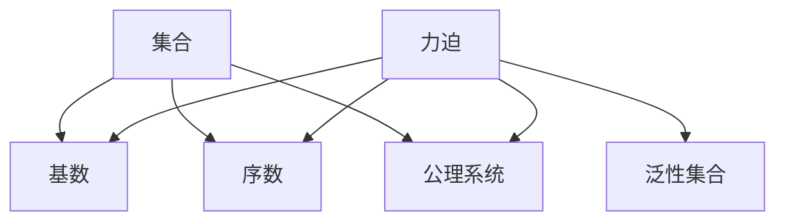

# 集合论导引：力迫基本理论

关键词：集合论、力迫、泛性、基数、序数、选择公理、连续统假设

## 1. 背景介绍
### 1.1 问题的由来
集合论是现代数学的基础,它研究集合的性质以及集合之间的关系。19世纪末,康托尔创立了集合论,并提出了无穷集合的概念。然而,集合论在发展过程中遇到了悖论,如罗素悖论等。为了解决这些悖论,数学家们提出了多个集合论公理化体系,如ZFC公理系统。

力迫是集合论中的一个重要概念,它描述了集合之间的一种特殊关系。通过研究力迫,我们可以更深入地理解集合的性质,并解决一些重要的数学问题,如连续统假设等。

### 1.2 研究现状
目前,力迫理论已经成为集合论研究的重要分支。许多数学家对力迫的性质进行了深入研究,并取得了丰硕的成果。例如,Solovay证明了ZFC与某些大基数公理相容;Shelah提出了正则性谱问题并给出了部分解答。

近年来,力迫理论也被应用到了其他数学分支,如拓扑学、代数学等。一些计算机科学家也尝试利用力迫理论来研究算法的复杂性。

### 1.3 研究意义
深入研究力迫理论,对于发展数学理论体系具有重要意义:

1. 有助于我们更好地理解集合的本质,揭示集合论的深层结构。
2. 可以解决一些重要的数学难题,如连续统假设、Suslin假设等。
3. 对其他数学分支具有启发意义,如拓扑学中的紧致性问题等。
4. 在计算机科学等应用领域也有潜在价值。

### 1.4 本文结构
本文将从以下几个方面介绍力迫的基本理论:

1. 力迫的核心概念与基本性质
2. 力迫的构造方法与应用
3. 力迫与基数、序数的关系
4. 力迫与一些重要的集合论公理和命题
5. 力迫理论的应用实例
6. 力迫理论的发展历史与研究现状
7. 总结与展望

## 2. 核心概念与联系
集合论中的核心概念包括:

- 集合:由一些确定的且不同的对象组成的整体。
- 元素:组成集合的对象。
- 子集:A是B的子集,当且仅当A的每个元素都是B的元素。  
- 函数:两个集合之间的一种对应关系。
- 基数:度量集合的大小。
- 序数:对应良序集的顺序类型。

力迫是集合论中的一个重要工具,它刻画了集合之间的一种特殊关系。直观地说,如果P力迫Q,那么Q包含了P的所有信息,且比P"更大"。通过巧妙地构造力迫,可以得到一些性质特殊的集合,如泛性集合等。

力迫与许多集合论概念密切相关:
- 力迫可以改变集合的基数性质,如科里力迫使连续统的基数变为 $\aleph_2$。
- 力迫可以影响集合的序数结构,如Sacks力迫保持序数的稠密性。  
- 力迫模型是研究集合论公理和命题的重要工具,如证明了ZFC与某些大基数公理的相容性。

下图是力迫与其他集合论概念的关系:

## 3. 核心算法原理 & 具体操作步骤
### 3.1 算法原理概述
力迫的基本思想是,通过泛性集合来扩充已有的模型,从而得到一个新的模型。在这个新模型中,某些命题可能会发生改变。通过巧妙地选择泛性集合,就可以使得新模型满足我们需要的性质。

泛性集合是指满足某种特殊性质的集合。直观地说,泛性集合是那些能够"编码"所有其他同类型集合信息的集合。常见的泛性集合有Cohen实数、Sacks实数等。

### 3.2 算法步骤详解
构造力迫模型的一般步骤如下:

1. 选取一个初始的模型 $M$,它满足ZFC公理。
2. 定义力迫条件集合 $\mathbb{P}$,它满足一定的封闭性和序关系。
3. 对 $\mathbb{P}$ 中的元素 $p$ 进行同延,得到泛性集合 $G$。
4. 在 $M[G]$ 中考察命题 $\varphi$ 的真值。
5. 如果 $\varphi$ 在 $M[G]$ 中为真,则称 $p$ 力迫 $\varphi$。

举个例子,Cohen力迫的构造步骤如下:

1. 令 $M$ 为满足ZFC的传递模型。
2. 令 $\mathbb{P}$ 为有限偏序集,每个元素都是整数的有限部分函数。
3. 对任意的 $p\in\mathbb{P}$,总存在 $q\leq p$ 使得 $q$ 在某个点定义。
4. 泛性集合 $G$ 是 $\mathbb{P}$ 的一个超滤子。在 $M[G]$ 中, $\cup G$ 是 $\omega$ 到 $2$ 的满射。
5. 可以证明,在 $M[G]$ 中 $CH$ 不成立,但 $M$ 中的基数和序数保持不变。

### 3.3 算法优缺点
力迫方法的优点在于:
1. 在保持原有模型的基本结构不变的情况下,可以改变某些命题的真值。
2. 通过选取不同的泛性集合,可以得到不同性质的模型。
3. 在证明集合论命题的独立性时非常有用。

但是,力迫方法也存在一些局限:
1. 泛性集合的构造比较复杂,有时需要复杂的组合技巧。
2. 有些命题(如CH)的真值无法通过有限步力迫得到。
3. 力迫方法主要适用于证明命题的独立性,对于证明命题的真值帮助不大。

### 3.4 算法应用领域
力迫方法主要应用于以下领域:
1. 集合论:证明一些命题(如CH、SH等)相对ZFC是独立的。
2. 模型论:构造具有特殊性质的模型,如饱和模型等。
3. 拓扑学:研究序列紧致性、D空间等性质。
4. 代数学:构造具有特殊性质的环、域等代数结构。
5. 计算理论:研究集合论与计算复杂性的关系。

## 4. 数学模型和公式 & 详细讲解 & 举例说明
### 4.1 数学模型构建
集合论可以看作是研究集合的数学理论。它的基本概念包括集合、元素、子集、幂集、笛卡尔积、关系、函数等。在标准的ZFC公理化体系中,这些概念可以通过公理来刻画。

例如,子集公理可以表述为:

$$\forall A \forall B \exists C \forall x [x\in C \leftrightarrow (x\in A \wedge x\in B)]$$

直观地说,它表示任意两个集合的交集仍然是一个集合。类似地,幂集公理表示任意集合的全部子集组成的集合仍然是一个集合。

在集合论中,两个最重要的概念是基数和序数。基数用于度量集合的大小,而序数则刻画了集合元素的顺序结构。通过基数和序数,我们可以比较不同集合的大小,研究它们的结构性质。

力迫方法则是在标准的集合论模型上,通过扩充集合来得到新的模型。它的核心概念是泛性集合和力迫序关系。

### 4.2 公式推导过程
下面我们来推导一下力迫的一些基本性质。设 $M$ 是一个标准的集合论模型,$\mathbb{P}$ 是 $M$ 中的一个偏序集,它满足以下性质:

1. $\mathbb{P}$ 有最大元 $1_{\mathbb{P}}$。
2. 对任意 $p,q\in\mathbb{P}$,存在 $r\in\mathbb{P}$ 使得 $r\leq p,q$。
3. 对任意 $p\in\mathbb{P}$ 和 $M$ 中的集合 $D$,如果 $D$ 在 $p$ 之下稠密,那么存在 $q\leq p$ 使得 $q\in D$。

我们称满足以上性质的 $\mathbb{P}$ 为 $M$ 上的力迫序。

**定理1:** 设 $G$ 是 $\mathbb{P}$ 的一个泛性集,那么 $M[G]$ 是 $M$ 的一个模型。

**证明:** 只需验证 $M[G]$ 满足ZFC公理即可。这里略去细节,给出大致思路:

1. $M[G]$ 的子集公理可以通过 $M$ 中子集的"名字"来保证。
2. $M[G]$ 的幂集公理可以通过 $M$ 中函数的"名字"来保证。
3. $M[G]$ 的替换公理可以通过 $M$ 中关系的"名字"来保证。
4. $M[G]$ 中的无穷公理和选择公理可以直接从 $M$ 中继承。

**定理2:** 设 $\varphi$ 是一个集合论公式, $p\in\mathbb{P}$。如果对任意的泛性集 $G\ni p$,都有 $M[G]\models\varphi$,那么称 $p$ 力迫 $\varphi$,记作 $p\Vdash\varphi$。

**证明:** 略。

力迫关系 $\Vdash$ 满足以下性质:

1. 如果 $p\Vdash\varphi$ 且 $q\leq p$,则 $q\Vdash\varphi$。
2. $p\Vdash\varphi\wedge\psi$ 当且仅当 $p\Vdash\varphi$ 且 $p\Vdash\psi$。
3. $p\Vdash\exists x\varphi(x)$ 当且仅当对某个 $M$ 中的集合 $a$,有 $p\Vdash\varphi(a)$。
4. 如果 $D$ 在 $p$ 之下稠密,且对任意 $q\in D$ 都有 $q\Vdash\varphi$,则 $p\Vdash\varphi$。

利用以上性质,我们可以在力迫扩充中研究各种集合论命题的真值。

### 4.3 案例分析与讲解
下面我们来看一个具体的例子:Cohen力迫与连续统假设。

**例:** 在ZFC中,连续统假设(CH)指的是实数集 $\mathbb{R}$ 与第一不可数基数 $\aleph_1$ 等势,即:

$$2^{\aleph_0}=\aleph_1$$

Cohen力迫可以否定CH。具体地,设 $M$ 是满足ZFC+CH的模型,令 $\mathbb{P}$ 为Cohen力迫序,则在 $M[G]$ 中,有:

$$2^{\aleph_0}=\aleph_2$$

也就是说,Cohen实数的加入改变了 $M$ 中的基数结构。

我们来看一下具体的构造过程:

1. 在 $M$ 中,令 $\mathbb{P}$ 为所有整数有限部分函数 $p:\omega\to 2$ 组成的集合。
2. 对任意 $p,q\in\mathbb{P}$,定义 $p\leq q$ 当且仅当 $p\supseteq q$。
3. 对 $\mathbb{P}$ 的任意泛性集 $G$,令 $c_G=\cup G:\omega\to 2$。
4. 可以证明,在 $M[G]$ 中,$c_G$ 是一个Cohen实数,且 $\aleph_1^M<|c_G|<\aleph_2^M$。
5. 由于 $M$ 满足CH,因此在 $M[G]$ 中必有 $2^{\aleph_0}\geq\aleph_2$。

这个例子说明,力迫方法可以用来研究集合论公理之间的相互关系