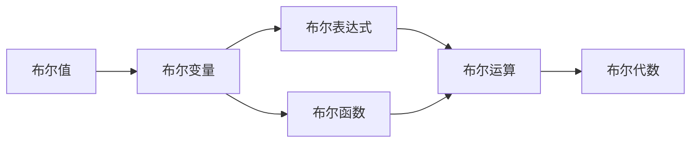

# 集合论导引：布尔值模型VB

关键词：集合论, 布尔值, 数学模型, 算法原理, 代码实现

## 1. 背景介绍
### 1.1 问题的由来
集合论是现代数学的基础,在计算机科学、人工智能等领域有广泛应用。而布尔值是最简单但也是最重要的数学模型之一,是集合论的基础。深入理解布尔值模型,对于我们学习和应用集合论、离散数学乃至计算机科学都有重要意义。

### 1.2 研究现状
目前,布尔值模型在数理逻辑、计算机科学等领域都有深入研究,并在实际应用中得到广泛运用。比如在数字电路设计、程序设计语言、数据库查询语言、人工智能等方面,布尔值都是其数学基础。但对于初学者来说,布尔值模型涉及的一些概念和定理可能不太容易理解。

### 1.3 研究意义
通过本文的讨论,读者可以系统地学习和掌握布尔值模型的基本概念、定理和应用。这不仅有助于更好地学习集合论和数理逻辑等数学知识,而且可以提升逻辑思维和抽象思维能力。同时,布尔值模型直接应用于计算机科学的方方面面,深入理解布尔值模型,也有助于我们成为更优秀的程序员和计算机科学家。

### 1.4 本文结构
本文将从布尔值模型的基本概念出发,系统讨论其相关定义、运算、定律和性质,并通过具体的数学模型和编程实例来加深理解。全文分为9个章节：第1章介绍研究背景；第2章讨论布尔值模型的核心概念；第3章介绍布尔代数的运算定律和算法；第4章建立布尔代数的数学模型并给出公式推导；第5章通过编程实例演示布尔代数的应用；第6章讨论布尔值在实际中的应用场景；第7章介绍学习布尔代数的资源；第8章总结全文并展望布尔模型的发展前景；第9章给出常见问题解答。

## 2. 核心概念与联系
布尔值模型主要涉及以下核心概念：
- 布尔值(Boolean value):只有两个值0和1,或称False和True 
- 布尔变量(Boolean variable):取值只能为0或1的变量
- 布尔函数(Boolean function):自变量和因变量都是布尔变量的函数
- 布尔表达式(Boolean expression):由布尔变量和布尔运算符组成的表达式
- 布尔运算(Boolean operation):布尔值之间的运算,包括与(AND)、或(OR)、非(NOT)等
- 布尔代数(Boolean algebra):研究布尔值和布尔运算的代数系统

这些概念之间的联系如下:


## 3. 核心算法原理 & 具体操作步骤
### 3.1 算法原理概述
布尔代数的基本运算包括与(AND)、或(OR)、非(NOT)三种,分别用符号 $\wedge$、$\vee$、$\neg$ 表示。设$p$,$q$为布尔变量,则三种运算定义为:

$p \wedge q = \begin{cases}
1, & p=q=1 \\
0, & \text{其他情况}
\end{cases}$

$p \vee q = \begin{cases}
0, & p=q=0 \\
1, & \text{其他情况}
\end{cases}$

$\neg p = \begin{cases}
0, & p=1 \\
1, & p=0
\end{cases}$

布尔代数还有一些重要的定律,包括交换律、结合律、分配律、德摩根定律等,这些定律构成了化简布尔表达式的理论基础。

### 3.2 算法步骤详解
对于给定的布尔表达式,我们可以通过以下步骤来化简求值:
1. 列出真值表,枚举所有可能的变量取值,计算表达式的值
2. 利用布尔代数的基本定律进行化简,比如 $p \wedge 1 = p$, $p \vee 0 = p$ 等
3. 使用德摩根定律 $\neg(p \wedge q) = (\neg p) \vee (\neg q)$, $\neg(p \vee q) = (\neg p) \wedge (\neg q)$ 去括号
4. 提取公因式,将相同项合并
5. 重复上述步骤,直到表达式不能再化简

利用上述方法,我们可以将任意复杂的布尔表达式化简成最简形式,这个最简形式被称为最小项或最大项。

### 3.3 算法优缺点
布尔代数化简算法的优点是:
- 原理简单,容易理解和实现
- 能够得到布尔表达式的最简形式
- 化简后的表达式更加简洁,更容易分析其逻辑结构

但是,该算法也存在一些缺点:
- 对于变量较多的布尔表达式,列出完整的真值表很困难
- 化简过程比较繁琐,需要大量重复劳动
- 没有通用的机械化简方法,有时仍需要一定数学直觉

### 3.4 算法应用领域
布尔代数是离散数学的基础,在计算机科学中有广泛应用,主要包括:
- 逻辑电路设计:用与或非门等实现任意布尔函数
- 程序设计语言:逻辑判断、条件分支等都离不开布尔表达式
- 数据库:SQL语句中的where条件实质是布尔表达式
- 人工智能:命题逻辑和一阶逻辑等知识表示和推理形式都基于布尔代数

## 4. 数学模型和公式 & 详细讲解 & 举例说明
### 4.1 数学模型构建
我们可以用一个二元组 $(B,\mathcal{O})$ 来定义布尔代数,其中:
- $B=\{0,1\}$ 为布尔值集合
- $\mathcal{O}=\{\wedge,\vee,\neg\}$ 为布尔运算集合

于是,一个布尔代数系统就是一个二元组 $(B,\mathcal{O})$,它满足以下公理:

设 $\forall p,q,r \in B$,则:

(1) 封闭性:
$p \wedge q \in B$, 
$p \vee q \in B$,
$\neg p \in B$

(2) 交换律:
$p \wedge q = q \wedge p$,
$p \vee q = q \vee p$

(3) 结合律:
$(p \wedge q) \wedge r = p \wedge (q \wedge r)$,
$(p \vee q) \vee r = p \vee (q \vee r)$

(4) 分配律:
$p \wedge (q \vee r) = (p \wedge q) \vee (p \wedge r)$
$p \vee (q \wedge r) = (p \vee q) \wedge (p \vee r)$

(5) 同一律:
$p \wedge 1 = p$,
$p \vee 0 = p$

(6) 补余律:
$p \wedge (\neg p) = 0$,
$p \vee (\neg p) = 1$

(7) 德摩根律:
$\neg(p \wedge q) = (\neg p) \vee (\neg q)$,
$\neg(p \vee q) = (\neg p) \wedge (\neg q)$

上述公理完整地刻画了布尔代数系统的数学特性,任何满足这些公理的系统,都可以被看作一个布尔代数。从逻辑上看,布尔代数定律揭示了命题逻辑的基本规律。

### 4.2 公式推导过程
利用布尔代数的基本定律,我们可以推导出一些重要公式,下面以德摩根律的推导为例:

证明: $\neg(p \wedge q) = (\neg p) \vee (\neg q)$

证明步骤:
$$
\begin{align}
\neg(p \wedge q) &= \neg(p \wedge q) \vee 0 \\
&= \neg(p \wedge q) \vee (p \wedge (\neg p)) \\
&= (\neg(p \wedge q) \vee p) \wedge (\neg(p \wedge q) \vee (\neg p)) \\
&= ((\neg p) \vee (\neg q) \vee p) \wedge ((\neg p) \vee (\neg q) \vee (\neg p)) \\
&= (1 \vee (\neg q)) \wedge ((\neg p) \vee 1) \\
&= 1 \wedge (\neg p) \vee (\neg q) \\
&= (\neg p) \vee (\neg q)
\end{align}
$$

其中用到的主要公式有:
- $p \vee 0 = p$
- $p \wedge (\neg p) = 0$
- 分配律
- $p \vee 1 = 1$
- $p \wedge 1 = p$

可见,利用布尔代数的基本定律,我们可以推导出许多重要的逻辑等价公式。

### 4.3 案例分析与讲解
下面我们以一个实际的例子来说明如何应用布尔代数化简布尔表达式。

例:设有布尔表达式 $F = (A \wedge B) \vee (\neg A \wedge C) \vee (B \wedge C)$,试化简之。

解:列出真值表如下:

| $A$ | $B$ | $C$ | $A \wedge B$ | $\neg A \wedge C$ | $B \wedge C$ | $F$ |
|:---:|:---:|:---:|:------------:|:-----------------:|:------------:|:---:|
|  0  |  0  |  0  |      0       |         0         |      0       |  0  |
|  0  |  0  |  1  |      0       |         1         |      0       |  1  |
|  0  |  1  |  0  |      0       |         0         |      0       |  0  |
|  0  |  1  |  1  |      0       |         1         |      1       |  1  |
|  1  |  0  |  0  |      0       |         0         |      0       |  0  |
|  1  |  0  |  1  |      0       |         0         |      0       |  0  |
|  1  |  1  |  0  |      1       |         0         |      0       |  1  |
|  1  |  1  |  1  |      1       |         0         |      1       |  1  |

观察真值表,只有在 $B=1$ 或 $C=1$ 时,$F$ 的值才为1。因此可以猜测 $F$ 可以化简为 $B \vee C$。

实际上,利用分配律可以证明:
$$
\begin{align}
F &= (A \wedge B) \vee (\neg A \wedge C) \vee (B \wedge C) \\
&= (A \wedge B) \vee ((\neg A) \vee B) \wedge C) \\
&= (A \wedge B) \vee (A \vee B) \wedge C) \\
&= B \vee C
\end{align}
$$

可见 $F$ 确实可以化简为 $B \vee C$,这和我们从真值表的观察结果一致。

### 4.4 常见问题解答
问:布尔代数中的"加法"和"乘法"运算分别是什么?
答:布尔代数中的"加法"运算就是逻辑或(OR),而"乘法"运算就是逻辑与(AND)。但是它们和普通代数中的加法乘法性质并不完全一样,需要遵循前面讨论的布尔代数定律。

问:布尔代数有没有"除法"运算?
答:布尔代数没有"除法"运算,因为逻辑命题不存在相除的概念。但是我们可以引入蕴涵(implication)运算,定义 $p \rightarrow q = (\neg p) \vee q$,表示"如果p成立那么q成立"。

## 5. 项目实践：代码实例和详细解释说明
### 5.1 开发环境搭建
我们将使用Python编程语言来实现布尔表达式的求值。读者需要安装Python 3.x版本的编译环境。推荐使用Anaconda发行版,它集成了Python科学计算生态中的众多常用工具包。

### 5.2 源代码详细实现
首先定义布尔变量和常量:
```python
class BoolVar:
    def __init__(self, name, value=None):
        self.name = name  
        self.value = value

    def __str__(self):
        return self.name

    def __