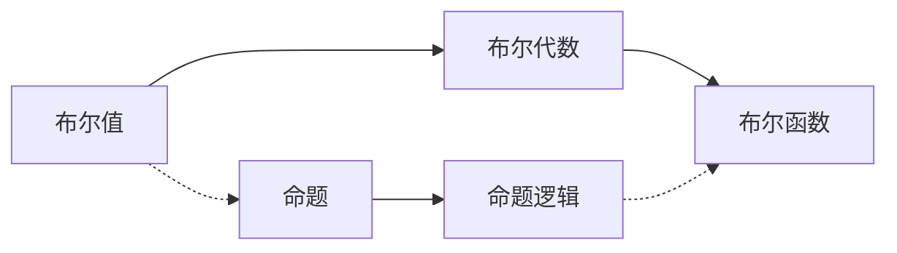

# 集合论导引：布尔值结构

关键词：集合论、布尔值、布尔代数、命题逻辑、逻辑门、二元关系

## 1. 背景介绍
### 1.1  问题的由来
布尔值是计算机科学和数字电路设计中最基本也是最重要的概念之一。它以数学家乔治·布尔的名字命名,代表着"真"和"假"两种逻辑状态。布尔值虽然简单,但却是计算机实现复杂逻辑功能的基石。深入理解布尔值的本质,对学习计算机科学、数字电路等知识至关重要。

### 1.2  研究现状
目前关于布尔值的研究主要集中在以下几个方面:
1. 布尔代数的公理化系统和等价变换规则。
2. 布尔函数的表示方法,如真值表、卡诺图等。
3. 布尔函数的化简方法,如卡诺图化简法、Q-M化简法等。
4. 命题逻辑与布尔代数之间的关系。
5. 布尔值在数字电路设计中的应用。

### 1.3  研究意义
深入研究布尔值结构有以下意义:
1. 加深对计算机内部工作原理的理解。计算机本质上就是一个布尔函数,输入二进制数,经过复杂的逻辑运算,最终输出结果。
2. 学习数字电路设计的理论基础。组合逻辑电路和时序逻辑电路都是通过布尔函数来实现的。
3. 掌握人工智能、知识表示等领域的基础知识。命题逻辑就是建立在布尔代数基础之上的。

### 1.4  本文结构
本文将从以下几个方面来探讨布尔值结构:
1. 布尔值的定义与布尔代数的基本运算
2. 布尔代数的公理系统
3. 布尔函数及其表示方法
4. 布尔函数的化简方法
5. 布尔值在数字逻辑电路中的应用
6. 布尔值与命题逻辑的关系

## 2. 核心概念与联系
- 布尔值(Boolean value):只有两个可能取值的变量,即"真(True)"和"假(False)",分别用1和0表示。
- 布尔代数(Boolean algebra):研究布尔值及其运算规则的代数系统。
- 布尔函数(Boolean function):定义域和值域都是布尔值的函数。
- 命题(Proposition):可判断真假的陈述句,与布尔值一一对应。
- 命题变项(Propositional variable):可以代表任意命题的符号。
- 联结词(Connectives):用来连接命题或命题变项的词,常见的有"非"、"与"、"或"、"蕴含"等。
- 公式(Formula):由命题变项和联结词组成的符号串。
- 真值指派(Truth value assignment):为命题变项指派真值的映射。
- 永真式(Tautology):在任意真值指派下都为真的公式。
- 逻辑等价(Logically equivalent):两个公式在相同真值指派下,真值总是一样,则称它们逻辑等价。

下图展示了布尔值、布尔代数、命题逻辑三者之间的关系:



## 3. 核心算法原理 & 具体操作步骤
### 3.1  算法原理概述
布尔代数的核心是研究布尔值在三种基本运算(与、或、非)下的运算规则和性质。通过基本运算可以构造出复杂的布尔函数,布尔函数则可以用于表示数字逻辑电路。

### 3.2  算法步骤详解
布尔代数的基本运算包括:
1. 与(AND):记作 $\wedge$,当且仅当两个布尔值都为1时,结果为1,否则为0。
2. 或(OR):记作 $\vee$,当且仅当两个布尔值都为0时,结果为0,否则为1。
3. 非(NOT):记作 $\neg$,将1变为0,0变为1。

布尔代数的基本定律包括:
1. 交换律:$x \wedge y = y \wedge x$, $x \vee y = y \vee x$
2. 结合律:$(x \wedge y) \wedge z = x \wedge (y \wedge z)$, $(x \vee y) \vee z = x \vee (y \vee z)$
3. 分配律:$x \wedge (y \vee z) = (x \wedge y) \vee (x \wedge z)$, $x \vee (y \wedge z) = (x \vee y) \wedge (x \vee z)$
4. 同一律:$x \wedge 1 = x$, $x \vee 0 = x$
5. 零律:$x \wedge 0 = 0$, $x \vee 1 = 1$
6. 补余律:$x \wedge \neg x = 0$, $x \vee \neg x = 1$
7. 双重否定律:$\neg (\neg x) = x$
8. 德摩根律:$\neg (x \wedge y) = \neg x \vee \neg y$, $\neg (x \vee y) = \neg x \wedge \neg y$

利用布尔代数定律,可将布尔函数化简为最简与或式(SOP)或最简或与式(POS)的形式。例如:
$$f(x,y,z) = x'y'z + x'yz' + xy'z' + xyz$$
其中 $x'$ 表示 $\neg x$。上式可以化简为:
$$f(x,y,z) = x'z + xy'$$

### 3.3  算法优缺点
布尔代数化简算法的优点是:
1. 形式简洁,可以大幅降低数字电路的复杂度。
2. 易于硬件实现,与、或、非三种门电路对应布尔代数的三种基本运算。

缺点是:
1. 对于多变量函数,计算复杂度较高。
2. 不能表示所有的逻辑函数,例如"异或"运算无法用基本运算直接表示。

### 3.4  算法应用领域
布尔代数广泛应用于以下领域:
1. 数字逻辑电路设计
2. 可靠性分析与故障诊断
3. 信息论与编码理论
4. 人工智能与知识表示
5. 数据库查询优化

## 4. 数学模型和公式 & 详细讲解 & 举例说明
### 4.1  数学模型构建
布尔代数可以定义为一个三元组 $\langle B,\wedge,\vee \rangle$,其中:
1. $B$ 是由两个元素0和1组成的集合。
2. $\wedge$ 是 $B$ 上的二元运算,称为"与",定义为:

|  $\wedge$  |  0  |  1  |
|:----------:|:---:|:---:|
|     0      |  0  |  0  |
|     1      |  0  |  1  |

3. $\vee$ 是 $B$ 上的二元运算,称为"或",定义为:

|  $\vee$  |  0  |  1  |
|:--------:|:---:|:---:|
|    0     |  0  |  1  |
|    1     |  1  |  1  |

此外,还可以定义一个一元运算 $\neg$,称为"非",定义为:

|  $x$  |  $\neg x$  |
|:-----:|:----------:|
|   0   |     1      |
|   1   |     0      |

### 4.2  公式推导过程
利用布尔代数的基本定律,可以推导出许多重要的公式,例如:

1. 吸收律:$x \wedge (x \vee y) = x$
推导过程:
$$\begin{aligned}
x \wedge (x \vee y) &= (x \wedge x) \vee (x \wedge y) \quad \text{(分配律)}\\
                    &= x \vee (x \wedge y) \quad \text{(幂等律)}\\
                    &= x \quad \text{(吸收律)}
\end{aligned}$$

2. 对合律:$(x \wedge y) \vee (\neg x \wedge y) = y$
推导过程:
$$\begin{aligned}
(x \wedge y) \vee (\neg x \wedge y) &= [(x \wedge y) \vee \neg x] \wedge [(x \wedge y) \vee y] \quad \text{(分配律)}\\
                                    &= (x \vee \neg x) \wedge (y \vee y) \quad \text{(分配律)}\\
                                    &= 1 \wedge y \quad \text{(互补律)}\\  
                                    &= y \quad \text{(同一律)}
\end{aligned}$$

### 4.3  案例分析与讲解
下面以一个实际的例子来说明布尔代数的应用。

假设某工厂生产的产品要经过A、B、C三道工序,每道工序都有检测环节,分别用 $a$、$b$、$c$ 表示各环节是否合格,1表示合格,0表示不合格。那么整个产品合格的条件可以用布尔函数表示为:
$$f(a,b,c) = a \wedge b \wedge c$$

现在要在总装车间增加一个检测岗位,只有前面三个岗位都合格,且总装检测合格(用 $d$ 表示),产品才能出厂,出厂条件可以表示为:
$$g(a,b,c,d) = f(a,b,c) \wedge d = a \wedge b \wedge c \wedge d$$

如果某一批产品A工序不合格,B、C工序合格,总装检测合格,那么:
$$\begin{aligned}
g(0,1,1,1) &= 0 \wedge 1 \wedge 1 \wedge 1\\
           &= 0
\end{aligned}$$
即这批产品不能出厂。

### 4.4  常见问题解答
Q:布尔代数中的"加法"和"乘法"运算与普通代数有何不同?
A:在布尔代数中,"加法"运算相当于逻辑"或",而"乘法"运算相当于逻辑"与"。它们都满足交换律、结合律和分配律,但不满足普通代数中的加法互逆、乘法互逆等性质。

Q:什么是布尔代数中的"对偶原理"?
A:将布尔代数中的一个等式中的所有变量和常数互换(0变为1,1变为0),并将 $\wedge$ 和 $\vee$ 互换,所得到的新等式仍然成立,这就是对偶原理。利用对偶原理可以将已知定理转化为对偶定理,简化定理的证明过程。

## 5. 项目实践：代码实例和详细解释说明
### 5.1  开发环境搭建
以Python为例,布尔运算可以直接用逻辑运算符实现:

|  布尔运算  |  Python运算符  |
|:----------:|:--------------:|
|     与     |      and       |
|     或     |       or       |
|     非     |      not       |

此外,Python还提供了`bool`函数,可以将其他类型转换为布尔类型。

### 5.2  源代码详细实现
下面是一个简单的布尔函数化简器的实现:
```python
def simplify(expr):
    # 1. 消除双重否定
    while '--' in expr:
        expr = expr.replace('--', '')
    # 2. 德摩根定律
    while '-(' in expr:
        i = expr.index('-(')
        j = expr.index(')', i)
        a = expr[i+2:j].split('&' if '&' in expr[i+2:j] else '|')
        expr = expr[:i] + ('|' if '&' in expr[i+2:j] else '&').join(map(lambda x: '-'+x.strip(), a)) + expr[j+1:]
    # 3. 吸收律
    while '1&' in expr or '0|' in expr:
        expr = expr.replace('1&', '').replace('0|', '')
    # 4. 常量传播
    while '1|' in expr or '0&' in expr:
        i = max(expr.index('1|') if '1|' in expr else -1, expr.index('0&') if '0&' in expr else -1)
        j = i + 2
        while j < len(expr) and expr[j] in '&|':
            j += 1
        expr = expr[:i] + ('1' if expr[i] == '1' else '0') + expr[j:]
    # 5. 幂等律
    for a in 'ABCD':
        while a+'&'+a in expr or a+'|'+a in expr:
            expr = expr.replace(a+'&'+a, a).replace(a+'|'+a, a)
    return expr

# 测试
print(simplify('-(-A&B)|(A&-B)')) # A&-B
print(simplify('(A&B